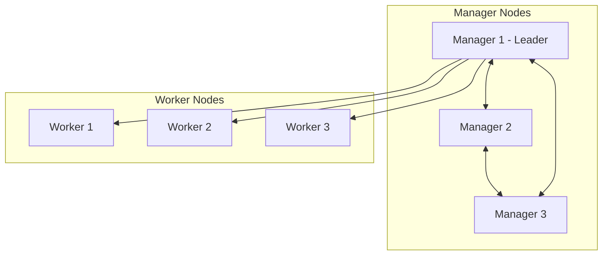

# How to Use Ansible to Manage Docker Swarm

Author: [nawazdhandala](https://www.github.com/nawazdhandala)

Tags: Ansible, Docker, Swarm, Orchestration, DevOps

Description: Automate Docker Swarm cluster setup, node management, and service deployment using Ansible playbooks and modules.

---

Docker Swarm is Docker's built-in container orchestration tool. It turns a group of Docker hosts into a single virtual cluster where you can deploy services that automatically get distributed across nodes. While Kubernetes gets most of the attention these days, Swarm remains a solid choice for teams that want orchestration without the complexity overhead. This post shows how to use Ansible to initialize a Swarm cluster, manage nodes, and keep everything running smoothly.

## Swarm Architecture Overview



Manager nodes handle cluster state and scheduling decisions. Worker nodes run the actual containers. For production, you want an odd number of managers (3 or 5) for proper Raft consensus.

## Inventory Setup

Your inventory needs to separate managers from workers. Here is a sample inventory file:

```ini
# inventory/swarm.ini - Swarm cluster inventory
[swarm_managers]
manager1 ansible_host=10.0.1.10
manager2 ansible_host=10.0.1.11
manager3 ansible_host=10.0.1.12

[swarm_workers]
worker1 ansible_host=10.0.2.10
worker2 ansible_host=10.0.2.11
worker3 ansible_host=10.0.2.12

[swarm_managers:vars]
swarm_role=manager

[swarm_workers:vars]
swarm_role=worker

[swarm:children]
swarm_managers
swarm_workers
```

## Initializing the Swarm

The first manager node initializes the swarm. After that, other nodes join using tokens. Here is the playbook:

```yaml
# init_swarm.yml - Initialize Docker Swarm on the first manager
---
- name: Initialize Docker Swarm
  hosts: swarm_managers[0]
  become: true
  vars:
    swarm_advertise_addr: "{{ ansible_default_ipv4.address }}"

  tasks:
    - name: Check if already part of a swarm
      community.docker.docker_swarm_info:
      register: swarm_info
      ignore_errors: true

    - name: Initialize swarm on first manager
      community.docker.docker_swarm:
        state: present
        advertise_addr: "{{ swarm_advertise_addr }}"
        listen_addr: "0.0.0.0:2377"
      register: swarm_init
      when: swarm_info is failed or not swarm_info.can_talk_to_docker

    - name: Get manager join token
      community.docker.docker_swarm_info:
      register: swarm_info_final

    - name: Store join tokens as facts
      ansible.builtin.set_fact:
        manager_token: "{{ swarm_info_final.swarm_facts.JoinTokens.Manager }}"
        worker_token: "{{ swarm_info_final.swarm_facts.JoinTokens.Worker }}"
        manager_addr: "{{ swarm_advertise_addr }}:2377"
```

## Joining Manager and Worker Nodes

Once the first manager is up, additional managers and workers join using their respective tokens:

```yaml
# join_managers.yml - Join additional manager nodes to the swarm
---
- name: Join Additional Managers
  hosts: swarm_managers[1:]
  become: true
  vars:
    first_manager: "{{ groups['swarm_managers'][0] }}"

  tasks:
    - name: Check current swarm status
      community.docker.docker_swarm_info:
      register: node_swarm_info
      ignore_errors: true

    - name: Join swarm as manager
      community.docker.docker_swarm:
        state: join
        advertise_addr: "{{ ansible_default_ipv4.address }}"
        join_token: "{{ hostvars[first_manager]['manager_token'] }}"
        remote_addrs:
          - "{{ hostvars[first_manager]['manager_addr'] }}"
      when: node_swarm_info is failed or not node_swarm_info.can_talk_to_docker
```

```yaml
# join_workers.yml - Join worker nodes to the swarm
---
- name: Join Workers to Swarm
  hosts: swarm_workers
  become: true
  vars:
    first_manager: "{{ groups['swarm_managers'][0] }}"

  tasks:
    - name: Check current swarm status
      community.docker.docker_swarm_info:
      register: node_swarm_info
      ignore_errors: true

    - name: Join swarm as worker
      community.docker.docker_swarm:
        state: join
        advertise_addr: "{{ ansible_default_ipv4.address }}"
        join_token: "{{ hostvars[first_manager]['worker_token'] }}"
        remote_addrs:
          - "{{ hostvars[first_manager]['manager_addr'] }}"
      when: node_swarm_info is failed or not node_swarm_info.can_talk_to_docker
```

## Full Cluster Setup Playbook

Combine everything into a single master playbook:

```yaml
# setup_swarm_cluster.yml - Complete swarm cluster setup
---
- name: Ensure Docker is installed on all nodes
  hosts: swarm
  become: true
  tasks:
    - name: Install Docker
      ansible.builtin.apt:
        name: docker-ce
        state: present
        update_cache: true

    - name: Start and enable Docker
      ansible.builtin.service:
        name: docker
        state: started
        enabled: true

- import_playbook: init_swarm.yml
- import_playbook: join_managers.yml
- import_playbook: join_workers.yml
```

## Managing Node Labels

Labels let you control where services get scheduled. For example, you might label nodes by their hardware capabilities or geographic location:

```yaml
# manage_labels.yml - Add labels to swarm nodes
---
- name: Manage Swarm Node Labels
  hosts: swarm_managers[0]
  become: true

  tasks:
    - name: Label worker nodes with their roles
      community.docker.docker_node:
        hostname: "{{ item.node }}"
        labels:
          environment: "{{ item.env }}"
          disk_type: "{{ item.disk }}"
          zone: "{{ item.zone }}"
      loop:
        - { node: "worker1", env: "production", disk: "ssd", zone: "us-east-1a" }
        - { node: "worker2", env: "production", disk: "ssd", zone: "us-east-1b" }
        - { node: "worker3", env: "staging", disk: "hdd", zone: "us-east-1c" }

    - name: Set node availability
      community.docker.docker_node:
        hostname: worker3
        availability: drain
      when: drain_staging | default(false) | bool
```

## Deploying Services

The `docker_swarm_service` module creates and manages Swarm services:

```yaml
# deploy_service.yml - Deploy a service to the swarm
---
- name: Deploy Swarm Services
  hosts: swarm_managers[0]
  become: true

  tasks:
    - name: Create an overlay network
      community.docker.docker_network:
        name: app_network
        driver: overlay
        scope: swarm

    - name: Deploy nginx service
      community.docker.docker_swarm_service:
        name: web
        image: nginx:1.25
        replicas: 3
        publish:
          - published_port: 80
            target_port: 80
            protocol: tcp
            mode: ingress
        networks:
          - app_network
        placement:
          constraints:
            - "node.labels.environment == production"
        update_config:
          parallelism: 1
          delay: 10s
          failure_action: rollback
        rollback_config:
          parallelism: 1
          delay: 5s
        restart_config:
          condition: on-failure
          delay: 5s
          max_attempts: 3
        limits:
          cpus: 0.5
          memory: 256M
        reservations:
          cpus: 0.25
          memory: 128M
```

## Monitoring Swarm Health

Regular health checks help catch issues before they become outages:

```yaml
# check_swarm_health.yml - Monitor swarm cluster health
---
- name: Check Swarm Health
  hosts: swarm_managers[0]
  become: true

  tasks:
    - name: Get swarm information
      community.docker.docker_swarm_info:
        nodes: true
        services: true
      register: swarm_health

    - name: Report node status
      ansible.builtin.debug:
        msg: >
          Node {{ item.Hostname }} -
          Status: {{ item.Status.State }} -
          Availability: {{ item.Spec.Availability }} -
          Role: {{ item.Spec.Role }}
      loop: "{{ swarm_health.nodes }}"
      loop_control:
        label: "{{ item.Hostname }}"

    - name: Check for down nodes
      ansible.builtin.assert:
        that:
          - item.Status.State == "ready"
        fail_msg: "Node {{ item.Hostname }} is {{ item.Status.State }}!"
        quiet: true
      loop: "{{ swarm_health.nodes }}"
      loop_control:
        label: "{{ item.Hostname }}"

    - name: Report service replica counts
      ansible.builtin.debug:
        msg: >
          Service {{ item.Spec.Name }} -
          Replicas: {{ item.Spec.Mode.Replicated.Replicas | default('global') }}
      loop: "{{ swarm_health.services }}"
      loop_control:
        label: "{{ item.Spec.Name }}"
```

## Rotating Join Tokens

For security, periodically rotate your join tokens so that old tokens cannot be used to add rogue nodes:

```yaml
# rotate_tokens.yml - Rotate swarm join tokens
---
- name: Rotate Swarm Join Tokens
  hosts: swarm_managers[0]
  become: true

  tasks:
    - name: Rotate worker join token
      community.docker.docker_swarm:
        state: present
        rotate_worker_token: true

    - name: Rotate manager join token
      community.docker.docker_swarm:
        state: present
        rotate_manager_token: true

    - name: Get updated tokens
      community.docker.docker_swarm_info:
      register: updated_swarm_info

    - name: Display new tokens (store securely)
      ansible.builtin.debug:
        msg:
          - "New worker token: {{ updated_swarm_info.swarm_facts.JoinTokens.Worker }}"
          - "New manager token: {{ updated_swarm_info.swarm_facts.JoinTokens.Manager }}"
      no_log: true
```

## Draining and Removing Nodes

When you need to take a node out of the cluster for maintenance:

```yaml
# drain_node.yml - Drain a node before maintenance
---
- name: Drain Swarm Node
  hosts: swarm_managers[0]
  become: true
  vars:
    target_node: worker2

  tasks:
    - name: Set node to drain mode
      community.docker.docker_node:
        hostname: "{{ target_node }}"
        availability: drain

    - name: Wait for containers to migrate
      ansible.builtin.pause:
        seconds: 30

    - name: Remove node from swarm (from manager)
      community.docker.docker_node:
        hostname: "{{ target_node }}"
        state: absent
        force: true
```

## Summary

Ansible makes Docker Swarm management predictable and repeatable. From initializing the cluster to deploying services and handling node maintenance, every operation can be codified in playbooks. The `community.docker` collection provides dedicated modules for each swarm operation, so you rarely need to fall back to raw shell commands. For teams that want container orchestration without the learning curve of Kubernetes, Swarm with Ansible is a practical and maintainable setup.
