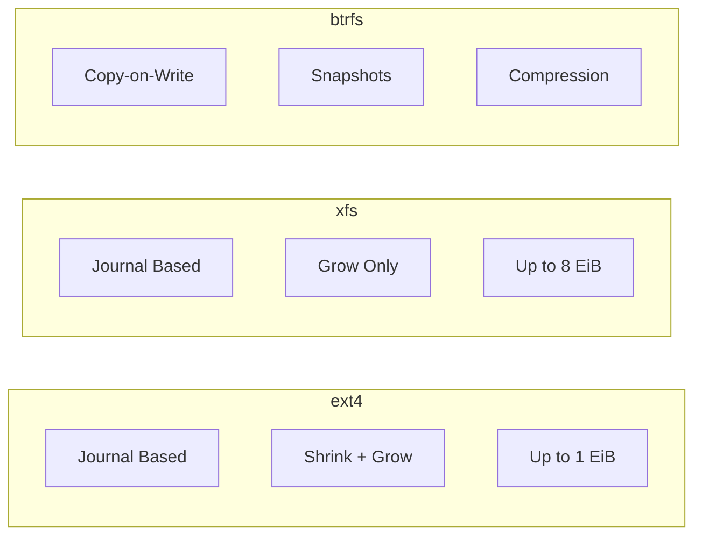

# How to Use Ansible to Manage File Systems (ext4, xfs, btrfs)

Author: [nawazdhandala](https://www.github.com/nawazdhandala)

Tags: Ansible, File Systems, Linux, Storage, DevOps

Description: Learn how to create, manage, and maintain ext4, xfs, and btrfs file systems across your Linux servers using Ansible for consistent storage configuration.

---

Choosing the right filesystem and configuring it properly is one of those decisions that haunts you for years if you get it wrong. ext4 is the reliable workhorse, xfs handles large files and high concurrency well, and btrfs brings modern features like snapshots and checksumming. Ansible helps you deploy the right filesystem for each use case consistently across your infrastructure.

## When to Use Each Filesystem

Before we get into the Ansible code, here is a quick guide on when each filesystem makes sense:

- **ext4**: General purpose, great for boot partitions, small to medium volumes, wide compatibility
- **xfs**: Database workloads, large files, high-throughput scenarios, cannot be shrunk (only grown)
- **btrfs**: When you need snapshots, checksumming, or compression. Good for development environments and data integrity-critical workloads

## Creating File Systems with Ansible

The `community.general.filesystem` module handles filesystem creation. Let us see it in action.

This playbook creates different filesystem types based on the intended use:

```yaml
# create-filesystems.yml - Create and configure file systems
---
- name: Create and Configure File Systems
  hosts: all
  become: true
  vars:
    filesystems:
      - device: /dev/sdb1
        fstype: ext4
        mount: /opt/app
        opts: defaults,noatime,errors=remount-ro
        label: APP_DATA
      - device: /dev/sdc1
        fstype: xfs
        mount: /var/lib/postgres
        opts: defaults,noatime,inode64
        label: PG_DATA
      - device: /dev/sdd1
        fstype: btrfs
        mount: /var/lib/snapshots
        opts: defaults,noatime,compress=zstd,space_cache=v2
        label: SNAP_DATA

  tasks:
    - name: Create filesystems on partitions
      community.general.filesystem:
        fstype: "{{ item.fstype }}"
        dev: "{{ item.device }}"
        opts: "-L {{ item.label }}"
      loop: "{{ filesystems }}"
      loop_control:
        label: "{{ item.device }} ({{ item.fstype }})"

    - name: Create mount point directories
      ansible.builtin.file:
        path: "{{ item.mount }}"
        state: directory
        mode: '0755'
      loop: "{{ filesystems }}"
      loop_control:
        label: "{{ item.mount }}"

    - name: Mount filesystems and add to fstab
      ansible.posix.mount:
        path: "{{ item.mount }}"
        src: "LABEL={{ item.label }}"
        fstype: "{{ item.fstype }}"
        opts: "{{ item.opts }}"
        state: mounted
      loop: "{{ filesystems }}"
      loop_control:
        label: "{{ item.mount }}"
```

## ext4 Specific Configuration

ext4 has several tunable parameters that affect performance and reliability. Here is how to configure them.

This playbook creates an ext4 filesystem with optimized parameters and tunes it after creation:

```yaml
# configure-ext4.yml - ext4 with performance tuning
---
- name: Configure ext4 File Systems
  hosts: app_servers
  become: true
  vars:
    ext4_device: /dev/vg_data/lv_app
    ext4_mount: /opt/app
    # Reserve 1% for root instead of default 5%
    ext4_reserved_percent: 1
    # Set maximum mount count before forced check
    ext4_max_mount_count: 30

  tasks:
    - name: Create ext4 filesystem with specific block size
      community.general.filesystem:
        fstype: ext4
        dev: "{{ ext4_device }}"
        # Use 4K block size and enable 64-bit mode for large volumes
        opts: "-b 4096 -O 64bit,metadata_csum -L APP_DATA"

    - name: Tune ext4 reserved blocks percentage
      ansible.builtin.command:
        cmd: "tune2fs -m {{ ext4_reserved_percent }} {{ ext4_device }}"
      register: tune_result
      changed_when: "'Setting reserved blocks percentage' in tune_result.stdout"

    - name: Set maximum mount count for fsck
      ansible.builtin.command:
        cmd: "tune2fs -c {{ ext4_max_mount_count }} {{ ext4_device }}"
      register: mount_count_result
      changed_when: "'Setting maximal mount count' in mount_count_result.stdout"

    - name: Enable journal checksumming for data integrity
      ansible.builtin.command:
        cmd: "tune2fs -O metadata_csum {{ ext4_device }}"
      register: csum_result
      changed_when: false
      failed_when: false

    - name: Mount ext4 with optimized options
      ansible.posix.mount:
        path: "{{ ext4_mount }}"
        src: "{{ ext4_device }}"
        fstype: ext4
        opts: defaults,noatime,errors=remount-ro,barrier=1,data=ordered
        state: mounted

    - name: Verify ext4 filesystem parameters
      ansible.builtin.command:
        cmd: "tune2fs -l {{ ext4_device }}"
      register: ext4_info
      changed_when: false

    - name: Display ext4 configuration
      ansible.builtin.debug:
        msg: "{{ ext4_info.stdout_lines | select('search', 'Reserved|Maximum mount|Filesystem features') | list }}"
```

## xfs Specific Configuration

xfs is the default filesystem on RHEL and its derivatives. It excels at parallel I/O operations.

This playbook creates and configures xfs for database workloads:

```yaml
# configure-xfs.yml - xfs for database servers
---
- name: Configure xfs File Systems
  hosts: database_servers
  become: true
  vars:
    xfs_device: /dev/vg_data/lv_database
    xfs_mount: /var/lib/database
    # Align with storage geometry for better performance
    xfs_agcount: 16

  tasks:
    - name: Create xfs filesystem optimized for databases
      community.general.filesystem:
        fstype: xfs
        dev: "{{ xfs_device }}"
        # agcount controls allocation group parallelism
        opts: "-d agcount={{ xfs_agcount }} -L DB_DATA"

    - name: Mount xfs with database-optimized options
      ansible.posix.mount:
        path: "{{ xfs_mount }}"
        src: "{{ xfs_device }}"
        fstype: xfs
        # inode64 allows inodes throughout the volume
        # nobarrier can improve perf with battery-backed RAID
        opts: defaults,noatime,inode64,logbufs=8,logbsize=256k
        state: mounted

    - name: Set xfs project quotas for directories
      ansible.builtin.shell: |
        # Enable project quotas if not already active
        if ! xfs_quota -x -c 'report -p' {{ xfs_mount }} 2>/dev/null | grep -q "Project"; then
          # Remount with project quota support
          mount -o remount,pquota {{ xfs_mount }}
        fi
      changed_when: false
      failed_when: false

    - name: Configure xfs real-time settings
      ansible.builtin.command:
        cmd: "xfs_io -x -c 'extsize 1m' {{ xfs_mount }}"
      changed_when: false
      failed_when: false

    - name: Verify xfs filesystem info
      ansible.builtin.command:
        cmd: "xfs_info {{ xfs_mount }}"
      register: xfs_info
      changed_when: false

    - name: Display xfs configuration
      ansible.builtin.debug:
        msg: "{{ xfs_info.stdout_lines }}"
```

## btrfs Specific Configuration

btrfs is the most feature-rich option with snapshots, compression, and subvolumes.

This playbook sets up btrfs with subvolumes and compression:

```yaml
# configure-btrfs.yml - btrfs with snapshots and compression
---
- name: Configure btrfs File Systems
  hosts: dev_servers
  become: true
  vars:
    btrfs_device: /dev/vg_data/lv_dev
    btrfs_mount: /srv/data
    btrfs_subvolumes:
      - name: "@home"
        mount: /srv/data/home
      - name: "@snapshots"
        mount: /srv/data/.snapshots
      - name: "@logs"
        mount: /srv/data/logs

  tasks:
    - name: Create btrfs filesystem with metadata duplication
      community.general.filesystem:
        fstype: btrfs
        dev: "{{ btrfs_device }}"
        opts: "-L BTRFS_DATA -M"

    - name: Create temporary mount point for subvolume creation
      ansible.builtin.file:
        path: /mnt/btrfs-setup
        state: directory
        mode: '0755'

    - name: Mount btrfs root for subvolume creation
      ansible.posix.mount:
        path: /mnt/btrfs-setup
        src: "{{ btrfs_device }}"
        fstype: btrfs
        state: mounted

    - name: Create btrfs subvolumes
      ansible.builtin.command:
        cmd: "btrfs subvolume create /mnt/btrfs-setup/{{ item.name }}"
      loop: "{{ btrfs_subvolumes }}"
      loop_control:
        label: "{{ item.name }}"
      register: subvol_result
      changed_when: "'Create subvolume' in subvol_result.stdout"
      failed_when: subvol_result.rc != 0 and 'already exists' not in subvol_result.stderr

    - name: Unmount temporary btrfs mount
      ansible.posix.mount:
        path: /mnt/btrfs-setup
        state: unmounted

    - name: Create mount points for subvolumes
      ansible.builtin.file:
        path: "{{ item.mount }}"
        state: directory
        mode: '0755'
      loop: "{{ btrfs_subvolumes }}"
      loop_control:
        label: "{{ item.mount }}"

    - name: Mount btrfs subvolumes with compression
      ansible.posix.mount:
        path: "{{ item.mount }}"
        src: "{{ btrfs_device }}"
        fstype: btrfs
        opts: "subvol={{ item.name }},compress=zstd:3,noatime,space_cache=v2"
        state: mounted
      loop: "{{ btrfs_subvolumes }}"
      loop_control:
        label: "{{ item.mount }}"
```

## Filesystem Health Checks

Regular health checks catch issues before they become outages.

This playbook runs filesystem checks and reports on health:

```yaml
# check-filesystem-health.yml - Monitor filesystem status
---
- name: Check Filesystem Health
  hosts: all
  become: true
  tasks:
    - name: Check disk space usage
      ansible.builtin.shell: |
        df -h --output=target,pcent | tail -n +2 | \
        awk '{gsub(/%/,"",$2); if ($2+0 > 85) print $1": "$2"% used"}'
      register: disk_usage
      changed_when: false

    - name: Alert on high disk usage
      ansible.builtin.debug:
        msg: "WARNING on {{ inventory_hostname }}: {{ item }}"
      loop: "{{ disk_usage.stdout_lines }}"
      when: disk_usage.stdout_lines | length > 0

    - name: Check for filesystem errors in dmesg
      ansible.builtin.shell: |
        dmesg | grep -i "ext4.*error\|xfs.*error\|btrfs.*error" | tail -5
      register: fs_errors
      changed_when: false
      failed_when: false

    - name: Report filesystem errors
      ansible.builtin.debug:
        msg: "FS errors on {{ inventory_hostname }}: {{ fs_errors.stdout_lines }}"
      when: fs_errors.stdout_lines | length > 0

    - name: Check inode usage
      ansible.builtin.shell: |
        df -i --output=target,ipcent | tail -n +2 | \
        awk '{gsub(/%/,"",$2); if ($2+0 > 80) print $1": "$2"% inodes used"}'
      register: inode_usage
      changed_when: false

    - name: Alert on high inode usage
      ansible.builtin.debug:
        msg: "INODE WARNING on {{ inventory_hostname }}: {{ item }}"
      loop: "{{ inode_usage.stdout_lines }}"
      when: inode_usage.stdout_lines | length > 0
```

## Filesystem Comparison



Choosing a filesystem is about matching your workload to the filesystem's strengths. Use Ansible to standardize on the right choice per server role, and you will avoid the inconsistency that comes from each admin picking their personal favorite.
