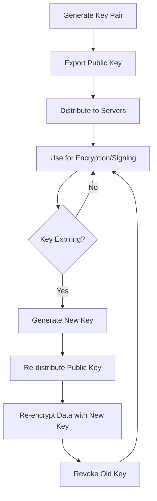

# How to Use Ansible to Manage GPG Keys

Author: [nawazdhandala](https://www.github.com/nawazdhandala)

Tags: Ansible, GPG, Security, Encryption, Key Management

Description: Learn how to automate GPG key generation, distribution, and lifecycle management across servers using Ansible playbooks and roles.

---

GPG keys pop up everywhere in infrastructure management. Package repositories need them for signature verification, encrypted backups depend on them, and team members use them for signing commits and encrypting secrets. Managing these keys by hand across multiple servers is tedious and error-prone. Ansible makes it possible to handle GPG key distribution, rotation, and cleanup in a consistent, repeatable way.

## Common GPG Key Use Cases in Infrastructure

Before diving into playbooks, here are the scenarios where GPG key management matters:

- APT and YUM repository signing keys
- Encrypted backup files (database dumps, config archives)
- Signing release artifacts in CI/CD pipelines
- Encrypting secrets at rest on disk
- Verifying file integrity during deployments

## Importing Repository Signing Keys

The most common GPG task in server management is importing keys for package repositories. Let us start there.

This playbook imports GPG keys for various package repositories:

```yaml
# import-repo-keys.yml - Import GPG signing keys for package repos
---
- name: Import Repository GPG Keys
  hosts: all
  become: true
  vars:
    gpg_repo_keys:
      - name: Docker CE
        url: https://download.docker.com/linux/ubuntu/gpg
        keyring: /usr/share/keyrings/docker-archive-keyring.gpg
      - name: HashiCorp
        url: https://apt.releases.hashicorp.com/gpg
        keyring: /usr/share/keyrings/hashicorp-archive-keyring.gpg
      - name: Kubernetes
        url: https://pkgs.k8s.io/core:/stable:/v1.29/deb/Release.key
        keyring: /usr/share/keyrings/kubernetes-apt-keyring.gpg

  tasks:
    - name: Import GPG keys for APT repositories
      ansible.builtin.shell: |
        # Download and dearmor the GPG key into the target keyring
        curl -fsSL "{{ item.url }}" | gpg --dearmor -o "{{ item.keyring }}"
      args:
        creates: "{{ item.keyring }}"
      loop: "{{ gpg_repo_keys }}"
      loop_control:
        label: "{{ item.name }}"
      when: ansible_os_family == "Debian"

    - name: Import GPG keys for YUM repositories
      ansible.builtin.rpm_key:
        key: "{{ item.url }}"
        state: present
      loop: "{{ gpg_repo_keys }}"
      loop_control:
        label: "{{ item.name }}"
      when: ansible_os_family == "RedHat"
```

## Generating GPG Keys for Service Accounts

Sometimes you need to generate GPG keys directly on servers for tasks like backup encryption. Here is how to automate that.

This playbook generates a GPG key pair for a service account used in backup encryption:

```yaml
# generate-gpg-keys.yml - Generate GPG keys for backup encryption
---
- name: Generate GPG Keys for Backup Service
  hosts: backup_servers
  become: true
  become_user: backup_user
  vars:
    gpg_key_name: "Backup Service"
    gpg_key_email: "backup@example.com"
    gpg_key_length: 4096
    gpg_key_expire: "2y"

  tasks:
    - name: Check if GPG key already exists
      ansible.builtin.shell: |
        gpg --list-keys "{{ gpg_key_email }}" 2>/dev/null
      register: existing_key
      changed_when: false
      failed_when: false

    - name: Create GPG batch file for unattended key generation
      ansible.builtin.copy:
        dest: /tmp/gpg-key-batch
        mode: '0600'
        content: |
          %no-protection
          Key-Type: RSA
          Key-Length: {{ gpg_key_length }}
          Subkey-Type: RSA
          Subkey-Length: {{ gpg_key_length }}
          Name-Real: {{ gpg_key_name }}
          Name-Email: {{ gpg_key_email }}
          Expire-Date: {{ gpg_key_expire }}
          %commit
      when: existing_key.rc != 0

    - name: Generate GPG key pair
      ansible.builtin.command:
        cmd: gpg --batch --gen-key /tmp/gpg-key-batch
      when: existing_key.rc != 0

    - name: Remove batch file after key generation
      ansible.builtin.file:
        path: /tmp/gpg-key-batch
        state: absent

    - name: Get the generated key fingerprint
      ansible.builtin.shell: |
        gpg --list-keys --with-colons "{{ gpg_key_email }}" | \
        grep '^fpr' | head -1 | cut -d: -f10
      register: key_fingerprint
      changed_when: false

    - name: Display key fingerprint
      ansible.builtin.debug:
        msg: "GPG key fingerprint for {{ inventory_hostname }}: {{ key_fingerprint.stdout }}"
```

## Distributing Public Keys Across Servers

When one server encrypts backups and another needs to decrypt them, you need to distribute public keys.

This playbook exports a public key from the source server and imports it on target servers:

```yaml
# distribute-gpg-keys.yml - Share public keys between servers
---
- name: Export Public Key from Backup Server
  hosts: backup_primary
  become: true
  become_user: backup_user
  tasks:
    - name: Export the public GPG key
      ansible.builtin.shell: |
        gpg --armor --export backup@example.com
      register: public_key
      changed_when: false

    - name: Store public key as a fact for other plays
      ansible.builtin.set_fact:
        backup_public_key: "{{ public_key.stdout }}"

- name: Import Public Key on Restore Servers
  hosts: backup_restore_servers
  become: true
  become_user: backup_user
  tasks:
    - name: Write public key to temporary file
      ansible.builtin.copy:
        content: "{{ hostvars['backup_primary']['backup_public_key'] }}"
        dest: /tmp/backup-public.key
        mode: '0600'

    - name: Import the public key into GPG keyring
      ansible.builtin.command:
        cmd: gpg --import /tmp/backup-public.key
      register: import_result
      changed_when: "'imported' in import_result.stderr"

    - name: Trust the imported key
      ansible.builtin.shell: |
        # Get the key fingerprint and set trust level to ultimate
        FINGERPRINT=$(gpg --list-keys --with-colons backup@example.com | grep '^fpr' | head -1 | cut -d: -f10)
        echo "${FINGERPRINT}:6:" | gpg --import-ownertrust
      changed_when: false

    - name: Clean up temporary key file
      ansible.builtin.file:
        path: /tmp/backup-public.key
        state: absent
```

## Managing GPG Key Rotation

Keys expire. When they do, you need a smooth rotation process. Here is a role that handles it.

This playbook rotates GPG keys by generating new ones and re-encrypting existing data:

```yaml
# rotate-gpg-keys.yml - Rotate expiring GPG keys
---
- name: Rotate GPG Keys
  hosts: backup_servers
  become: true
  become_user: backup_user
  vars:
    gpg_key_email: "backup@example.com"
    expiry_warning_days: 30

  tasks:
    - name: Check key expiration date
      ansible.builtin.shell: |
        # Get the expiration timestamp of the primary key
        gpg --list-keys --with-colons "{{ gpg_key_email }}" | \
        grep '^pub' | cut -d: -f7
      register: expiry_timestamp
      changed_when: false

    - name: Calculate days until expiration
      ansible.builtin.set_fact:
        days_until_expiry: >-
          {{ ((expiry_timestamp.stdout | int) - (ansible_date_time.epoch | int)) / 86400 | int }}

    - name: Display expiration status
      ansible.builtin.debug:
        msg: "Key expires in {{ days_until_expiry }} days"

    - name: Export old public key before rotation
      ansible.builtin.shell: |
        gpg --armor --export "{{ gpg_key_email }}" > /var/backups/old-public-key.asc
      when: days_until_expiry | int < expiry_warning_days

    - name: Generate new key if current one is expiring soon
      ansible.builtin.shell: |
        # Generate replacement key with new expiry
        gpg --batch --gen-key <<EOF
        %no-protection
        Key-Type: RSA
        Key-Length: 4096
        Subkey-Type: RSA
        Subkey-Length: 4096
        Name-Real: Backup Service (Rotated)
        Name-Email: {{ gpg_key_email }}
        Expire-Date: 2y
        %commit
        EOF
      when: days_until_expiry | int < expiry_warning_days

    - name: Remove old expired key after rotation is verified
      ansible.builtin.shell: |
        # Only remove old key after confirming new key works
        OLD_FPR=$(gpg --list-keys --with-colons "{{ gpg_key_email }}" | \
          grep '^fpr' | head -1 | cut -d: -f10)
        echo "Old key fingerprint: ${OLD_FPR} - manual removal required after verification"
      when: days_until_expiry | int < 0
```

## GPG Key Lifecycle

Here is how the full key lifecycle looks:



## Cleaning Up Unused Keys

Over time, GPG keyrings accumulate old keys. This task helps clean them up.

This playbook removes revoked and expired keys from server keyrings:

```yaml
# cleanup-gpg-keys.yml - Remove old and expired keys
---
- name: Clean Up GPG Keyrings
  hosts: all
  become: true
  tasks:
    - name: Find expired keys in the keyring
      ansible.builtin.shell: |
        # List keys that have expired
        gpg --list-keys --with-colons 2>/dev/null | \
        grep '^pub' | \
        awk -F: '$2 == "e" {print $5}'
      register: expired_keys
      changed_when: false

    - name: Remove expired keys
      ansible.builtin.command:
        cmd: "gpg --batch --yes --delete-keys {{ item }}"
      loop: "{{ expired_keys.stdout_lines }}"
      when: expired_keys.stdout_lines | length > 0
```

## Security Considerations

A few things to keep in mind when managing GPG keys with Ansible:

**Never store private keys in version control.** Use Ansible Vault to encrypt any private key material that needs to be in your repository. Better yet, generate keys on the target hosts and only distribute public keys.

**Use strong key sizes.** RSA 4096-bit is the minimum I would recommend. If your version of GPG supports it, consider Ed25519 keys for better performance.

**Set expiration dates.** Keys without expiry dates are a liability. Two years is a reasonable default for service account keys.

**Back up your keyrings.** If a server dies and you lose the GPG keyring, any data encrypted to that key is gone. Export and store private keys securely (in a vault, HSM, or encrypted backup).

GPG key management is one of those tasks that seems simple until you have 50 servers with different keyrings and keys in various states. Ansible brings order to the chaos and makes sure every server has exactly the keys it needs.
