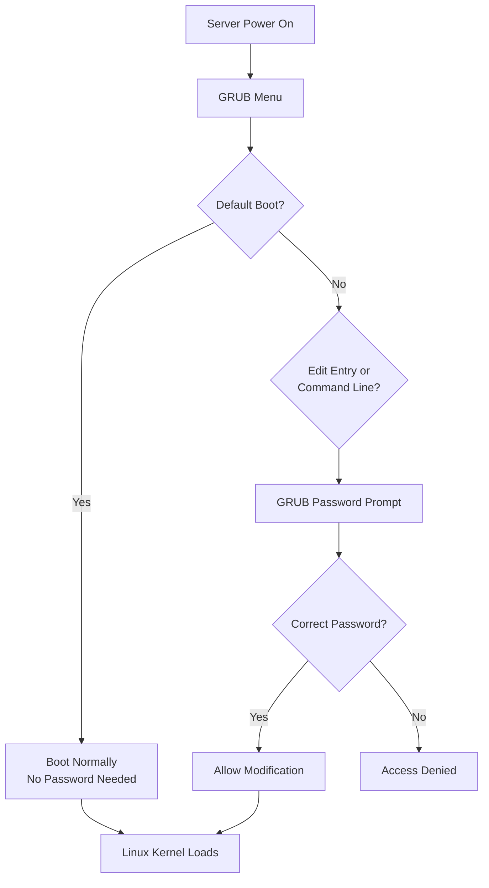

# How to Use Ansible to Manage GRUB Password Protection

Author: [nawazdhandala](https://www.github.com/nawazdhandala)

Tags: Ansible, GRUB, Security, Boot Protection

Description: Secure your Linux server boot process by configuring GRUB password protection with Ansible to prevent unauthorized boot modifications.

---

The GRUB bootloader is the first thing that runs when a Linux server starts. Without password protection, anyone with physical access or console access (IPMI, iLO, iDRAC, cloud serial console) can modify boot parameters, boot into single-user mode, and gain root access without knowing any passwords. This is a well-known security issue that compliance frameworks like CIS Benchmarks, PCI-DSS, and STIG all require you to address.

Setting a GRUB password ensures that boot parameters cannot be modified and recovery mode cannot be accessed without proper authentication. Ansible makes this configuration consistent and auditable across your entire fleet.

## Understanding GRUB Security

There are two levels of GRUB password protection:

1. **Unrestricted with password**: Users can boot the default entry without a password, but modifying boot entries or accessing the GRUB command line requires authentication.
2. **Fully restricted**: A password is required even to boot the default entry. This is more secure but means you need the password during normal reboots.

For most production environments, option 1 (unrestricted default boot, restricted editing) is the right choice.



## Setting Up GRUB Password with Ansible

```yaml
# configure-grub-password.yml - Set GRUB bootloader password
---
- name: Configure GRUB password protection
  hosts: all
  become: true

  vars:
    grub_superuser: "bootadmin"
    grub_password: "{{ vault_grub_password }}"

  tasks:
    # Generate the GRUB password hash
    - name: Generate GRUB password hash
      ansible.builtin.shell:
        cmd: "echo -e '{{ grub_password }}\n{{ grub_password }}' | grub2-mkpasswd-pbkdf2 | grep 'PBKDF2' | awk '{print $NF}'"
      register: grub_hash
      changed_when: false
      no_log: true

    # Check if GRUB password is already configured
    - name: Check existing GRUB user config
      ansible.builtin.stat:
        path: /etc/grub.d/01_users
      register: grub_users_file

    # Deploy the GRUB user configuration
    - name: Create GRUB superuser configuration
      ansible.builtin.copy:
        dest: /etc/grub.d/01_users
        owner: root
        group: root
        mode: '0755'
        content: |
          #!/bin/sh
          cat << 'EOF'
          set superusers="{{ grub_superuser }}"
          password_pbkdf2 {{ grub_superuser }} {{ grub_hash.stdout }}
          EOF
      no_log: true
      notify: rebuild grub config

    # Make default boot entries unrestricted (no password for normal boot)
    - name: Configure unrestricted default boot
      ansible.builtin.lineinfile:
        path: /etc/grub.d/10_linux
        regexp: "^CLASS="
        line: 'CLASS="--class gnu-linux --class gnu --class os --unrestricted"'
        backup: true
      notify: rebuild grub config

  handlers:
    - name: rebuild grub config
      ansible.builtin.command:
        cmd: grub2-mkconfig -o /boot/grub2/grub.cfg
      when: ansible_os_family == "RedHat"

    - name: rebuild grub config debian
      ansible.builtin.command:
        cmd: update-grub
      when: ansible_os_family == "Debian"
```

## Handling UEFI and Legacy BIOS

The GRUB configuration path differs between UEFI and legacy BIOS systems:

```yaml
# grub-password-multiboot.yml - Handle both UEFI and BIOS systems
---
- name: Configure GRUB password for any boot mode
  hosts: all
  become: true

  vars:
    grub_superuser: "bootadmin"
    grub_password: "{{ vault_grub_password }}"

  tasks:
    # Detect boot mode
    - name: Check if system boots with UEFI
      ansible.builtin.stat:
        path: /sys/firmware/efi
      register: efi_check

    - name: Set GRUB config path
      ansible.builtin.set_fact:
        grub_cfg_path: "{{ '/boot/efi/EFI/redhat/grub.cfg' if efi_check.stat.exists else '/boot/grub2/grub.cfg' }}"
      when: ansible_os_family == "RedHat"

    - name: Set GRUB config path (Debian)
      ansible.builtin.set_fact:
        grub_cfg_path: "{{ '/boot/efi/EFI/ubuntu/grub.cfg' if efi_check.stat.exists else '/boot/grub/grub.cfg' }}"
      when: ansible_os_family == "Debian"

    # Generate password hash
    - name: Generate GRUB password hash
      ansible.builtin.shell:
        cmd: "echo -e '{{ grub_password }}\n{{ grub_password }}' | grub2-mkpasswd-pbkdf2 2>/dev/null | grep 'PBKDF2' | awk '{print $NF}'"
      register: grub_hash
      changed_when: false
      no_log: true

    # Deploy user configuration
    - name: Deploy GRUB user config
      ansible.builtin.copy:
        dest: /etc/grub.d/01_users
        owner: root
        group: root
        mode: '0755'
        content: |
          #!/bin/sh
          cat << 'EOF'
          set superusers="{{ grub_superuser }}"
          password_pbkdf2 {{ grub_superuser }} {{ grub_hash.stdout }}
          EOF
      no_log: true

    # Set unrestricted flag on default menu entries
    - name: Configure unrestricted default boot (RedHat)
      ansible.builtin.lineinfile:
        path: /etc/grub.d/10_linux
        regexp: "^CLASS="
        line: 'CLASS="--class gnu-linux --class gnu --class os --unrestricted"'
        backup: true
      when: ansible_os_family == "RedHat"

    # Rebuild GRUB configuration
    - name: Rebuild GRUB config (RedHat)
      ansible.builtin.command:
        cmd: "grub2-mkconfig -o {{ grub_cfg_path }}"
      when: ansible_os_family == "RedHat"

    - name: Rebuild GRUB config (Debian)
      ansible.builtin.command:
        cmd: update-grub
      when: ansible_os_family == "Debian"

    # Verify the password was set
    - name: Verify GRUB password is configured
      ansible.builtin.shell:
        cmd: "grep -c 'password_pbkdf2' {{ grub_cfg_path }}"
      register: password_check
      changed_when: false

    - name: Display verification
      ansible.builtin.debug:
        msg: "{{ inventory_hostname }}: GRUB password {{ 'IS' if password_check.stdout | int > 0 else 'IS NOT' }} configured (boot mode: {{ 'UEFI' if efi_check.stat.exists else 'BIOS' }})"
```

## Auditing GRUB Security

For compliance checks, audit GRUB password configuration across the fleet:

```yaml
# audit-grub-security.yml - Audit GRUB password protection
---
- name: Audit GRUB bootloader security
  hosts: all
  become: true

  tasks:
    # Check if GRUB user config exists
    - name: Check for GRUB user configuration
      ansible.builtin.stat:
        path: /etc/grub.d/01_users
      register: grub_users

    # Check if password hash is in generated config
    - name: Check for password in GRUB config
      ansible.builtin.shell:
        cmd: "grep -l 'password_pbkdf2' /boot/grub2/grub.cfg /boot/efi/EFI/*/grub.cfg 2>/dev/null || echo 'NOT FOUND'"
      register: grub_password_check
      changed_when: false

    # Check if superuser is set
    - name: Check for superuser in GRUB config
      ansible.builtin.shell:
        cmd: "grep 'set superusers' /boot/grub2/grub.cfg /boot/efi/EFI/*/grub.cfg 2>/dev/null || echo 'NOT FOUND'"
      register: superuser_check
      changed_when: false

    # Check GRUB config file permissions
    - name: Check GRUB config permissions
      ansible.builtin.stat:
        path: /boot/grub2/grub.cfg
      register: grub_cfg_perms
      failed_when: false

    # Check 01_users script permissions
    - name: Check 01_users permissions
      ansible.builtin.stat:
        path: /etc/grub.d/01_users
      register: users_perms
      when: grub_users.stat.exists

    # Build compliance report
    - name: Generate GRUB security report
      ansible.builtin.debug:
        msg:
          - "=== GRUB Security Audit: {{ inventory_hostname }} ==="
          - "User config exists: {{ grub_users.stat.exists }}"
          - "Password configured: {{ 'NOT FOUND' not in grub_password_check.stdout }}"
          - "Superuser set: {{ 'NOT FOUND' not in superuser_check.stdout }}"
          - "GRUB cfg permissions: {{ grub_cfg_perms.stat.mode | default('N/A') }}"
          - "Status: {{ 'COMPLIANT' if grub_users.stat.exists and 'NOT FOUND' not in grub_password_check.stdout else 'NON-COMPLIANT' }}"

    # Fix permissions on GRUB config (should be 0600 or 0644)
    - name: Set correct permissions on GRUB config
      ansible.builtin.file:
        path: "{{ item }}"
        owner: root
        group: root
        mode: '0600'
      loop:
        - /boot/grub2/grub.cfg
        - /etc/grub.d/01_users
      failed_when: false
```

## Changing the GRUB Password

When you need to rotate the GRUB password:

```yaml
# rotate-grub-password.yml - Rotate GRUB bootloader password
---
- name: Rotate GRUB password
  hosts: all
  become: true
  serial: 10

  vars:
    grub_superuser: "bootadmin"
    grub_new_password: "{{ vault_grub_new_password }}"

  tasks:
    # Generate new password hash
    - name: Generate new GRUB password hash
      ansible.builtin.shell:
        cmd: "echo -e '{{ grub_new_password }}\n{{ grub_new_password }}' | grub2-mkpasswd-pbkdf2 | grep 'PBKDF2' | awk '{print $NF}'"
      register: new_hash
      changed_when: false
      no_log: true

    # Update the GRUB user configuration
    - name: Update GRUB password
      ansible.builtin.copy:
        dest: /etc/grub.d/01_users
        owner: root
        group: root
        mode: '0755'
        content: |
          #!/bin/sh
          cat << 'EOF'
          set superusers="{{ grub_superuser }}"
          password_pbkdf2 {{ grub_superuser }} {{ new_hash.stdout }}
          EOF
      no_log: true

    # Rebuild GRUB
    - name: Rebuild GRUB configuration
      ansible.builtin.command:
        cmd: grub2-mkconfig -o /boot/grub2/grub.cfg
      when: ansible_os_family == "RedHat"

    # Log the password change
    - name: Log password rotation
      ansible.builtin.lineinfile:
        path: /var/log/grub-password-changes.log
        line: "{{ ansible_date_time.iso8601 }} - GRUB password rotated by Ansible"
        create: true
        mode: '0600'
```

## Removing GRUB Password (Emergency)

If you need to remove the GRUB password temporarily (handle with care):

```yaml
# remove-grub-password.yml - Remove GRUB password (use with caution)
---
- name: Remove GRUB password protection
  hosts: "{{ target_hosts }}"
  become: true

  tasks:
    - name: Remove GRUB user configuration
      ansible.builtin.file:
        path: /etc/grub.d/01_users
        state: absent

    - name: Remove unrestricted class modification
      ansible.builtin.lineinfile:
        path: /etc/grub.d/10_linux
        regexp: "^CLASS=.*--unrestricted"
        line: 'CLASS="--class gnu-linux --class gnu --class os"'
      failed_when: false

    - name: Rebuild GRUB configuration
      ansible.builtin.command:
        cmd: grub2-mkconfig -o /boot/grub2/grub.cfg
      when: ansible_os_family == "RedHat"

    - name: Log password removal
      ansible.builtin.lineinfile:
        path: /var/log/grub-password-changes.log
        line: "{{ ansible_date_time.iso8601 }} - GRUB password REMOVED by Ansible - SECURITY RISK"
        create: true
        mode: '0600'

    - name: Display warning
      ansible.builtin.debug:
        msg: "WARNING: GRUB password protection has been removed from {{ inventory_hostname }}. Re-enable as soon as possible."
```

## Practical Tips

From securing bootloaders in production environments:

1. Always use PBKDF2 hashed passwords. GRUB supports both plain text and hashed passwords. Never use plain text as anyone who can read the GRUB config file would see the password.

2. Use the `--unrestricted` flag on default boot entries. Without it, every single boot requires the GRUB password, which means automated reboots (patching, kernel updates) will hang waiting for password input. The unrestricted flag allows normal booting but requires authentication to modify entries.

3. Store the GRUB password in multiple secure locations. If you lose the GRUB password and need to modify boot parameters, you will need physical access to the server and a rescue disk. Keep it in your Ansible Vault, your team password manager, and a printed copy in a physical safe.

4. Test the configuration by attempting to edit a boot entry on a non-production server. You should see a username/password prompt when pressing 'e' on a GRUB menu entry.

5. The 01_users file must be executable (mode 0755). GRUB's configuration generation scripts source this file during `grub2-mkconfig`. If it is not executable, the superuser and password directives will not be included in the generated configuration.

6. On UEFI systems with Secure Boot, GRUB password protection is one part of a larger chain of trust. It prevents unauthorized boot parameter modification, but Secure Boot prevents loading unsigned kernels. Both should be enabled together.

7. Remember that GRUB password does not protect against booting from external media. Physical security (locked server rooms, BIOS boot order settings, BIOS passwords) is also necessary for a complete boot security strategy.

GRUB password protection is a basic security control that compliance frameworks consistently require. With Ansible managing it, you can be confident that every server in your fleet has consistent boot protection.
