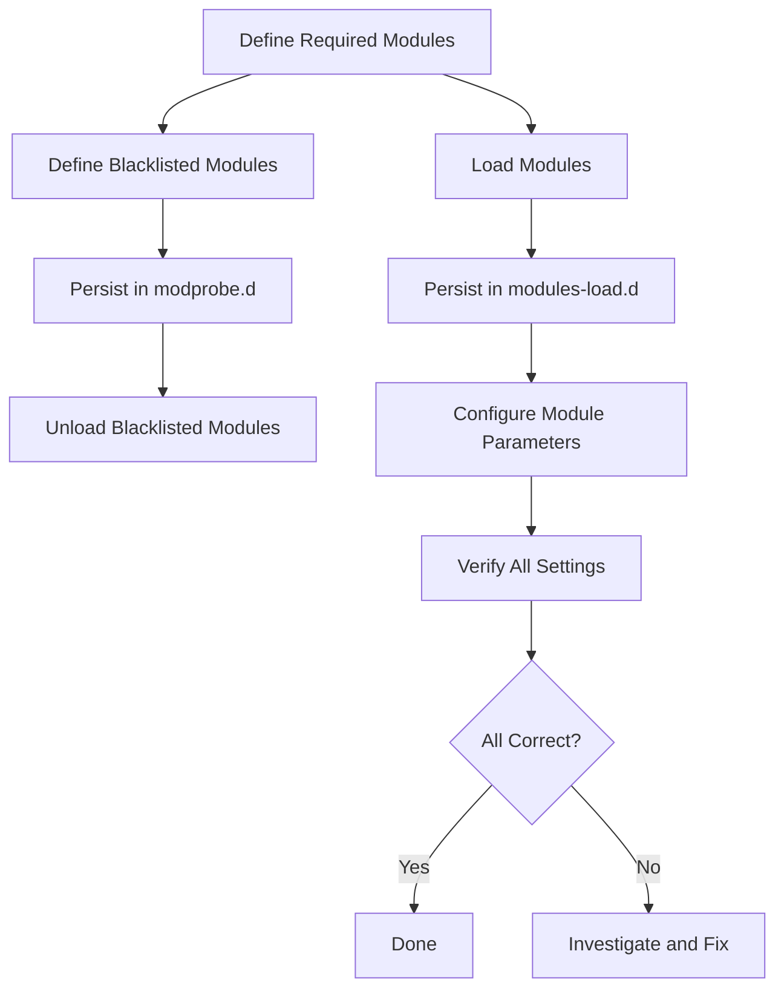

# How to Use Ansible to Manage Kernel Modules

Author: [nawazdhandala](https://www.github.com/nawazdhandala)

Tags: Ansible, Kernel Modules, Linux, System Administration

Description: Automate Linux kernel module loading, unloading, blacklisting, and configuration using Ansible for consistent driver and feature management across servers.

---

Kernel modules are pieces of code that can be loaded into the Linux kernel on demand without rebooting. They handle everything from device drivers to filesystem support to network protocols. Managing which modules are loaded, which are blocked, and how they are configured is a routine part of server administration. Ansible lets you define your module requirements in code and push them across your fleet.

## Understanding Kernel Modules

Before diving into Ansible, here is a quick refresher. Kernel modules live in `/lib/modules/<kernel-version>/` and are loaded with `modprobe`. You can check currently loaded modules with `lsmod`, and module parameters with `modinfo`. The key files involved are:

- `/etc/modules-load.d/*.conf` - Modules to load at boot
- `/etc/modprobe.d/*.conf` - Module parameters and blacklist rules
- `/lib/modules/<version>/` - Actual module files

## Loading Kernel Modules

The `community.general.modprobe` module handles loading and unloading kernel modules.

This playbook loads required kernel modules and makes them persistent:

```yaml
# manage-kernel-modules.yml - Load and configure kernel modules
---
- name: Manage Kernel Modules
  hosts: all
  become: true
  vars:
    required_modules:
      - name: br_netfilter
        comment: "Required for Kubernetes networking"
      - name: overlay
        comment: "Required for container storage drivers"
      - name: ip_vs
        comment: "IP Virtual Server for load balancing"
      - name: ip_vs_rr
        comment: "Round-robin scheduling for IPVS"
      - name: ip_vs_wrr
        comment: "Weighted round-robin for IPVS"
      - name: ip_vs_sh
        comment: "Source hashing for IPVS"
      - name: nf_conntrack
        comment: "Connection tracking for firewall"

  tasks:
    - name: Load required kernel modules immediately
      community.general.modprobe:
        name: "{{ item.name }}"
        state: present
      loop: "{{ required_modules }}"
      loop_control:
        label: "{{ item.name }}"

    - name: Persist modules across reboots
      ansible.builtin.copy:
        dest: /etc/modules-load.d/ansible-managed.conf
        mode: '0644'
        content: |
          # Kernel modules managed by Ansible
          # Do not edit manually
          
          # {{ mod.comment }}
          {{ mod.name }}
          

    - name: Verify modules are loaded
      ansible.builtin.shell: |
        lsmod | grep -c "^{{ item.name }}" || echo "0"
      register: module_check
      changed_when: false
      loop: "{{ required_modules }}"
      loop_control:
        label: "{{ item.name }}"

    - name: Report module status
      ansible.builtin.debug:
        msg: "{{ item.item.name }}: {{ 'LOADED' if item.stdout | int > 0 else 'NOT LOADED' }}"
      loop: "{{ module_check.results }}"
      loop_control:
        label: "{{ item.item.name }}"
```

## Blacklisting Kernel Modules

Blacklisting prevents modules from loading automatically. This is important for security (disabling unused protocols) and stability (preventing problematic drivers).

This playbook blacklists modules that should not be loaded:

```yaml
# blacklist-modules.yml - Disable unwanted kernel modules
---
- name: Blacklist Kernel Modules
  hosts: all
  become: true
  vars:
    blacklisted_modules:
      # Uncommon network protocols (CIS Benchmark recommendation)
      - name: dccp
        reason: "Unused network protocol - security hardening"
      - name: sctp
        reason: "Unused network protocol - security hardening"
      - name: rds
        reason: "Unused network protocol - security hardening"
      - name: tipc
        reason: "Unused network protocol - security hardening"
      # Uncommon filesystems
      - name: cramfs
        reason: "Unused filesystem - security hardening"
      - name: freevxfs
        reason: "Unused filesystem - security hardening"
      - name: jffs2
        reason: "Unused filesystem - security hardening"
      - name: hfs
        reason: "Unused filesystem - security hardening"
      - name: hfsplus
        reason: "Unused filesystem - security hardening"
      - name: squashfs
        reason: "Unused filesystem - security hardening"
      - name: udf
        reason: "Unused filesystem - security hardening"
      # USB storage (for servers that should not accept USB drives)
      - name: usb-storage
        reason: "USB storage disabled on servers"

  tasks:
    - name: Create blacklist configuration file
      ansible.builtin.copy:
        dest: /etc/modprobe.d/ansible-blacklist.conf
        mode: '0644'
        content: |
          # Module blacklist managed by Ansible
          # Do not edit manually
          
          # {{ mod.reason }}
          blacklist {{ mod.name }}
          install {{ mod.name }} /bin/true
          

    - name: Unload blacklisted modules that are currently loaded
      community.general.modprobe:
        name: "{{ item.name }}"
        state: absent
      loop: "{{ blacklisted_modules }}"
      loop_control:
        label: "{{ item.name }}"
      failed_when: false

    - name: Verify blacklisted modules are not loaded
      ansible.builtin.shell: |
        lsmod | grep -c "^{{ item.name }}" || echo "0"
      register: blacklist_check
      changed_when: false
      loop: "{{ blacklisted_modules }}"
      loop_control:
        label: "{{ item.name }}"

    - name: Report any blacklisted modules still loaded
      ansible.builtin.debug:
        msg: "WARNING: {{ item.item.name }} is still loaded (may require reboot)"
      loop: "{{ blacklist_check.results }}"
      loop_control:
        label: "{{ item.item.name }}"
      when: item.stdout | int > 0
```

The `install <module> /bin/true` line is important. Blacklisting alone only prevents automatic loading. The `install` directive makes sure that even explicit `modprobe` calls for this module do nothing.

## Configuring Module Parameters

Many modules accept parameters that change their behavior. These are set through files in `/etc/modprobe.d/`.

This playbook configures module parameters for specific hardware and workloads:

```yaml
# configure-module-params.yml - Set kernel module options
---
- name: Configure Kernel Module Parameters
  hosts: all
  become: true
  vars:
    module_options:
      - module: bonding
        options: "mode=4 miimon=100 lacp_rate=1"
        comment: "Network bonding with LACP"
      - module: nf_conntrack
        options: "hashsize=131072"
        comment: "Increase connection tracking hash table"
      - module: tcp_bbr
        options: ""
        comment: "BBR congestion control"

  tasks:
    - name: Create module options configuration
      ansible.builtin.copy:
        dest: /etc/modprobe.d/ansible-module-options.conf
        mode: '0644'
        content: |
          # Module options managed by Ansible
          
          
          # {{ mod.comment }}
          options {{ mod.module }} {{ mod.options }}
          
          

    - name: Apply nf_conntrack hashsize at runtime
      ansible.builtin.shell: |
        echo 131072 > /sys/module/nf_conntrack/parameters/hashsize
      changed_when: false
      failed_when: false
      when: "'nf_conntrack' in ansible_loaded_modules | default([])"
```

## Kubernetes-Specific Module Management

Kubernetes nodes need specific kernel modules. Here is a focused playbook for that.

This playbook prepares kernel modules required by Kubernetes:

```yaml
# k8s-kernel-modules.yml - Kubernetes node prerequisites
---
- name: Configure Kernel Modules for Kubernetes
  hosts: k8s_nodes
  become: true
  tasks:
    - name: Load Kubernetes-required modules
      community.general.modprobe:
        name: "{{ item }}"
        state: present
      loop:
        - br_netfilter
        - overlay
        - ip_vs
        - ip_vs_rr
        - ip_vs_wrr
        - ip_vs_sh
        - nf_conntrack

    - name: Persist Kubernetes modules
      ansible.builtin.copy:
        dest: /etc/modules-load.d/k8s.conf
        mode: '0644'
        content: |
          # Kubernetes prerequisites
          br_netfilter
          overlay
          ip_vs
          ip_vs_rr
          ip_vs_wrr
          ip_vs_sh
          nf_conntrack

    - name: Set sysctl parameters that depend on br_netfilter
      ansible.posix.sysctl:
        name: "{{ item.key }}"
        value: "{{ item.value }}"
        sysctl_set: true
        state: present
        sysctl_file: /etc/sysctl.d/k8s.conf
      loop:
        - { key: "net.bridge.bridge-nf-call-iptables", value: "1" }
        - { key: "net.bridge.bridge-nf-call-ip6tables", value: "1" }
        - { key: "net.ipv4.ip_forward", value: "1" }
```

## Module Information Gathering

This playbook collects module information for inventory and auditing.

This playbook gathers kernel module information across your fleet:

```yaml
# audit-modules.yml - Audit loaded kernel modules
---
- name: Audit Kernel Modules
  hosts: all
  become: true
  tasks:
    - name: Get list of all loaded modules
      ansible.builtin.command: lsmod
      register: loaded_modules
      changed_when: false

    - name: Count loaded modules
      ansible.builtin.shell: |
        lsmod | tail -n +2 | wc -l
      register: module_count
      changed_when: false

    - name: Report module count
      ansible.builtin.debug:
        msg: "{{ inventory_hostname }}: {{ module_count.stdout }} modules loaded"

    - name: Check for known vulnerable modules
      ansible.builtin.shell: |
        lsmod | grep -E "^(dccp|rds|sctp|tipc)" || echo "none found"
      register: vulnerable_modules
      changed_when: false

    - name: Alert on potentially dangerous modules
      ansible.builtin.debug:
        msg: "SECURITY: Potentially dangerous modules on {{ inventory_hostname }}: {{ vulnerable_modules.stdout }}"
      when: "'none found' not in vulnerable_modules.stdout"

    - name: Get module information for troubleshooting
      ansible.builtin.command: "modinfo {{ item }}"
      register: module_info
      changed_when: false
      failed_when: false
      loop:
        - br_netfilter
        - overlay
        - nf_conntrack
```

## Module Management Workflow



## Things to Watch Out For

**Module dependencies**: Some modules depend on others. `modprobe` handles this automatically, but if you blacklist a dependency, the dependent module will also fail to load. Check dependencies with `modinfo -F depends <module>`.

**Kernel version changes**: When you upgrade the kernel, module paths change. Ansible handles this transparently since `modprobe` always looks in the right directory for the running kernel.

**Live module removal**: You cannot unload a module that is in use. If a module is in use by another module or has active connections, `modprobe -r` will fail. A reboot may be necessary.

**Initramfs updates**: Some modules are loaded during early boot from the initramfs. If you blacklist or add modules that affect early boot, you may need to update the initramfs with `update-initramfs -u` or `dracut -f`.

Managing kernel modules with Ansible gives you full control over what code runs in kernel space across your fleet. Combined with module blacklisting for security hardening, it forms an important part of your server baseline configuration.
