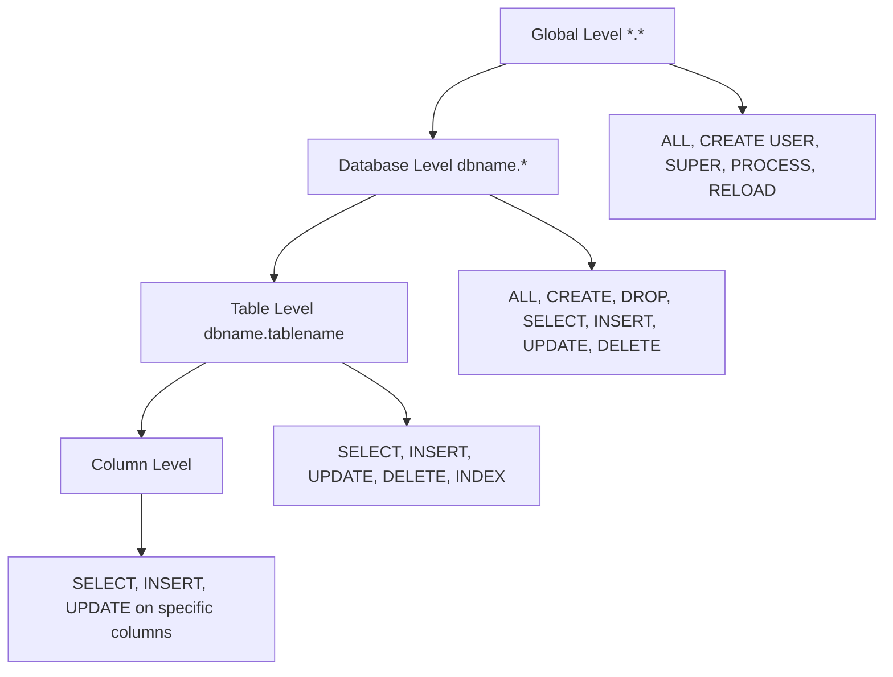
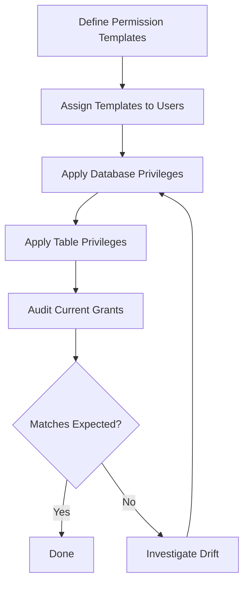

# How to Use Ansible to Manage MySQL Permissions

Author: [nawazdhandala](https://www.github.com/nawazdhandala)

Tags: Ansible, MySQL, Permissions, Database Security

Description: Manage MySQL privileges and permissions with Ansible to enforce least-privilege access control across your database servers.

---

MySQL permissions determine who can read, write, create, and delete data in your databases. Getting permissions wrong can mean anything from application failures (too few privileges) to data breaches (too many privileges). Ansible lets you define permissions as code, apply them consistently, and audit them easily.

This post covers MySQL privilege management with Ansible, from basic table-level grants to complex multi-database permission schemes.

## MySQL Privilege Hierarchy

MySQL permissions work at multiple levels. Understanding this hierarchy is important for proper access control.



## Setting Privileges During User Creation

The simplest way to manage permissions is during user creation with the `priv` parameter.

```yaml
# playbooks/manage-mysql-permissions.yml
# Create users with specific privilege sets
---
- name: Manage MySQL permissions
  hosts: databases
  become: true
  vars:
    mysql_users:
      # Admin with full access to all databases
      - name: db_admin
        password: "{{ vault_db_admin_password }}"
        host: "10.0.1.%"
        priv: "*.*:ALL,GRANT"

      # Application user with CRUD on specific database
      - name: app_user
        password: "{{ vault_app_user_password }}"
        host: "10.0.1.%"
        priv: "myapp_production.*:SELECT,INSERT,UPDATE,DELETE/myapp_sessions.*:SELECT,INSERT,DELETE"

      # Read-only user for reporting
      - name: reporting_user
        password: "{{ vault_reporting_password }}"
        host: "10.0.2.%"
        priv: "myapp_production.*:SELECT/myapp_analytics.*:SELECT"

      # Backup user with the minimum privileges needed for mysqldump
      - name: backup_user
        password: "{{ vault_backup_password }}"
        host: "localhost"
        priv: "*.*:SELECT,LOCK TABLES,SHOW VIEW,RELOAD,REPLICATION CLIENT,EVENT,TRIGGER"

  tasks:
    - name: Create users with privileges
      community.mysql.mysql_user:
        name: "{{ item.name }}"
        password: "{{ item.password }}"
        host: "{{ item.host }}"
        priv: "{{ item.priv }}"
        state: present
        login_unix_socket: /var/run/mysqld/mysqld.sock
      loop: "{{ mysql_users }}"
      no_log: true
```

## Understanding the Privilege String Format

The `priv` parameter uses a specific format: `db.table:PRIV1,PRIV2/db2.table2:PRIV3`. The slash separates different database/table privilege sets.

```yaml
# Examples of privilege string formats

# All privileges on all databases
priv: "*.*:ALL,GRANT"

# SELECT only on one database
priv: "myapp.*:SELECT"

# CRUD on one database, SELECT on another
priv: "myapp.*:SELECT,INSERT,UPDATE,DELETE/analytics.*:SELECT"

# Specific table privileges
priv: "myapp.users:SELECT,INSERT,UPDATE/myapp.sessions:SELECT,INSERT,DELETE"

# Global privileges plus database privileges
priv: "*.*:PROCESS,REPLICATION CLIENT/myapp.*:SELECT"
```

## Managing Privileges Separately from User Creation

Sometimes you want to manage privileges independent of user creation. You can use the `mysql_user` module with `append_privs: true` to add privileges without replacing existing ones.

```yaml
# Add privileges to an existing user without removing current ones
- name: Grant additional read access to reporting user
  community.mysql.mysql_user:
    name: reporting_user
    host: "10.0.2.%"
    priv: "myapp_audit.*:SELECT"
    append_privs: true
    state: present
    login_unix_socket: /var/run/mysqld/mysqld.sock
```

## Role-Based Permission Management

Define permission templates for common roles and assign them to users.

```yaml
# roles/mysql_permissions/defaults/main.yml
# Permission templates for common database roles
---
mysql_permission_templates:
  readonly:
    privs: "SELECT"
  readwrite:
    privs: "SELECT,INSERT,UPDATE,DELETE"
  admin:
    privs: "ALL"
  backup:
    global_privs: "SELECT,LOCK TABLES,SHOW VIEW,RELOAD,REPLICATION CLIENT,EVENT,TRIGGER"
  monitoring:
    global_privs: "PROCESS,REPLICATION CLIENT,SELECT"
  migration:
    privs: "ALL"
    global_privs: "CREATE,ALTER,DROP,INDEX,REFERENCES"
```

```yaml
# roles/mysql_permissions/tasks/main.yml
# Apply permission templates to users
---
- name: Apply database-level permissions
  community.mysql.mysql_user:
    name: "{{ item.0.name }}"
    host: "{{ item.0.host | default('%') }}"
    priv: "{{ item.1.database }}.*:{{ mysql_permission_templates[item.0.role].privs }}"
    append_privs: "{{ not (item.0.replace_privs | default(false)) }}"
    state: present
    login_unix_socket: "{{ mysql_socket }}"
  loop: "{{ mysql_user_permissions | subelements('databases') }}"
  when: mysql_permission_templates[item.0.role].privs is defined
  no_log: true
```

Use it in your inventory.

```yaml
# inventory/production/group_vars/databases.yml
# Assign permission templates to users
mysql_user_permissions:
  - name: app_user
    host: "10.0.1.%"
    role: readwrite
    databases:
      - database: myapp_production
      - database: myapp_sessions

  - name: reporting_user
    host: "10.0.2.%"
    role: readonly
    databases:
      - database: myapp_production
      - database: myapp_analytics

  - name: migration_user
    host: "10.0.1.5"
    role: admin
    databases:
      - database: myapp_production
```

## Revoking Privileges

To revoke privileges, use `state: absent` on the privilege or create the user without the privilege and without `append_privs`.

```yaml
# Revoke all privileges from a user
- name: Revoke all privileges from decommissioned user
  community.mysql.mysql_user:
    name: old_app_user
    host: "%"
    priv: "*.*:USAGE"
    state: present
    login_unix_socket: /var/run/mysqld/mysqld.sock
```

Setting privileges to just `USAGE` effectively removes all meaningful access while keeping the user account intact.

## Auditing Current Privileges

Check what privileges users currently have.

```yaml
# Audit current user privileges
- name: Check grants for all application users
  community.mysql.mysql_query:
    query: "SHOW GRANTS FOR '{{ item }}'@'10.0.1.%'"
    login_unix_socket: /var/run/mysqld/mysqld.sock
  register: user_grants
  loop:
    - app_user
    - reporting_user
    - backup_user
  ignore_errors: true

- name: Display current privileges
  debug:
    msg: "{{ item.item }}: {{ item.query_result[0] }}"
  loop: "{{ user_grants.results }}"
  when: item.query_result is defined
```

## Table-Level Permissions

For fine-grained control, grant access to specific tables only.

```yaml
# Grant access to specific tables
- name: Grant reporting user access to specific tables only
  community.mysql.mysql_user:
    name: limited_reporting_user
    host: "10.0.2.%"
    password: "{{ vault_limited_reporting_password }}"
    priv: "myapp_production.orders:SELECT/myapp_production.products:SELECT/myapp_production.customers:SELECT"
    state: present
    login_unix_socket: /var/run/mysqld/mysqld.sock
  no_log: true
```

## Common Privilege Sets Reference

Here is a quick reference for common MySQL privilege combinations.

```yaml
# Common privilege patterns for reference
privilege_patterns:
  # Web application (basic CRUD)
  web_app: "SELECT,INSERT,UPDATE,DELETE"

  # Web app with stored procedures
  web_app_procs: "SELECT,INSERT,UPDATE,DELETE,EXECUTE"

  # Application that manages its own schema
  app_with_ddl: "SELECT,INSERT,UPDATE,DELETE,CREATE,ALTER,DROP,INDEX,REFERENCES"

  # Backup agent
  backup_agent: "SELECT,LOCK TABLES,SHOW VIEW,RELOAD,REPLICATION CLIENT,EVENT,TRIGGER"

  # Monitoring agent (Prometheus mysqld_exporter, Datadog, etc.)
  monitoring: "PROCESS,REPLICATION CLIENT,SELECT"

  # Read replica for analytics
  analytics_reader: "SELECT"

  # CI/CD migration runner
  migration_runner: "ALL"
```

## Flushing Privileges

After making permission changes outside of the `mysql_user` module (like direct SQL), you may need to flush privileges. The `mysql_user` module does this automatically, but here is how to do it manually.

```yaml
# Flush privileges after manual changes
- name: Flush MySQL privileges
  community.mysql.mysql_query:
    query: "FLUSH PRIVILEGES"
    login_unix_socket: /var/run/mysqld/mysqld.sock
```

## Permission Management Flow



## Conclusion

MySQL permission management with Ansible ensures least-privilege access control across all your database servers. Define permission templates for common roles, assign them to users through inventory variables, and use the `community.mysql.mysql_user` module to apply them idempotently. The `append_privs` option lets you layer permissions without replacing existing grants. Regular auditing with `SHOW GRANTS` queries helps detect permission drift. With permissions defined as code, you get a clear, auditable trail of who has access to what.
