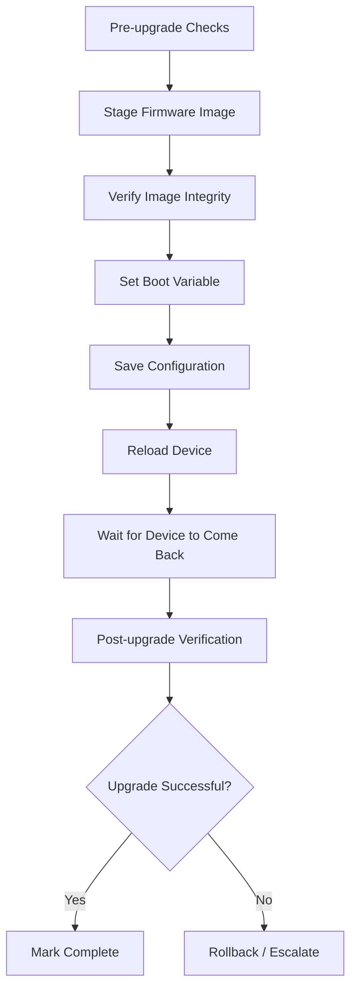

# How to Use Ansible to Manage Network Device Firmware

Author: [nawazdhandala](https://www.github.com/nawazdhandala)

Tags: Ansible, Firmware, Network Automation, Upgrade

Description: Automate network device firmware upgrades with Ansible, including image staging, validation, upgrade execution, and post-upgrade verification.

---

Firmware upgrades on network devices are one of the most stressful tasks in a network engineer's life. You are rebooting production devices, crossing your fingers that the new image boots correctly, and hoping you did not miss a dependency. Doing this across dozens or hundreds of devices amplifies that stress.

Ansible can automate the entire firmware upgrade lifecycle: pre-checks, image staging, verification, upgrade execution, and post-upgrade validation. This post walks through a practical firmware management workflow.

## Firmware Upgrade Workflow

Before writing any playbooks, understand the workflow.



## Defining Firmware Variables

Track the target firmware version and image file in variables.

```yaml
# group_vars/ios_routers/firmware.yml - Firmware management variables
---
firmware:
  # Target firmware details
  target_version: "17.09.04a"
  target_image: "cat9k_iosxe.17.09.04a.SPA.bin"
  target_md5: "a1b2c3d4e5f6a1b2c3d4e5f6a1b2c3d4"
  target_size_mb: 850

  # File server hosting the firmware images
  file_server: "10.10.1.100"
  file_server_protocol: "scp"
  file_server_path: "/firmware/cisco/ios"
  file_server_user: "firmware"
  file_server_password: "{{ vault_firmware_password }}"

  # Minimum flash space required (in bytes)
  min_flash_space: 1000000000

  # Boot variable
  boot_system: "flash:{{ firmware.target_image }}"
```

## Pre-Upgrade Checks

Before attempting any upgrade, verify that the device is a candidate.

```yaml
# pre_upgrade_checks.yml - Validate device readiness for firmware upgrade
---
- name: Pre-upgrade validation
  hosts: upgrade_candidates
  gather_facts: false
  connection: network_cli
  serial: 1

  tasks:
    # Check current firmware version
    - name: Get current version
      cisco.ios.ios_command:
        commands:
          - show version
      register: version_output

    - name: Parse current version
      ansible.builtin.set_fact:
        current_version: "{{ version_output.stdout[0] | regex_search('Version ([\\S]+)', '\\1') | first }}"

    # Skip if already running target version
    - name: Check if upgrade needed
      ansible.builtin.debug:
        msg: "Device {{ inventory_hostname }} already running {{ current_version }} - skipping"
      when: current_version == firmware.target_version

    - name: End play if already on target
      ansible.builtin.meta: end_host
      when: current_version == firmware.target_version

    # Check available flash space
    - name: Check flash storage
      cisco.ios.ios_command:
        commands:
          - dir flash: | include free
      register: flash_info

    - name: Parse free space
      ansible.builtin.set_fact:
        free_space: "{{ flash_info.stdout[0] | regex_search('(\\d+) bytes free', '\\1') | first }}"

    - name: Verify sufficient flash space
      ansible.builtin.assert:
        that:
          - free_space | int > firmware.min_flash_space
        fail_msg: "Insufficient flash: {{ free_space }} bytes free, need {{ firmware.min_flash_space }}"
        success_msg: "Flash space OK: {{ free_space }} bytes free"

    # Check device is not in a degraded state
    - name: Check for critical processes
      cisco.ios.ios_command:
        commands:
          - show processes cpu | include CPU
      register: cpu_info

    - name: Parse CPU usage
      ansible.builtin.set_fact:
        cpu_usage: "{{ cpu_info.stdout[0] | regex_search('five minutes: (\\d+)', '\\1') | first }}"

    - name: Verify CPU is not maxed
      ansible.builtin.assert:
        that:
          - cpu_usage | int < 80
        fail_msg: "CPU too high for upgrade: {{ cpu_usage }}% (threshold: 80%)"
        success_msg: "CPU usage OK: {{ cpu_usage }}%"

    # Backup configuration before upgrade
    - name: Backup config pre-upgrade
      cisco.ios.ios_config:
        backup: true
        backup_options:
          dir_path: "backups/pre-upgrade"
          filename: "{{ inventory_hostname }}_{{ current_version }}.cfg"

    - name: Record pre-upgrade state
      ansible.builtin.copy:
        content: |
          hostname: {{ inventory_hostname }}
          current_version: {{ current_version }}
          target_version: {{ firmware.target_version }}
          free_space: {{ free_space }}
          cpu_usage: {{ cpu_usage }}
          timestamp: {{ lookup('pipe', 'date -u +%Y-%m-%dT%H:%M:%SZ') }}
        dest: "reports/pre-upgrade/{{ inventory_hostname }}.yml"
      delegate_to: localhost
```

## Staging Firmware Images

Copy the firmware image to each device.

```yaml
# stage_firmware.yml - Copy firmware image to device flash
---
- name: Stage firmware images
  hosts: upgrade_candidates
  gather_facts: false
  connection: network_cli
  serial: 5

  tasks:
    # Check if image already exists on flash
    - name: Check if image exists on flash
      cisco.ios.ios_command:
        commands:
          - "dir flash:{{ firmware.target_image }}"
      register: image_check
      ignore_errors: true

    - name: Skip staging if image exists
      ansible.builtin.debug:
        msg: "Image already on flash, skipping transfer"
      when: image_check is succeeded

    # Copy image from file server to device flash
    - name: Copy firmware to device
      cisco.ios.ios_command:
        commands:
          - command: "copy scp://{{ firmware.file_server_user }}:{{ firmware.file_server_password }}@{{ firmware.file_server }}{{ firmware.file_server_path }}/{{ firmware.target_image }} flash:{{ firmware.target_image }}"
            prompt:
              - "Destination filename"
            answer:
              - ""
        wait_for:
          - result[0] contains "bytes copied"
      when: image_check is failed
      vars:
        ansible_command_timeout: 1800

    # Verify the copied image using MD5
    - name: Verify image MD5 hash
      cisco.ios.ios_command:
        commands:
          - "verify /md5 flash:{{ firmware.target_image }}"
      register: md5_result
      vars:
        ansible_command_timeout: 600

    - name: Assert MD5 matches
      ansible.builtin.assert:
        that:
          - firmware.target_md5 in md5_result.stdout[0]
        fail_msg: "MD5 verification FAILED for {{ inventory_hostname }}! Do not proceed with upgrade."
        success_msg: "MD5 verified successfully"
```

## Executing the Firmware Upgrade

With the image staged and verified, set the boot variable and reload.

```yaml
# execute_upgrade.yml - Set boot variable and reload devices
---
- name: Execute firmware upgrade
  hosts: upgrade_candidates
  gather_facts: false
  connection: network_cli
  serial: 1

  tasks:
    # Set the boot system to the new image
    - name: Set boot variable
      cisco.ios.ios_config:
        lines:
          - "no boot system"
          - "boot system flash:{{ firmware.target_image }}"
        save_when: always

    # Verify boot variable is set correctly
    - name: Verify boot variable
      cisco.ios.ios_command:
        commands:
          - show boot
      register: boot_check

    - name: Assert boot variable is correct
      ansible.builtin.assert:
        that:
          - firmware.target_image in boot_check.stdout[0]
        fail_msg: "Boot variable not set correctly!"

    # Save config one more time before reload
    - name: Save configuration
      cisco.ios.ios_command:
        commands:
          - write memory

    # Reload the device
    - name: Reload device
      cisco.ios.ios_command:
        commands:
          - command: reload
            prompt:
              - "confirm"
              - "Save"
            answer:
              - "y"
              - "y"
      vars:
        ansible_command_timeout: 30
      ignore_errors: true

    # Wait for device to come back online
    - name: Wait for device to reboot
      ansible.builtin.wait_for:
        host: "{{ ansible_host }}"
        port: 22
        delay: 120
        timeout: 600
        state: started
      delegate_to: localhost

    # Wait a bit more for the device to fully boot
    - name: Wait for services to stabilize
      ansible.builtin.pause:
        seconds: 60
```

## Post-Upgrade Verification

After the device comes back, verify it is running the correct version and is healthy.

```yaml
# post_upgrade_verify.yml - Validate the upgrade was successful
---
- name: Post-upgrade verification
  hosts: upgrade_candidates
  gather_facts: false
  connection: network_cli

  tasks:
    - name: Get version after upgrade
      cisco.ios.ios_command:
        commands:
          - show version
      register: post_version

    - name: Parse new version
      ansible.builtin.set_fact:
        new_version: "{{ post_version.stdout[0] | regex_search('Version ([\\S]+)', '\\1') | first }}"

    - name: Verify firmware version
      ansible.builtin.assert:
        that:
          - new_version == firmware.target_version
        fail_msg: "UPGRADE FAILED: Running {{ new_version }}, expected {{ firmware.target_version }}"
        success_msg: "Upgrade successful: now running {{ new_version }}"

    - name: Check interface status
      cisco.ios.ios_command:
        commands:
          - show ip interface brief
      register: interfaces

    - name: Check routing protocols
      cisco.ios.ios_command:
        commands:
          - show ip ospf neighbor
          - show ip bgp summary
      register: routing
      ignore_errors: true

    - name: Verify OSPF neighbors recovered
      ansible.builtin.debug:
        msg: "OSPF neighbors: {{ routing.stdout[0] | regex_findall('FULL') | length }}"

    - name: Generate post-upgrade report
      ansible.builtin.copy:
        content: |
          Upgrade Report: {{ inventory_hostname }}
          Previous Version: {{ hostvars[inventory_hostname].current_version | default('unknown') }}
          Current Version: {{ new_version }}
          Status: {{ 'SUCCESS' if new_version == firmware.target_version else 'FAILED' }}
          Timestamp: {{ lookup('pipe', 'date -u +%Y-%m-%dT%H:%M:%SZ') }}
        dest: "reports/post-upgrade/{{ inventory_hostname }}.txt"
      delegate_to: localhost
```

Firmware management with Ansible transforms one of the most stressful network operations into a structured, repeatable process. Pre-checks catch problems before you start. Image staging and verification happen in parallel. Upgrades execute one at a time with automatic verification. And when something goes wrong, you have backups and reports to guide your recovery. That kind of discipline is what makes the difference between a smooth maintenance window and an all-nighter.
