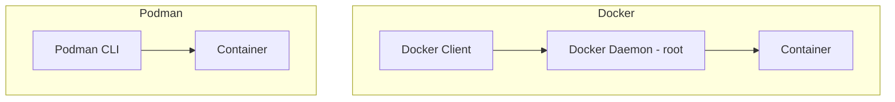

# How to Use Ansible to Manage Podman Containers

Author: [nawazdhandala](https://www.github.com/nawazdhandala)

Tags: Ansible, Podman, Containers, Linux, DevOps

Description: Manage Podman containers with Ansible using the containers.podman collection for rootless and daemonless container workflows.

---

Podman has become a serious alternative to Docker, especially in enterprise Linux environments. It runs containers without a daemon, supports rootless containers out of the box, and is fully compatible with OCI container images. The `containers.podman` Ansible collection provides dedicated modules for managing Podman containers, images, pods, and networks. This post covers the practical details of automating Podman container management with Ansible.

## Why Podman?

Podman solves some real problems that Docker has in certain environments:

- **No daemon**: Podman does not need a background service running as root. Each container is a child process of the user who started it.
- **Rootless by default**: Regular users can run containers without elevated privileges, which matters a lot for security compliance.
- **Systemd integration**: Podman generates systemd unit files for containers, so containers can start on boot and restart on failure like any other service.
- **Docker CLI compatibility**: Most `docker` commands work with `podman` by just changing the command name.



## Installing the Collection

Install the `containers.podman` collection from Ansible Galaxy:

```bash
# Install the Podman collection
ansible-galaxy collection install containers.podman
```

## Installing Podman with Ansible

First, make sure Podman is installed on your target hosts:

```yaml
# install_podman.yml - Install Podman on RHEL/CentOS/Fedora and Debian/Ubuntu
---
- name: Install Podman
  hosts: container_hosts
  become: true

  tasks:
    - name: Install Podman on RHEL-based systems
      ansible.builtin.dnf:
        name:
          - podman
          - podman-plugins
          - buildah
          - skopeo
        state: present
      when: ansible_os_family == "RedHat"

    - name: Install Podman on Debian-based systems
      ansible.builtin.apt:
        name:
          - podman
          - buildah
          - skopeo
        state: present
        update_cache: true
      when: ansible_os_family == "Debian"

    - name: Verify Podman installation
      ansible.builtin.command:
        cmd: podman version
      register: podman_version
      changed_when: false

    - name: Display Podman version
      ansible.builtin.debug:
        msg: "{{ podman_version.stdout_lines }}"
```

## Running Containers with Podman

The `podman_container` module works similarly to Docker's `docker_container`:

```yaml
# run_container.yml - Run a Podman container
---
- name: Run Podman Containers
  hosts: container_hosts
  become: false  # Rootless containers do not need sudo

  tasks:
    - name: Pull the image first
      containers.podman.podman_image:
        name: docker.io/library/nginx
        tag: latest

    - name: Run nginx container
      containers.podman.podman_container:
        name: webserver
        image: docker.io/library/nginx:latest
        state: started
        ports:
          - "8080:80"
        volumes:
          - "/home/{{ ansible_user }}/www:/usr/share/nginx/html:ro"
```

Notice the `become: false`. Since Podman supports rootless containers, regular users can run this without sudo. The container runs under the user's namespace.

## Container with Full Configuration

Here is a more complete example with environment variables, resource limits, and health checks:

```yaml
# full_container.yml - Fully configured Podman container
---
- name: Deploy Application Container
  hosts: container_hosts
  become: false
  vars:
    app_version: "2.1.0"

  tasks:
    - name: Create data directories
      ansible.builtin.file:
        path: "{{ item }}"
        state: directory
        mode: '0755'
      loop:
        - "{{ ansible_user_dir }}/app/data"
        - "{{ ansible_user_dir }}/app/config"
        - "{{ ansible_user_dir }}/app/logs"

    - name: Deploy application container
      containers.podman.podman_container:
        name: myapp
        image: "registry.example.com/myapp:{{ app_version }}"
        state: started
        restart_policy: on-failure
        ports:
          - "3000:3000"
          - "127.0.0.1:9090:9090"
        env:
          NODE_ENV: "production"
          DATABASE_URL: "postgres://appuser:{{ vault_db_pass }}@db:5432/mydb"
          LOG_LEVEL: "info"
        volumes:
          - "{{ ansible_user_dir }}/app/data:/app/data"
          - "{{ ansible_user_dir }}/app/config:/app/config:ro"
          - "{{ ansible_user_dir }}/app/logs:/app/logs"
        memory: "512m"
        cpus: "1.5"
        healthcheck: "curl -f http://localhost:3000/health || exit 1"
        healthcheck_interval: 30s
        healthcheck_timeout: 10s
        healthcheck_retries: 3
        labels:
          app: myapp
          version: "{{ app_version }}"
          environment: production
```

## Running Rootful Containers

Some workloads need root privileges (binding to low ports, accessing host devices, etc.). For these cases, use `become: true`:

```yaml
# rootful_container.yml - Container that requires root
---
- name: Run Rootful Container
  hosts: container_hosts
  become: true

  tasks:
    - name: Run container with privileged port binding
      containers.podman.podman_container:
        name: dns-server
        image: docker.io/coredns/coredns:latest
        state: started
        ports:
          - "53:53/tcp"
          - "53:53/udp"
        volumes:
          - "/opt/coredns/config:/etc/coredns:ro"
```

## Managing Container Networks

Podman supports CNI and netavark networking. Create networks for container-to-container communication:

```yaml
# podman_networks.yml - Create and use Podman networks
---
- name: Manage Podman Networks
  hosts: container_hosts
  become: false

  tasks:
    - name: Create application network
      containers.podman.podman_network:
        name: app_net
        subnet: 10.89.0.0/24
        gateway: 10.89.0.1
        state: present

    - name: Run database on the network
      containers.podman.podman_container:
        name: postgres
        image: docker.io/library/postgres:16
        state: started
        network:
          - app_net
        env:
          POSTGRES_PASSWORD: "{{ vault_db_password }}"

    - name: Run application on the same network
      containers.podman.podman_container:
        name: webapp
        image: registry.example.com/webapp:latest
        state: started
        network:
          - app_net
        ports:
          - "8080:8080"
        env:
          DATABASE_HOST: "postgres"
          DATABASE_PORT: "5432"
```

## Generating Systemd Units

One of Podman's best features is generating systemd unit files. This lets containers start on boot and be managed like regular services:

```yaml
# systemd_containers.yml - Generate systemd units for Podman containers
---
- name: Create Systemd-Managed Containers
  hosts: container_hosts
  become: false

  tasks:
    - name: Create the container first
      containers.podman.podman_container:
        name: webapp
        image: registry.example.com/webapp:latest
        state: created  # Created but not started
        ports:
          - "8080:8080"
        env:
          NODE_ENV: "production"

    - name: Generate systemd unit for the container
      containers.podman.podman_generate_systemd:
        name: webapp
        new: true
        restart_policy: on-failure
        time: 30
        dest: "{{ ansible_user_dir }}/.config/systemd/user/"
      register: systemd_unit

    - name: Reload systemd user daemon
      ansible.builtin.systemd:
        daemon_reload: true
        scope: user

    - name: Enable and start the container service
      ansible.builtin.systemd:
        name: "container-webapp"
        state: started
        enabled: true
        scope: user

    - name: Enable lingering for the user (so services run when logged out)
      ansible.builtin.command:
        cmd: "loginctl enable-linger {{ ansible_user }}"
      become: true
      changed_when: true
```

The `loginctl enable-linger` command is important. Without it, the user's systemd services (and therefore their containers) stop when the user logs out.

## Container Lifecycle Management

Manage the full lifecycle of containers:

```yaml
# lifecycle.yml - Container lifecycle operations
---
- name: Container Lifecycle Management
  hosts: container_hosts
  become: false

  tasks:
    - name: Stop a container
      containers.podman.podman_container:
        name: webapp
        state: stopped

    - name: Start a container
      containers.podman.podman_container:
        name: webapp
        state: started

    - name: Restart a container
      containers.podman.podman_container:
        name: webapp
        state: started
        force_restart: true

    - name: Remove a container
      containers.podman.podman_container:
        name: webapp
        state: absent
```

## Checking Container Status

Monitor your Podman containers:

```yaml
# check_status.yml - Check Podman container status
---
- name: Check Container Status
  hosts: container_hosts
  become: false

  tasks:
    - name: Get container info
      containers.podman.podman_container_info:
        name: webapp
      register: container_info

    - name: Display container state
      ansible.builtin.debug:
        msg:
          - "Name: {{ container_info.containers[0].Name }}"
          - "State: {{ container_info.containers[0].State.Status }}"
          - "Image: {{ container_info.containers[0].ImageName }}"
          - "Started: {{ container_info.containers[0].State.StartedAt }}"

    - name: List all running containers
      containers.podman.podman_container_info:
      register: all_containers

    - name: Show running container names
      ansible.builtin.debug:
        msg: "{{ all_containers.containers | map(attribute='Name') | list }}"
```

## Migrating from Docker to Podman

If you are moving from Docker to Podman, the Ansible module changes are minimal:

| Docker Module | Podman Module |
|---|---|
| community.docker.docker_container | containers.podman.podman_container |
| community.docker.docker_image | containers.podman.podman_image |
| community.docker.docker_network | containers.podman.podman_network |
| community.docker.docker_volume | containers.podman.podman_volume |

The parameters are very similar, so migration mostly involves changing module names and adjusting for rootless operation (removing `become: true` where possible).

## Summary

Podman with Ansible is a strong combination for environments that need rootless containers, daemonless operation, or tight systemd integration. The `containers.podman` collection provides modules that mirror the Docker collection's functionality, making migration straightforward. The key differences are rootless operation by default, systemd unit generation for service management, and the absence of a daemon. For RHEL and Fedora environments where Podman is the default container runtime, this is the natural choice for container automation.
