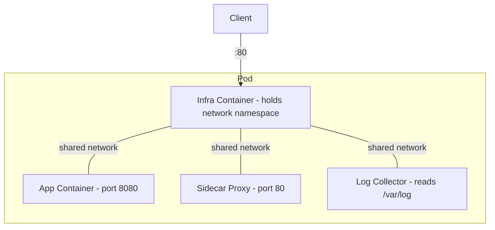

# How to Use Ansible to Manage Podman Pods

Author: [nawazdhandala](https://www.github.com/nawazdhandala)

Tags: Ansible, Podman, Pods, Containers, Linux

Description: Create and manage Podman pods with Ansible to group related containers that share network namespaces and resources.

---

Podman pods bring the Kubernetes pod concept to standalone container hosts. A pod is a group of containers that share the same network namespace, meaning they can communicate over localhost and share the same IP address. This makes pods perfect for tightly coupled services like a web application with its sidecar proxy, or an application with its log collector. Ansible provides modules to create, manage, and orchestrate pods through the `containers.podman` collection.

## What is a Podman Pod?

A pod in Podman groups one or more containers under a shared infra container. The infra container (usually `k8s.gcr.io/pause`) holds the network namespace open, and all other containers in the pod share that namespace.



Containers in a pod can reach each other on `localhost`, just like containers in a Kubernetes pod.

## Creating a Pod

Use the `podman_pod` module to create pods:

```yaml
# create_pod.yml - Create a basic Podman pod
---
- name: Create Podman Pod
  hosts: container_hosts
  become: false

  tasks:
    - name: Create a pod with port mappings
      containers.podman.podman_pod:
        name: webapp-pod
        state: created
        ports:
          - "8080:80"
          - "8443:443"
        network:
          - podman

    - name: Start the pod
      containers.podman.podman_pod:
        name: webapp-pod
        state: started
```

Port mappings are defined at the pod level, not on individual containers. This is because all containers in the pod share the same network namespace.

## Adding Containers to a Pod

Once a pod exists, add containers to it using the `pod` parameter:

```yaml
# pod_with_containers.yml - Create a pod and add containers
---
- name: Deploy Application Pod
  hosts: container_hosts
  become: false
  vars:
    app_version: "1.4.0"

  tasks:
    - name: Create the application pod
      containers.podman.podman_pod:
        name: myapp-pod
        state: created
        ports:
          - "80:80"
          - "443:443"
          - "127.0.0.1:9090:9090"  # Metrics only on localhost

    - name: Run the application container in the pod
      containers.podman.podman_container:
        name: myapp
        image: "registry.example.com/myapp:{{ app_version }}"
        pod: myapp-pod
        state: started
        env:
          APP_PORT: "8080"
          LOG_DIR: "/var/log/app"
        volumes:
          - "app-logs:/var/log/app"

    - name: Run nginx reverse proxy in the pod
      containers.podman.podman_container:
        name: myapp-nginx
        image: docker.io/library/nginx:latest
        pod: myapp-pod
        state: started
        volumes:
          - "{{ ansible_user_dir }}/nginx/conf.d:/etc/nginx/conf.d:ro"
          - "{{ ansible_user_dir }}/nginx/certs:/etc/nginx/certs:ro"

    - name: Run log collector sidecar in the pod
      containers.podman.podman_container:
        name: myapp-logs
        image: docker.io/fluent/fluent-bit:latest
        pod: myapp-pod
        state: started
        volumes:
          - "app-logs:/var/log/app:ro"
          - "{{ ansible_user_dir }}/fluentbit/config:/fluent-bit/etc:ro"
```

Because the containers share a network namespace, the nginx container can proxy to the app on `localhost:8080`, and the log collector can read from the shared volume.

## Pod for a Database with Monitoring

Here is a practical example of a PostgreSQL pod with pgbouncer connection pooling and a metrics exporter:

```yaml
# database_pod.yml - PostgreSQL pod with connection pooler and exporter
---
- name: Deploy Database Pod
  hosts: database_hosts
  become: false
  vars:
    pg_version: "16"
    pgbouncer_version: "1.22.0"

  tasks:
    - name: Create database pod
      containers.podman.podman_pod:
        name: database-pod
        state: created
        ports:
          - "5432:6432"      # PgBouncer port exposed
          - "127.0.0.1:9187:9187"  # Postgres exporter metrics

    - name: Create data volume
      containers.podman.podman_volume:
        name: pgdata
        state: present

    - name: Run PostgreSQL
      containers.podman.podman_container:
        name: postgres
        image: "docker.io/library/postgres:{{ pg_version }}"
        pod: database-pod
        state: started
        env:
          POSTGRES_PASSWORD: "{{ vault_pg_password }}"
          POSTGRES_DB: "appdb"
          PGDATA: "/var/lib/postgresql/data/pgdata"
        volumes:
          - "pgdata:/var/lib/postgresql/data"
        healthcheck: "pg_isready -U postgres"
        healthcheck_interval: 10s

    - name: Run PgBouncer connection pooler
      containers.podman.podman_container:
        name: pgbouncer
        image: "docker.io/edoburu/pgbouncer:{{ pgbouncer_version }}"
        pod: database-pod
        state: started
        env:
          DATABASE_URL: "postgres://postgres:{{ vault_pg_password }}@localhost:5432/appdb"
          POOL_MODE: "transaction"
          MAX_CLIENT_CONN: "200"

    - name: Run Postgres exporter for Prometheus
      containers.podman.podman_container:
        name: pg-exporter
        image: docker.io/prometheuscommunity/postgres-exporter:latest
        pod: database-pod
        state: started
        env:
          DATA_SOURCE_NAME: "postgresql://postgres:{{ vault_pg_password }}@localhost:5432/appdb?sslmode=disable"
```

## Managing Pod Lifecycle

Control the entire pod (all containers at once):

```yaml
# pod_lifecycle.yml - Pod lifecycle operations
---
- name: Pod Lifecycle Management
  hosts: container_hosts
  become: false

  tasks:
    - name: Stop all containers in the pod
      containers.podman.podman_pod:
        name: myapp-pod
        state: stopped

    - name: Start all containers in the pod
      containers.podman.podman_pod:
        name: myapp-pod
        state: started

    - name: Restart the entire pod
      containers.podman.podman_pod:
        name: myapp-pod
        state: restarted

    - name: Remove the pod and all its containers
      containers.podman.podman_pod:
        name: myapp-pod
        state: absent
        force: true  # Force remove even if containers are running
```

## Pod Status Checking

Monitor pod health:

```yaml
# check_pod.yml - Check pod and container status
---
- name: Check Pod Health
  hosts: container_hosts
  become: false

  tasks:
    - name: Get pod information
      containers.podman.podman_pod_info:
        name: myapp-pod
      register: pod_info

    - name: Display pod status
      ansible.builtin.debug:
        msg:
          - "Pod: {{ pod_info.pods[0].Name }}"
          - "Status: {{ pod_info.pods[0].State }}"
          - "Containers: {{ pod_info.pods[0].Containers | length }}"

    - name: Check each container in the pod
      containers.podman.podman_container_info:
        name: "{{ item.Name }}"
      register: container_status
      loop: "{{ pod_info.pods[0].Containers }}"
      loop_control:
        label: "{{ item.Name }}"

    - name: Report any unhealthy containers
      ansible.builtin.debug:
        msg: "{{ item.item.Name }}: {{ item.containers[0].State.Status }}"
      loop: "{{ container_status.results }}"
      loop_control:
        label: "{{ item.item.Name }}"
```

## Generating Systemd Units for Pods

Create systemd services that manage the entire pod:

```yaml
# pod_systemd.yml - Generate systemd units for a pod
---
- name: Create Systemd-Managed Pod
  hosts: container_hosts
  become: false

  tasks:
    - name: Ensure user systemd directory exists
      ansible.builtin.file:
        path: "{{ ansible_user_dir }}/.config/systemd/user"
        state: directory
        mode: '0755'

    - name: Generate systemd unit for the pod
      containers.podman.podman_generate_systemd:
        name: myapp-pod
        new: true
        restart_policy: on-failure
        dest: "{{ ansible_user_dir }}/.config/systemd/user/"
        container_prefix: container
        pod_prefix: pod

    - name: Reload systemd
      ansible.builtin.systemd:
        daemon_reload: true
        scope: user

    - name: Enable and start the pod service
      ansible.builtin.systemd:
        name: pod-myapp-pod
        state: started
        enabled: true
        scope: user
```

## Updating Containers in a Pod

To update a container within a pod, stop the pod, replace the container, and restart:

```yaml
# update_pod_container.yml - Update a specific container in a pod
---
- name: Update Container in Pod
  hosts: container_hosts
  become: false
  vars:
    new_version: "1.5.0"

  tasks:
    - name: Pull new image version
      containers.podman.podman_image:
        name: "registry.example.com/myapp:{{ new_version }}"

    - name: Stop the pod
      containers.podman.podman_pod:
        name: myapp-pod
        state: stopped

    - name: Remove the old app container
      containers.podman.podman_container:
        name: myapp
        state: absent

    - name: Create updated app container in the pod
      containers.podman.podman_container:
        name: myapp
        image: "registry.example.com/myapp:{{ new_version }}"
        pod: myapp-pod
        state: created
        env:
          APP_PORT: "8080"
        volumes:
          - "app-logs:/var/log/app"

    - name: Start the pod with updated container
      containers.podman.podman_pod:
        name: myapp-pod
        state: started

    - name: Wait for application to be ready
      ansible.builtin.uri:
        url: "http://localhost:80/health"
        status_code: 200
      register: health
      retries: 10
      delay: 5
      until: health.status == 200
```

## Summary

Podman pods let you group related containers that need to communicate tightly, sharing network namespaces just like Kubernetes pods. Ansible's `containers.podman` collection provides dedicated modules for creating pods, adding containers to them, and managing their lifecycle. Combined with systemd integration, you get reliable, self-healing pod deployments on standalone hosts without needing a full Kubernetes cluster. Pods are especially valuable for sidecar patterns, where a main application container needs companion containers for logging, monitoring, or proxying.
