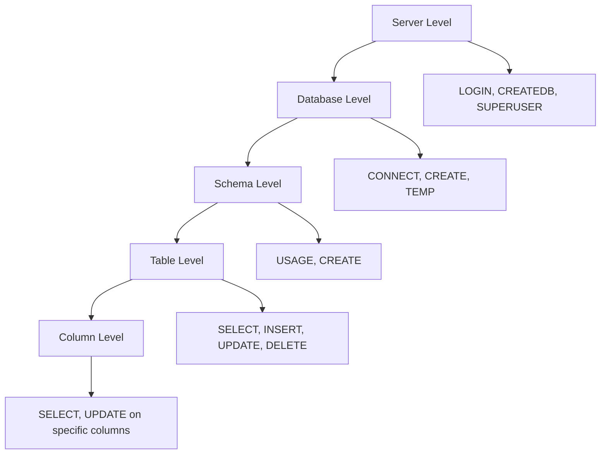

# How to Use Ansible to Manage PostgreSQL Permissions

Author: [nawazdhandala](https://www.github.com/nawazdhandala)

Tags: Ansible, PostgreSQL, Permissions, Database Security

Description: Manage PostgreSQL permissions and privileges with Ansible to enforce least-privilege access control across all your database servers.

---

PostgreSQL has a granular permission system that controls who can do what at the database, schema, table, and column level. Managing these permissions by hand across multiple servers and environments is a recipe for inconsistency. One server might have the reporting user with write access, while another has it correctly set to read-only. Ansible's `community.postgresql.postgresql_privs` module lets you define permissions as code and apply them consistently everywhere.

This post covers how to manage PostgreSQL permissions with Ansible, from database-level grants to fine-grained table and schema privileges.

## Permission Levels in PostgreSQL

PostgreSQL permissions work at several levels. Understanding the hierarchy is important before automating with Ansible.



## Database-Level Permissions

Start by granting CONNECT access to the databases each user needs.

```yaml
# playbooks/manage-pg-permissions.yml
# Grant database-level permissions to PostgreSQL users
---
- name: Manage PostgreSQL permissions
  hosts: databases
  become: true
  become_user: postgres

  tasks:
    - name: Grant CONNECT on production database to app user
      community.postgresql.postgresql_privs:
        database: myapp_production
        type: database
        roles: myapp_user
        privs: CONNECT
        state: present

    - name: Grant CONNECT and CREATE on production database to admin
      community.postgresql.postgresql_privs:
        database: myapp_production
        type: database
        roles: myapp_admin
        privs: CONNECT,CREATE,TEMP
        state: present

    - name: Grant CONNECT on production database to readonly user
      community.postgresql.postgresql_privs:
        database: myapp_production
        type: database
        roles: myapp_readonly
        privs: CONNECT
        state: present
```

## Schema-Level Permissions

Schema permissions control who can see and create objects within a schema.

```yaml
# Grant schema-level permissions
- name: Grant USAGE on public schema to app user
  community.postgresql.postgresql_privs:
    database: myapp_production
    type: schema
    objs: public
    roles: myapp_user
    privs: USAGE
    state: present

- name: Grant USAGE and CREATE on public schema to admin
  community.postgresql.postgresql_privs:
    database: myapp_production
    type: schema
    objs: public
    roles: myapp_admin
    privs: USAGE,CREATE
    state: present

- name: Grant USAGE on public schema to readonly user
  community.postgresql.postgresql_privs:
    database: myapp_production
    type: schema
    objs: public
    roles: myapp_readonly
    privs: USAGE
    state: present
```

## Table-Level Permissions

This is where you define who can read, write, update, and delete data.

```yaml
# Grant table-level permissions for different user types
- name: Grant full table access to app user
  community.postgresql.postgresql_privs:
    database: myapp_production
    schema: public
    type: table
    objs: ALL_IN_SCHEMA
    roles: myapp_user
    privs: SELECT,INSERT,UPDATE,DELETE
    state: present

- name: Grant read-only access to reporting user
  community.postgresql.postgresql_privs:
    database: myapp_production
    schema: public
    type: table
    objs: ALL_IN_SCHEMA
    roles: myapp_readonly
    privs: SELECT
    state: present

- name: Grant all privileges to admin user
  community.postgresql.postgresql_privs:
    database: myapp_production
    schema: public
    type: table
    objs: ALL_IN_SCHEMA
    roles: myapp_admin
    privs: ALL
    state: present
```

## Sequence Permissions

If your tables use sequences (auto-increment), the application user needs access to those too.

```yaml
# Grant sequence permissions so INSERT with serial/identity columns works
- name: Grant sequence usage to app user
  community.postgresql.postgresql_privs:
    database: myapp_production
    schema: public
    type: sequence
    objs: ALL_IN_SCHEMA
    roles: myapp_user
    privs: USAGE,SELECT,UPDATE
    state: present

- name: Grant sequence read to readonly user
  community.postgresql.postgresql_privs:
    database: myapp_production
    schema: public
    type: sequence
    objs: ALL_IN_SCHEMA
    roles: myapp_readonly
    privs: SELECT
    state: present
```

## Default Privileges for Future Tables

When new tables are created, they do not automatically inherit the permissions you have set. Default privileges fix this.

```yaml
# Set default privileges so future tables get correct permissions
- name: Set default SELECT on future tables for readonly user
  community.postgresql.postgresql_privs:
    database: myapp_production
    schema: public
    type: default_privs
    objs: TABLES
    roles: myapp_readonly
    privs: SELECT
    target_roles: myapp_admin
    state: present

- name: Set default CRUD on future tables for app user
  community.postgresql.postgresql_privs:
    database: myapp_production
    schema: public
    type: default_privs
    objs: TABLES
    roles: myapp_user
    privs: SELECT,INSERT,UPDATE,DELETE
    target_roles: myapp_admin
    state: present

- name: Set default sequence usage for app user
  community.postgresql.postgresql_privs:
    database: myapp_production
    schema: public
    type: default_privs
    objs: SEQUENCES
    roles: myapp_user
    privs: USAGE,SELECT,UPDATE
    target_roles: myapp_admin
    state: present
```

## Complete Permission Management Role

Here is a role that manages all permission levels for a typical application.

```yaml
# roles/postgresql_permissions/defaults/main.yml
# Default permission definitions
---
postgresql_permission_sets:
  - database: myapp_production
    grants:
      - role: myapp_admin
        database_privs: CONNECT,CREATE,TEMP
        schema_privs: USAGE,CREATE
        table_privs: ALL
        sequence_privs: ALL
      - role: myapp_user
        database_privs: CONNECT
        schema_privs: USAGE
        table_privs: SELECT,INSERT,UPDATE,DELETE
        sequence_privs: USAGE,SELECT,UPDATE
      - role: myapp_readonly
        database_privs: CONNECT
        schema_privs: USAGE
        table_privs: SELECT
        sequence_privs: SELECT
```

```yaml
# roles/postgresql_permissions/tasks/main.yml
# Apply all permission levels from the configuration
---
- name: Grant database-level privileges
  community.postgresql.postgresql_privs:
    database: "{{ item.0.database }}"
    type: database
    roles: "{{ item.1.role }}"
    privs: "{{ item.1.database_privs }}"
    state: present
  loop: "{{ postgresql_permission_sets | subelements('grants') }}"
  become: true
  become_user: postgres

- name: Grant schema-level privileges
  community.postgresql.postgresql_privs:
    database: "{{ item.0.database }}"
    type: schema
    objs: public
    roles: "{{ item.1.role }}"
    privs: "{{ item.1.schema_privs }}"
    state: present
  loop: "{{ postgresql_permission_sets | subelements('grants') }}"
  become: true
  become_user: postgres

- name: Grant table-level privileges
  community.postgresql.postgresql_privs:
    database: "{{ item.0.database }}"
    schema: public
    type: table
    objs: ALL_IN_SCHEMA
    roles: "{{ item.1.role }}"
    privs: "{{ item.1.table_privs }}"
    state: present
  loop: "{{ postgresql_permission_sets | subelements('grants') }}"
  become: true
  become_user: postgres

- name: Grant sequence-level privileges
  community.postgresql.postgresql_privs:
    database: "{{ item.0.database }}"
    schema: public
    type: sequence
    objs: ALL_IN_SCHEMA
    roles: "{{ item.1.role }}"
    privs: "{{ item.1.sequence_privs }}"
    state: present
  loop: "{{ postgresql_permission_sets | subelements('grants') }}"
  become: true
  become_user: postgres
```

## Revoking Permissions

To revoke permissions, use `state: absent`.

```yaml
# Revoke write access from a user
- name: Revoke write privileges from decommissioned user
  community.postgresql.postgresql_privs:
    database: myapp_production
    schema: public
    type: table
    objs: ALL_IN_SCHEMA
    roles: old_app_user
    privs: INSERT,UPDATE,DELETE
    state: absent
  become: true
  become_user: postgres
```

## Auditing Current Permissions

Verify that permissions are set correctly by querying the system catalogs.

```yaml
# Audit current table permissions
- name: Check table permissions for a user
  community.postgresql.postgresql_query:
    db: myapp_production
    query: |
      SELECT grantee, table_schema, table_name, privilege_type
      FROM information_schema.table_privileges
      WHERE grantee = 'myapp_readonly'
      ORDER BY table_schema, table_name, privilege_type;
  register: perms_audit
  become: true
  become_user: postgres

- name: Display current permissions
  debug:
    msg: "{{ perms_audit.query_result }}"
```

## Specific Table Permissions

Sometimes you need to grant access to specific tables rather than all tables in a schema.

```yaml
# Grant access to specific tables only
- name: Grant SELECT on specific tables to analytics user
  community.postgresql.postgresql_privs:
    database: myapp_production
    schema: public
    type: table
    objs: orders,products,customers
    roles: analytics_user
    privs: SELECT
    state: present
  become: true
  become_user: postgres
```

## Conclusion

PostgreSQL permission management with Ansible gives you audit-ready, version-controlled access control. Define your permission sets in variables, apply them with the `community.postgresql.postgresql_privs` module, and never worry about permission drift between servers again. The key practices are: always set default privileges for future objects, grant the minimum privileges each role needs, and include audit queries in your playbooks to verify the result. With permissions defined as code, you get a complete history of who has access to what and when it changed.
