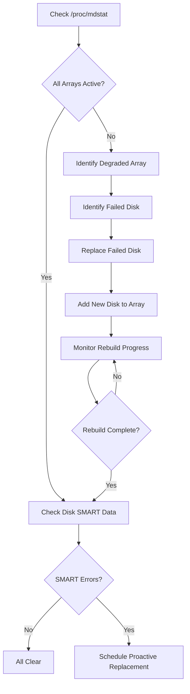

# How to Use Ansible to Manage RAID Arrays

Author: [nawazdhandala](https://www.github.com/nawazdhandala)

Tags: Ansible, RAID, Storage, Linux Administration

Description: Manage software RAID arrays across your Linux servers using Ansible for consistent disk redundancy and storage configuration.

---

Software RAID on Linux using mdadm is a reliable way to protect data on servers that do not have hardware RAID controllers. It is common on cloud instances, bare-metal servers from budget providers, and development environments where hardware RAID is overkill or unavailable. The challenge comes when you need to manage RAID arrays across a fleet of servers with consistent configurations.

Ansible gives you a way to create, monitor, and maintain mdadm RAID arrays across all your servers from a single set of playbooks. This guide covers everything from creating new arrays to monitoring health and handling disk replacements.

## Creating RAID Arrays

Let us start with creating a RAID-1 mirror and a RAID-5 array. RAID-1 gives you mirroring (good for boot drives), while RAID-5 provides striping with parity (good for data volumes).

```yaml
# create-raid.yml - Create software RAID arrays using mdadm
---
- name: Create software RAID arrays
  hosts: storage_servers
  become: true

  vars:
    raid_arrays:
      - name: /dev/md0
        level: 1
        devices:
          - /dev/sdb
          - /dev/sdc
        filesystem: ext4
        mount_point: /data/mirror
        mount_opts: defaults,noatime

      - name: /dev/md1
        level: 5
        devices:
          - /dev/sdd
          - /dev/sde
          - /dev/sdf
          - /dev/sdg
        filesystem: xfs
        mount_point: /data/storage
        mount_opts: defaults,noatime,nobarrier

  tasks:
    # Install mdadm if not present
    - name: Install mdadm
      ansible.builtin.yum:
        name: mdadm
        state: present
      when: ansible_os_family == "RedHat"

    - name: Install mdadm (Debian)
      ansible.builtin.apt:
        name: mdadm
        state: present
        update_cache: true
      when: ansible_os_family == "Debian"

    # Check if arrays already exist
    - name: Check for existing RAID arrays
      ansible.builtin.command:
        cmd: "mdadm --detail {{ item.name }}"
      loop: "{{ raid_arrays }}"
      register: existing_raids
      changed_when: false
      failed_when: false

    # Zero out superblocks on member disks (only for new arrays)
    - name: Zero superblocks on member disks
      ansible.builtin.command:
        cmd: "mdadm --zero-superblock {{ item.1 }}"
      loop: "{{ raid_arrays | subelements('devices') }}"
      when: existing_raids.results[raid_arrays.index(item.0)].rc != 0
      loop_control:
        label: "{{ item.1 }}"
      failed_when: false

    # Create the RAID arrays
    - name: Create RAID arrays
      ansible.builtin.command:
        cmd: >
          mdadm --create {{ item.name }}
          --level={{ item.level }}
          --raid-devices={{ item.devices | length }}
          {{ item.devices | join(' ') }}
          --run
      loop: "{{ raid_arrays }}"
      when: existing_raids.results[raid_arrays.index(item)].rc != 0
      loop_control:
        label: "{{ item.name }}"

    # Wait for initial sync to make progress
    - name: Wait for RAID sync to start
      ansible.builtin.pause:
        seconds: 10
      when: existing_raids.results | selectattr('rc', 'ne', 0) | list | length > 0

    # Create filesystems on the arrays
    - name: Create filesystems
      community.general.filesystem:
        fstype: "{{ item.filesystem }}"
        dev: "{{ item.name }}"
      loop: "{{ raid_arrays }}"

    # Create mount point directories
    - name: Create mount points
      ansible.builtin.file:
        path: "{{ item.mount_point }}"
        state: directory
        mode: '0755'
      loop: "{{ raid_arrays }}"

    # Mount the arrays
    - name: Mount RAID arrays
      ansible.posix.mount:
        path: "{{ item.mount_point }}"
        src: "{{ item.name }}"
        fstype: "{{ item.filesystem }}"
        opts: "{{ item.mount_opts }}"
        state: mounted
      loop: "{{ raid_arrays }}"

    # Save the RAID configuration to mdadm.conf
    - name: Save RAID configuration
      ansible.builtin.shell:
        cmd: mdadm --detail --scan >> /etc/mdadm.conf
      changed_when: true

    # Update initramfs to include RAID config for boot
    - name: Update initramfs (RedHat)
      ansible.builtin.command:
        cmd: dracut --force
      when: ansible_os_family == "RedHat"
      changed_when: true

    - name: Update initramfs (Debian)
      ansible.builtin.command:
        cmd: update-initramfs -u
      when: ansible_os_family == "Debian"
      changed_when: true
```

## Monitoring RAID Health

RAID arrays need regular monitoring. A degraded array is still working, but one more disk failure away from total data loss.

```yaml
# monitor-raid.yml - Check RAID array health across all servers
---
- name: Monitor RAID array health
  hosts: storage_servers
  become: true

  tasks:
    # Get the status of all RAID arrays
    - name: Check RAID array status
      ansible.builtin.command:
        cmd: "cat /proc/mdstat"
      register: mdstat
      changed_when: false

    - name: Display RAID status
      ansible.builtin.debug:
        var: mdstat.stdout_lines

    # Get detailed info for each array
    - name: Get detailed array info
      ansible.builtin.command:
        cmd: "mdadm --detail {{ item }}"
      loop:
        - /dev/md0
        - /dev/md1
      register: raid_details
      changed_when: false
      failed_when: false

    # Check for degraded arrays
    - name: Check for degraded arrays
      ansible.builtin.shell:
        cmd: "mdadm --detail {{ item }} | grep 'State :'"
      loop:
        - /dev/md0
        - /dev/md1
      register: array_states
      changed_when: false
      failed_when: false

    # Alert on any degraded arrays
    - name: Alert on degraded RAID arrays
      ansible.builtin.debug:
        msg: "ALERT: {{ item.item }} is degraded! {{ item.stdout }}"
      loop: "{{ array_states.results }}"
      when: item.stdout is defined and 'degraded' in item.stdout
      loop_control:
        label: "{{ item.item }}"

    # Check for any rebuilding arrays
    - name: Check rebuild progress
      ansible.builtin.shell:
        cmd: "cat /proc/mdstat | grep -A2 'recovery\\|resync' || echo 'No rebuilds in progress'"
      register: rebuild_status
      changed_when: false

    - name: Display rebuild status
      ansible.builtin.debug:
        var: rebuild_status.stdout_lines
```

## RAID Health Check Flow



## Replacing Failed Disks

When a disk fails, you need to remove it, physically replace it, and add the new disk to the array. Here is a playbook for that process:

```yaml
# replace-raid-disk.yml - Replace a failed disk in a RAID array
---
- name: Replace failed RAID disk
  hosts: "{{ target_host }}"
  become: true

  vars:
    raid_device: /dev/md0
    failed_disk: /dev/sdc
    new_disk: /dev/sdc

  tasks:
    # Mark the failed disk as faulty (if not already)
    - name: Mark disk as faulty
      ansible.builtin.command:
        cmd: "mdadm {{ raid_device }} --fail {{ failed_disk }}"
      register: fail_result
      changed_when: "'has been marked as faulty' in fail_result.stdout"
      failed_when: false

    # Remove the failed disk from the array
    - name: Remove failed disk from array
      ansible.builtin.command:
        cmd: "mdadm {{ raid_device }} --remove {{ failed_disk }}"
      register: remove_result
      changed_when: "'has been removed' in remove_result.stdout"
      failed_when: false

    - name: Display removal result
      ansible.builtin.debug:
        msg: "Disk {{ failed_disk }} removed from {{ raid_device }}. Replace the physical disk now."

    # Wait for confirmation that the physical disk has been replaced
    - name: Wait for physical disk replacement
      ansible.builtin.pause:
        prompt: "Replace the physical disk and press Enter to continue"

    # Partition the new disk to match the array
    - name: Copy partition table from existing member
      ansible.builtin.command:
        cmd: "sfdisk -d {{ raid_device | regex_replace('md\\d+', 'sdb') }} | sfdisk {{ new_disk }}"
      changed_when: true
      failed_when: false

    # Add the new disk to the array
    - name: Add new disk to RAID array
      ansible.builtin.command:
        cmd: "mdadm {{ raid_device }} --add {{ new_disk }}"
      register: add_result

    - name: Display add result
      ansible.builtin.debug:
        var: add_result.stdout

    # Monitor the rebuild progress
    - name: Monitor rebuild
      ansible.builtin.command:
        cmd: "cat /proc/mdstat"
      register: rebuild_progress
      until: rebuild_progress.stdout is not search('recovery')
      retries: 360
      delay: 10
      changed_when: false

    # Update mdadm.conf after successful rebuild
    - name: Update RAID configuration
      ansible.builtin.shell:
        cmd: "mdadm --detail --scan > /etc/mdadm.conf"
      changed_when: true

    - name: Rebuild complete
      ansible.builtin.debug:
        msg: "RAID rebuild complete. Array {{ raid_device }} is healthy."
```

## Configuring RAID Email Alerts

You want to know about RAID issues before users start complaining. Here is how to set up email alerts:

```yaml
# raid-alerts.yml - Configure mdadm email monitoring alerts
---
- name: Configure RAID monitoring alerts
  hosts: storage_servers
  become: true

  vars:
    alert_email: "ops-team@example.com"
    mail_from: "raid-monitor@{{ ansible_hostname }}"

  tasks:
    # Configure mdadm monitoring
    - name: Configure mdadm monitoring in mdadm.conf
      ansible.builtin.lineinfile:
        path: /etc/mdadm.conf
        regexp: '^MAILADDR'
        line: "MAILADDR {{ alert_email }}"
        create: true
        mode: '0644'
      notify: restart mdmonitor

    # Configure the monitoring program
    - name: Set monitoring daemon options
      ansible.builtin.lineinfile:
        path: /etc/mdadm.conf
        regexp: '^PROGRAM'
        line: "PROGRAM /usr/local/bin/raid-alert.sh"
        create: true
        mode: '0644'

    # Create a custom alert script
    - name: Deploy RAID alert script
      ansible.builtin.copy:
        dest: /usr/local/bin/raid-alert.sh
        mode: '0755'
        content: |
          #!/bin/bash
          # RAID event alert script - deployed by Ansible
          EVENT=$1
          DEVICE=$2

          MESSAGE="RAID Alert on $(hostname)\nEvent: ${EVENT}\nDevice: ${DEVICE}\nTime: $(date)\n\nCurrent status:\n$(cat /proc/mdstat)"

          echo -e "${MESSAGE}" | mail -s "RAID Alert: ${EVENT} on $(hostname)" {{ alert_email }}

          # Also log to syslog
          logger -t mdadm "RAID event: ${EVENT} on ${DEVICE}"

    # Enable the monitoring daemon
    - name: Enable mdmonitor service
      ansible.builtin.systemd:
        name: mdmonitor
        state: started
        enabled: true

    # Set up a cron job for periodic RAID checks
    - name: Schedule weekly RAID check
      ansible.builtin.cron:
        name: "Weekly RAID array check"
        weekday: "0"
        hour: "2"
        minute: "0"
        job: "mdadm --detail --scan | while read line; do mdadm --action=check $(echo $line | awk '{print $2}'); done"
        user: root

  handlers:
    - name: restart mdmonitor
      ansible.builtin.systemd:
        name: mdmonitor
        state: restarted
```

## Growing RAID Arrays

When you add more disks to a server, you can grow existing arrays:

```yaml
# grow-raid.yml - Expand a RAID array with additional disks
---
- name: Grow RAID-5 array
  hosts: "{{ target_host }}"
  become: true

  vars:
    raid_device: /dev/md1
    new_disks:
      - /dev/sdh
      - /dev/sdi
    new_raid_devices: 6  # Total devices after adding (was 4, adding 2)

  tasks:
    # Add new disks to the array
    - name: Add new disks to RAID array
      ansible.builtin.command:
        cmd: "mdadm {{ raid_device }} --add {{ item }}"
      loop: "{{ new_disks }}"

    # Grow the array to use the new disks
    - name: Grow RAID array
      ansible.builtin.command:
        cmd: "mdadm --grow {{ raid_device }} --raid-devices={{ new_raid_devices }}"

    # Monitor the reshape progress
    - name: Wait for reshape to complete
      ansible.builtin.command:
        cmd: "cat /proc/mdstat"
      register: reshape_status
      until: reshape_status.stdout is not search('reshape')
      retries: 720
      delay: 60
      changed_when: false

    # Grow the filesystem to use the new space
    - name: Grow XFS filesystem
      ansible.builtin.command:
        cmd: "xfs_growfs {{ raid_device }}"
      when: "'xfs' in ansible_mounts | selectattr('device', 'equalto', raid_device) | map(attribute='fstype') | first | default('xfs')"

    - name: Grow ext4 filesystem
      ansible.builtin.command:
        cmd: "resize2fs {{ raid_device }}"
      when: "'ext' in ansible_mounts | selectattr('device', 'equalto', raid_device) | map(attribute='fstype') | first | default('')"

    # Update configuration
    - name: Update mdadm.conf
      ansible.builtin.shell:
        cmd: "mdadm --detail --scan > /etc/mdadm.conf"
      changed_when: true
```

## Practical Advice

Here are some things I have learned from managing RAID arrays in production:

1. Always save your mdadm.conf after creating or modifying arrays. Without it, the array names can change on reboot, which breaks your fstab entries and potentially your entire system.

2. Use RAID-10 instead of RAID-5 for write-heavy workloads. RAID-5 write performance is poor because of the parity calculation overhead. RAID-10 gives you both speed and redundancy.

3. Schedule regular RAID scrubs (weekly is good). This reads all data and parity blocks to detect silent corruption. The cron job in the alerts playbook above does exactly this.

4. Monitor disk SMART data in addition to RAID status. SMART can warn you about a failing disk before it actually fails, giving you time to do a proactive replacement instead of a reactive one.

5. Never create a RAID array on the same physical disks as another array. It sounds obvious, but I have seen people accidentally use partitions from the same disk in different arrays, which defeats the entire purpose of RAID.

6. Test your disk replacement procedure in a staging environment before you need to do it in production at 3 AM. Practice makes the difference between a calm recovery and a panicked scramble.

RAID is your first line of defense against disk failures. Managing it with Ansible means every server in your fleet has the same array configuration, the same monitoring, and the same alerting. No surprises.
