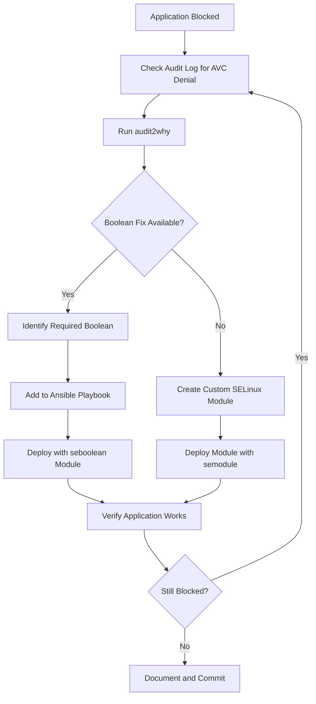

# How to Use Ansible to Manage SELinux Booleans

Author: [nawazdhandala](https://www.github.com/nawazdhandala)

Tags: Ansible, SELinux, Security, Linux

Description: Manage SELinux boolean settings across your RHEL/CentOS servers using Ansible for consistent mandatory access control policies.

---

SELinux is one of the most powerful security features on RHEL-family Linux systems, and also one of the most commonly disabled. The usual story goes like this: an application does not work, someone runs `setenforce 0`, the problem goes away, and SELinux stays disabled forever. This is unfortunate because SELinux provides real protection against privilege escalation and lateral movement attacks.

The key to keeping SELinux enabled is understanding and managing SELinux booleans. Booleans are on/off switches that modify SELinux policy without requiring you to write custom policy modules. They handle the most common scenarios where default policy is too restrictive for a specific use case. Ansible makes managing these booleans across your fleet straightforward.

## Understanding SELinux Booleans

Booleans let you toggle specific behaviors in SELinux policy. For example:

- `httpd_can_network_connect` - Allow Apache to make network connections to backends
- `httpd_can_sendmail` - Allow Apache to send mail
- `samba_enable_home_dirs` - Allow Samba to share user home directories
- `mysql_connect_any` - Allow MySQL to connect to any port

Without the right booleans set, applications will be blocked by SELinux and you will see AVC denials in the audit log.

## Checking SELinux Status

First, verify SELinux is actually running on your servers:

```yaml
# check-selinux.yml - Audit SELinux status across the fleet
---
- name: Audit SELinux status
  hosts: all
  become: true
  gather_facts: true

  tasks:
    # Check SELinux status using ansible facts
    - name: Display SELinux status
      ansible.builtin.debug:
        msg:
          - "Host: {{ inventory_hostname }}"
          - "SELinux status: {{ ansible_selinux.status | default('not available') }}"
          - "SELinux mode: {{ ansible_selinux.mode | default('not available') }}"
          - "SELinux policy: {{ ansible_selinux.type | default('not available') }}"

    # Flag servers with SELinux disabled
    - name: Alert on disabled SELinux
      ansible.builtin.debug:
        msg: "WARNING: SELinux is {{ ansible_selinux.mode | default('disabled') }} on {{ inventory_hostname }}"
      when: ansible_selinux.status | default('disabled') == 'disabled' or ansible_selinux.mode | default('disabled') == 'permissive'

    # Get all currently set booleans
    - name: Get all SELinux booleans
      ansible.builtin.command:
        cmd: getsebool -a
      register: all_booleans
      changed_when: false
      when: ansible_selinux.status | default('disabled') == 'enabled'

    # Count active booleans
    - name: Count enabled booleans
      ansible.builtin.shell:
        cmd: "getsebool -a | grep -c ' --> on$'"
      register: on_count
      changed_when: false
      when: ansible_selinux.status | default('disabled') == 'enabled'

    - name: Display boolean count
      ansible.builtin.debug:
        msg: "{{ inventory_hostname }}: {{ on_count.stdout | default(0) }} booleans enabled"
      when: ansible_selinux.status | default('disabled') == 'enabled'
```

## Setting SELinux Booleans by Server Role

Different server roles need different booleans. Here is a role-based approach:

```yaml
# manage-selinux-booleans.yml - Set SELinux booleans based on server role
---
- name: Configure SELinux booleans for web servers
  hosts: web_servers
  become: true

  vars:
    web_selinux_booleans:
      # Allow httpd to connect to backend services (app servers, databases)
      - name: httpd_can_network_connect
        state: true
      # Allow httpd to connect to database ports
      - name: httpd_can_network_connect_db
        state: true
      # Allow httpd to send emails
      - name: httpd_can_sendmail
        state: true
      # Allow httpd to execute CGI scripts
      - name: httpd_enable_cgi
        state: true
      # Allow httpd to read user content in home directories
      - name: httpd_enable_homedirs
        state: false
      # Allow httpd to read content from NFS
      - name: httpd_use_nfs
        state: true
      # Allow httpd to use CIFS/Samba shares
      - name: httpd_use_cifs
        state: false

  tasks:
    # Ensure SELinux is enforcing
    - name: Ensure SELinux is enforcing
      ansible.posix.selinux:
        state: enforcing
        policy: targeted

    # Apply web server booleans
    - name: Set web server SELinux booleans
      ansible.posix.seboolean:
        name: "{{ item.name }}"
        state: "{{ item.state }}"
        persistent: true
      loop: "{{ web_selinux_booleans }}"

- name: Configure SELinux booleans for database servers
  hosts: db_servers
  become: true

  vars:
    db_selinux_booleans:
      # Allow MySQL/MariaDB to connect to any port
      - name: mysql_connect_any
        state: false
      # Allow databases to use NFS for storage
      - name: selinuxuser_mysql_connect_enabled
        state: true

  tasks:
    - name: Ensure SELinux is enforcing
      ansible.posix.selinux:
        state: enforcing
        policy: targeted

    - name: Set database server SELinux booleans
      ansible.posix.seboolean:
        name: "{{ item.name }}"
        state: "{{ item.state }}"
        persistent: true
      loop: "{{ db_selinux_booleans }}"

- name: Configure SELinux booleans for Samba servers
  hosts: samba_servers
  become: true

  vars:
    samba_selinux_booleans:
      # Allow Samba to share home directories
      - name: samba_enable_home_dirs
        state: true
      # Allow Samba to share any directory
      - name: samba_export_all_rw
        state: false
      # Allow Samba to act as a domain controller
      - name: samba_domain_controller
        state: false
      # Allow Samba to share NFS content
      - name: samba_share_nfs
        state: true

  tasks:
    - name: Ensure SELinux is enforcing
      ansible.posix.selinux:
        state: enforcing
        policy: targeted

    - name: Set Samba SELinux booleans
      ansible.posix.seboolean:
        name: "{{ item.name }}"
        state: "{{ item.state }}"
        persistent: true
      loop: "{{ samba_selinux_booleans }}"
```

## Troubleshooting SELinux Denials

When SELinux blocks something, you need to figure out which boolean to enable. Here is a playbook that helps with troubleshooting:

```yaml
# troubleshoot-selinux.yml - Diagnose SELinux denials and suggest fixes
---
- name: Troubleshoot SELinux denials
  hosts: "{{ target_host }}"
  become: true

  tasks:
    # Install troubleshooting tools
    - name: Install SELinux troubleshooting tools
      ansible.builtin.yum:
        name:
          - setroubleshoot-server
          - setools-console
          - policycoreutils-python-utils
        state: present

    # Check for recent AVC denials
    - name: Get recent SELinux denials
      ansible.builtin.shell:
        cmd: "ausearch -m AVC -ts recent 2>/dev/null | tail -30"
      register: recent_denials
      changed_when: false
      failed_when: false

    - name: Display recent denials
      ansible.builtin.debug:
        var: recent_denials.stdout_lines

    # Use sealert to get human-readable suggestions
    - name: Get SELinux alert analysis
      ansible.builtin.shell:
        cmd: "sealert -a /var/log/audit/audit.log 2>/dev/null | head -100"
      register: sealert_output
      changed_when: false
      failed_when: false

    - name: Display alert analysis
      ansible.builtin.debug:
        var: sealert_output.stdout_lines

    # Check for boolean suggestions from audit2why
    - name: Get boolean suggestions from audit2why
      ansible.builtin.shell:
        cmd: "ausearch -m AVC -ts recent 2>/dev/null | audit2why | grep 'boolean' | sort -u"
      register: boolean_suggestions
      changed_when: false
      failed_when: false

    - name: Display boolean suggestions
      ansible.builtin.debug:
        msg: "Suggested booleans to enable: {{ boolean_suggestions.stdout_lines | default(['No suggestions found']) }}"

    # Search for booleans related to a specific service
    - name: Search for httpd-related booleans
      ansible.builtin.shell:
        cmd: "getsebool -a | grep httpd"
      register: httpd_booleans
      changed_when: false

    - name: Display httpd booleans
      ansible.builtin.debug:
        var: httpd_booleans.stdout_lines
```

## SELinux Boolean Management Workflow



## Auditing Boolean Compliance

Ensure all servers have the correct booleans set:

```yaml
# audit-booleans.yml - Verify SELinux boolean compliance
---
- name: Audit SELinux boolean compliance
  hosts: web_servers
  become: true

  vars:
    required_booleans:
      httpd_can_network_connect: "on"
      httpd_can_network_connect_db: "on"
      httpd_can_sendmail: "on"
      httpd_enable_homedirs: "off"

  tasks:
    # Check each required boolean
    - name: Check boolean values
      ansible.builtin.command:
        cmd: "getsebool {{ item.key }}"
      register: boolean_check
      changed_when: false
      loop: "{{ required_booleans | dict2items }}"
      loop_control:
        label: "{{ item.key }}"

    # Report compliance
    - name: Check compliance
      ansible.builtin.assert:
        that:
          - "item.value in bool_result.stdout"
        fail_msg: "NON-COMPLIANT: {{ bool_result.item.key }} is not {{ item.value }}"
        success_msg: "COMPLIANT: {{ bool_result.item.key }} is {{ item.value }}"
      loop: "{{ required_booleans | dict2items }}"
      loop_control:
        label: "{{ item.key }}"
        loop_var: item
      vars:
        bool_result: "{{ boolean_check.results[loop.index0 | default(0)] }}"
      failed_when: false

    # Generate compliance report
    - name: Build compliance report
      ansible.builtin.shell:
        cmd: |
          echo "SELinux Boolean Compliance Report - {{ inventory_hostname }}"
          echo "Date: $(date)"
          echo "---"
          
          actual=$(getsebool {{ bool_name }} | awk '{print $NF}')
          if [ "$actual" = "{{ expected }}" ]; then
            echo "PASS: {{ bool_name }} = $actual"
          else
            echo "FAIL: {{ bool_name }} = $actual (expected {{ expected }})"
          fi
          
      register: report
      changed_when: false

    - name: Display compliance report
      ansible.builtin.debug:
        var: report.stdout_lines
```

## Enabling SELinux on Servers Where It Was Disabled

For servers where someone disabled SELinux, here is how to gradually re-enable it:

```yaml
# enable-selinux.yml - Gradually re-enable SELinux on servers
---
- name: Re-enable SELinux safely
  hosts: selinux_disabled
  become: true
  serial: 1

  tasks:
    # Step 1: Set to permissive mode first (logs but does not enforce)
    - name: Set SELinux to permissive
      ansible.posix.selinux:
        state: permissive
        policy: targeted

    # Relabel the filesystem (required after SELinux was disabled)
    - name: Touch autorelabel file for next boot
      ansible.builtin.file:
        path: /.autorelabel
        state: touch
        mode: '0644'

    # Reboot to apply permissive mode and relabel
    - name: Reboot for relabeling
      ansible.builtin.reboot:
        reboot_timeout: 1200
        msg: "Rebooting for SELinux filesystem relabeling"

    # Wait for relabeling to complete (it can take a while)
    - name: Verify relabeling complete
      ansible.builtin.stat:
        path: /.autorelabel
      register: autorelabel
      until: not autorelabel.stat.exists
      retries: 60
      delay: 30

    # Monitor for denials in permissive mode
    - name: Check for AVC denials after relabel
      ansible.builtin.shell:
        cmd: "ausearch -m AVC -ts boot 2>/dev/null | wc -l"
      register: denial_count
      changed_when: false

    - name: Report denial count
      ansible.builtin.debug:
        msg: "{{ inventory_hostname }}: {{ denial_count.stdout }} AVC denials in permissive mode. Review before switching to enforcing."

    # Only switch to enforcing if denial count is acceptable
    - name: Switch to enforcing mode
      ansible.posix.selinux:
        state: enforcing
        policy: targeted
      when: denial_count.stdout | int < 10
```

## Production Tips

From managing SELinux across hundreds of production servers:

1. Never disable SELinux. Set it to permissive if you must troubleshoot, but always bring it back to enforcing. Permissive mode logs denials without blocking, which gives you the information needed to fix the policy.

2. Use `audit2why` before reaching for `setenforce 0`. Nine times out of ten, the fix is a simple boolean toggle that takes one Ansible task to apply.

3. Make booleans persistent. The `persistent: true` parameter in the `seboolean` module ensures the setting survives reboots. Without it, the boolean resets on the next reboot.

4. Document each boolean you enable and why. "We enabled `httpd_can_network_connect` because our Apache reverse proxy needs to connect to backend application servers on port 8080" is critical context for the next person who touches this configuration.

5. Test boolean changes in staging first. Some booleans have broader effects than you might expect. For example, `httpd_can_network_connect` allows Apache to connect to any port, not just specific ones. Make sure you are comfortable with the scope before deploying to production.

6. Run periodic compliance audits. Booleans can be changed manually on individual servers. The audit playbook catches drift before it becomes a security issue.

SELinux with properly managed booleans provides defense in depth that actually matters. With Ansible making the management painless, there is no reason to leave it disabled.
