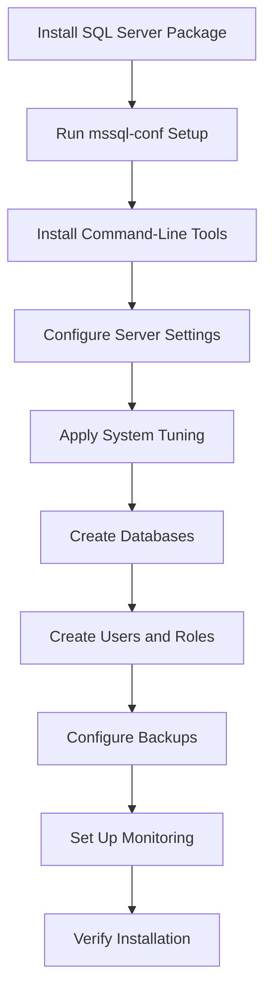

# How to Use Ansible to Manage SQL Server on Linux

Author: [nawazdhandala](https://www.github.com/nawazdhandala)

Tags: Ansible, SQL Server, Linux, Database Administration

Description: Install, configure, and manage Microsoft SQL Server on Linux using Ansible playbooks with practical examples and automation tips.

---

SQL Server on Linux has been production-ready since 2017, and it has come a long way. Running SQL Server on Ubuntu or RHEL is now a legitimate choice for teams that need SQL Server compatibility without Windows infrastructure. Managing it with Ansible means you can treat SQL Server like any other Linux service: automated installation, configuration management, and consistent deployments.

This guide covers installing and managing SQL Server on Linux using Ansible.

## Prerequisites

- Ansible 2.9+
- Target servers running Ubuntu 20.04+ or RHEL 8+
- At least 4GB RAM (SQL Server minimum requirement is 2GB, but 4GB is practical)
- 10GB+ free disk space

## Inventory

```ini
# inventory/sqlserver.ini
[sqlserver_nodes]
sql-linux-1 ansible_host=10.0.11.10
sql-linux-2 ansible_host=10.0.11.11

[sqlserver_nodes:vars]
ansible_user=ubuntu
mssql_version=2022
mssql_edition=Developer
mssql_tcp_port=1433
mssql_data_dir=/var/opt/mssql/data
mssql_log_dir=/var/opt/mssql/log
mssql_backup_dir=/var/opt/mssql/backup
```

## Installing SQL Server on Ubuntu

```yaml
# playbooks/install-sqlserver.yml
---
- name: Install SQL Server on Linux
  hosts: sqlserver_nodes
  become: true
  vars_files:
    - ../vault/sqlserver-secrets.yml

  tasks:
    - name: Install prerequisite packages
      ansible.builtin.apt:
        name:
          - curl
          - gnupg
          - software-properties-common
        state: present
        update_cache: true

    - name: Add Microsoft GPG key
      ansible.builtin.apt_key:
        url: https://packages.microsoft.com/keys/microsoft.asc
        state: present

    - name: Add SQL Server repository
      ansible.builtin.apt_repository:
        repo: "deb https://packages.microsoft.com/ubuntu/{{ ansible_distribution_version }}/mssql-server-{{ mssql_version }} {{ ansible_distribution_release }} main"
        state: present
        filename: mssql-server

    - name: Install SQL Server package
      ansible.builtin.apt:
        name: mssql-server
        state: present
        update_cache: true
      register: mssql_install

    - name: Run mssql-conf setup to accept EULA and set SA password
      ansible.builtin.command:
        cmd: /opt/mssql/bin/mssql-conf setup
      environment:
        ACCEPT_EULA: "Y"
        MSSQL_SA_PASSWORD: "{{ vault_mssql_sa_password }}"
        MSSQL_PID: "{{ mssql_edition }}"
      when: mssql_install.changed
      changed_when: true
      no_log: true

    - name: Ensure SQL Server is running
      ansible.builtin.systemd:
        name: mssql-server
        state: started
        enabled: true
```

## Installing SQL Server Tools

The command-line tools (`sqlcmd`, `bcp`) are in a separate package.

```yaml
# playbooks/install-sqlserver-tools.yml
---
- name: Install SQL Server command-line tools
  hosts: sqlserver_nodes
  become: true

  tasks:
    - name: Add Microsoft tools repository
      ansible.builtin.apt_repository:
        repo: "deb https://packages.microsoft.com/ubuntu/{{ ansible_distribution_version }}/prod {{ ansible_distribution_release }} main"
        state: present
        filename: mssql-tools

    - name: Install SQL Server tools and ODBC driver
      ansible.builtin.apt:
        name:
          - mssql-tools18
          - unixodbc-dev
        state: present
        update_cache: true
      environment:
        ACCEPT_EULA: "Y"

    - name: Add sqlcmd to the system PATH
      ansible.builtin.copy:
        dest: /etc/profile.d/mssql-tools.sh
        content: |
          export PATH="$PATH:/opt/mssql-tools18/bin"
        mode: "0644"
```

## Configuring SQL Server

Use `mssql-conf` to configure SQL Server settings.

```yaml
# playbooks/configure-sqlserver.yml
---
- name: Configure SQL Server
  hosts: sqlserver_nodes
  become: true

  tasks:
    - name: Set TCP port
      ansible.builtin.command:
        cmd: /opt/mssql/bin/mssql-conf set network.tcpport {{ mssql_tcp_port }}
      register: port_config
      changed_when: "'changed' in port_config.stdout"
      notify: Restart SQL Server

    - name: Set default data directory
      ansible.builtin.command:
        cmd: /opt/mssql/bin/mssql-conf set filelocation.defaultdatadir {{ mssql_data_dir }}
      register: data_config
      changed_when: true
      notify: Restart SQL Server

    - name: Set default log directory
      ansible.builtin.command:
        cmd: /opt/mssql/bin/mssql-conf set filelocation.defaultlogdir {{ mssql_log_dir }}
      register: log_config
      changed_when: true
      notify: Restart SQL Server

    - name: Set default backup directory
      ansible.builtin.command:
        cmd: /opt/mssql/bin/mssql-conf set filelocation.defaultbackupdir {{ mssql_backup_dir }}
      register: backup_config
      changed_when: true
      notify: Restart SQL Server

    - name: Enable SQL Server Agent
      ansible.builtin.command:
        cmd: /opt/mssql/bin/mssql-conf set sqlagent.enabled true
      register: agent_config
      changed_when: true
      notify: Restart SQL Server

    - name: Set memory limit (leave 2GB for the OS)
      ansible.builtin.command:
        cmd: /opt/mssql/bin/mssql-conf set memory.memorylimitmb {{ mssql_memory_limit_mb | default(4096) }}
      register: memory_config
      changed_when: true
      notify: Restart SQL Server

    - name: Create required directories
      ansible.builtin.file:
        path: "{{ item }}"
        state: directory
        owner: mssql
        group: mssql
        mode: "0750"
      loop:
        - "{{ mssql_data_dir }}"
        - "{{ mssql_log_dir }}"
        - "{{ mssql_backup_dir }}"

  handlers:
    - name: Restart SQL Server
      ansible.builtin.systemd:
        name: mssql-server
        state: restarted
```

## Creating Databases and Users

Use `sqlcmd` to manage databases and users through Ansible.

```yaml
# playbooks/create-databases.yml
---
- name: Create SQL Server databases and users
  hosts: sqlserver_nodes
  become: true
  vars_files:
    - ../vault/sqlserver-secrets.yml
  vars:
    mssql_databases:
      - name: AppDatabase
        owner: app_user
      - name: ReportingDB
        owner: reporting_user
    mssql_users:
      - name: app_user
        password: "{{ vault_app_user_password }}"
        default_db: AppDatabase
        roles: ["db_datareader", "db_datawriter"]
      - name: reporting_user
        password: "{{ vault_reporting_user_password }}"
        default_db: ReportingDB
        roles: ["db_datareader"]

  tasks:
    - name: Create databases
      ansible.builtin.command:
        cmd: >
          /opt/mssql-tools18/bin/sqlcmd
          -S localhost,{{ mssql_tcp_port }}
          -U SA -P "{{ vault_mssql_sa_password }}"
          -C
          -Q "IF NOT EXISTS (SELECT name FROM sys.databases WHERE name = '{{ item.name }}')
              CREATE DATABASE [{{ item.name }}];"
      loop: "{{ mssql_databases }}"
      loop_control:
        label: "{{ item.name }}"
      changed_when: true
      no_log: true

    - name: Create SQL logins
      ansible.builtin.command:
        cmd: >
          /opt/mssql-tools18/bin/sqlcmd
          -S localhost,{{ mssql_tcp_port }}
          -U SA -P "{{ vault_mssql_sa_password }}"
          -C
          -Q "IF NOT EXISTS (SELECT name FROM sys.sql_logins WHERE name = '{{ item.name }}')
              CREATE LOGIN [{{ item.name }}] WITH PASSWORD = '{{ item.password }}',
              DEFAULT_DATABASE = [{{ item.default_db }}];"
      loop: "{{ mssql_users }}"
      loop_control:
        label: "{{ item.name }}"
      changed_when: true
      no_log: true

    - name: Create database users and assign roles
      ansible.builtin.command:
        cmd: >
          /opt/mssql-tools18/bin/sqlcmd
          -S localhost,{{ mssql_tcp_port }}
          -U SA -P "{{ vault_mssql_sa_password }}"
          -C
          -d {{ item.default_db }}
          -Q "IF NOT EXISTS (SELECT name FROM sys.database_principals WHERE name = '{{ item.name }}')
              CREATE USER [{{ item.name }}] FOR LOGIN [{{ item.name }}];
              
              ALTER ROLE [{{ role }}] ADD MEMBER [{{ item.name }}];
              "
      loop: "{{ mssql_users }}"
      loop_control:
        label: "{{ item.name }}"
      changed_when: true
      no_log: true
```

## System Tuning for SQL Server on Linux

```yaml
# playbooks/tune-sqlserver-linux.yml
---
- name: Apply system tuning for SQL Server on Linux
  hosts: sqlserver_nodes
  become: true

  tasks:
    - name: Set recommended kernel parameters
      ansible.posix.sysctl:
        name: "{{ item.key }}"
        value: "{{ item.value }}"
        state: present
        reload: true
      loop:
        - { key: "vm.swappiness", value: "1" }
        - { key: "vm.dirty_background_ratio", value: "3" }
        - { key: "vm.dirty_ratio", value: "80" }
        - { key: "vm.max_map_count", value: "1600000" }
        - { key: "net.core.rmem_default", value: "262144" }
        - { key: "net.core.rmem_max", value: "4194304" }
        - { key: "net.core.wmem_default", value: "262144" }
        - { key: "net.core.wmem_max", value: "1048576" }

    - name: Disable Transparent Huge Pages
      ansible.builtin.copy:
        dest: /etc/systemd/system/disable-thp.service
        content: |
          [Unit]
          Description=Disable Transparent Huge Pages for SQL Server
          Before=mssql-server.service

          [Service]
          Type=oneshot
          ExecStart=/bin/sh -c 'echo never > /sys/kernel/mm/transparent_hugepage/enabled'
          ExecStart=/bin/sh -c 'echo never > /sys/kernel/mm/transparent_hugepage/defrag'

          [Install]
          WantedBy=multi-user.target
        mode: "0644"
      notify: Start disable-thp service

    - name: Set mssql user resource limits
      ansible.builtin.copy:
        dest: /etc/security/limits.d/mssql.conf
        content: |
          mssql soft nofile 65535
          mssql hard nofile 65535
          mssql soft nproc 65535
          mssql hard nproc 65535
          mssql soft memlock unlimited
          mssql hard memlock unlimited
        mode: "0644"

  handlers:
    - name: Start disable-thp service
      ansible.builtin.systemd:
        daemon_reload: true
        name: disable-thp
        state: started
        enabled: true
```

## SQL Server Management Flow



## Backup Automation

```yaml
# playbooks/backup-sqlserver.yml
---
- name: Backup SQL Server databases
  hosts: sqlserver_nodes
  become: true
  vars_files:
    - ../vault/sqlserver-secrets.yml
  vars:
    timestamp: "{{ ansible_date_time.date }}_{{ ansible_date_time.hour }}{{ ansible_date_time.minute }}"

  tasks:
    - name: Create full backup of each database
      ansible.builtin.command:
        cmd: >
          /opt/mssql-tools18/bin/sqlcmd
          -S localhost,{{ mssql_tcp_port }}
          -U SA -P "{{ vault_mssql_sa_password }}"
          -C
          -Q "BACKUP DATABASE [{{ item.name }}]
              TO DISK = '{{ mssql_backup_dir }}/{{ item.name }}_{{ timestamp }}.bak'
              WITH COMPRESSION, CHECKSUM, STATS = 10;"
      loop: "{{ mssql_databases }}"
      loop_control:
        label: "{{ item.name }}"
      changed_when: true
      no_log: true
```

## Verification

```yaml
# playbooks/verify-sqlserver.yml
---
- name: Verify SQL Server installation
  hosts: sqlserver_nodes
  become: true
  vars_files:
    - ../vault/sqlserver-secrets.yml

  tasks:
    - name: Check SQL Server service status
      ansible.builtin.systemd:
        name: mssql-server
      register: mssql_service

    - name: Query SQL Server version
      ansible.builtin.command:
        cmd: >
          /opt/mssql-tools18/bin/sqlcmd
          -S localhost,{{ mssql_tcp_port }}
          -U SA -P "{{ vault_mssql_sa_password }}"
          -C
          -Q "SELECT @@VERSION AS version;"
          -h -1
      register: mssql_version
      changed_when: false
      no_log: true

    - name: Display SQL Server status
      ansible.builtin.debug:
        msg:
          - "Service: {{ mssql_service.status.ActiveState }}"
          - "Version: {{ mssql_version.stdout_lines[0] | default('Unable to query') }}"

    - name: List all databases
      ansible.builtin.command:
        cmd: >
          /opt/mssql-tools18/bin/sqlcmd
          -S localhost,{{ mssql_tcp_port }}
          -U SA -P "{{ vault_mssql_sa_password }}"
          -C
          -Q "SELECT name, state_desc FROM sys.databases;"
      register: db_list
      changed_when: false
      no_log: true

    - name: Display databases
      ansible.builtin.debug:
        msg: "{{ db_list.stdout_lines }}"
```

## RHEL/CentOS Installation

For RHEL systems, the installation is similar with YUM.

```yaml
# tasks/install-sqlserver-rhel.yml
---
- name: Add SQL Server repository for RHEL
  ansible.builtin.yum_repository:
    name: mssql-server
    description: "SQL Server {{ mssql_version }}"
    baseurl: "https://packages.microsoft.com/rhel/{{ ansible_distribution_major_version }}/mssql-server-{{ mssql_version }}/"
    gpgcheck: true
    gpgkey: https://packages.microsoft.com/keys/microsoft.asc
    enabled: true

- name: Install SQL Server on RHEL
  ansible.builtin.yum:
    name: mssql-server
    state: present
```

## Production Tips

1. **Set the memory limit explicitly.** SQL Server will consume all available memory by default. Set `memory.memorylimitmb` to leave at least 2GB for the OS.

2. **Use the `-C` flag with sqlcmd for self-signed certs.** SQL Server 2022 enables encryption by default. The `-C` flag trusts the server certificate.

3. **Enable trace flags for best performance on Linux.** Trace flag 3979 can help with I/O performance on Linux file systems.

4. **Monitor with the standard Linux tools.** `top`, `iostat`, and `sar` work perfectly for tracking SQL Server resource usage on Linux.

5. **Keep the SA password in Vault and change it regularly.** The SA account is the most powerful account and should only be used for administration, never for application connections.

## Conclusion

Managing SQL Server on Linux with Ansible gives you the same automation capabilities you have with PostgreSQL or MySQL. The playbooks in this guide cover installation, configuration, database creation, user management, system tuning, and backups. SQL Server on Linux is a first-class citizen in the Ansible ecosystem, and with these playbooks, you can manage it alongside your other databases without switching tools.
