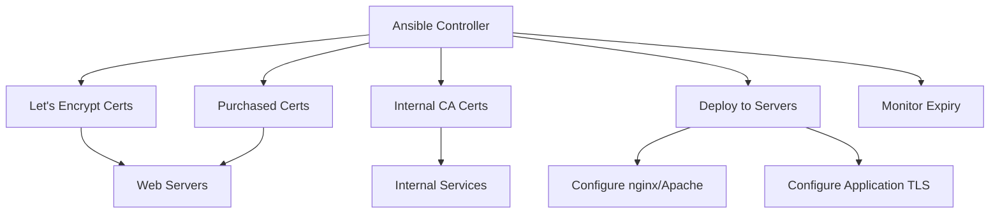

# How to Use Ansible to Manage SSL/TLS Certificates

Author: [nawazdhandala](https://www.github.com/nawazdhandala)

Tags: Ansible, SSL, TLS, Certificates, Security

Description: Learn how to manage SSL/TLS certificates with Ansible including deployment, renewal monitoring, self-signed certs, and private CA management.

---

Managing SSL/TLS certificates across a fleet of servers is one of those tasks that seems simple until you have dozens of services, each with their own certificate requirements. Some need Let's Encrypt certificates, others use certificates from an internal CA, and some services need client certificates for mutual TLS. Tracking expiry dates, handling renewals, and deploying certificates to the right servers in the right locations is the kind of work that Ansible was built for.

In this guide, I will cover the full certificate lifecycle: obtaining certificates from Let's Encrypt with certbot, deploying certificates from a certificate authority, managing certificate files and permissions, configuring web servers to use them, and monitoring expiry dates.

## Certificate Management Architecture



## Variables

```yaml
# group_vars/all.yml
# Certificate storage on Ansible controller
cert_local_dir: "{{ playbook_dir }}/files/certificates"

# Default certificate locations on target servers
cert_dir: /etc/ssl/private
cert_public_dir: /etc/ssl/certs
cert_key_permissions: '0600'
cert_permissions: '0644'

# Let's Encrypt settings
letsencrypt_email: "admin@example.com"
letsencrypt_staging: false
letsencrypt_challenge: http

# Certificate definitions
certificates:
  - name: api.example.com
    type: letsencrypt
    domains:
      - api.example.com
      - api2.example.com
    deploy_to: webservers
    services_to_reload:
      - nginx

  - name: internal-app
    type: file
    cert_file: internal-app.crt
    key_file: internal-app.key
    chain_file: internal-ca-chain.crt
    deploy_to: appservers
    cert_dest: /etc/myapp/tls/server.crt
    key_dest: /etc/myapp/tls/server.key
    chain_dest: /etc/myapp/tls/ca-chain.crt
    services_to_reload:
      - myapp

  - name: wildcard.example.com
    type: file
    cert_file: wildcard.example.com.crt
    key_file: wildcard.example.com.key
    chain_file: ca-bundle.crt
    deploy_to: webservers
    services_to_reload:
      - nginx

# CA certificate to trust on all servers
trusted_ca_certs:
  - name: internal-ca
    cert_content: |
      -----BEGIN CERTIFICATE-----
      MIIDXTCCAkWgAwIBAgIJALa...
      -----END CERTIFICATE-----
```

## Let's Encrypt Certificate Role

```yaml
# roles/letsencrypt/tasks/main.yml
---
- name: Install certbot
  ansible.builtin.package:
    name:
      - certbot
      - python3-certbot-nginx
    state: present

- name: Check if certificate already exists
  ansible.builtin.stat:
    path: "/etc/letsencrypt/live/{{ item.domains[0] }}/fullchain.pem"
  register: cert_exists
  loop: "{{ certificates | selectattr('type', 'equalto', 'letsencrypt') | list }}"

- name: Obtain Let's Encrypt certificate
  ansible.builtin.command:
    cmd: >
      certbot certonly
      --nginx
      --non-interactive
      --agree-tos
      --email {{ letsencrypt_email }}
       --staging 
       -d {{ domain }}
  loop: "{{ cert_exists.results }}"
  when: not item.stat.exists
  notify: Reload nginx

- name: Set up automatic renewal cron job
  ansible.builtin.cron:
    name: "Certbot renewal"
    hour: "3"
    minute: "30"
    day: "*/1"
    job: "certbot renew --quiet --deploy-hook 'systemctl reload nginx'"
    user: root

- name: Test renewal process
  ansible.builtin.command:
    cmd: certbot renew --dry-run
  register: renewal_test
  changed_when: false
  ignore_errors: yes

- name: Display renewal test result
  ansible.builtin.debug:
    msg: "Renewal test: {{ 'PASSED' if renewal_test.rc == 0 else 'FAILED' }}"
```

## Certificate Deployment Role

Deploy certificates from files stored on the Ansible controller.

```yaml
# roles/cert-deploy/tasks/main.yml
---
- name: Create certificate directories
  ansible.builtin.file:
    path: "{{ item }}"
    state: directory
    owner: root
    group: root
    mode: '0755'
  loop:
    - "{{ cert_dir }}"
    - "{{ cert_public_dir }}"

- name: Deploy certificate files for this host
  ansible.builtin.include_tasks: deploy-cert.yml
  loop: "{{ certificates | selectattr('type', 'equalto', 'file') | list }}"
  loop_control:
    loop_var: cert
  when: >
    cert.deploy_to == 'all' or
    cert.deploy_to in group_names
```

Individual certificate deployment.

```yaml
# roles/cert-deploy/tasks/deploy-cert.yml
---
- name: "Deploy certificate for {{ cert.name }}"
  ansible.builtin.copy:
    src: "{{ cert_local_dir }}/{{ cert.cert_file }}"
    dest: "{{ cert.cert_dest | default(cert_public_dir ~ '/' ~ cert.cert_file) }}"
    owner: root
    group: root
    mode: "{{ cert_permissions }}"
  notify: "Reload {{ cert.services_to_reload | join(' and ') }}"

- name: "Deploy private key for {{ cert.name }}"
  ansible.builtin.copy:
    src: "{{ cert_local_dir }}/{{ cert.key_file }}"
    dest: "{{ cert.key_dest | default(cert_dir ~ '/' ~ cert.key_file) }}"
    owner: root
    group: root
    mode: "{{ cert_key_permissions }}"
  notify: "Reload {{ cert.services_to_reload | join(' and ') }}"

- name: "Deploy CA chain for {{ cert.name }}"
  ansible.builtin.copy:
    src: "{{ cert_local_dir }}/{{ cert.chain_file }}"
    dest: "{{ cert.chain_dest | default(cert_public_dir ~ '/' ~ cert.chain_file) }}"
    owner: root
    group: root
    mode: "{{ cert_permissions }}"
  when: cert.chain_file is defined
  notify: "Reload {{ cert.services_to_reload | join(' and ') }}"

- name: "Create combined fullchain for {{ cert.name }}"
  ansible.builtin.shell:
    cmd: >
      cat {{ cert.cert_dest | default(cert_public_dir ~ '/' ~ cert.cert_file) }}
      {{ cert.chain_dest | default(cert_public_dir ~ '/' ~ cert.chain_file) }}
      > {{ cert_public_dir }}/{{ cert.name }}-fullchain.pem
  when: cert.chain_file is defined
  changed_when: true

- name: "Verify certificate and key match"
  ansible.builtin.shell:
    cmd: |
      CERT_MOD=$(openssl x509 -noout -modulus -in {{ cert.cert_dest | default(cert_public_dir ~ '/' ~ cert.cert_file) }} | md5sum)
      KEY_MOD=$(openssl rsa -noout -modulus -in {{ cert.key_dest | default(cert_dir ~ '/' ~ cert.key_file) }} | md5sum)
      if [ "$CERT_MOD" = "$KEY_MOD" ]; then
        echo "MATCH"
      else
        echo "MISMATCH"
        exit 1
      fi
  register: cert_verify
  changed_when: false

- name: "Verify certificate validity"
  ansible.builtin.command:
    cmd: "openssl x509 -checkend 0 -in {{ cert.cert_dest | default(cert_public_dir ~ '/' ~ cert.cert_file) }}"
  register: cert_valid
  changed_when: false
```

## Trust Internal CA Certificates

```yaml
# roles/cert-deploy/tasks/trust-ca.yml
---
- name: Deploy trusted CA certificates on Debian systems
  ansible.builtin.copy:
    dest: "/usr/local/share/ca-certificates/{{ item.name }}.crt"
    content: "{{ item.cert_content }}"
    owner: root
    group: root
    mode: '0644'
  loop: "{{ trusted_ca_certs | default([]) }}"
  when: ansible_os_family == "Debian"
  notify: Update CA trust store

- name: Deploy trusted CA on RHEL systems
  ansible.builtin.copy:
    dest: "/etc/pki/ca-trust/source/anchors/{{ item.name }}.crt"
    content: "{{ item.cert_content }}"
    owner: root
    group: root
    mode: '0644'
  loop: "{{ trusted_ca_certs | default([]) }}"
  when: ansible_os_family == "RedHat"
  notify: Update CA trust store RHEL
```

## Nginx SSL Configuration

Deploy nginx SSL configuration that uses the deployed certificates.

```yaml
# roles/nginx-ssl/tasks/main.yml
---
- name: Deploy nginx SSL configuration
  ansible.builtin.template:
    src: nginx-ssl.conf.j2
    dest: "/etc/nginx/sites-available/{{ item.name }}"
    owner: root
    group: root
    mode: '0644'
  loop: "{{ nginx_ssl_sites | default([]) }}"
  notify: Reload nginx

- name: Enable nginx SSL sites
  ansible.builtin.file:
    src: "/etc/nginx/sites-available/{{ item.name }}"
    dest: "/etc/nginx/sites-enabled/{{ item.name }}"
    state: link
  loop: "{{ nginx_ssl_sites | default([]) }}"
  notify: Reload nginx
```

The nginx SSL template with modern security settings.

```jinja2
# roles/nginx-ssl/templates/nginx-ssl.conf.j2
# {{ item.name }} - Managed by Ansible
server {
    listen 443 ssl http2;
    server_name {{ item.domains | join(' ') }};

    # Certificate files
    ssl_certificate {{ item.cert_path | default('/etc/letsencrypt/live/' ~ item.domains[0] ~ '/fullchain.pem') }};
    ssl_certificate_key {{ item.key_path | default('/etc/letsencrypt/live/' ~ item.domains[0] ~ '/privkey.pem') }};

    # Modern SSL configuration
    ssl_protocols TLSv1.2 TLSv1.3;
    ssl_ciphers ECDHE-ECDSA-AES128-GCM-SHA256:ECDHE-RSA-AES128-GCM-SHA256:ECDHE-ECDSA-AES256-GCM-SHA384:ECDHE-RSA-AES256-GCM-SHA384;
    ssl_prefer_server_ciphers off;

    # HSTS
    add_header Strict-Transport-Security "max-age=63072000; includeSubDomains; preload" always;

    # OCSP stapling
    ssl_stapling on;
    ssl_stapling_verify on;
    resolver 1.1.1.1 8.8.8.8 valid=300s;
    resolver_timeout 5s;

    # Session settings
    ssl_session_timeout 1d;
    ssl_session_cache shared:SSL:10m;
    ssl_session_tickets off;

    location / {
        proxy_pass {{ item.upstream | default('http://localhost:8080') }};
        proxy_set_header Host $host;
        proxy_set_header X-Real-IP $remote_addr;
        proxy_set_header X-Forwarded-For $proxy_add_x_forwarded_for;
        proxy_set_header X-Forwarded-Proto $scheme;
    }
}

# Redirect HTTP to HTTPS
server {
    listen 80;
    server_name {{ item.domains | join(' ') }};
    return 301 https://$server_name$request_uri;
}
```

## Handlers

```yaml
# handlers/main.yml
---
- name: Reload nginx
  ansible.builtin.service:
    name: nginx
    state: reloaded

- name: Update CA trust store
  ansible.builtin.command:
    cmd: update-ca-certificates

- name: Update CA trust store RHEL
  ansible.builtin.command:
    cmd: update-ca-trust
```

## Certificate Monitoring

Check expiry dates across all deployed certificates.

```yaml
# monitor-certs.yml
---
- name: Check certificate expiry dates
  hosts: all
  become: yes
  tasks:
    - name: Find all certificate files
      ansible.builtin.find:
        paths:
          - /etc/ssl/certs
          - /etc/letsencrypt/live
        patterns: "*.pem,*.crt"
        recurse: yes
      register: found_certs

    - name: Check each certificate expiry
      ansible.builtin.shell:
        cmd: |
          expiry=$(openssl x509 -enddate -noout -in "{{ item.path }}" 2>/dev/null | cut -d= -f2)
          days=$(( ( $(date -d "$expiry" +%s) - $(date +%s) ) / 86400 ))
          echo "{{ item.path }}|${expiry}|${days}"
      register: cert_expiry
      loop: "{{ found_certs.files }}"
      changed_when: false
      ignore_errors: yes

    - name: Display certificate status
      ansible.builtin.debug:
        msg: "{{ item.stdout }}"
      loop: "{{ cert_expiry.results }}"
      when: item.stdout is defined
```

## Main Playbook

```yaml
# site.yml
---
- name: Deploy Let's Encrypt certificates
  hosts: webservers
  become: yes
  roles:
    - letsencrypt

- name: Deploy file-based certificates
  hosts: all
  become: yes
  roles:
    - cert-deploy

- name: Configure nginx SSL
  hosts: webservers
  become: yes
  roles:
    - nginx-ssl
```

## Running the Playbook

```bash
# Deploy all certificates
ansible-playbook -i inventory/hosts.ini site.yml

# Deploy only to a specific server
ansible-playbook -i inventory/hosts.ini site.yml --limit app-01

# Monitor certificate expiry
ansible-playbook -i inventory/hosts.ini monitor-certs.yml

# Only deploy file-based certificates
ansible-playbook -i inventory/hosts.ini site.yml --tags cert-deploy
```

## Wrapping Up

Certificate management with Ansible gives you a single source of truth for all your TLS configuration. Let's Encrypt certificates are obtained and renewed automatically, internal CA certificates are deployed from a secure local store, and nginx configuration is generated from templates. The key practices are: always verify that certificate and key match after deployment, keep private keys in Ansible Vault or a separate secure directory, and set up monitoring for certificate expiry dates. With this foundation, adding TLS to a new service is just a variable change and a playbook run.
