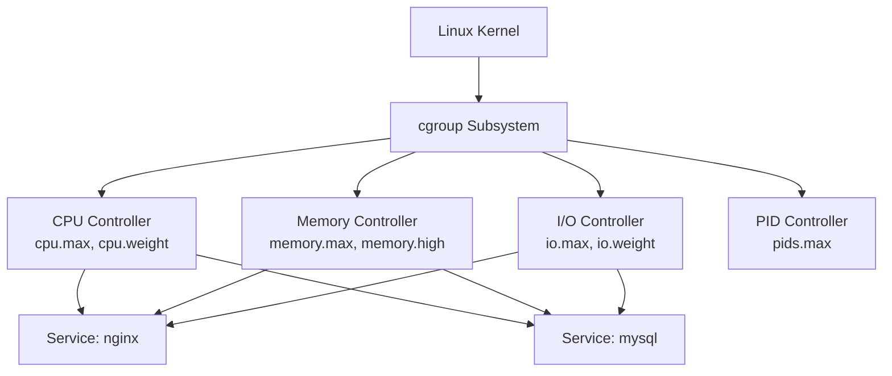

# How to Use Ansible to Manage System Resource Limits (cgroups)

Author: [nawazdhandala](https://www.github.com/nawazdhandala)

Tags: Ansible, Cgroups, Resource Management, Linux

Description: Manage cgroup resource limits with Ansible to control CPU, memory, and I/O allocation for services and applications on Linux.

---

Control groups (cgroups) are a Linux kernel feature that lets you limit, account for, and isolate the resource usage of process groups. They are the foundation of container isolation in Docker and Kubernetes, but they are equally useful on regular servers. Without cgroups, a runaway process can consume all available CPU and memory, starving other services and potentially crashing the entire system.

Ansible gives you a way to define and enforce resource limits consistently across your fleet. This guide covers practical cgroup management using both systemd (the modern approach) and direct cgroup configuration.

## Understanding cgroups v1 vs v2

Most modern Linux distributions have moved to cgroups v2, which provides a unified hierarchy. You can check which version your system uses:

```yaml
# check-cgroup-version.yml - Determine cgroup version across fleet
---
- name: Check cgroup version
  hosts: all
  become: true

  tasks:
    # Check cgroup version
    - name: Determine cgroup version
      ansible.builtin.shell:
        cmd: |
          if [ -f /sys/fs/cgroup/cgroup.controllers ]; then
            echo "cgroups v2 (unified)"
          elif [ -d /sys/fs/cgroup/cpu ]; then
            echo "cgroups v1 (legacy)"
          else
            echo "cgroups not mounted"
          fi
      register: cgroup_version
      changed_when: false

    - name: Display cgroup version
      ansible.builtin.debug:
        msg: "{{ inventory_hostname }}: {{ cgroup_version.stdout }}"

    # List available controllers
    - name: List available cgroup controllers
      ansible.builtin.shell:
        cmd: "cat /sys/fs/cgroup/cgroup.controllers 2>/dev/null || ls /sys/fs/cgroup/ 2>/dev/null | head -20"
      register: controllers
      changed_when: false

    - name: Display controllers
      ansible.builtin.debug:
        var: controllers.stdout_lines
```

## Resource Limit Architecture



## Managing Resource Limits with systemd

The easiest way to manage cgroups on modern systems is through systemd service unit overrides. Each systemd service gets its own cgroup automatically.

```yaml
# systemd-resource-limits.yml - Set resource limits via systemd service overrides
---
- name: Configure resource limits for services
  hosts: all
  become: true

  vars:
    service_limits:
      # Web server - generous CPU, moderate memory
      - service: nginx
        limits:
          CPUQuota: "200%"        # Allow up to 2 CPU cores
          MemoryMax: "2G"         # Hard memory limit
          MemoryHigh: "1536M"     # Soft limit (triggers throttling)
          IOWeight: 100           # Default I/O priority
          TasksMax: 4096          # Maximum number of processes/threads

      # Database - lots of memory, controlled I/O
      - service: mysqld
        limits:
          CPUQuota: "400%"        # Up to 4 CPU cores
          MemoryMax: "8G"
          MemoryHigh: "6G"
          IOWeight: 200           # Higher I/O priority than default
          TasksMax: 1024

      # Application server - balanced limits
      - service: myapp
        limits:
          CPUQuota: "150%"
          MemoryMax: "4G"
          MemoryHigh: "3G"
          IOWeight: 100
          TasksMax: 512

  tasks:
    # Create systemd override directories for each service
    - name: Create systemd override directories
      ansible.builtin.file:
        path: "/etc/systemd/system/{{ item.service }}.service.d"
        state: directory
        mode: '0755'
      loop: "{{ service_limits }}"
      loop_control:
        label: "{{ item.service }}"

    # Deploy resource limit overrides
    - name: Deploy resource limit overrides
      ansible.builtin.copy:
        dest: "/etc/systemd/system/{{ item.service }}.service.d/resource-limits.conf"
        mode: '0644'
        content: |
          # Resource limits - Managed by Ansible
          [Service]
          
          {{ key }}={{ value }}
          
      loop: "{{ service_limits }}"
      loop_control:
        label: "{{ item.service }}"
      notify: reload systemd

    # Apply the changes
    - name: Reload systemd and restart affected services
      ansible.builtin.systemd:
        daemon_reload: true

    # Verify limits are applied
    - name: Verify resource limits
      ansible.builtin.command:
        cmd: "systemctl show {{ item.service }} --property=CPUQuota,MemoryMax,MemoryHigh,TasksMax"
      loop: "{{ service_limits }}"
      register: verify_limits
      changed_when: false
      failed_when: false
      loop_control:
        label: "{{ item.service }}"

    - name: Display applied limits
      ansible.builtin.debug:
        msg: "{{ item.item.service }}: {{ item.stdout_lines }}"
      loop: "{{ verify_limits.results }}"
      loop_control:
        label: "{{ item.item.service }}"

  handlers:
    - name: reload systemd
      ansible.builtin.systemd:
        daemon_reload: true
```

## Creating Custom cgroup Slices

Systemd organizes cgroups into slices. You can create custom slices to group related services:

```yaml
# custom-slices.yml - Create custom systemd slices for resource management
---
- name: Configure custom cgroup slices
  hosts: all
  become: true

  tasks:
    # Create a slice for web-facing services
    - name: Create web services slice
      ansible.builtin.copy:
        dest: /etc/systemd/system/web.slice
        mode: '0644'
        content: |
          # Web services resource group - Managed by Ansible
          [Unit]
          Description=Web Services Slice
          Before=slices.target

          [Slice]
          CPUQuota=400%
          MemoryMax=8G
          MemoryHigh=6G
          IOWeight=150
          TasksMax=8192
      notify: reload systemd

    # Create a slice for background/batch jobs
    - name: Create batch jobs slice
      ansible.builtin.copy:
        dest: /etc/systemd/system/batch.slice
        mode: '0644'
        content: |
          # Batch processing resource group - Managed by Ansible
          [Unit]
          Description=Batch Processing Slice
          Before=slices.target

          [Slice]
          CPUQuota=200%
          MemoryMax=4G
          MemoryHigh=3G
          IOWeight=50
          TasksMax=2048
          CPUWeight=50
      notify: reload systemd

    # Move services into appropriate slices
    - name: Place nginx in web slice
      ansible.builtin.file:
        path: /etc/systemd/system/nginx.service.d
        state: directory
        mode: '0755'

    - name: Configure nginx to use web slice
      ansible.builtin.copy:
        dest: /etc/systemd/system/nginx.service.d/slice.conf
        mode: '0644'
        content: |
          [Service]
          Slice=web.slice
      notify: reload systemd

    - name: Reload systemd
      ansible.builtin.systemd:
        daemon_reload: true

  handlers:
    - name: reload systemd
      ansible.builtin.systemd:
        daemon_reload: true
```

## Setting User Resource Limits

Limit resources for specific users, useful for shared servers:

```yaml
# user-resource-limits.yml - Set per-user resource limits
---
- name: Configure per-user resource limits
  hosts: shared_servers
  become: true

  vars:
    user_limits:
      - user: developer
        cpu_quota: "100%"
        memory_max: "2G"
        tasks_max: 512
      - user: buildbot
        cpu_quota: "200%"
        memory_max: "4G"
        tasks_max: 1024

  tasks:
    # Create user slice overrides
    - name: Create user slice override directory
      ansible.builtin.file:
        path: "/etc/systemd/system/user-{{ item.user | hash('md5') | truncate(8, true, '') }}.slice.d"
        state: directory
        mode: '0755'
      loop: "{{ user_limits }}"
      loop_control:
        label: "{{ item.user }}"

    # Configure limits via systemd-run for user sessions
    - name: Deploy user resource limits
      ansible.builtin.copy:
        dest: /etc/systemd/system/user-.slice.d/resource-limits.conf
        mode: '0644'
        content: |
          # Per-user resource limits - Managed by Ansible
          [Slice]
          TasksMax=1024
          MemoryMax=4G
          CPUQuota=200%

    # Also set traditional ulimits
    - name: Configure ulimits for users
      ansible.builtin.copy:
        dest: /etc/security/limits.d/99-user-limits.conf
        mode: '0644'
        content: |
          # User resource limits - Managed by Ansible
          
          {{ user.user }}  hard  nproc    {{ user.tasks_max }}
          {{ user.user }}  soft  nproc    {{ user.tasks_max }}
          {{ user.user }}  hard  nofile   65536
          {{ user.user }}  soft  nofile   65536
          

      notify: reload systemd

  handlers:
    - name: reload systemd
      ansible.builtin.systemd:
        daemon_reload: true
```

## Monitoring Resource Usage by cgroup

Track how much resources each cgroup is actually using:

```yaml
# monitor-cgroups.yml - Monitor cgroup resource usage
---
- name: Monitor cgroup resource usage
  hosts: all
  become: true

  tasks:
    # Get top-level cgroup resource usage
    - name: Get systemd-cgtop snapshot
      ansible.builtin.shell:
        cmd: "systemd-cgtop --batch --iterations=1 --depth=2 | head -30"
      register: cgtop
      changed_when: false

    - name: Display cgroup resource usage
      ansible.builtin.debug:
        var: cgtop.stdout_lines

    # Check memory usage per service
    - name: Get memory usage for key services
      ansible.builtin.shell:
        cmd: |
          for service in nginx mysqld myapp; do
            mem=$(systemctl show "$service" --property=MemoryCurrent 2>/dev/null | cut -d= -f2)
            max=$(systemctl show "$service" --property=MemoryMax 2>/dev/null | cut -d= -f2)
            if [ "$mem" != "" ] && [ "$mem" != "[not set]" ]; then
              echo "$service: current=${mem}, max=${max}"
            fi
          done
      register: mem_usage
      changed_when: false

    - name: Display service memory usage
      ansible.builtin.debug:
        var: mem_usage.stdout_lines

    # Check for OOM kills
    - name: Check for recent OOM kills
      ansible.builtin.shell:
        cmd: "journalctl --since '24 hours ago' | grep -i 'oom' | tail -10 || echo 'No OOM events'"
      register: oom_events
      changed_when: false

    - name: Display OOM events
      ansible.builtin.debug:
        msg: "{{ inventory_hostname }}: {{ oom_events.stdout_lines }}"

    # Check if any services have hit their memory limit
    - name: Check for memory pressure events
      ansible.builtin.shell:
        cmd: |
          for service in nginx.service mysqld.service myapp.service; do
            pressure=$(cat /sys/fs/cgroup/system.slice/${service}/memory.pressure 2>/dev/null | head -1)
            if [ -n "$pressure" ]; then
              echo "${service}: ${pressure}"
            fi
          done
      register: mem_pressure
      changed_when: false
      failed_when: false

    - name: Display memory pressure
      ansible.builtin.debug:
        var: mem_pressure.stdout_lines
```

## Emergency Resource Controls

When a process is consuming too many resources and you need to act fast:

```yaml
# emergency-limits.yml - Apply emergency resource limits to a runaway service
---
- name: Apply emergency resource limits
  hosts: "{{ target_host }}"
  become: true

  vars:
    target_service: "{{ service_name }}"
    emergency_cpu: "50%"
    emergency_memory: "1G"

  tasks:
    # Immediately apply CPU throttling
    - name: Apply emergency CPU limit
      ansible.builtin.command:
        cmd: "systemctl set-property {{ target_service }} CPUQuota={{ emergency_cpu }}"
      changed_when: true

    # Apply memory limit
    - name: Apply emergency memory limit
      ansible.builtin.command:
        cmd: "systemctl set-property {{ target_service }} MemoryMax={{ emergency_memory }}"
      changed_when: true

    # Verify the limits took effect
    - name: Verify emergency limits
      ansible.builtin.command:
        cmd: "systemctl show {{ target_service }} --property=CPUQuota,MemoryMax"
      register: verify
      changed_when: false

    - name: Display applied emergency limits
      ansible.builtin.debug:
        msg: "Emergency limits applied to {{ target_service }}: {{ verify.stdout_lines }}"

    # Log the emergency action
    - name: Log emergency limit application
      ansible.builtin.lineinfile:
        path: /var/log/emergency-limits.log
        line: "{{ ansible_date_time.iso8601 }} - Emergency limits applied to {{ target_service }}: CPU={{ emergency_cpu }}, Memory={{ emergency_memory }}"
        create: true
        mode: '0644'
```

## Setting Default Limits for All Services

Apply baseline limits to prevent any single service from monopolizing resources:

```yaml
# default-limits.yml - Set default resource limits for all systemd services
---
- name: Configure default systemd resource limits
  hosts: all
  become: true

  tasks:
    # Configure default limits in system.conf
    - name: Set default service limits
      ansible.builtin.copy:
        dest: /etc/systemd/system.conf.d/default-limits.conf
        owner: root
        group: root
        mode: '0644'
        content: |
          # Default resource limits - Managed by Ansible
          [Manager]
          DefaultTasksMax=4096
          DefaultMemoryAccounting=yes
          DefaultCPUAccounting=yes
          DefaultIOAccounting=yes
          DefaultBlockIOAccounting=yes
      notify: reload systemd

    # Set default limits for user sessions
    - name: Set default user session limits
      ansible.builtin.copy:
        dest: /etc/systemd/user.conf.d/default-limits.conf
        owner: root
        group: root
        mode: '0644'
        content: |
          # Default user session limits - Managed by Ansible
          [Manager]
          DefaultTasksMax=1024
      notify: reload systemd

    - name: Create user.conf.d directory
      ansible.builtin.file:
        path: /etc/systemd/user.conf.d
        state: directory
        mode: '0755'

  handlers:
    - name: reload systemd
      ansible.builtin.systemd:
        daemon_reload: true
```

## Practical Tips

From managing cgroups in production:

1. Use systemd service overrides rather than directly manipulating cgroup files. Systemd manages the cgroup lifecycle for you and ensures settings persist across service restarts and system reboots.

2. Set `MemoryHigh` before `MemoryMax`. MemoryHigh is a soft limit that triggers throttling and reclamation, giving the process a chance to reduce memory usage before MemoryMax kills it outright.

3. Enable resource accounting globally with `DefaultCPUAccounting=yes` and `DefaultMemoryAccounting=yes` in system.conf. Without accounting enabled, you cannot see resource usage per service in tools like `systemd-cgtop`.

4. CPUQuota is expressed as a percentage of one CPU core. `CPUQuota=200%` means the service can use up to 2 CPU cores. On an 8-core server, `CPUQuota=800%` would allow using all cores.

5. Monitor for OOM kills. When a process exceeds its MemoryMax, the kernel OOM killer will terminate it. Check the journal for these events and adjust limits if they are too aggressive.

6. The `systemctl set-property` command applies limits at runtime without a service restart. This is invaluable for responding to a runaway process without causing downtime.

7. Be careful with CPUQuota on database servers. A database that hits its CPU limit will slow down every query, potentially causing cascading timeouts across your application. Use CPUWeight for relative priority instead of hard CPUQuota limits.

Cgroups with Ansible give you fine-grained control over resource allocation. Instead of hoping that no service will go rogue, you can enforce limits that protect your overall system stability.
