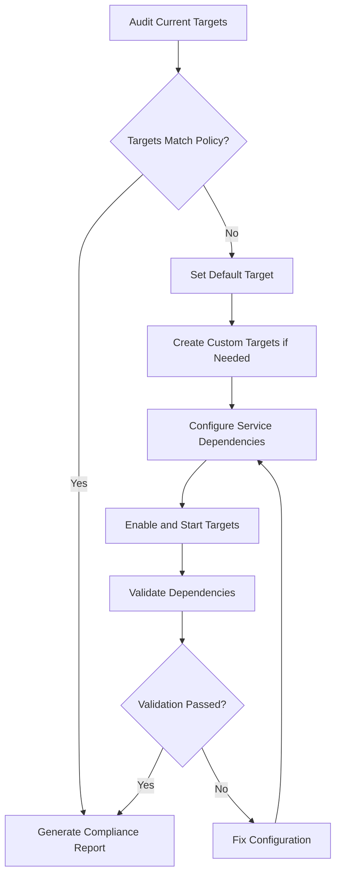

# How to Use Ansible to Manage SystemD Targets

Author: [nawazdhandala](https://www.github.com/nawazdhandala)

Tags: Ansible, SystemD, Linux, Server Administration

Description: Learn how to use Ansible to manage systemd targets across your Linux fleet for consistent boot behavior and service grouping.

---

SystemD targets are the modern replacement for SysV runlevels. They define what services start at boot and how the system behaves in different states. When you have dozens or hundreds of servers, manually switching targets or ensuring consistent boot configurations becomes a nightmare. Ansible gives you a clean, repeatable way to handle all of this from a single playbook.

In this guide, I will walk through practical examples of managing systemd targets with Ansible, from basic target switching to building custom targets that group your application services together.

## Understanding SystemD Targets

Before jumping into the Ansible code, let me briefly cover what targets actually do. A systemd target is a unit that groups other units together. Think of it as a synchronization point. The most commonly used ones are:

- `multi-user.target` - the standard text-mode boot (like runlevel 3)
- `graphical.target` - full GUI desktop (like runlevel 5)
- `rescue.target` - single-user mode for troubleshooting
- `emergency.target` - bare minimum shell for serious recovery

You can check your current default target with `systemctl get-default` on any systemd-based system.

## Setting the Default Boot Target

The most common task is ensuring all your servers boot into the right target. Production servers should almost always use `multi-user.target` since there is no reason to run a GUI on a headless box.

Here is a playbook that sets the default target across your fleet:

```yaml
# set-default-target.yml - Ensure all production servers boot to multi-user target
---
- name: Configure default systemd target
  hosts: production_servers
  become: true
  vars:
    default_target: multi-user.target

  tasks:
    # Check what target is currently set as default
    - name: Get current default target
      ansible.builtin.command:
        cmd: systemctl get-default
      register: current_target
      changed_when: false

    # Only change if the current target does not match desired state
    - name: Set default boot target
      ansible.builtin.command:
        cmd: "systemctl set-default {{ default_target }}"
      when: current_target.stdout != default_target
      notify: log target change

    # Print the result for visibility in the playbook output
    - name: Display current target status
      ansible.builtin.debug:
        msg: "Server {{ inventory_hostname }} target: {{ current_target.stdout }} -> desired: {{ default_target }}"

  handlers:
    - name: log target change
      ansible.builtin.lineinfile:
        path: /var/log/ansible-changes.log
        line: "{{ ansible_date_time.iso8601 }} - Default target changed to {{ default_target }}"
        create: true
        mode: '0644'
```

## Switching Active Targets at Runtime

Sometimes you need to switch a running system to a different target without rebooting. This is useful during maintenance windows where you want to drop to rescue mode or bring down non-essential services.

```yaml
# switch-target-runtime.yml - Switch active target on running systems
---
- name: Switch systemd target at runtime
  hosts: maintenance_group
  become: true
  serial: 1  # Process one server at a time to avoid mass outage

  tasks:
    # Isolate the target - this stops services not needed by the target
    - name: Switch to multi-user target (stop GUI services)
      ansible.builtin.systemd:
        name: multi-user.target
        state: started
        no_block: false
      register: target_switch

    # Verify the switch happened correctly
    - name: Verify active target
      ansible.builtin.command:
        cmd: systemctl list-units --type target --state active
      register: active_targets
      changed_when: false

    - name: Show active targets
      ansible.builtin.debug:
        var: active_targets.stdout_lines
```

## Listing and Auditing Targets Across Servers

Before making changes, you typically want to audit what targets are in use across your entire fleet. This fact-gathering playbook collects that info and writes it to a report.

```yaml
# audit-targets.yml - Collect target information from all servers
---
- name: Audit systemd targets across fleet
  hosts: all
  become: true
  gather_facts: true

  tasks:
    # Get the default boot target
    - name: Get default target
      ansible.builtin.command:
        cmd: systemctl get-default
      register: default_target
      changed_when: false

    # Get all currently active targets
    - name: Get active targets
      ansible.builtin.shell:
        cmd: systemctl list-units --type target --state active --no-legend | awk '{print $1}'
      register: active_targets
      changed_when: false

    # Get all available targets on the system
    - name: Get available targets
      ansible.builtin.shell:
        cmd: systemctl list-unit-files --type target --no-legend | awk '{print $1, $2}'
      register: available_targets
      changed_when: false

    # Build a summary for each host
    - name: Create audit report entry
      ansible.builtin.set_fact:
        target_report:
          hostname: "{{ inventory_hostname }}"
          os: "{{ ansible_distribution }} {{ ansible_distribution_version }}"
          default_target: "{{ default_target.stdout }}"
          active_targets: "{{ active_targets.stdout_lines }}"

    - name: Display report
      ansible.builtin.debug:
        var: target_report

    # Write report to a local file on the controller
    - name: Save audit report to controller
      ansible.builtin.copy:
        content: "{{ target_report | to_nice_yaml }}"
        dest: "/tmp/target-audit-{{ inventory_hostname }}.yml"
        mode: '0644'
      delegate_to: localhost
```

## Creating Custom SystemD Targets

This is where it gets really interesting. You can create custom targets that group your application services together. For example, a `webapp.target` that depends on nginx, your app server, and Redis all being up.

```yaml
# create-custom-target.yml - Deploy a custom systemd target for web applications
---
- name: Deploy custom webapp target
  hosts: web_servers
  become: true

  tasks:
    # Create the custom target unit file
    - name: Deploy webapp.target unit file
      ansible.builtin.copy:
        dest: /etc/systemd/system/webapp.target
        mode: '0644'
        content: |
          [Unit]
          Description=Web Application Services Target
          Requires=network-online.target
          After=network-online.target
          # This target pulls in all webapp-related services
          # Services bind to this target using WantedBy=webapp.target

          [Install]
          WantedBy=multi-user.target
      notify: reload systemd

    # Make nginx part of the webapp target
    - name: Create nginx override to bind to webapp target
      ansible.builtin.file:
        path: /etc/systemd/system/nginx.service.d
        state: directory
        mode: '0755'

    - name: Add webapp target dependency to nginx
      ansible.builtin.copy:
        dest: /etc/systemd/system/nginx.service.d/webapp-target.conf
        mode: '0644'
        content: |
          [Install]
          WantedBy=webapp.target
      notify: reload systemd

    # Enable the custom target so it starts at boot
    - name: Enable webapp target
      ansible.builtin.systemd:
        name: webapp.target
        enabled: true
        daemon_reload: true

  handlers:
    - name: reload systemd
      ansible.builtin.systemd:
        daemon_reload: true
```

## Managing Target Dependencies and Ordering

When working with targets, the dependency chain matters a lot. Here is a playbook that validates target dependencies are correct:

```yaml
# validate-target-deps.yml - Check that target dependencies are properly configured
---
- name: Validate systemd target dependencies
  hosts: all
  become: true

  vars:
    required_dependencies:
      multi-user.target:
        - basic.target
        - network.target
      webapp.target:
        - network-online.target

  tasks:
    # Check dependencies for each target we care about
    - name: Get target dependencies
      ansible.builtin.command:
        cmd: "systemctl list-dependencies {{ item.key }} --no-pager --plain"
      loop: "{{ required_dependencies | dict2items }}"
      register: dep_results
      changed_when: false

    # Validate that required deps are present
    - name: Check for missing dependencies
      ansible.builtin.assert:
        that:
          - item.1 in dep_check.stdout
        fail_msg: "Missing dependency {{ item.1 }} in target {{ item.0.key }}"
        success_msg: "Dependency {{ item.1 }} found in {{ item.0.key }}"
      loop: "{{ dep_results.results | subelements('item.value') }}"
      loop_control:
        label: "{{ item.0.item.key }} -> {{ item.1 }}"
      vars:
        dep_check: "{{ item.0 }}"
```

## Target Management Workflow

Here is a visual overview of how the target management workflow fits together:



## Practical Tips from Production

A few things I have learned running this in production:

1. Always use `serial: 1` or a small batch size when switching targets at runtime. Switching targets can stop running services, and you do not want to take down your entire fleet at once.

2. The `systemctl isolate` command is powerful but dangerous. It will stop all units that are not dependencies of the target you are isolating to. Use it carefully and always test in staging first.

3. Custom targets are underrated. Instead of managing individual services with enable/disable across dozens of playbooks, group them into a target. Then you can start or stop an entire application stack by managing one target.

4. Always run the audit playbook first when inheriting infrastructure from another team. You would be surprised how many production servers are accidentally booting into `graphical.target` and running a full GNOME desktop nobody ever sees.

5. Keep your target unit files in version control alongside your playbooks. Treat them as infrastructure code, not as one-off configurations.

SystemD targets are a fundamental building block of modern Linux systems, and having them under Ansible management means one less thing that can drift out of compliance across your fleet.
