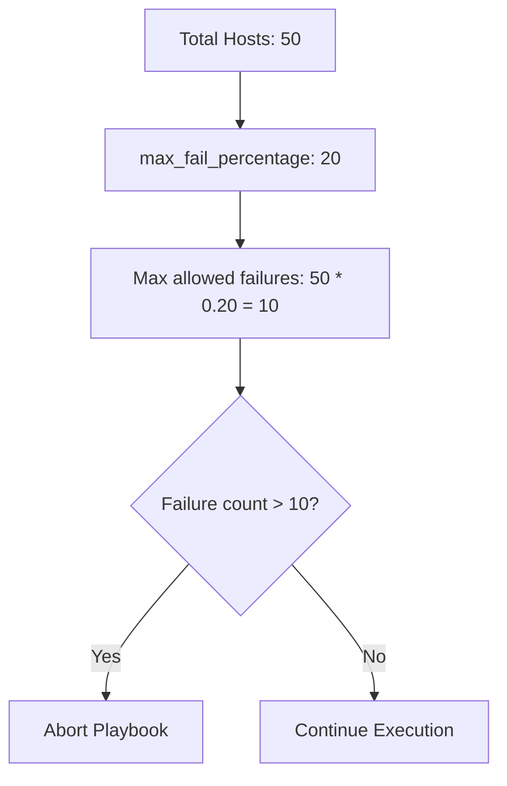

# How to Use max_fail_percentage in Ansible Playbooks

Author: [nawazdhandala](https://www.github.com/nawazdhandala)

Tags: Ansible, Error Handling, Deployment, Playbook

Description: Learn how to use max_fail_percentage in Ansible to control failure thresholds and prevent mass outages during rolling deployments.

---

When you deploy to a fleet of 100 servers, you expect a few might fail. Maybe a host has a disk issue, or a network hiccup causes a timeout. Those individual failures are acceptable. What is not acceptable is continuing a deployment when 30 hosts have already failed because something is fundamentally wrong with the release. The `max_fail_percentage` option lets you define that threshold.

## What max_fail_percentage Does

This option tells Ansible: "If more than X% of hosts fail, stop the entire playbook." It gives you a middle ground between the default behavior (continue unless all hosts fail) and `any_errors_fatal` (stop on the first failure).

```yaml
# rolling-deploy.yml - stops if more than 20% of hosts fail
---
- name: Rolling deployment
  hosts: webservers
  become: yes
  serial: 5
  max_fail_percentage: 20

  tasks:
    - name: Deploy application
      synchronize:
        src: /opt/releases/v2.5.0/
        dest: /var/www/myapp/

    - name: Restart application
      service:
        name: myapp
        state: restarted

    - name: Verify health
      uri:
        url: "http://localhost:8080/health"
        status_code: 200
      retries: 5
      delay: 3
```

If you have 50 web servers and `max_fail_percentage` is set to 20, Ansible will abort the playbook if more than 10 hosts fail (20% of 50 = 10).

## How the Calculation Works

Ansible calculates the threshold based on the total number of hosts in the play, not the number of hosts in each serial batch.



There is a subtlety here. Ansible uses "greater than" comparison, not "greater than or equal to." So with 50 hosts and 20%, exactly 10 failures is still okay. The 11th failure triggers the abort.

## Setting the Value to Zero

Setting `max_fail_percentage: 0` does not mean "allow zero failures." Due to the way Ansible calculates it, `max_fail_percentage: 0` actually means "only abort if ALL hosts fail." This is a common point of confusion.

If you want zero tolerance for failures, use `any_errors_fatal: true` instead.

```yaml
# This does NOT stop on first failure
- name: Misleading zero
  hosts: webservers
  max_fail_percentage: 0

# This DOES stop on first failure
- name: True zero tolerance
  hosts: webservers
  any_errors_fatal: true
```

## Practical Deployment Scenario

Here is a complete deployment playbook that uses `max_fail_percentage` with a rolling update strategy.

```yaml
# production-deploy.yml - safe rolling deployment
---
# Play 1: Pre-checks on all hosts
- name: Pre-deployment validation
  hosts: webservers
  any_errors_fatal: true

  tasks:
    - name: Verify minimum disk space
      shell: df --output=avail / | tail -1
      register: disk_avail
      changed_when: false
      failed_when: disk_avail.stdout | int < 2097152

    - name: Verify application is currently healthy
      uri:
        url: "http://localhost:8080/health"
        status_code: 200

# Play 2: Rolling deployment with failure threshold
- name: Deploy application
  hosts: webservers
  become: yes
  serial: 5
  max_fail_percentage: 10

  pre_tasks:
    - name: Remove from load balancer
      uri:
        url: "http://lb.example.com/api/backends/{{ inventory_hostname }}"
        method: DELETE
      delegate_to: localhost

    - name: Wait for connections to drain
      pause:
        seconds: 30

  tasks:
    - name: Stop application
      service:
        name: myapp
        state: stopped

    - name: Deploy new version
      unarchive:
        src: /opt/releases/myapp-2.5.0.tar.gz
        dest: /var/www/myapp/
        remote_src: yes

    - name: Start application
      service:
        name: myapp
        state: started

    - name: Wait for application to become healthy
      uri:
        url: "http://localhost:8080/health"
        status_code: 200
      retries: 10
      delay: 5
      register: health_check
      until: health_check.status == 200

  post_tasks:
    - name: Add back to load balancer
      uri:
        url: "http://lb.example.com/api/backends"
        method: POST
        body_format: json
        body:
          host: "{{ inventory_hostname }}"
          port: 8080
      delegate_to: localhost
```

With `serial: 5` and `max_fail_percentage: 10`, Ansible deploys 5 hosts at a time. If failures accumulate past the 10% threshold of your total fleet, the rollout stops. The hosts that have not been touched yet stay on the old version, limiting the blast radius.

## Interaction with serial

The `max_fail_percentage` and `serial` options work together to create safe deployment patterns.

```yaml
# Different strategies for different risk levels
---
# Conservative: deploy one at a time, stop if any fail
- name: Canary deployment
  hosts: webservers
  serial: 1
  any_errors_fatal: true
  tasks: [...]

# Moderate: deploy 5 at a time, stop if >10% fail
- name: Rolling deployment
  hosts: webservers
  serial: 5
  max_fail_percentage: 10
  tasks: [...]

# Aggressive: deploy 20 at a time, stop if >25% fail
- name: Fast rollout
  hosts: webservers
  serial: 20
  max_fail_percentage: 25
  tasks: [...]
```

## Choosing the Right Percentage

The right threshold depends on your infrastructure and the type of change.

| Scenario | Suggested Threshold |
|----------|-------------------|
| Database schema migrations | 0 (use any_errors_fatal) |
| Application deployments | 10-20% |
| Configuration updates | 20-30% |
| Monitoring agent updates | 30-50% |
| Log rotation scripts | 50%+ |

For critical operations where consistency matters, keep the threshold low. For routine maintenance where individual failures are expected and non-impactful, you can be more lenient.

## Monitoring Failure Rates

You can track failure rates across your deployment by examining the play recap.

```bash
# Run the playbook and capture output
ansible-playbook -i production.ini deploy.yml 2>&1 | tee deploy.log

# Extract failure counts from the recap
grep -E "unreachable|failed" deploy.log
```

For automated monitoring, use the JSON callback plugin.

```bash
# Get machine-readable output
ANSIBLE_STDOUT_CALLBACK=json ansible-playbook -i production.ini deploy.yml > deploy.json
```

Then parse the JSON to extract per-host success/failure status and integrate it with your monitoring system.

## Combining with Rescue Blocks

When `max_fail_percentage` triggers an abort, tasks in the current batch that have not started will not run. But you can use rescue blocks to handle failures on individual hosts before the threshold is reached.

```yaml
# deploy-with-rollback.yml - individual host rollback before threshold
---
- name: Deploy with per-host rollback
  hosts: webservers
  become: yes
  serial: 5
  max_fail_percentage: 15

  tasks:
    - block:
        - name: Backup current version
          command: cp -r /var/www/myapp /var/www/myapp.backup

        - name: Deploy new version
          synchronize:
            src: /opt/releases/new/
            dest: /var/www/myapp/

        - name: Verify deployment
          uri:
            url: "http://localhost:8080/health"
            status_code: 200
          retries: 3
          delay: 5

      rescue:
        - name: Rollback this host
          command: mv /var/www/myapp.backup /var/www/myapp

        - name: Restart with old version
          service:
            name: myapp
            state: restarted

        - name: Mark host as failed for threshold calculation
          fail:
            msg: "Deployment failed and rolled back on {{ inventory_hostname }}"
```

The rescue block rolls back the individual host, then uses `fail` to mark it as failed. This failure counts toward the `max_fail_percentage` threshold. If too many hosts hit the rescue path, the playbook stops.

## Summary

The `max_fail_percentage` option is your safety valve for fleet-wide operations. It lets individual hosts fail without stopping the entire operation, but it draws a line when failures become systemic. Combined with `serial` for batch processing and rescue blocks for per-host cleanup, it gives you a production-grade deployment strategy that handles real-world failure scenarios.
