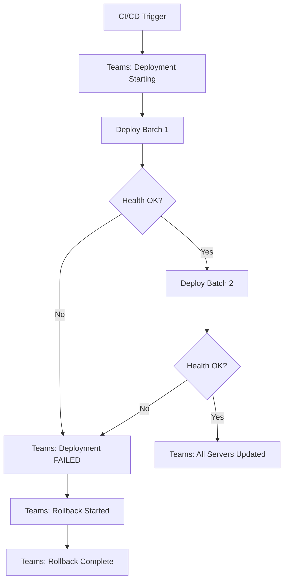

# How to Use Ansible with Microsoft Teams Notifications

Author: [nawazdhandala](https://www.github.com/nawazdhandala)

Tags: Ansible, Microsoft Teams, CI/CD, Notifications

Description: Send deployment notifications to Microsoft Teams channels from Ansible playbooks using incoming webhooks and adaptive cards.

---

If your organization uses Microsoft Teams instead of Slack, you still want deployment notifications flowing into your team channels. Ansible can post messages to Teams using Incoming Webhooks and the `uri` module. Teams also supports Adaptive Cards, which let you build rich, structured notifications with buttons and formatted sections.

This post covers everything from basic webhook messages to rich Adaptive Card notifications, and how to integrate it all into your CI/CD pipeline.

## Setting Up an Incoming Webhook in Teams

First, you need to create an Incoming Webhook in your Teams channel. Go to the channel, click the three dots menu, select "Connectors" (or "Manage channel" then "Connectors"), find "Incoming Webhook", and configure it. Give it a name like "Ansible Deploy Bot" and copy the webhook URL.

The URL will look something like `https://myorg.webhook.office.com/webhookb2/...`.

## Sending Basic Notifications

Here is a playbook that sends a simple Teams notification using the `uri` module.

```yaml
# playbooks/deploy-with-teams.yml
# Deploy application and send notifications to Microsoft Teams
---
- name: Deploy with Teams notifications
  hosts: webservers
  serial: 2
  become: true
  vars:
    teams_webhook_url: "{{ lookup('env', 'TEAMS_WEBHOOK_URL') }}"
    app_version: "{{ deploy_version }}"
    app_name: "myapp"

  pre_tasks:
    - name: Notify Teams that deployment is starting
      uri:
        url: "{{ teams_webhook_url }}"
        method: POST
        body_format: json
        body:
          "@type": "MessageCard"
          "@context": "http://schema.org/extensions"
          themeColor: "FFA500"
          summary: "Deployment Starting"
          sections:
            - activityTitle: "Deployment Starting"
              activitySubtitle: "{{ app_name }} v{{ app_version }}"
              facts:
                - name: "Application"
                  value: "{{ app_name }}"
                - name: "Version"
                  value: "{{ app_version }}"
                - name: "Servers"
                  value: "{{ ansible_play_hosts | length }}"
                - name: "Started by"
                  value: "CI/CD Pipeline"
              markdown: true
        status_code: 200
      delegate_to: localhost
      run_once: true

  tasks:
    - name: Pull application code
      git:
        repo: "https://github.com/myorg/{{ app_name }}.git"
        dest: "/opt/{{ app_name }}"
        version: "{{ app_version }}"
        force: true

    - name: Restart application
      systemd:
        name: "{{ app_name }}"
        state: restarted

    - name: Verify health
      uri:
        url: "http://{{ ansible_host }}:8080/health"
        status_code: 200
      register: health
      until: health.status == 200
      retries: 10
      delay: 5

  post_tasks:
    - name: Notify Teams of successful deployment
      uri:
        url: "{{ teams_webhook_url }}"
        method: POST
        body_format: json
        body:
          "@type": "MessageCard"
          "@context": "http://schema.org/extensions"
          themeColor: "00FF00"
          summary: "Deployment Successful"
          sections:
            - activityTitle: "Deployment Successful"
              activitySubtitle: "{{ app_name }} v{{ app_version }}"
              facts:
                - name: "Application"
                  value: "{{ app_name }}"
                - name: "Version"
                  value: "{{ app_version }}"
                - name: "Servers Updated"
                  value: "{{ ansible_play_hosts | join(', ') }}"
              markdown: true
        status_code: 200
      delegate_to: localhost
      run_once: true
```

## Using Adaptive Cards for Rich Notifications

Adaptive Cards provide a more modern and flexible notification format. They support buttons, columns, and various text styles.

```yaml
# Send a rich Adaptive Card notification to Teams
- name: Send Adaptive Card deployment notification
  uri:
    url: "{{ teams_webhook_url }}"
    method: POST
    body_format: json
    body:
      type: "message"
      attachments:
        - contentType: "application/vnd.microsoft.card.adaptive"
          contentUrl: null
          content:
            "$schema": "http://adaptivecards.io/schemas/adaptive-card.json"
            type: "AdaptiveCard"
            version: "1.4"
            body:
              - type: "TextBlock"
                text: "Deployment Report"
                weight: "Bolder"
                size: "Large"
              - type: "ColumnSet"
                columns:
                  - type: "Column"
                    width: "auto"
                    items:
                      - type: "TextBlock"
                        text: "Application:"
                        weight: "Bolder"
                  - type: "Column"
                    width: "stretch"
                    items:
                      - type: "TextBlock"
                        text: "{{ app_name }}"
              - type: "ColumnSet"
                columns:
                  - type: "Column"
                    width: "auto"
                    items:
                      - type: "TextBlock"
                        text: "Version:"
                        weight: "Bolder"
                  - type: "Column"
                    width: "stretch"
                    items:
                      - type: "TextBlock"
                        text: "{{ app_version }}"
              - type: "ColumnSet"
                columns:
                  - type: "Column"
                    width: "auto"
                    items:
                      - type: "TextBlock"
                        text: "Status:"
                        weight: "Bolder"
                  - type: "Column"
                    width: "stretch"
                    items:
                      - type: "TextBlock"
                        text: "Deployed Successfully"
                        color: "Good"
              - type: "FactSet"
                facts:
                  - title: "Environment"
                    value: "{{ env_name | default('Production') }}"
                  - title: "Servers"
                    value: "{{ ansible_play_hosts | length }}"
                  - title: "Timestamp"
                    value: "{{ ansible_date_time.iso8601 }}"
    status_code: 200
  delegate_to: localhost
  run_once: true
```

## Failure Notifications with Rescue

When deployments fail, you want a clear alert in Teams.

```yaml
# playbooks/deploy-teams-failsafe.yml
# Deployment with automatic Teams failure alerts
---
- name: Failsafe deployment with Teams alerts
  hosts: webservers
  serial: 2
  become: true
  vars:
    teams_webhook_url: "{{ lookup('env', 'TEAMS_WEBHOOK_URL') }}"

  tasks:
    - name: Deploy with failure handling
      block:
        - name: Deploy application
          git:
            repo: "https://github.com/myorg/myapp.git"
            dest: /opt/myapp
            version: "{{ deploy_version }}"
            force: true

        - name: Restart service
          systemd:
            name: myapp
            state: restarted

        - name: Health check
          uri:
            url: "http://{{ ansible_host }}:8080/health"
            status_code: 200
          retries: 5
          delay: 3

      rescue:
        - name: Send failure notification to Teams
          uri:
            url: "{{ teams_webhook_url }}"
            method: POST
            body_format: json
            body:
              "@type": "MessageCard"
              "@context": "http://schema.org/extensions"
              themeColor: "FF0000"
              summary: "Deployment Failed"
              sections:
                - activityTitle: "DEPLOYMENT FAILED"
                  activitySubtitle: "Immediate attention required"
                  facts:
                    - name: "Failed Server"
                      value: "{{ inventory_hostname }}"
                    - name: "Version"
                      value: "{{ deploy_version }}"
                    - name: "Error"
                      value: "Health check failed after deployment"
                  markdown: true
              potentialAction:
                - "@type": "OpenUri"
                  name: "View Logs"
                  targets:
                    - os: "default"
                      uri: "https://logs.myorg.com/deployments/{{ deploy_version }}"
          delegate_to: localhost

        - name: Stop deployment
          fail:
            msg: "Deployment failed on {{ inventory_hostname }}"
```

## Creating a Reusable Teams Notification Role

Wrap the Teams notification logic in a role so you can reuse it across playbooks.

```yaml
# roles/teams_notify/tasks/main.yml
# Reusable role for Microsoft Teams notifications
---
- name: Send Teams notification
  uri:
    url: "{{ teams_notify_webhook_url }}"
    method: POST
    body_format: json
    body:
      "@type": "MessageCard"
      "@context": "http://schema.org/extensions"
      themeColor: "{{ teams_notify_color }}"
      summary: "{{ teams_notify_title }}"
      sections:
        - activityTitle: "{{ teams_notify_title }}"
          activitySubtitle: "{{ teams_notify_subtitle | default('') }}"
          facts: "{{ teams_notify_facts | default([]) }}"
          text: "{{ teams_notify_text | default('') }}"
          markdown: true
    status_code: 200
  delegate_to: localhost
  run_once: "{{ teams_notify_once | default(true) }}"
```

```yaml
# roles/teams_notify/defaults/main.yml
# Default values for Teams notification role
---
teams_notify_webhook_url: "{{ lookup('env', 'TEAMS_WEBHOOK_URL') }}"
teams_notify_color: "0076D7"
teams_notify_title: "Ansible Notification"
teams_notify_once: true
```

Now use it simply in any playbook.

```yaml
# Using the Teams notification role
- name: Notify start
  include_role:
    name: teams_notify
  vars:
    teams_notify_title: "Deployment Starting"
    teams_notify_color: "FFA500"
    teams_notify_facts:
      - name: "App"
        value: "{{ app_name }}"
      - name: "Version"
        value: "{{ app_version }}"
```

## CI/CD Integration with GitHub Actions

```yaml
# .github/workflows/deploy-teams.yml
# Deploy and notify Microsoft Teams through CI/CD
name: Deploy with Teams Notifications

on:
  push:
    tags: ['v*']

jobs:
  deploy:
    runs-on: ubuntu-latest
    steps:
      - uses: actions/checkout@v4

      - name: Setup Ansible
        run: pip install ansible

      - name: Deploy
        env:
          TEAMS_WEBHOOK_URL: ${{ secrets.TEAMS_WEBHOOK_URL }}
          ANSIBLE_HOST_KEY_CHECKING: "false"
        run: |
          ansible-playbook playbooks/deploy-with-teams.yml \
            -i inventory/production.yml \
            -e "deploy_version=${{ github.ref_name }}" \
            --private-key <(echo "${{ secrets.SSH_KEY }}")
```

## Message Flow in a Deployment



## Conclusion

Microsoft Teams notifications from Ansible are straightforward using the `uri` module and Incoming Webhooks. MessageCards give you structured notifications with facts and action buttons, while Adaptive Cards offer even richer formatting. Wrap the notification logic in a reusable role, and you can add Teams alerts to any playbook with a single `include_role` call. Combined with `block/rescue` for failure detection, your team will always know the status of every deployment without leaving Teams.
