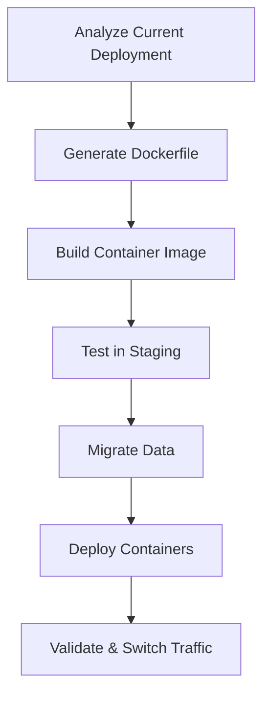

# How to Use Ansible to Migrate Applications to Containers

Author: [nawazdhandala](https://www.github.com/nawazdhandala)

Tags: Ansible, Docker, Containers, Migration, DevOps

Description: Use Ansible to systematically migrate traditional applications to containers with Dockerfile generation, image building, and orchestration.

---

Moving applications from bare-metal or VM deployments into containers is a common modernization effort. The process involves analyzing existing deployments, creating Dockerfiles, building images, setting up container orchestration, and migrating data. Ansible helps manage this transition systematically rather than doing it application by application in an ad-hoc fashion.

## Migration Strategy



## Role Defaults

```yaml
# roles/containerize/defaults/main.yml - Container migration settings
containerize_registry: registry.example.com:5000
containerize_apps:
  - name: web-app
    source_dir: /opt/web-app
    base_image: node:20-alpine
    port: 3000
    env_vars:
      NODE_ENV: production
      DB_HOST: "{{ db_host }}"
    volumes:
      - /data/uploads:/app/uploads
    health_check: /health

  - name: api-service
    source_dir: /opt/api
    base_image: python:3.11-slim
    port: 8000
    env_vars:
      DJANGO_SETTINGS_MODULE: config.production
    health_check: /api/health
```

## Analysis Tasks

```yaml
# roles/containerize/tasks/analyze.yml - Analyze current deployment
---
- name: Gather information about running services
  command: "systemctl show {{ item.name }} --property=ExecStart,Environment,WorkingDirectory"
  register: service_info
  loop: "{{ containerize_apps }}"
  changed_when: false

- name: Identify port bindings
  command: "ss -tlnp | grep {{ item.port }}"
  register: port_info
  loop: "{{ containerize_apps }}"
  changed_when: false
  ignore_errors: yes

- name: Check application dependencies
  command: "lsof -i -P -n | grep {{ item.name }}"
  register: dep_info
  loop: "{{ containerize_apps }}"
  changed_when: false
  ignore_errors: yes

- name: Generate migration analysis report
  template:
    src: analysis_report.j2
    dest: "/tmp/container-migration-analysis.txt"
    mode: '0644'
```

## Dockerfile Generation

```yaml
# roles/containerize/tasks/build.yml - Generate and build containers
---
- name: Create build directories
  file:
    path: "/tmp/builds/{{ item.name }}"
    state: directory
    mode: '0755'
  loop: "{{ containerize_apps }}"

- name: Generate Dockerfile for each application
  template:
    src: Dockerfile.j2
    dest: "/tmp/builds/{{ item.name }}/Dockerfile"
    mode: '0644'
  loop: "{{ containerize_apps }}"

- name: Copy application source for build context
  synchronize:
    src: "{{ item.source_dir }}/"
    dest: "/tmp/builds/{{ item.name }}/app/"
  loop: "{{ containerize_apps }}"

- name: Build container images
  community.docker.docker_image:
    name: "{{ containerize_registry }}/{{ item.name }}"
    tag: "{{ app_version | default('latest') }}"
    source: build
    build:
      path: "/tmp/builds/{{ item.name }}"
    push: yes
  loop: "{{ containerize_apps }}"
```

## Dockerfile Template

```dockerfile
# roles/containerize/templates/Dockerfile.j2
FROM {{ item.base_image }}

WORKDIR /app

# Copy application files
COPY app/ .

# Install dependencies based on detected package manager

RUN npm ci --production

COPY app/requirements.txt .
RUN pip install --no-cache-dir -r requirements.txt


# Set environment variables

ENV {{ key }}={{ value }}


EXPOSE {{ item.port }}

HEALTHCHECK --interval=30s --timeout=5s --retries=3 \
  CMD curl -f http://localhost:{{ item.port }}{{ item.health_check }} || exit 1


CMD ["node", "server.js"]

CMD ["gunicorn", "--bind", "0.0.0.0:{{ item.port }}", "app:application"]

```

## Container Deployment

```yaml
# roles/containerize/tasks/deploy.yml - Deploy containerized applications
---
- name: Deploy containerized applications
  community.docker.docker_container:
    name: "{{ item.name }}"
    image: "{{ containerize_registry }}/{{ item.name }}:{{ app_version | default('latest') }}"
    state: started
    restart_policy: unless-stopped
    ports:
      - "{{ item.port }}:{{ item.port }}"
    env: "{{ item.env_vars }}"
    volumes: "{{ item.volumes | default([]) }}"
    healthcheck:
      test: ["CMD", "curl", "-f", "http://localhost:{{ item.port }}{{ item.health_check }}"]
      interval: 30s
      timeout: 5s
      retries: 3
  loop: "{{ containerize_apps }}"
```

## Running the Migration

```bash
# Analyze current deployments
ansible-playbook -i inventory/hosts.ini containerize.yml --tags analyze

# Build container images
ansible-playbook -i inventory/hosts.ini containerize.yml --tags build

# Deploy containers
ansible-playbook -i inventory/hosts.ini containerize.yml --tags deploy
```

## Summary

Ansible provides a structured approach to containerizing applications. By automating the analysis, Dockerfile generation, image building, and deployment steps, you reduce the risk of missing dependencies or misconfiguring the container environment. The templates can be extended for different application stacks, and once an application is containerized, the same Ansible playbooks can manage its lifecycle across development, staging, and production environments.

## Common Use Cases

Here are several practical scenarios where this module proves essential in real-world playbooks.

### Infrastructure Provisioning Workflow

```yaml
# Complete workflow incorporating this module
- name: Infrastructure provisioning
  hosts: all
  become: true
  gather_facts: true
  tasks:
    - name: Gather system information
      ansible.builtin.setup:
        gather_subset:
          - hardware
          - network

    - name: Display system summary
      ansible.builtin.debug:
        msg: >-
          Host {{ inventory_hostname }} has
          {{ ansible_memtotal_mb }}MB RAM,
          {{ ansible_processor_vcpus }} vCPUs,
          running {{ ansible_distribution }} {{ ansible_distribution_version }}

    - name: Install required packages
      ansible.builtin.package:
        name:
          - curl
          - wget
          - git
          - vim
          - htop
          - jq
        state: present

    - name: Configure system timezone
      ansible.builtin.timezone:
        name: "{{ system_timezone | default('UTC') }}"

    - name: Configure hostname
      ansible.builtin.hostname:
        name: "{{ inventory_hostname }}"

    - name: Update /etc/hosts
      ansible.builtin.lineinfile:
        path: /etc/hosts
        regexp: '^127\.0\.1\.1'
        line: "127.0.1.1 {{ inventory_hostname }}"

    - name: Configure SSH hardening
      ansible.builtin.lineinfile:
        path: /etc/ssh/sshd_config
        regexp: "{{ item.regexp }}"
        line: "{{ item.line }}"
      loop:
        - { regexp: '^PermitRootLogin', line: 'PermitRootLogin no' }
        - { regexp: '^PasswordAuthentication', line: 'PasswordAuthentication no' }
      notify: restart sshd

    - name: Configure firewall rules
      community.general.ufw:
        rule: allow
        port: "{{ item }}"
        proto: tcp
      loop:
        - "22"
        - "80"
        - "443"

    - name: Enable firewall
      community.general.ufw:
        state: enabled
        policy: deny

  handlers:
    - name: restart sshd
      ansible.builtin.service:
        name: sshd
        state: restarted
```

### Integration with Monitoring

```yaml
# Using gathered facts to configure monitoring thresholds
- name: Configure monitoring based on system specs
  hosts: all
  become: true
  tasks:
    - name: Set monitoring thresholds based on hardware
      ansible.builtin.template:
        src: monitoring_config.yml.j2
        dest: /etc/monitoring/config.yml
      vars:
        memory_warning_threshold: "{{ (ansible_memtotal_mb * 0.8) | int }}"
        memory_critical_threshold: "{{ (ansible_memtotal_mb * 0.95) | int }}"
        cpu_warning_threshold: 80
        cpu_critical_threshold: 95

    - name: Register host with monitoring system
      ansible.builtin.uri:
        url: "https://monitoring.example.com/api/hosts"
        method: POST
        body_format: json
        body:
          hostname: "{{ inventory_hostname }}"
          ip_address: "{{ ansible_default_ipv4.address }}"
          os: "{{ ansible_distribution }}"
          memory_mb: "{{ ansible_memtotal_mb }}"
          cpus: "{{ ansible_processor_vcpus }}"
        headers:
          Authorization: "Bearer {{ monitoring_api_token }}"
        status_code: [200, 201, 409]
```

### Error Handling Patterns

```yaml
# Robust error handling with this module
- name: Robust task execution
  hosts: all
  tasks:
    - name: Attempt primary operation
      ansible.builtin.command: /opt/app/primary-task.sh
      register: primary_result
      failed_when: false

    - name: Handle primary failure with fallback
      ansible.builtin.command: /opt/app/fallback-task.sh
      when: primary_result.rc != 0
      register: fallback_result

    - name: Report final status
      ansible.builtin.debug:
        msg: >-
          Task completed via {{ 'primary' if primary_result.rc == 0 else 'fallback' }} path.
          Return code: {{ primary_result.rc if primary_result.rc == 0 else fallback_result.rc }}

    - name: Fail if both paths failed
      ansible.builtin.fail:
        msg: "Both primary and fallback operations failed"
      when:
        - primary_result.rc != 0
        - fallback_result is defined
        - fallback_result.rc != 0
```

### Scheduling and Automation

```yaml
# Set up scheduled compliance scans using cron
- name: Configure automated scans
  hosts: all
  become: true
  tasks:
    - name: Create scan script
      ansible.builtin.copy:
        dest: /opt/scripts/compliance_scan.sh
        mode: '0755'
        content: |
          #!/bin/bash
          cd /opt/ansible
          ansible-playbook playbooks/validate.yml -i inventory/ > /var/log/compliance_scan.log 2>&1
          EXIT_CODE=$?
          if [ $EXIT_CODE -ne 0 ]; then
            curl -X POST https://hooks.example.com/alert \
              -H "Content-Type: application/json" \
              -d "{\"text\":\"Compliance scan failed on $(hostname)\"}"
          fi
          exit $EXIT_CODE

    - name: Schedule weekly compliance scan
      ansible.builtin.cron:
        name: "Weekly compliance scan"
        minute: "0"
        hour: "3"
        weekday: "1"
        job: "/opt/scripts/compliance_scan.sh"
        user: ansible
```

