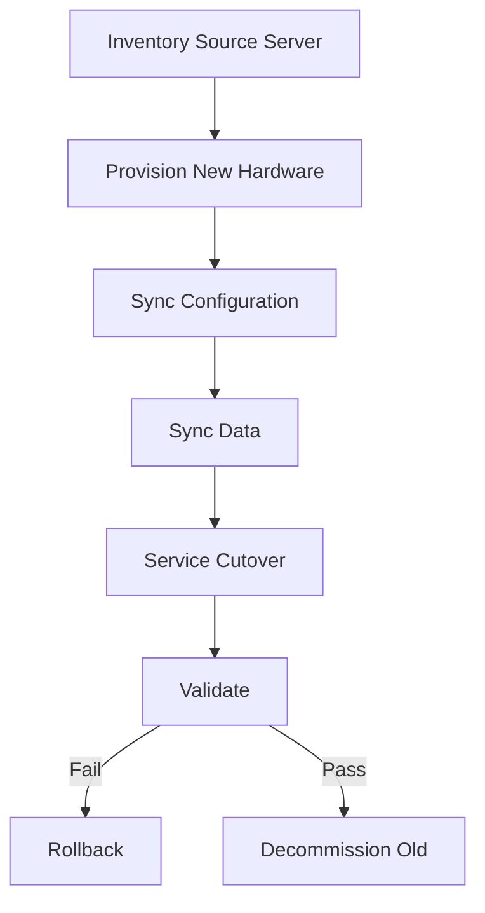

# How to Use Ansible to Migrate Servers to New Hardware

Author: [nawazdhandala](https://www.github.com/nawazdhandala)

Tags: Ansible, Migration, Infrastructure, Linux, DevOps

Description: Plan and execute server migrations to new hardware using Ansible with data sync, service cutover, and validation procedures.

---

Migrating servers to new hardware is one of the most stressful infrastructure tasks. You have to move applications, data, and configurations without losing anything or causing extended downtime. When done manually, migrations are slow and mistakes compound quickly. Ansible brings structure to the migration by breaking it into repeatable phases: inventory the source, provision the target, sync data, cut over services, and validate.

## Migration Workflow



## Role Defaults

```yaml
# roles/migration/defaults/main.yml - Server migration settings
migration_source_host: old-server.internal
migration_target_host: new-server.internal
migration_sync_dirs:
  - /var/www
  - /opt/app
  - /etc/nginx
migration_services:
  - nginx
  - app-service
  - redis
migration_dns_record: app.example.com
migration_cutover_window: 300
migration_rsync_opts: "-avz --delete --progress"
```

## Phase 1: Provision Target

```yaml
# roles/migration/tasks/provision.yml - Set up the new server
---
- name: Apply baseline configuration to new server
  include_role:
    name: baseline
  delegate_to: "{{ migration_target_host }}"

- name: Install same packages as source
  apt:
    name: "{{ source_packages }}"
    state: present
  delegate_to: "{{ migration_target_host }}"

- name: Copy system users from source to target
  user:
    name: "{{ item.name }}"
    uid: "{{ item.uid }}"
    group: "{{ item.group }}"
    home: "{{ item.home }}"
    shell: "{{ item.shell }}"
  loop: "{{ source_users }}"
  delegate_to: "{{ migration_target_host }}"
```

## Phase 2: Data Sync

```yaml
# roles/migration/tasks/sync.yml - Sync data from old to new server
---
- name: Initial data sync (can run while source is live)
  synchronize:
    src: "{{ item }}"
    dest: "{{ item }}"
    mode: push
    rsync_opts: "{{ migration_rsync_opts }}"
  loop: "{{ migration_sync_dirs }}"
  delegate_to: "{{ migration_source_host }}"

- name: Sync configuration files
  synchronize:
    src: "/etc/{{ item }}/"
    dest: "/etc/{{ item }}/"
    mode: push
  loop:
    - nginx
    - systemd/system
  delegate_to: "{{ migration_source_host }}"
```

## Phase 3: Cutover

```yaml
# roles/migration/tasks/cutover.yml - Switch traffic to new server
---
- name: Stop services on source server
  systemd:
    name: "{{ item }}"
    state: stopped
  loop: "{{ migration_services }}"
  delegate_to: "{{ migration_source_host }}"

- name: Final data sync (delta only)
  synchronize:
    src: "{{ item }}"
    dest: "{{ item }}"
    mode: push
    rsync_opts: "{{ migration_rsync_opts }}"
  loop: "{{ migration_sync_dirs }}"
  delegate_to: "{{ migration_source_host }}"

- name: Start services on target server
  systemd:
    name: "{{ item }}"
    state: started
    enabled: yes
  loop: "{{ migration_services }}"
  delegate_to: "{{ migration_target_host }}"

- name: Validate services are running
  uri:
    url: "http://{{ migration_target_host }}:80/health"
    status_code: 200
  register: target_health
  until: target_health.status == 200
  retries: 10
  delay: 5
  delegate_to: "{{ migration_target_host }}"

- name: Update DNS to point to new server
  debug:
    msg: "Update {{ migration_dns_record }} to point to {{ migration_target_host }}"
```

## Running the Migration

```bash
# Phase 1: Provision and initial sync (no downtime)
ansible-playbook -i inventory/hosts.ini migrate.yml --tags "provision,sync"

# Phase 2: Cutover (brief downtime)
ansible-playbook -i inventory/hosts.ini migrate.yml --tags "cutover"

# Phase 3: Validate and decommission
ansible-playbook -i inventory/hosts.ini migrate.yml --tags "validate"
```

## Summary

Server migration with Ansible is structured, predictable, and reversible. The phased approach means you can do initial data syncs with zero downtime, then schedule a brief cutover window for the final sync and DNS switch. If validation fails, rolling back is as simple as restarting services on the old server and reverting the DNS change. The entire procedure is documented in the playbook, so anyone on the team can execute the migration.

## Common Use Cases

Here are several practical scenarios where this module proves essential in real-world playbooks.

### Infrastructure Provisioning Workflow

```yaml
# Complete workflow incorporating this module
- name: Infrastructure provisioning
  hosts: all
  become: true
  gather_facts: true
  tasks:
    - name: Gather system information
      ansible.builtin.setup:
        gather_subset:
          - hardware
          - network

    - name: Display system summary
      ansible.builtin.debug:
        msg: >-
          Host {{ inventory_hostname }} has
          {{ ansible_memtotal_mb }}MB RAM,
          {{ ansible_processor_vcpus }} vCPUs,
          running {{ ansible_distribution }} {{ ansible_distribution_version }}

    - name: Install required packages
      ansible.builtin.package:
        name:
          - curl
          - wget
          - git
          - vim
          - htop
          - jq
        state: present

    - name: Configure system timezone
      ansible.builtin.timezone:
        name: "{{ system_timezone | default('UTC') }}"

    - name: Configure hostname
      ansible.builtin.hostname:
        name: "{{ inventory_hostname }}"

    - name: Update /etc/hosts
      ansible.builtin.lineinfile:
        path: /etc/hosts
        regexp: '^127\.0\.1\.1'
        line: "127.0.1.1 {{ inventory_hostname }}"

    - name: Configure SSH hardening
      ansible.builtin.lineinfile:
        path: /etc/ssh/sshd_config
        regexp: "{{ item.regexp }}"
        line: "{{ item.line }}"
      loop:
        - { regexp: '^PermitRootLogin', line: 'PermitRootLogin no' }
        - { regexp: '^PasswordAuthentication', line: 'PasswordAuthentication no' }
      notify: restart sshd

    - name: Configure firewall rules
      community.general.ufw:
        rule: allow
        port: "{{ item }}"
        proto: tcp
      loop:
        - "22"
        - "80"
        - "443"

    - name: Enable firewall
      community.general.ufw:
        state: enabled
        policy: deny

  handlers:
    - name: restart sshd
      ansible.builtin.service:
        name: sshd
        state: restarted
```

### Integration with Monitoring

```yaml
# Using gathered facts to configure monitoring thresholds
- name: Configure monitoring based on system specs
  hosts: all
  become: true
  tasks:
    - name: Set monitoring thresholds based on hardware
      ansible.builtin.template:
        src: monitoring_config.yml.j2
        dest: /etc/monitoring/config.yml
      vars:
        memory_warning_threshold: "{{ (ansible_memtotal_mb * 0.8) | int }}"
        memory_critical_threshold: "{{ (ansible_memtotal_mb * 0.95) | int }}"
        cpu_warning_threshold: 80
        cpu_critical_threshold: 95

    - name: Register host with monitoring system
      ansible.builtin.uri:
        url: "https://monitoring.example.com/api/hosts"
        method: POST
        body_format: json
        body:
          hostname: "{{ inventory_hostname }}"
          ip_address: "{{ ansible_default_ipv4.address }}"
          os: "{{ ansible_distribution }}"
          memory_mb: "{{ ansible_memtotal_mb }}"
          cpus: "{{ ansible_processor_vcpus }}"
        headers:
          Authorization: "Bearer {{ monitoring_api_token }}"
        status_code: [200, 201, 409]
```

### Error Handling Patterns

```yaml
# Robust error handling with this module
- name: Robust task execution
  hosts: all
  tasks:
    - name: Attempt primary operation
      ansible.builtin.command: /opt/app/primary-task.sh
      register: primary_result
      failed_when: false

    - name: Handle primary failure with fallback
      ansible.builtin.command: /opt/app/fallback-task.sh
      when: primary_result.rc != 0
      register: fallback_result

    - name: Report final status
      ansible.builtin.debug:
        msg: >-
          Task completed via {{ 'primary' if primary_result.rc == 0 else 'fallback' }} path.
          Return code: {{ primary_result.rc if primary_result.rc == 0 else fallback_result.rc }}

    - name: Fail if both paths failed
      ansible.builtin.fail:
        msg: "Both primary and fallback operations failed"
      when:
        - primary_result.rc != 0
        - fallback_result is defined
        - fallback_result.rc != 0
```

### Scheduling and Automation

```yaml
# Set up scheduled compliance scans using cron
- name: Configure automated scans
  hosts: all
  become: true
  tasks:
    - name: Create scan script
      ansible.builtin.copy:
        dest: /opt/scripts/compliance_scan.sh
        mode: '0755'
        content: |
          #!/bin/bash
          cd /opt/ansible
          ansible-playbook playbooks/validate.yml -i inventory/ > /var/log/compliance_scan.log 2>&1
          EXIT_CODE=$?
          if [ $EXIT_CODE -ne 0 ]; then
            curl -X POST https://hooks.example.com/alert \
              -H "Content-Type: application/json" \
              -d "{\"text\":\"Compliance scan failed on $(hostname)\"}"
          fi
          exit $EXIT_CODE

    - name: Schedule weekly compliance scan
      ansible.builtin.cron:
        name: "Weekly compliance scan"
        minute: "0"
        hour: "3"
        weekday: "1"
        job: "/opt/scripts/compliance_scan.sh"
        user: ansible
```

