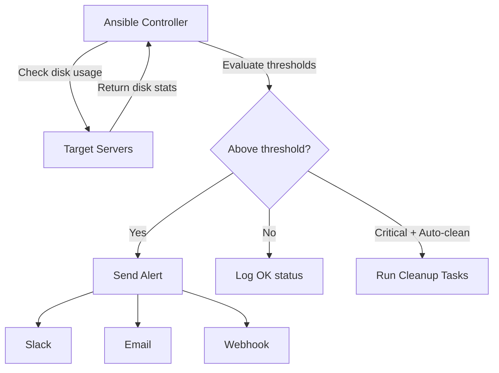

# How to Use Ansible to Monitor Disk Space and Send Alerts

Author: [nawazdhandala](https://www.github.com/nawazdhandala)

Tags: Ansible, Disk Monitoring, Alerting, Linux, DevOps

Description: Automate disk space monitoring with Ansible playbooks that check usage thresholds and send alerts via Slack, email, or webhook.

---

Running out of disk space is one of the most common causes of production outages, and it is almost always preventable. Logs fill up, database files grow, temp directories accumulate junk, and suddenly your application crashes because it cannot write to disk. While tools like Prometheus with node_exporter handle continuous monitoring, Ansible provides a lightweight approach that works without any agents and integrates directly into your existing automation workflow.

In this post, I will show you how to build an Ansible playbook that checks disk space across all your servers, identifies partitions exceeding thresholds, and sends alerts through multiple channels. We will also cover automated cleanup actions for common space hogs.

## How It Works



## Variables

```yaml
# group_vars/all.yml
# Disk usage thresholds (percentage)
disk_warning_threshold: 80
disk_critical_threshold: 90
disk_emergency_threshold: 95

# Filesystems to exclude from checks
disk_exclude_types:
  - tmpfs
  - devtmpfs
  - squashfs
  - overlay

# Minimum partition size to monitor (in MB)
# Skips tiny filesystems like /boot/efi
disk_min_size_mb: 500

# Alert channels
disk_alert_slack_webhook: "{{ vault_slack_webhook | default('') }}"
disk_alert_slack_channel: "#disk-alerts"
disk_alert_email_to: "ops-team@company.com"
disk_alert_email_from: "ansible-alerts@company.com"
disk_alert_smtp_host: "smtp.company.com"

# Auto-cleanup settings
disk_auto_cleanup: true
disk_cleanup_journal_max_size: "500M"
disk_cleanup_apt_cache: true
disk_cleanup_old_kernels: true
disk_cleanup_tmp_days: 7
```

## Main Playbook

```yaml
# disk-monitor.yml
---
- name: Monitor disk space across all servers
  hosts: all
  become: yes
  gather_facts: yes
  vars:
    disk_issues: []

  tasks:
    - name: Get disk usage for all relevant filesystems
      ansible.builtin.shell:
        cmd: >
          df -BM --output=target,fstype,size,used,avail,pcent
          | tail -n +2
          | grep -v -E '({{ disk_exclude_types | join("|") }})'
      register: disk_output
      changed_when: false

    - name: Parse disk usage and identify issues
      ansible.builtin.set_fact:
        disk_status: >-
          
          
          
          
          
          
          
          
          
          {% set pct = parts[5] | replace('%','') | int %}
          
          
          
          
          
          
          {{ results }}

    - name: Identify partitions with issues
      ansible.builtin.set_fact:
        disk_issues: "{{ disk_status | selectattr('status', 'ne', 'OK') | list }}"

    - name: Display disk status summary
      ansible.builtin.debug:
        msg: |
          === Disk Status for {{ inventory_hostname }} ===
          
          [{{ disk.status }}] {{ disk.mount }} - {{ disk.percent }}% used ({{ disk.avail_mb }}MB free)
          

    - name: Run cleanup if auto-cleanup is enabled and issues found
      ansible.builtin.include_tasks: cleanup.yml
      when:
        - disk_auto_cleanup | bool
        - disk_issues | length > 0

- name: Send consolidated alert report
  hosts: localhost
  gather_facts: no
  tasks:
    - name: Build alert message
      ansible.builtin.set_fact:
        alert_hosts: >-
          
          
          
          
          
          
          {{ hosts_with_issues }}

    - name: Send Slack alert
      ansible.builtin.uri:
        url: "{{ disk_alert_slack_webhook }}"
        method: POST
        body_format: json
        body:
          channel: "{{ disk_alert_slack_channel }}"
          username: "Disk Monitor"
          icon_emoji: ":floppy_disk:"
          text: |
            *Disk Space Alert*
            
            *{{ entry.host }}*:
            
            - {{ issue.mount }}: {{ issue.percent }}% used ({{ issue.avail_mb }}MB free) [{{ issue.status }}]
            
            
      when:
        - alert_hosts | length > 0
        - disk_alert_slack_webhook | length > 0

    - name: Send email alert
      community.general.mail:
        host: "{{ disk_alert_smtp_host }}"
        to: "{{ disk_alert_email_to }}"
        from: "{{ disk_alert_email_from }}"
        subject: "[DISK ALERT] {{ alert_hosts | length }} servers with disk space issues"
        body: |
          Disk Space Alert Report
          Generated: {{ ansible_date_time.iso8601 | default('now') }}

          
          Host: {{ entry.host }}
          
            {{ issue.mount }}: {{ issue.percent }}% used ({{ issue.avail_mb }}MB free) [{{ issue.status }}]
          

          
      when:
        - alert_hosts | length > 0
        - disk_alert_email_to is defined

    - name: Report all clear
      ansible.builtin.debug:
        msg: "All servers have healthy disk usage levels."
      when: alert_hosts | length == 0
```

## Automated Cleanup Tasks

When disk usage exceeds thresholds, these cleanup tasks reclaim space from common sources.

```yaml
# cleanup.yml
---
- name: Clean systemd journal logs
  ansible.builtin.command:
    cmd: "journalctl --vacuum-size={{ disk_cleanup_journal_max_size }}"
  register: journal_clean
  changed_when: "'Vacuuming done' in journal_clean.stdout"

- name: Clean apt cache
  ansible.builtin.apt:
    autoclean: yes
    autoremove: yes
  when:
    - disk_cleanup_apt_cache | bool
    - ansible_os_family == "Debian"

- name: Clean yum cache
  ansible.builtin.command:
    cmd: yum clean all
  when:
    - disk_cleanup_apt_cache | bool
    - ansible_os_family == "RedHat"
  changed_when: true

- name: Remove old temporary files
  ansible.builtin.find:
    paths: /tmp
    age: "{{ disk_cleanup_tmp_days }}d"
    recurse: yes
  register: old_tmp_files

- name: Delete old temporary files
  ansible.builtin.file:
    path: "{{ item.path }}"
    state: absent
  loop: "{{ old_tmp_files.files }}"
  when: old_tmp_files.matched > 0

- name: Remove old log files that have been rotated and compressed
  ansible.builtin.find:
    paths: /var/log
    patterns: "*.gz,*.old,*.1,*.2,*.3,*.4,*.5"
    age: "14d"
    recurse: yes
  register: old_logs

- name: Delete old rotated logs
  ansible.builtin.file:
    path: "{{ item.path }}"
    state: absent
  loop: "{{ old_logs.files }}"
  when: old_logs.matched > 0

- name: Find large core dump files
  ansible.builtin.find:
    paths: /var/crash
    patterns: "*.crash,core.*"
    size: "10m"
  register: crash_files
  ignore_errors: yes

- name: Remove old crash files
  ansible.builtin.file:
    path: "{{ item.path }}"
    state: absent
  loop: "{{ crash_files.files | default([]) }}"

- name: Re-check disk usage after cleanup
  ansible.builtin.shell:
    cmd: "df -h {{ disk_issues | map(attribute='mount') | join(' ') }}"
  register: post_cleanup
  changed_when: false

- name: Show post-cleanup disk usage
  ansible.builtin.debug:
    msg: |
      Post-cleanup disk usage:
      {{ post_cleanup.stdout }}
```

## Targeted Monitoring for Specific Directories

Sometimes you need to watch specific directories that grow independently of overall disk usage.

```yaml
# directory-monitor.yml
---
- name: Monitor specific directory sizes
  hosts: all
  become: yes
  vars:
    watched_directories:
      - path: /var/log
        max_size_gb: 5
      - path: /var/lib/docker
        max_size_gb: 20
      - path: /var/lib/postgresql
        max_size_gb: 50
      - path: /tmp
        max_size_gb: 2

  tasks:
    - name: Check directory sizes
      ansible.builtin.command:
        cmd: "du -sm {{ item.path }}"
      register: dir_sizes
      loop: "{{ watched_directories }}"
      changed_when: false
      ignore_errors: yes

    - name: Evaluate directory sizes
      ansible.builtin.debug:
        msg: >-
          {{ item.item.path }}: {{ (item.stdout.split()[0] | int / 1024) | round(2) }}GB
          
          [OVER LIMIT - max {{ item.item.max_size_gb }}GB]
          
          [OK - under {{ item.item.max_size_gb }}GB limit]
          
      loop: "{{ dir_sizes.results }}"
      when: item.rc == 0
```

## Scheduling with Cron

Set up the disk monitor to run on a regular schedule.

```yaml
# setup-cron.yml
---
- name: Set up disk monitoring cron job
  hosts: localhost
  tasks:
    - name: Create cron job for disk monitoring
      ansible.builtin.cron:
        name: "Ansible disk space monitor"
        minute: "0"
        hour: "*/4"
        job: >
          /usr/bin/ansible-playbook
          -i /opt/ansible/inventory/hosts.ini
          /opt/ansible/playbooks/disk-monitor.yml
          >> /var/log/ansible-disk-monitor.log 2>&1
```

## Running the Playbook

```bash
# Run disk space check on all servers
ansible-playbook -i inventory/hosts.ini disk-monitor.yml

# Run on specific servers
ansible-playbook -i inventory/hosts.ini disk-monitor.yml --limit db-servers

# Run with auto-cleanup disabled
ansible-playbook -i inventory/hosts.ini disk-monitor.yml -e "disk_auto_cleanup=false"

# Run with lower thresholds for a stricter check
ansible-playbook -i inventory/hosts.ini disk-monitor.yml -e "disk_warning_threshold=70 disk_critical_threshold=80"
```

## Wrapping Up

This Ansible-based disk monitoring approach works well as a complement to continuous monitoring tools. It requires no agents, uses standard Linux commands, and integrates with your existing alert channels. The automatic cleanup feature is particularly useful for non-production environments where you want to keep things tidy without manual intervention. For production, I recommend running the monitoring playbook on a schedule but keeping auto-cleanup disabled until you have verified the cleanup tasks are safe for your specific environment.
