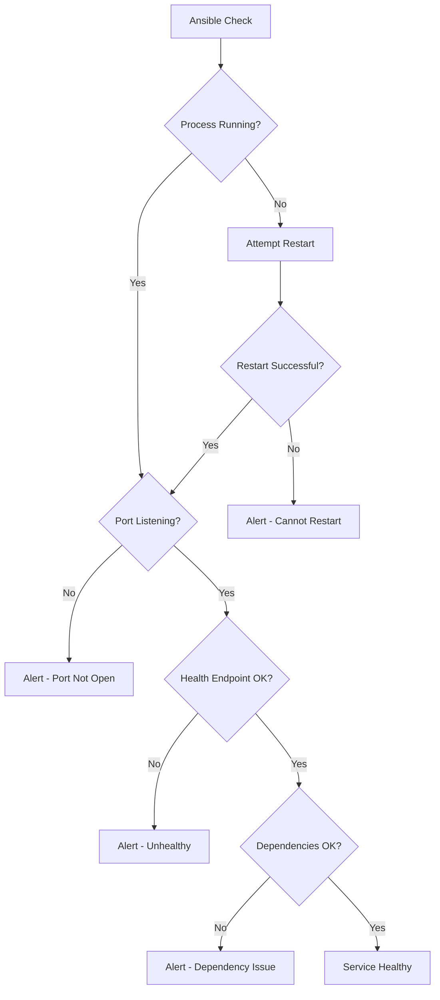

# How to Use Ansible to Monitor Service Availability

Author: [nawazdhandala](https://www.github.com/nawazdhandala)

Tags: Ansible, Service Monitoring, Availability, DevOps, Linux

Description: Build Ansible playbooks that check service availability across your infrastructure with health endpoints, port checks, and process verification.

---

Knowing whether your services are actually running and serving traffic is fundamental to operations. It is not enough to check that a process is running; you need to verify that it is accepting connections and responding correctly. Ansible provides a straightforward way to build service availability checks that go beyond simple process monitoring.

This post covers building comprehensive service availability checks using Ansible. We will verify that processes are running, ports are listening, health endpoints respond correctly, and dependent services are reachable. When something is wrong, the playbook takes action, either restarting the service or alerting the team.

## Monitoring Strategy



## Variables

Define the services you want to monitor and their expected states.

```yaml
# group_vars/all.yml
# Service definitions with health check parameters
monitored_services:
  - name: nginx
    process_name: nginx
    port: 80
    health_url: "http://localhost/health"
    health_expected_status: 200
    auto_restart: true
    max_restart_attempts: 3
    dependencies:
      - host: localhost
        port: 8080
        name: "upstream app"

  - name: postgresql
    process_name: postgres
    port: 5432
    health_command: "pg_isready -h localhost"
    auto_restart: false
    dependencies: []

  - name: redis
    process_name: redis-server
    port: 6379
    health_command: "redis-cli ping"
    health_expected_output: "PONG"
    auto_restart: true
    max_restart_attempts: 2
    dependencies: []

  - name: application
    process_name: myapp
    port: 8080
    health_url: "http://localhost:8080/api/health"
    health_expected_status: 200
    health_expected_body: '"status":"ok"'
    auto_restart: true
    max_restart_attempts: 2
    dependencies:
      - host: localhost
        port: 5432
        name: "PostgreSQL"
      - host: localhost
        port: 6379
        name: "Redis"

# Alert settings
service_alert_slack_webhook: "{{ vault_slack_webhook | default('') }}"
service_alert_slack_channel: "#service-alerts"
```

## Service Availability Playbook

```yaml
# service-monitor.yml
---
- name: Check service availability
  hosts: all
  become: yes
  gather_facts: yes
  vars:
    service_results: []

  tasks:
    - name: Check each monitored service
      ansible.builtin.include_tasks: check-service.yml
      loop: "{{ monitored_services }}"
      loop_control:
        loop_var: service
      when: monitored_services is defined

    - name: Display service availability report
      ansible.builtin.debug:
        msg: |
          === Service Availability Report for {{ inventory_hostname }} ===
          
          [{{ result.status }}] {{ result.name }}: {{ result.message }}
          

    - name: Set host health status
      ansible.builtin.set_fact:
        host_service_health: >-
          CRITICAL
          WARNING
          OK

- name: Send alert notifications
  hosts: localhost
  gather_facts: no
  tasks:
    - name: Identify hosts with service issues
      ansible.builtin.set_fact:
        unhealthy_hosts: >-
          
          
          
          
          
          
          
          {{ results }}

    - name: Send Slack alert for service issues
      ansible.builtin.uri:
        url: "{{ service_alert_slack_webhook }}"
        method: POST
        body_format: json
        body:
          channel: "{{ service_alert_slack_channel }}"
          text: |
            *Service Availability Alert*
            
            *{{ entry.host }}*:
            
            - [{{ issue.status }}] {{ issue.name }}: {{ issue.message }}
            
            
      when:
        - unhealthy_hosts | length > 0
        - service_alert_slack_webhook | length > 0
```

## Individual Service Check Tasks

```yaml
# check-service.yml
---
# Step 1: Check if the process is running
- name: "Check if {{ service.name }} process is running"
  ansible.builtin.command:
    cmd: "pgrep -x {{ service.process_name }}"
  register: process_check
  changed_when: false
  ignore_errors: yes

- name: "Attempt restart of {{ service.name }} if process is not running"
  block:
    - name: "Restart {{ service.name }}"
      ansible.builtin.service:
        name: "{{ service.name }}"
        state: restarted
      register: restart_result

    - name: "Wait for {{ service.name }} to come up"
      ansible.builtin.wait_for:
        port: "{{ service.port }}"
        timeout: 30
      register: restart_wait

    - name: Record successful restart
      ansible.builtin.set_fact:
        service_results: "{{ service_results + [{'name': service.name, 'status': 'WARNING', 'message': 'Was down, successfully restarted'}] }}"
      when: restart_wait is success

  rescue:
    - name: Record failed restart
      ansible.builtin.set_fact:
        service_results: "{{ service_results + [{'name': service.name, 'status': 'CRITICAL', 'message': 'Process not running, restart failed'}] }}"

  when:
    - process_check.rc != 0
    - service.auto_restart | default(false) | bool

- name: "Record process not running (no auto-restart)"
  ansible.builtin.set_fact:
    service_results: "{{ service_results + [{'name': service.name, 'status': 'CRITICAL', 'message': 'Process not running'}] }}"
  when:
    - process_check.rc != 0
    - not (service.auto_restart | default(false) | bool)

# Step 2: Check if the port is listening
- name: "Check if {{ service.name }} port {{ service.port }} is open"
  ansible.builtin.wait_for:
    port: "{{ service.port }}"
    timeout: 5
    state: started
  register: port_check
  ignore_errors: yes
  when: process_check.rc == 0

- name: "Record port check failure for {{ service.name }}"
  ansible.builtin.set_fact:
    service_results: "{{ service_results + [{'name': service.name, 'status': 'CRITICAL', 'message': 'Port ' ~ service.port ~ ' not listening'}] }}"
  when:
    - process_check.rc == 0
    - port_check is failed

# Step 3: Check health endpoint (HTTP)
- name: "Check {{ service.name }} health endpoint"
  ansible.builtin.uri:
    url: "{{ service.health_url }}"
    method: GET
    status_code: "{{ service.health_expected_status | default(200) }}"
    timeout: 10
  register: health_http
  ignore_errors: yes
  when:
    - process_check.rc == 0
    - port_check is success
    - service.health_url is defined

- name: "Record HTTP health check failure"
  ansible.builtin.set_fact:
    service_results: "{{ service_results + [{'name': service.name, 'status': 'WARNING', 'message': 'Health endpoint returned ' ~ (health_http.status | default('timeout'))}] }}"
  when:
    - service.health_url is defined
    - health_http is failed

# Step 3b: Check health command
- name: "Check {{ service.name }} via health command"
  ansible.builtin.command:
    cmd: "{{ service.health_command }}"
  register: health_cmd
  changed_when: false
  ignore_errors: yes
  when:
    - process_check.rc == 0
    - port_check is success
    - service.health_command is defined

- name: "Record command health check failure"
  ansible.builtin.set_fact:
    service_results: "{{ service_results + [{'name': service.name, 'status': 'WARNING', 'message': 'Health command failed: ' ~ health_cmd.stderr | default('unknown error')}] }}"
  when:
    - service.health_command is defined
    - health_cmd is failed

# Step 4: Check dependencies
- name: "Check {{ service.name }} dependencies"
  ansible.builtin.wait_for:
    host: "{{ dep.host }}"
    port: "{{ dep.port }}"
    timeout: 5
    state: started
  register: dep_checks
  loop: "{{ service.dependencies | default([]) }}"
  loop_control:
    loop_var: dep
  ignore_errors: yes
  when:
    - process_check.rc == 0
    - service.dependencies is defined

- name: "Record dependency failures"
  ansible.builtin.set_fact:
    service_results: "{{ service_results + [{'name': service.name, 'status': 'WARNING', 'message': 'Dependency ' ~ item.dep.name ~ ' unreachable at ' ~ item.dep.host ~ ':' ~ item.dep.port}] }}"
  loop: "{{ dep_checks.results | default([]) }}"
  when:
    - item is failed

# Step 5: Record success if all checks passed
- name: "Record {{ service.name }} as healthy"
  ansible.builtin.set_fact:
    service_results: "{{ service_results + [{'name': service.name, 'status': 'OK', 'message': 'All checks passed'}] }}"
  when:
    - process_check.rc == 0
    - port_check is success
    - (health_http is success or service.health_url is not defined)
    - (health_cmd is success or service.health_command is not defined)
```

## Running the Monitor

```bash
# Check all services across all hosts
ansible-playbook -i inventory/hosts.ini service-monitor.yml

# Check only web servers
ansible-playbook -i inventory/hosts.ini service-monitor.yml --limit webservers

# Disable auto-restart (dry run mode)
ansible-playbook -i inventory/hosts.ini service-monitor.yml -e '{"monitored_services": []}' --check

# Run with verbose output for debugging
ansible-playbook -i inventory/hosts.ini service-monitor.yml -v
```

## Scheduling Regular Checks

```yaml
# setup-monitoring-cron.yml
---
- name: Set up service monitoring cron
  hosts: localhost
  tasks:
    - name: Schedule service availability checks every 5 minutes
      ansible.builtin.cron:
        name: "Ansible service availability check"
        minute: "*/5"
        job: >
          /usr/bin/ansible-playbook
          -i /opt/ansible/inventory/hosts.ini
          /opt/ansible/playbooks/service-monitor.yml
          --forks 20
          >> /var/log/ansible-service-monitor.log 2>&1
```

## Wrapping Up

Ansible-based service monitoring fills a useful niche between manual checks and full monitoring platforms. It requires no agents on target hosts, uses the same SSH access you already have for configuration management, and the check definitions live alongside your infrastructure code. The auto-restart capability makes it particularly useful for non-critical environments where you want basic self-healing without deploying a full orchestration platform. For production, pair this with continuous monitoring tools and use Ansible checks as a validation layer that runs during deployments or scheduled maintenance windows.
