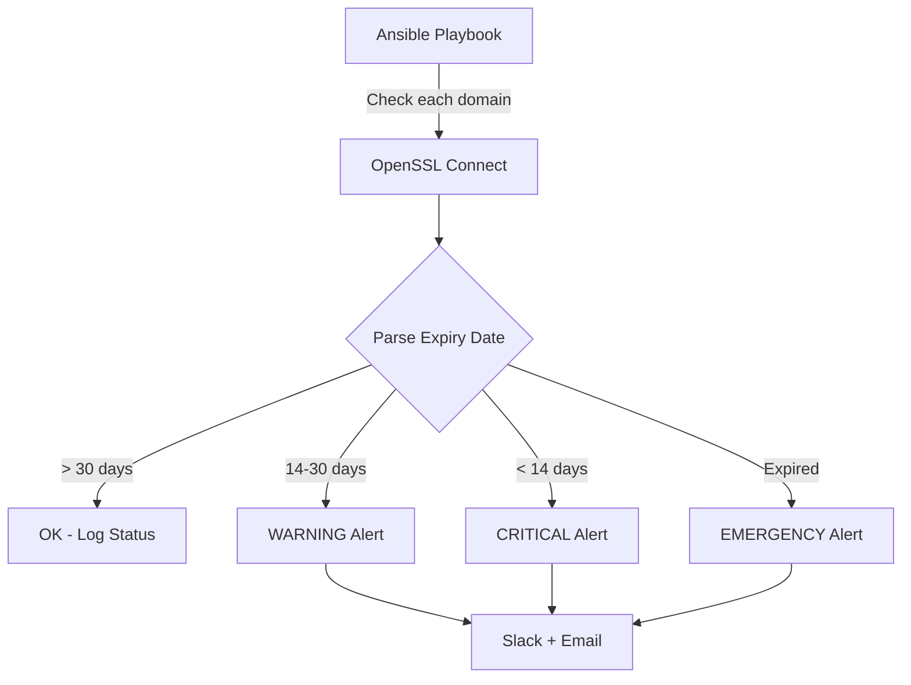

# How to Use Ansible to Monitor SSL Certificate Expiry

Author: [nawazdhandala](https://www.github.com/nawazdhandala)

Tags: Ansible, SSL, Certificates, Monitoring, Security

Description: Build Ansible playbooks that check SSL certificate expiry dates across all your domains and send alerts before certificates expire.

---

An expired SSL certificate is one of the most embarrassing production incidents you can have. Users get scary browser warnings, API clients refuse to connect, and the fix is usually simple if you had caught it in time. Major companies have had outages from expired certificates, so this is not just a small team problem.

Ansible provides a clean way to check certificate expiry dates across all your domains, both externally-facing and internal services. In this post, I will build a comprehensive certificate monitoring playbook that checks every certificate you care about, calculates days until expiry, and sends alerts through Slack and email when renewal deadlines approach.

## Monitoring Flow



## Variables

Define the domains to monitor and alert thresholds.

```yaml
# group_vars/all.yml
# Domains and endpoints to check
ssl_check_domains:
  - domain: api.example.com
    port: 443
    name: Production API
  - domain: www.example.com
    port: 443
    name: Company Website
  - domain: admin.example.com
    port: 443
    name: Admin Dashboard
  - domain: mail.example.com
    port: 465
    name: Mail Server
    starttls: smtp
  - domain: db.example.com
    port: 5432
    name: PostgreSQL (TLS)
    starttls: postgres

# Internal certificates to check (file paths on servers)
ssl_check_files:
  - path: /etc/ssl/certs/internal-ca.pem
    name: Internal CA Certificate
    hosts: all
  - path: /etc/nginx/ssl/server.crt
    name: Nginx TLS Certificate
    hosts: webservers

# Alert thresholds (days until expiry)
ssl_warning_days: 30
ssl_critical_days: 14
ssl_emergency_days: 7

# Notification settings
ssl_alert_slack_webhook: "{{ vault_slack_webhook | default('') }}"
ssl_alert_slack_channel: "#ssl-alerts"
ssl_alert_email_to: "security-team@company.com"
ssl_alert_email_from: "ssl-monitor@company.com"
ssl_alert_smtp_host: "smtp.company.com"
```

## Certificate Check Playbook

```yaml
# ssl-monitor.yml
---
- name: Check SSL certificate expiry dates
  hosts: localhost
  gather_facts: yes
  vars:
    ssl_results: []

  tasks:
    - name: Check each domain certificate
      ansible.builtin.shell:
        cmd: |
          echo | openssl s_client \
            -servername {{ item.domain }} \
            -connect {{ item.domain }}:{{ item.port }} \
            -starttls {{ item.starttls }} \
            2>/dev/null | openssl x509 -noout -dates -subject 2>/dev/null
      register: cert_checks
      loop: "{{ ssl_check_domains }}"
      changed_when: false
      ignore_errors: yes

    - name: Parse certificate information
      ansible.builtin.set_fact:
        ssl_results: >-
          
          
          
          
          
          
          
          
          
          
          
          
          
          
          
          {{ results }}

    - name: Calculate days until expiry for each certificate
      ansible.builtin.shell:
        cmd: |
          expiry_epoch=$(date -d "{{ item.expiry_date }}" +%s 2>/dev/null || date -j -f "%b %d %T %Y %Z" "{{ item.expiry_date }}" +%s 2>/dev/null)
          current_epoch=$(date +%s)
          days_left=$(( (expiry_epoch - current_epoch) / 86400 ))
          echo "${days_left}"
      register: days_calculations
      loop: "{{ ssl_results }}"
      when: item.reachable and item.expiry_date | length > 0
      changed_when: false

    - name: Build certificate report
      ansible.builtin.set_fact:
        cert_report: >-
          
          
          
          
          
          
          
          
          
          
          
          
          
          {{ report }}

    - name: Display certificate report
      ansible.builtin.debug:
        msg: |
          === SSL Certificate Expiry Report ===
          Generated: {{ ansible_date_time.iso8601 }}

          
          [{{ cert.status }}] {{ cert.name }} ({{ cert.domain }})
            Expires: {{ cert.expiry_date }}
            Days remaining: {{ cert.days_left }}
          

    - name: Identify certificates needing attention
      ansible.builtin.set_fact:
        certs_needing_attention: "{{ cert_report | selectattr('status', 'ne', 'OK') | list }}"

    - name: Send Slack alert for expiring certificates
      ansible.builtin.uri:
        url: "{{ ssl_alert_slack_webhook }}"
        method: POST
        body_format: json
        body:
          channel: "{{ ssl_alert_slack_channel }}"
          username: "SSL Monitor"
          text: |
            *SSL Certificate Expiry Alert*
            
            [{{ cert.status }}] *{{ cert.name }}* ({{ cert.domain }})
            Expires: {{ cert.expiry_date }} ({{ cert.days_left }} days)
            
      when:
        - certs_needing_attention | length > 0
        - ssl_alert_slack_webhook | length > 0

    - name: Send email alert
      community.general.mail:
        host: "{{ ssl_alert_smtp_host }}"
        to: "{{ ssl_alert_email_to }}"
        from: "{{ ssl_alert_email_from }}"
        subject: "[SSL ALERT] {{ certs_needing_attention | length }} certificates need attention"
        body: |
          SSL Certificate Expiry Alert
          Generated: {{ ansible_date_time.iso8601 }}

          The following certificates need attention:

          
          [{{ cert.status }}] {{ cert.name }} ({{ cert.domain }})
            Expires: {{ cert.expiry_date }}
            Days remaining: {{ cert.days_left }}
          

          Full report:
          
          {{ cert.name }} ({{ cert.domain }}): {{ cert.days_left }} days - {{ cert.status }}
          
      when:
        - certs_needing_attention | length > 0
        - ssl_alert_email_to is defined

    - name: All certificates healthy
      ansible.builtin.debug:
        msg: "All {{ cert_report | length }} certificates are valid for at least {{ ssl_warning_days }} days."
      when: certs_needing_attention | length == 0
```

## Checking Certificate Files on Servers

For internal certificates stored as files on servers, check them directly.

```yaml
# ssl-file-check.yml
---
- name: Check certificate files on servers
  hosts: all
  become: yes
  vars:
    local_cert_results: []
  tasks:
    - name: Find certificate files to check
      ansible.builtin.set_fact:
        certs_to_check: "{{ ssl_check_files | selectattr('hosts', 'equalto', 'all') | list + ssl_check_files | selectattr('hosts', 'equalto', group_names[0] | default('none')) | list }}"

    - name: Check each certificate file
      ansible.builtin.shell:
        cmd: |
          if [ -f "{{ item.path }}" ]; then
            expiry=$(openssl x509 -in "{{ item.path }}" -noout -enddate 2>/dev/null | cut -d= -f2)
            echo "${expiry}"
          else
            echo "FILE_NOT_FOUND"
          fi
      register: file_cert_checks
      loop: "{{ certs_to_check }}"
      changed_when: false
      ignore_errors: yes

    - name: Display file certificate status
      ansible.builtin.debug:
        msg: "{{ item.item.name }} ({{ item.item.path }}): Expires {{ item.stdout }}"
      loop: "{{ file_cert_checks.results }}"
      when: item.stdout != "FILE_NOT_FOUND"
```

## Automated Renewal Trigger

When a certificate is close to expiry, trigger an automated renewal with certbot.

```yaml
# auto-renew.yml
---
- name: Auto-renew certificates close to expiry
  hosts: webservers
  become: yes
  tasks:
    - name: Check if certbot is installed
      ansible.builtin.command:
        cmd: which certbot
      register: certbot_check
      changed_when: false
      ignore_errors: yes

    - name: Run certbot renewal
      ansible.builtin.command:
        cmd: certbot renew --non-interactive --quiet
      register: certbot_result
      when: certbot_check.rc == 0

    - name: Reload nginx after renewal
      ansible.builtin.service:
        name: nginx
        state: reloaded
      when:
        - certbot_check.rc == 0
        - certbot_result.changed
```

## Scheduling

```bash
# Run SSL check daily at 9 AM
# Add to crontab on the Ansible controller:
0 9 * * * /usr/bin/ansible-playbook -i /opt/ansible/inventory/hosts.ini /opt/ansible/playbooks/ssl-monitor.yml >> /var/log/ssl-monitor.log 2>&1

# Run the full check manually
ansible-playbook -i inventory/hosts.ini ssl-monitor.yml

# Check a specific domain
ansible-playbook -i inventory/hosts.ini ssl-monitor.yml -e '{"ssl_check_domains": [{"domain": "api.example.com", "port": 443, "name": "API"}]}'
```

## Wrapping Up

SSL certificate monitoring is one of those tasks that is boring until it saves you from a major outage. This Ansible approach requires no agents and checks certificates from the outside, just like your users would encounter them. Running the check daily gives you plenty of lead time before expiry. The key things to remember are: set your warning threshold generous enough to allow for renewal processing time, include internal certificates (they expire too), and make sure alerts go to a channel that people actually read.
