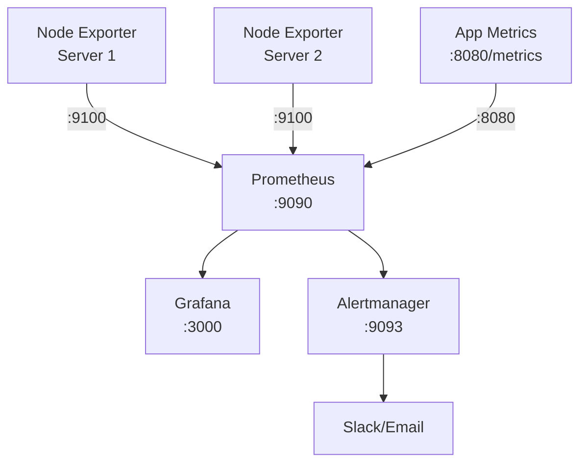

# How to Use Ansible to Set Up a Monitoring Stack (Prometheus + Grafana)

Author: [nawazdhandala](https://www.github.com/nawazdhandala)

Tags: Ansible, Prometheus, Grafana, Monitoring, DevOps

Description: Deploy a complete monitoring stack with Prometheus for metrics collection and Grafana for dashboards using Ansible automation playbooks.

---

Monitoring is not optional in production. You need to know when services go down, when disks fill up, and when response times spike before your users start complaining. Prometheus and Grafana together form the most popular open-source monitoring stack. Prometheus scrapes metrics from your services and stores them as time-series data, while Grafana turns those numbers into dashboards and alerts. Setting up both manually takes time and is hard to replicate across environments. Ansible solves that problem.

This guide walks through deploying a complete Prometheus and Grafana monitoring stack with Ansible, including Node Exporter on all monitored hosts, alert rules, and pre-configured dashboards.

## Architecture Overview



## Role Defaults

```yaml
# roles/monitoring/defaults/main.yml - Monitoring stack configuration
prometheus_version: "2.48.0"
grafana_version: "10.2.0"
node_exporter_version: "1.7.0"
alertmanager_version: "0.26.0"

prometheus_port: 9090
grafana_port: 3000
node_exporter_port: 9100
alertmanager_port: 9093

prometheus_data_dir: /var/lib/prometheus
prometheus_config_dir: /etc/prometheus
prometheus_retention: "30d"
prometheus_scrape_interval: "15s"

grafana_admin_user: admin
grafana_admin_password: "{{ vault_grafana_admin_password }}"

# Alertmanager configuration
alertmanager_slack_webhook: "{{ vault_slack_webhook_url }}"
alertmanager_slack_channel: "#alerts"
```

## Prometheus Installation Tasks

```yaml
# roles/monitoring/tasks/prometheus.yml - Install Prometheus
---
- name: Create prometheus system user
  user:
    name: prometheus
    system: yes
    shell: /usr/sbin/nologin
    create_home: no

- name: Create Prometheus directories
  file:
    path: "{{ item }}"
    state: directory
    owner: prometheus
    group: prometheus
    mode: '0755'
  loop:
    - "{{ prometheus_config_dir }}"
    - "{{ prometheus_config_dir }}/rules"
    - "{{ prometheus_data_dir }}"

- name: Download Prometheus binary
  get_url:
    url: "https://github.com/prometheus/prometheus/releases/download/v{{ prometheus_version }}/prometheus-{{ prometheus_version }}.linux-amd64.tar.gz"
    dest: /tmp/prometheus.tar.gz
    mode: '0644'

- name: Extract Prometheus
  unarchive:
    src: /tmp/prometheus.tar.gz
    dest: /tmp/
    remote_src: yes

- name: Install Prometheus binaries
  copy:
    src: "/tmp/prometheus-{{ prometheus_version }}.linux-amd64/{{ item }}"
    dest: "/usr/local/bin/{{ item }}"
    owner: root
    group: root
    mode: '0755'
    remote_src: yes
  loop:
    - prometheus
    - promtool

- name: Deploy Prometheus configuration
  template:
    src: prometheus.yml.j2
    dest: "{{ prometheus_config_dir }}/prometheus.yml"
    owner: prometheus
    group: prometheus
    mode: '0644'
    validate: "promtool check config %s"
  notify: restart prometheus

- name: Deploy alert rules
  template:
    src: alert_rules.yml.j2
    dest: "{{ prometheus_config_dir }}/rules/alerts.yml"
    owner: prometheus
    group: prometheus
    mode: '0644'
  notify: restart prometheus

- name: Create Prometheus systemd service
  template:
    src: prometheus.service.j2
    dest: /etc/systemd/system/prometheus.service
    mode: '0644'
  notify:
    - reload systemd
    - restart prometheus

- name: Start and enable Prometheus
  systemd:
    name: prometheus
    state: started
    enabled: yes
    daemon_reload: yes
```

## Prometheus Configuration Template

```yaml
# roles/monitoring/templates/prometheus.yml.j2 - Prometheus scrape config
global:
  scrape_interval: {{ prometheus_scrape_interval }}
  evaluation_interval: 15s

rule_files:
  - "rules/*.yml"

alerting:
  alertmanagers:
    - static_configs:
        - targets:
            - "localhost:{{ alertmanager_port }}"

scrape_configs:
  # Prometheus self-monitoring
  - job_name: 'prometheus'
    static_configs:
      - targets: ['localhost:{{ prometheus_port }}']

  # Node Exporter targets for system metrics
  - job_name: 'node'
    static_configs:
      - targets:

          - '{{ hostvars[host].ansible_host }}:{{ node_exporter_port }}'


  # Grafana metrics
  - job_name: 'grafana'
    static_configs:
      - targets: ['localhost:{{ grafana_port }}']
```

## Alert Rules Template

```yaml
# roles/monitoring/templates/alert_rules.yml.j2 - Prometheus alerting rules
groups:
  - name: node_alerts
    rules:
      - alert: HighCPUUsage
        expr: 100 - (avg by(instance) (rate(node_cpu_seconds_total{mode="idle"}[5m])) * 100) > 80
        for: 5m
        labels:
          severity: warning
        annotations:
          summary: "High CPU usage on {{ '{{ $labels.instance }}' }}"
          description: "CPU usage is above 80% for 5 minutes"

      - alert: HighMemoryUsage
        expr: (1 - node_memory_MemAvailable_bytes / node_memory_MemTotal_bytes) * 100 > 85
        for: 5m
        labels:
          severity: warning
        annotations:
          summary: "High memory usage on {{ '{{ $labels.instance }}' }}"

      - alert: DiskSpaceLow
        expr: (1 - node_filesystem_avail_bytes{fstype!="tmpfs"} / node_filesystem_size_bytes{fstype!="tmpfs"}) * 100 > 85
        for: 5m
        labels:
          severity: critical
        annotations:
          summary: "Disk space low on {{ '{{ $labels.instance }}' }}"

      - alert: InstanceDown
        expr: up == 0
        for: 2m
        labels:
          severity: critical
        annotations:
          summary: "Instance {{ '{{ $labels.instance }}' }} is down"
```

## Grafana Installation Tasks

```yaml
# roles/monitoring/tasks/grafana.yml - Install Grafana
---
- name: Add Grafana GPG key
  apt_key:
    url: https://apt.grafana.com/gpg.key
    state: present

- name: Add Grafana repository
  apt_repository:
    repo: "deb https://apt.grafana.com stable main"
    state: present
    filename: grafana

- name: Install Grafana
  apt:
    name: grafana
    state: present
    update_cache: yes

- name: Configure Grafana
  template:
    src: grafana.ini.j2
    dest: /etc/grafana/grafana.ini
    owner: root
    group: grafana
    mode: '0640'
  notify: restart grafana

- name: Start and enable Grafana
  systemd:
    name: grafana-server
    state: started
    enabled: yes

- name: Wait for Grafana to start
  uri:
    url: "http://localhost:{{ grafana_port }}/api/health"
    status_code: 200
  register: grafana_health
  until: grafana_health.status == 200
  retries: 20
  delay: 5

- name: Add Prometheus as Grafana data source
  uri:
    url: "http://localhost:{{ grafana_port }}/api/datasources"
    method: POST
    user: "{{ grafana_admin_user }}"
    password: "{{ grafana_admin_password }}"
    force_basic_auth: yes
    body_format: json
    body:
      name: Prometheus
      type: prometheus
      url: "http://localhost:{{ prometheus_port }}"
      access: proxy
      isDefault: true
    status_code: [200, 409]
```

## Node Exporter Tasks

```yaml
# roles/node_exporter/tasks/main.yml - Deploy on all monitored hosts
---
- name: Create node_exporter user
  user:
    name: node_exporter
    system: yes
    shell: /usr/sbin/nologin
    create_home: no

- name: Download Node Exporter
  get_url:
    url: "https://github.com/prometheus/node_exporter/releases/download/v{{ node_exporter_version }}/node_exporter-{{ node_exporter_version }}.linux-amd64.tar.gz"
    dest: /tmp/node_exporter.tar.gz

- name: Extract Node Exporter
  unarchive:
    src: /tmp/node_exporter.tar.gz
    dest: /tmp/
    remote_src: yes

- name: Install Node Exporter binary
  copy:
    src: "/tmp/node_exporter-{{ node_exporter_version }}.linux-amd64/node_exporter"
    dest: /usr/local/bin/node_exporter
    owner: root
    group: root
    mode: '0755'
    remote_src: yes

- name: Create Node Exporter systemd service
  copy:
    content: |
      [Unit]
      Description=Node Exporter
      After=network.target

      [Service]
      User=node_exporter
      ExecStart=/usr/local/bin/node_exporter
      Restart=always

      [Install]
      WantedBy=multi-user.target
    dest: /etc/systemd/system/node_exporter.service
    mode: '0644'

- name: Start and enable Node Exporter
  systemd:
    name: node_exporter
    state: started
    enabled: yes
    daemon_reload: yes
```

## Handlers

```yaml
# roles/monitoring/handlers/main.yml
---
- name: restart prometheus
  systemd:
    name: prometheus
    state: restarted

- name: restart grafana
  systemd:
    name: grafana-server
    state: restarted

- name: reload systemd
  systemd:
    daemon_reload: yes
```

## Main Playbook

```yaml
# playbook.yml - Deploy complete monitoring stack
---
- hosts: monitoring_server
  become: yes
  roles:
    - monitoring

- hosts: monitored
  become: yes
  roles:
    - node_exporter
```

## Running the Playbook

```bash
# Deploy the entire monitoring stack
ansible-playbook -i inventory/hosts.ini playbook.yml --ask-vault-pass
```

## Summary

This Ansible setup gives you a complete monitoring pipeline: Node Exporter on every server, Prometheus collecting and storing metrics, alert rules for common failure scenarios, and Grafana for visualization. The entire stack is defined in code, so you can replicate it across development, staging, and production environments. When you add new servers, just include them in the `monitored` group and rerun the playbook to have them automatically picked up by Prometheus.
