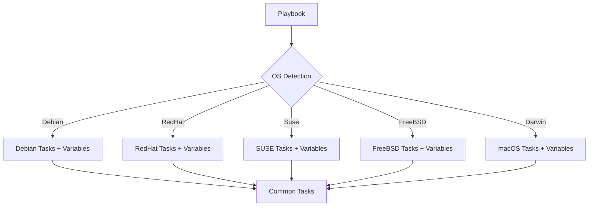

# How to Use Ansible for Multi-OS Playbook Development

Author: [nawazdhandala](https://www.github.com/nawazdhandala)

Tags: Ansible, Multi-OS, Cross-Platform, Best Practices, Testing

Description: Develop and test Ansible playbooks that work across Linux, FreeBSD, macOS, and Windows using a structured multi-OS development workflow.

---

Managing a heterogeneous fleet that includes Debian, RHEL, SUSE, FreeBSD, macOS, and possibly Windows requires a disciplined approach to playbook development. This guide covers the complete workflow for building, organizing, and testing multi-OS Ansible playbooks.

## Architecture for Multi-OS Playbooks



## Project Structure

```
ansible-multi-os/
  inventory/
    hosts.yml
  group_vars/
    all.yml
    debian.yml
    redhat.yml
    suse.yml
    freebsd.yml
    macos.yml
  roles/
    common/
      tasks/
        main.yml
        packages.yml
        users.yml
        security.yml
      vars/
        Debian.yml
        RedHat.yml
        Suse.yml
        FreeBSD.yml
        Darwin.yml
      defaults/
        main.yml
      handlers/
        main.yml
    webserver/
      tasks/
        main.yml
        install.yml
        configure.yml
      vars/
        Debian.yml
        RedHat.yml
      templates/
        vhost.conf.j2
  playbooks/
    site.yml
    webservers.yml
  molecule/
    default/
      molecule.yml
```

## The Common Role

The common role handles tasks that every OS needs, adapting automatically:

```yaml
# roles/common/tasks/main.yml
- name: Load OS-specific variables
  ansible.builtin.include_vars: "{{ item }}"
  with_first_found:
    - "{{ ansible_distribution }}_{{ ansible_distribution_major_version }}.yml"
    - "{{ ansible_distribution }}.yml"
    - "{{ ansible_os_family }}.yml"
    - "{{ ansible_system }}.yml"

- name: Include package installation tasks
  ansible.builtin.include_tasks: packages.yml

- name: Include user management tasks
  ansible.builtin.include_tasks: users.yml

- name: Include security hardening tasks
  ansible.builtin.include_tasks: security.yml
```

```yaml
# roles/common/tasks/packages.yml
- name: Install packages (Linux with package module)
  ansible.builtin.package:
    name: "{{ common_packages }}"
    state: present
  when: ansible_system == "Linux"

- name: Install packages (FreeBSD)
  community.general.pkgng:
    name: "{{ common_packages }}"
    state: present
  when: ansible_system == "FreeBSD"

- name: Install packages (macOS)
  community.general.homebrew:
    name: "{{ common_packages }}"
    state: present
  when: ansible_system == "Darwin"
```

```yaml
# roles/common/vars/Debian.yml
common_packages:
  - vim
  - htop
  - tmux
  - git
  - curl
  - jq
  - chrony
  - ufw

common_ssh_service: ssh
common_ntp_service: chrony
common_firewall_tool: ufw
```

```yaml
# roles/common/vars/RedHat.yml
common_packages:
  - vim-enhanced
  - htop
  - tmux
  - git
  - curl
  - jq
  - chrony
  - firewalld

common_ssh_service: sshd
common_ntp_service: chronyd
common_firewall_tool: firewalld
```

```yaml
# roles/common/vars/FreeBSD.yml
common_packages:
  - vim
  - htop
  - tmux
  - git
  - curl
  - jq
  - chrony

common_ssh_service: sshd
common_ntp_service: chronyd
common_firewall_tool: pf
```

```yaml
# roles/common/vars/Darwin.yml
common_packages:
  - vim
  - htop
  - tmux
  - git
  - curl
  - jq

common_ssh_service: ""
common_ntp_service: ""
common_firewall_tool: ""
```

## Service Management

```yaml
# roles/common/tasks/security.yml
- name: Harden SSH (all OS)
  ansible.builtin.lineinfile:
    path: "{{ ssh_config_path | default('/etc/ssh/sshd_config') }}"
    regexp: "{{ item.regexp }}"
    line: "{{ item.line }}"
  loop:
    - { regexp: '^#?PermitRootLogin', line: 'PermitRootLogin no' }
    - { regexp: '^#?PasswordAuthentication', line: 'PasswordAuthentication no' }
  when: common_ssh_service != ""
  notify: restart ssh

- name: Start NTP service (systemd)
  ansible.builtin.systemd:
    name: "{{ common_ntp_service }}"
    enabled: true
    state: started
  when:
    - common_ntp_service != ""
    - ansible_service_mgr == "systemd"

- name: Start NTP service (non-systemd)
  ansible.builtin.service:
    name: "{{ common_ntp_service }}"
    enabled: true
    state: started
  when:
    - common_ntp_service != ""
    - ansible_service_mgr != "systemd"
```

## Testing Across Multiple OS

Use Molecule with multiple platforms:

```yaml
# molecule/default/molecule.yml
dependency:
  name: galaxy
driver:
  name: docker
platforms:
  - name: ubuntu2404
    image: ubuntu:24.04
    pre_build_image: true
  - name: rocky9
    image: rockylinux:9
    pre_build_image: true
  - name: debian12
    image: debian:12
    pre_build_image: true
  - name: opensuse
    image: opensuse/leap:15.5
    pre_build_image: true
provisioner:
  name: ansible
verifier:
  name: ansible
```

```bash
# Test on all platforms
molecule test

# Test on a specific platform
molecule converge -- --limit ubuntu2404
```

## Running the Multi-OS Playbook

```yaml
# playbooks/site.yml
---
- name: Configure all servers
  hosts: all
  roles:
    - common

- name: Configure web servers
  hosts: webservers
  roles:
    - webserver
```

```bash
ansible-playbook -i inventory/hosts.yml playbooks/site.yml
```

## Summary

Multi-OS playbook development requires a systematic approach: OS detection through facts, variable files per distribution, portable module choices (`package` over `apt`/`dnf`, `service` over `systemd`), and comprehensive testing with Molecule across multiple platforms. Structure your roles with `vars/` directories per OS family, use `with_first_found` for graceful fallbacks, and test every change against all target platforms. This discipline pays off when your fleet grows and diversifies.

## Common Use Cases

Here are several practical scenarios where this module proves essential in real-world playbooks.

### Infrastructure Provisioning Workflow

```yaml
# Complete workflow incorporating this module
- name: Infrastructure provisioning
  hosts: all
  become: true
  gather_facts: true
  tasks:
    - name: Gather system information
      ansible.builtin.setup:
        gather_subset:
          - hardware
          - network

    - name: Display system summary
      ansible.builtin.debug:
        msg: >-
          Host {{ inventory_hostname }} has
          {{ ansible_memtotal_mb }}MB RAM,
          {{ ansible_processor_vcpus }} vCPUs,
          running {{ ansible_distribution }} {{ ansible_distribution_version }}

    - name: Install required packages
      ansible.builtin.package:
        name:
          - curl
          - wget
          - git
          - vim
          - htop
          - jq
        state: present

    - name: Configure system timezone
      ansible.builtin.timezone:
        name: "{{ system_timezone | default('UTC') }}"

    - name: Configure hostname
      ansible.builtin.hostname:
        name: "{{ inventory_hostname }}"

    - name: Update /etc/hosts
      ansible.builtin.lineinfile:
        path: /etc/hosts
        regexp: '^127\.0\.1\.1'
        line: "127.0.1.1 {{ inventory_hostname }}"

    - name: Configure SSH hardening
      ansible.builtin.lineinfile:
        path: /etc/ssh/sshd_config
        regexp: "{{ item.regexp }}"
        line: "{{ item.line }}"
      loop:
        - { regexp: '^PermitRootLogin', line: 'PermitRootLogin no' }
        - { regexp: '^PasswordAuthentication', line: 'PasswordAuthentication no' }
      notify: restart sshd

    - name: Configure firewall rules
      community.general.ufw:
        rule: allow
        port: "{{ item }}"
        proto: tcp
      loop:
        - "22"
        - "80"
        - "443"

    - name: Enable firewall
      community.general.ufw:
        state: enabled
        policy: deny

  handlers:
    - name: restart sshd
      ansible.builtin.service:
        name: sshd
        state: restarted
```

### Integration with Monitoring

```yaml
# Using gathered facts to configure monitoring thresholds
- name: Configure monitoring based on system specs
  hosts: all
  become: true
  tasks:
    - name: Set monitoring thresholds based on hardware
      ansible.builtin.template:
        src: monitoring_config.yml.j2
        dest: /etc/monitoring/config.yml
      vars:
        memory_warning_threshold: "{{ (ansible_memtotal_mb * 0.8) | int }}"
        memory_critical_threshold: "{{ (ansible_memtotal_mb * 0.95) | int }}"
        cpu_warning_threshold: 80
        cpu_critical_threshold: 95

    - name: Register host with monitoring system
      ansible.builtin.uri:
        url: "https://monitoring.example.com/api/hosts"
        method: POST
        body_format: json
        body:
          hostname: "{{ inventory_hostname }}"
          ip_address: "{{ ansible_default_ipv4.address }}"
          os: "{{ ansible_distribution }}"
          memory_mb: "{{ ansible_memtotal_mb }}"
          cpus: "{{ ansible_processor_vcpus }}"
        headers:
          Authorization: "Bearer {{ monitoring_api_token }}"
        status_code: [200, 201, 409]
```

### Error Handling Patterns

```yaml
# Robust error handling with this module
- name: Robust task execution
  hosts: all
  tasks:
    - name: Attempt primary operation
      ansible.builtin.command: /opt/app/primary-task.sh
      register: primary_result
      failed_when: false

    - name: Handle primary failure with fallback
      ansible.builtin.command: /opt/app/fallback-task.sh
      when: primary_result.rc != 0
      register: fallback_result

    - name: Report final status
      ansible.builtin.debug:
        msg: >-
          Task completed via {{ 'primary' if primary_result.rc == 0 else 'fallback' }} path.
          Return code: {{ primary_result.rc if primary_result.rc == 0 else fallback_result.rc }}

    - name: Fail if both paths failed
      ansible.builtin.fail:
        msg: "Both primary and fallback operations failed"
      when:
        - primary_result.rc != 0
        - fallback_result is defined
        - fallback_result.rc != 0
```

### Scheduling and Automation

```yaml
# Set up scheduled compliance scans using cron
- name: Configure automated scans
  hosts: all
  become: true
  tasks:
    - name: Create scan script
      ansible.builtin.copy:
        dest: /opt/scripts/compliance_scan.sh
        mode: '0755'
        content: |
          #!/bin/bash
          cd /opt/ansible
          ansible-playbook playbooks/validate.yml -i inventory/ > /var/log/compliance_scan.log 2>&1
          EXIT_CODE=$?
          if [ $EXIT_CODE -ne 0 ]; then
            curl -X POST https://hooks.example.com/alert \
              -H "Content-Type: application/json" \
              -d "{\"text\":\"Compliance scan failed on $(hostname)\"}"
          fi
          exit $EXIT_CODE

    - name: Schedule weekly compliance scan
      ansible.builtin.cron:
        name: "Weekly compliance scan"
        minute: "0"
        hour: "3"
        weekday: "1"
        job: "/opt/scripts/compliance_scan.sh"
        user: ansible
```

