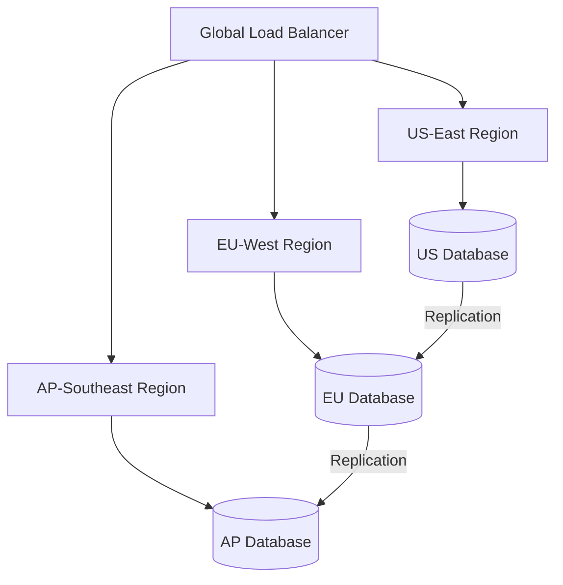

# How to Use Ansible to Set Up Multi-Region Deployments

Author: [nawazdhandala](https://www.github.com/nawazdhandala)

Tags: Ansible, Multi-Region, Infrastructure, DevOps, Cloud

Description: Deploy applications across multiple geographic regions using Ansible with region-specific configurations, data replication, and traffic routing.

---

Deploying applications across multiple regions improves availability, reduces latency for geographically distributed users, and provides natural disaster recovery boundaries. The complexity lies in managing region-specific configurations, ensuring data consistency, and coordinating deployments across regions. Ansible handles this through inventory groups, region-specific variables, and playbook strategies that account for cross-region dependencies.

## Multi-Region Architecture



## Inventory Structure

```ini
# inventory/multi-region.ini - Region-organized inventory
[us_east_web]
us-web-1 ansible_host=10.1.1.10
us-web-2 ansible_host=10.1.1.11

[eu_west_web]
eu-web-1 ansible_host=10.2.1.10
eu-web-2 ansible_host=10.2.1.11

[ap_southeast_web]
ap-web-1 ansible_host=10.3.1.10
ap-web-2 ansible_host=10.3.1.11

[web:children]
us_east_web
eu_west_web
ap_southeast_web
```

## Region-Specific Variables

```yaml
# group_vars/us_east_web.yml - US East configuration
region: us-east-1
region_display_name: "US East"
db_endpoint: db-us.internal.example.com
cdn_origin: us-cdn.example.com
cache_endpoint: redis-us.internal.example.com
api_base_url: https://api-us.example.com

# group_vars/eu_west_web.yml - EU West configuration
region: eu-west-1
region_display_name: "EU West"
db_endpoint: db-eu.internal.example.com
cdn_origin: eu-cdn.example.com
cache_endpoint: redis-eu.internal.example.com
api_base_url: https://api-eu.example.com
```

## Deployment Tasks

```yaml
# roles/multi_region_deploy/tasks/main.yml
---
- name: Deploy application with region-specific config
  template:
    src: app_config.yml.j2
    dest: /opt/app/config/production.yml
    owner: app
    group: app
    mode: '0640'
  notify: restart application

- name: Deploy region-specific environment variables
  template:
    src: env.j2
    dest: /opt/app/.env
    owner: app
    group: app
    mode: '0600'
  notify: restart application

- name: Configure regional health check endpoint
  template:
    src: health_check.conf.j2
    dest: /etc/nginx/conf.d/health.conf
    mode: '0644'
  notify: reload nginx
```

## Regional Configuration Template

```yaml
# roles/multi_region_deploy/templates/app_config.yml.j2
server:
  region: {{ region }}
  region_name: "{{ region_display_name }}"

database:
  host: {{ db_endpoint }}
  pool_size: 20

cache:
  host: {{ cache_endpoint }}
  port: 6379

cdn:
  origin: {{ cdn_origin }}
```

## Rolling Regional Deployment Playbook

```yaml
# deploy-multi-region.yml - Deploy across all regions sequentially
---
# Deploy to US East first (canary region)
- hosts: us_east_web
  become: yes
  serial: 1
  roles:
    - multi_region_deploy
  post_tasks:
    - name: Run smoke tests against US region
      uri:
        url: "https://api-us.example.com/health"
        status_code: 200
      delegate_to: localhost

# Then deploy to EU West
- hosts: eu_west_web
  become: yes
  serial: "50%"
  roles:
    - multi_region_deploy

# Finally deploy to AP Southeast
- hosts: ap_southeast_web
  become: yes
  serial: "50%"
  roles:
    - multi_region_deploy
```

## Running the Deployment

```bash
# Deploy to all regions (US first as canary)
ansible-playbook -i inventory/multi-region.ini deploy-multi-region.yml

# Deploy to a single region only
ansible-playbook -i inventory/multi-region.ini deploy-multi-region.yml --limit eu_west_web
```

## Summary

Multi-region deployments with Ansible use inventory groups and region-specific variables to handle the complexity of deploying the same application with different configurations across geographic regions. The sequential deployment strategy, starting with a canary region, provides safety. If the US deployment shows problems, you can stop before rolling out to other regions. This pattern scales to any number of regions by simply adding inventory groups and their corresponding variable files.

## Common Use Cases

Here are several practical scenarios where this module proves essential in real-world playbooks.

### Infrastructure Provisioning Workflow

```yaml
# Complete workflow incorporating this module
- name: Infrastructure provisioning
  hosts: all
  become: true
  gather_facts: true
  tasks:
    - name: Gather system information
      ansible.builtin.setup:
        gather_subset:
          - hardware
          - network

    - name: Display system summary
      ansible.builtin.debug:
        msg: >-
          Host {{ inventory_hostname }} has
          {{ ansible_memtotal_mb }}MB RAM,
          {{ ansible_processor_vcpus }} vCPUs,
          running {{ ansible_distribution }} {{ ansible_distribution_version }}

    - name: Install required packages
      ansible.builtin.package:
        name:
          - curl
          - wget
          - git
          - vim
          - htop
          - jq
        state: present

    - name: Configure system timezone
      ansible.builtin.timezone:
        name: "{{ system_timezone | default('UTC') }}"

    - name: Configure hostname
      ansible.builtin.hostname:
        name: "{{ inventory_hostname }}"

    - name: Update /etc/hosts
      ansible.builtin.lineinfile:
        path: /etc/hosts
        regexp: '^127\.0\.1\.1'
        line: "127.0.1.1 {{ inventory_hostname }}"

    - name: Configure SSH hardening
      ansible.builtin.lineinfile:
        path: /etc/ssh/sshd_config
        regexp: "{{ item.regexp }}"
        line: "{{ item.line }}"
      loop:
        - { regexp: '^PermitRootLogin', line: 'PermitRootLogin no' }
        - { regexp: '^PasswordAuthentication', line: 'PasswordAuthentication no' }
      notify: restart sshd

    - name: Configure firewall rules
      community.general.ufw:
        rule: allow
        port: "{{ item }}"
        proto: tcp
      loop:
        - "22"
        - "80"
        - "443"

    - name: Enable firewall
      community.general.ufw:
        state: enabled
        policy: deny

  handlers:
    - name: restart sshd
      ansible.builtin.service:
        name: sshd
        state: restarted
```

### Integration with Monitoring

```yaml
# Using gathered facts to configure monitoring thresholds
- name: Configure monitoring based on system specs
  hosts: all
  become: true
  tasks:
    - name: Set monitoring thresholds based on hardware
      ansible.builtin.template:
        src: monitoring_config.yml.j2
        dest: /etc/monitoring/config.yml
      vars:
        memory_warning_threshold: "{{ (ansible_memtotal_mb * 0.8) | int }}"
        memory_critical_threshold: "{{ (ansible_memtotal_mb * 0.95) | int }}"
        cpu_warning_threshold: 80
        cpu_critical_threshold: 95

    - name: Register host with monitoring system
      ansible.builtin.uri:
        url: "https://monitoring.example.com/api/hosts"
        method: POST
        body_format: json
        body:
          hostname: "{{ inventory_hostname }}"
          ip_address: "{{ ansible_default_ipv4.address }}"
          os: "{{ ansible_distribution }}"
          memory_mb: "{{ ansible_memtotal_mb }}"
          cpus: "{{ ansible_processor_vcpus }}"
        headers:
          Authorization: "Bearer {{ monitoring_api_token }}"
        status_code: [200, 201, 409]
```

### Error Handling Patterns

```yaml
# Robust error handling with this module
- name: Robust task execution
  hosts: all
  tasks:
    - name: Attempt primary operation
      ansible.builtin.command: /opt/app/primary-task.sh
      register: primary_result
      failed_when: false

    - name: Handle primary failure with fallback
      ansible.builtin.command: /opt/app/fallback-task.sh
      when: primary_result.rc != 0
      register: fallback_result

    - name: Report final status
      ansible.builtin.debug:
        msg: >-
          Task completed via {{ 'primary' if primary_result.rc == 0 else 'fallback' }} path.
          Return code: {{ primary_result.rc if primary_result.rc == 0 else fallback_result.rc }}

    - name: Fail if both paths failed
      ansible.builtin.fail:
        msg: "Both primary and fallback operations failed"
      when:
        - primary_result.rc != 0
        - fallback_result is defined
        - fallback_result.rc != 0
```

### Scheduling and Automation

```yaml
# Set up scheduled compliance scans using cron
- name: Configure automated scans
  hosts: all
  become: true
  tasks:
    - name: Create scan script
      ansible.builtin.copy:
        dest: /opt/scripts/compliance_scan.sh
        mode: '0755'
        content: |
          #!/bin/bash
          cd /opt/ansible
          ansible-playbook playbooks/validate.yml -i inventory/ > /var/log/compliance_scan.log 2>&1
          EXIT_CODE=$?
          if [ $EXIT_CODE -ne 0 ]; then
            curl -X POST https://hooks.example.com/alert \
              -H "Content-Type: application/json" \
              -d "{\"text\":\"Compliance scan failed on $(hostname)\"}"
          fi
          exit $EXIT_CODE

    - name: Schedule weekly compliance scan
      ansible.builtin.cron:
        name: "Weekly compliance scan"
        minute: "0"
        hour: "3"
        weekday: "1"
        job: "/opt/scripts/compliance_scan.sh"
        user: ansible
```

