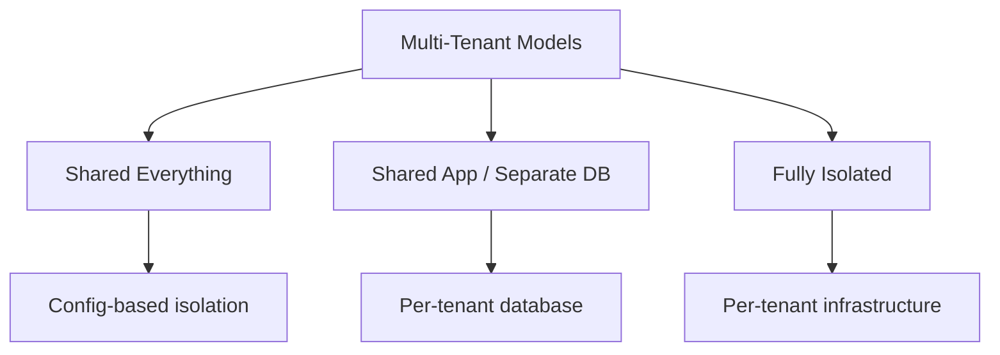

# How to Use Ansible for Multi-Tenant Infrastructure

Author: [nawazdhandala](https://www.github.com/nawazdhandala)

Tags: Ansible, Multi-Tenant, Infrastructure, SaaS

Description: Manage multi-tenant infrastructure with Ansible to provision isolated tenant environments, handle per-tenant configuration, and automate tenant onboarding.

---

Multi-tenant infrastructure requires careful isolation between tenants while keeping management overhead low. Each tenant might need their own database, their own subdomain, their own resource limits, and their own configuration. Ansible can automate all of this, from tenant onboarding to ongoing management.

This post covers patterns for managing multi-tenant infrastructure with Ansible.

## Multi-Tenant Architecture

There are different levels of tenant isolation:



## Tenant Definition

Define each tenant as a variable file:

```yaml
# tenants/acme-corp.yml
# Tenant configuration for ACME Corp
---
tenant_id: acme-corp
tenant_name: "ACME Corporation"
tenant_domain: acme.app.example.com
tenant_tier: enterprise

database:
  name: "tenant_acme_corp"
  max_connections: 50
  storage_limit_gb: 100

resources:
  cpu_limit: "2000m"
  memory_limit: "4Gi"
  storage_limit: "50Gi"

features:
  sso_enabled: true
  api_rate_limit: 10000
  max_users: 500
  custom_branding: true

contact:
  email: admin@acme-corp.com
  support_tier: premium
```

```yaml
# tenants/small-startup.yml
# Tenant configuration for Small Startup
---
tenant_id: small-startup
tenant_name: "Small Startup Inc"
tenant_domain: smallstartup.app.example.com
tenant_tier: basic

database:
  name: "tenant_small_startup"
  max_connections: 10
  storage_limit_gb: 10

resources:
  cpu_limit: "500m"
  memory_limit: "1Gi"
  storage_limit: "10Gi"

features:
  sso_enabled: false
  api_rate_limit: 1000
  max_users: 25
  custom_branding: false
```

## Tenant Onboarding Playbook

```yaml
# playbooks/onboard-tenant.yml
# Onboard a new tenant to the platform
---
- name: Onboard new tenant
  hosts: localhost
  connection: local
  vars_files:
    - "../tenants/{{ tenant_id }}.yml"

  tasks:
    - name: Create tenant database
      community.postgresql.postgresql_db:
        name: "{{ database.name }}"
        login_host: "{{ db_host }}"
        login_user: "{{ db_admin_user }}"
        login_password: "{{ db_admin_password }}"
        state: present

    - name: Create tenant database user
      community.postgresql.postgresql_user:
        name: "{{ tenant_id }}_user"
        password: "{{ lookup('password', '/dev/null length=24 chars=ascii_letters,digits') }}"
        login_host: "{{ db_host }}"
        login_user: "{{ db_admin_user }}"
        login_password: "{{ db_admin_password }}"
        db: "{{ database.name }}"
        priv: "ALL"
      no_log: true
      register: tenant_db_user

    - name: Run tenant schema migrations
      community.postgresql.postgresql_query:
        db: "{{ database.name }}"
        login_host: "{{ db_host }}"
        login_user: "{{ db_admin_user }}"
        login_password: "{{ db_admin_password }}"
        path_to_script: "{{ playbook_dir }}/../sql/tenant_schema.sql"

    - name: Seed default tenant data
      community.postgresql.postgresql_query:
        db: "{{ database.name }}"
        login_host: "{{ db_host }}"
        login_user: "{{ db_admin_user }}"
        login_password: "{{ db_admin_password }}"
        query: |
          INSERT INTO tenant_settings (key, value) VALUES
          ('tenant_name', '{{ tenant_name }}'),
          ('tier', '{{ tenant_tier }}'),
          ('max_users', '{{ features.max_users }}'),
          ('api_rate_limit', '{{ features.api_rate_limit }}');

    - name: Store tenant credentials in vault
      ansible.builtin.command:
        cmd: >
          vault kv put secret/tenants/{{ tenant_id }}
          db_user={{ tenant_id }}_user
          db_password={{ tenant_db_user.queries | default('generated') }}
      no_log: true

    - name: Configure DNS for tenant domain
      amazon.aws.route53:
        zone: "{{ base_domain }}"
        record: "{{ tenant_domain }}"
        type: CNAME
        value: "{{ app_lb_domain }}"
        state: present

    - name: Configure SSL certificate for tenant
      ansible.builtin.command:
        cmd: >
          certbot certonly --dns-route53 --non-interactive
          -d {{ tenant_domain }}
      changed_when: true

- name: Deploy tenant configuration to app servers
  hosts: app_servers
  become: true
  vars_files:
    - "../tenants/{{ tenant_id }}.yml"

  tasks:
    - name: Deploy tenant Nginx configuration
      ansible.builtin.template:
        src: templates/tenant-nginx.conf.j2
        dest: "/etc/nginx/conf.d/tenant-{{ tenant_id }}.conf"
        mode: '0644'
      notify: reload nginx

    - name: Deploy tenant application configuration
      ansible.builtin.template:
        src: templates/tenant-config.yml.j2
        dest: "/opt/app/config/tenants/{{ tenant_id }}.yml"
        mode: '0640'
      notify: reload application

    - name: Notify tenant provisioning complete
      community.general.slack:
        token: "{{ slack_token }}"
        channel: "#tenant-ops"
        msg: "New tenant {{ tenant_name }} ({{ tenant_id }}) onboarded successfully"
      delegate_to: localhost
      run_once: true
```

## Tenant Resource Management

Apply resource limits per tenant tier:

```yaml
# roles/tenant_resources/tasks/main.yml
# Apply resource limits based on tenant tier
---
- name: Load all tenant configurations
  ansible.builtin.include_vars:
    dir: "{{ playbook_dir }}/../tenants/"
    extensions: [yml]
    name: all_tenants

- name: Apply database connection limits per tenant
  community.postgresql.postgresql_query:
    db: postgres
    login_host: "{{ db_host }}"
    login_user: "{{ db_admin_user }}"
    login_password: "{{ db_admin_password }}"
    query: "ALTER ROLE {{ item.value.tenant_id }}_user CONNECTION LIMIT {{ item.value.database.max_connections }};"
  loop: "{{ all_tenants | dict2items }}"
  when: item.value.tenant_id is defined

- name: Deploy Nginx rate limiting per tenant
  ansible.builtin.template:
    src: tenant-rate-limit.conf.j2
    dest: /etc/nginx/conf.d/rate-limits.conf
    mode: '0644'
  notify: reload nginx
```

## Bulk Operations Across Tenants

```yaml
# playbooks/update-all-tenants.yml
# Apply configuration changes to all tenants
---
- name: Update all tenant configurations
  hosts: app_servers
  become: true

  tasks:
    - name: Find all tenant config files
      ansible.builtin.find:
        paths: "{{ playbook_dir }}/../tenants/"
        patterns: "*.yml"
      register: tenant_files
      delegate_to: localhost

    - name: Update each tenant
      ansible.builtin.include_tasks: tasks/update-tenant.yml
      loop: "{{ tenant_files.files }}"
      loop_control:
        loop_var: tenant_file
```

## Key Takeaways

Multi-tenant infrastructure management with Ansible revolves around treating each tenant as a parameterized deployment. Define tenants as variable files, create onboarding playbooks that provision all required resources, and use templates to generate per-tenant configurations. Apply resource limits based on the tenant tier. Build bulk operation playbooks for applying changes across all tenants. This approach scales from a handful of tenants to hundreds while keeping the management overhead low.

## Common Use Cases

Here are several practical scenarios where this module proves essential in real-world playbooks.

### Infrastructure Provisioning Workflow

```yaml
# Complete workflow incorporating this module
- name: Infrastructure provisioning
  hosts: all
  become: true
  gather_facts: true
  tasks:
    - name: Gather system information
      ansible.builtin.setup:
        gather_subset:
          - hardware
          - network

    - name: Display system summary
      ansible.builtin.debug:
        msg: >-
          Host {{ inventory_hostname }} has
          {{ ansible_memtotal_mb }}MB RAM,
          {{ ansible_processor_vcpus }} vCPUs,
          running {{ ansible_distribution }} {{ ansible_distribution_version }}

    - name: Install required packages
      ansible.builtin.package:
        name:
          - curl
          - wget
          - git
          - vim
          - htop
          - jq
        state: present

    - name: Configure system timezone
      ansible.builtin.timezone:
        name: "{{ system_timezone | default('UTC') }}"

    - name: Configure hostname
      ansible.builtin.hostname:
        name: "{{ inventory_hostname }}"

    - name: Update /etc/hosts
      ansible.builtin.lineinfile:
        path: /etc/hosts
        regexp: '^127\.0\.1\.1'
        line: "127.0.1.1 {{ inventory_hostname }}"

    - name: Configure SSH hardening
      ansible.builtin.lineinfile:
        path: /etc/ssh/sshd_config
        regexp: "{{ item.regexp }}"
        line: "{{ item.line }}"
      loop:
        - { regexp: '^PermitRootLogin', line: 'PermitRootLogin no' }
        - { regexp: '^PasswordAuthentication', line: 'PasswordAuthentication no' }
      notify: restart sshd

    - name: Configure firewall rules
      community.general.ufw:
        rule: allow
        port: "{{ item }}"
        proto: tcp
      loop:
        - "22"
        - "80"
        - "443"

    - name: Enable firewall
      community.general.ufw:
        state: enabled
        policy: deny

  handlers:
    - name: restart sshd
      ansible.builtin.service:
        name: sshd
        state: restarted
```

### Integration with Monitoring

```yaml
# Using gathered facts to configure monitoring thresholds
- name: Configure monitoring based on system specs
  hosts: all
  become: true
  tasks:
    - name: Set monitoring thresholds based on hardware
      ansible.builtin.template:
        src: monitoring_config.yml.j2
        dest: /etc/monitoring/config.yml
      vars:
        memory_warning_threshold: "{{ (ansible_memtotal_mb * 0.8) | int }}"
        memory_critical_threshold: "{{ (ansible_memtotal_mb * 0.95) | int }}"
        cpu_warning_threshold: 80
        cpu_critical_threshold: 95

    - name: Register host with monitoring system
      ansible.builtin.uri:
        url: "https://monitoring.example.com/api/hosts"
        method: POST
        body_format: json
        body:
          hostname: "{{ inventory_hostname }}"
          ip_address: "{{ ansible_default_ipv4.address }}"
          os: "{{ ansible_distribution }}"
          memory_mb: "{{ ansible_memtotal_mb }}"
          cpus: "{{ ansible_processor_vcpus }}"
        headers:
          Authorization: "Bearer {{ monitoring_api_token }}"
        status_code: [200, 201, 409]
```

### Error Handling Patterns

```yaml
# Robust error handling with this module
- name: Robust task execution
  hosts: all
  tasks:
    - name: Attempt primary operation
      ansible.builtin.command: /opt/app/primary-task.sh
      register: primary_result
      failed_when: false

    - name: Handle primary failure with fallback
      ansible.builtin.command: /opt/app/fallback-task.sh
      when: primary_result.rc != 0
      register: fallback_result

    - name: Report final status
      ansible.builtin.debug:
        msg: >-
          Task completed via {{ 'primary' if primary_result.rc == 0 else 'fallback' }} path.
          Return code: {{ primary_result.rc if primary_result.rc == 0 else fallback_result.rc }}

    - name: Fail if both paths failed
      ansible.builtin.fail:
        msg: "Both primary and fallback operations failed"
      when:
        - primary_result.rc != 0
        - fallback_result is defined
        - fallback_result.rc != 0
```

### Scheduling and Automation

```yaml
# Set up scheduled compliance scans using cron
- name: Configure automated scans
  hosts: all
  become: true
  tasks:
    - name: Create scan script
      ansible.builtin.copy:
        dest: /opt/scripts/compliance_scan.sh
        mode: '0755'
        content: |
          #!/bin/bash
          cd /opt/ansible
          ansible-playbook playbooks/validate.yml -i inventory/ > /var/log/compliance_scan.log 2>&1
          EXIT_CODE=$?
          if [ $EXIT_CODE -ne 0 ]; then
            curl -X POST https://hooks.example.com/alert \
              -H "Content-Type: application/json" \
              -d "{\"text\":\"Compliance scan failed on $(hostname)\"}"
          fi
          exit $EXIT_CODE

    - name: Schedule weekly compliance scan
      ansible.builtin.cron:
        name: "Weekly compliance scan"
        minute: "0"
        hour: "3"
        weekday: "1"
        job: "/opt/scripts/compliance_scan.sh"
        user: ansible
```

