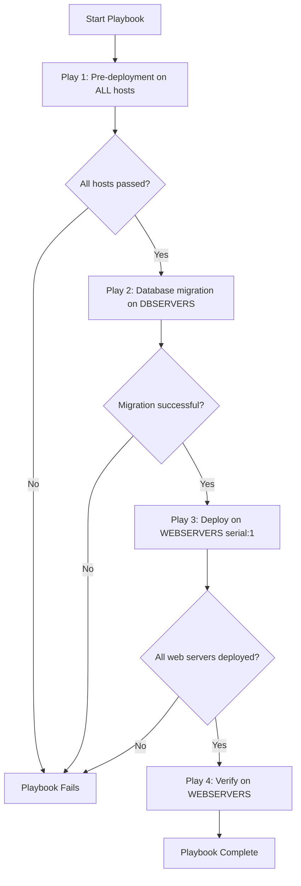

# How to Use Multiple Plays in a Single Ansible Playbook

Author: [nawazdhandala](https://www.github.com/nawazdhandala)

Tags: Ansible, Playbook, Plays, Automation

Description: Learn how to structure multiple plays in one Ansible playbook to orchestrate tasks across different host groups and configurations.

---

A single Ansible playbook can contain multiple plays, and this is one of the most useful patterns for orchestrating deployments that span different types of servers. Each play targets a different group of hosts and runs its own set of tasks. Think of it as writing multiple mini-playbooks in one file, executed in sequence.

## Why Use Multiple Plays?

Most real-world infrastructure involves multiple tiers. A typical web application has load balancers, web servers, application servers, and database servers. Each tier needs different configuration, but the deployment needs to happen in a coordinated sequence. Multiple plays in one playbook solve this problem cleanly.

## Basic Multi-Play Structure

Here is a simple example with two plays.

```yaml
# multi-tier.yml - configures both web servers and database servers
---
- name: Configure database servers
  hosts: dbservers
  become: yes

  tasks:
    - name: Install PostgreSQL
      apt:
        name: postgresql
        state: present

    - name: Start PostgreSQL service
      service:
        name: postgresql
        state: started
        enabled: yes

- name: Configure web servers
  hosts: webservers
  become: yes

  tasks:
    - name: Install nginx
      apt:
        name: nginx
        state: present

    - name: Deploy application
      synchronize:
        src: /opt/releases/current/
        dest: /var/www/app/

    - name: Start nginx
      service:
        name: nginx
        state: started
        enabled: yes
```

Each play starts with a new `- name:` at the root level. The plays run in order, top to bottom. The database servers get configured first, then the web servers.

## A Complete Deployment Playbook

Let us build a more realistic example that deploys a three-tier application.

```yaml
# full-deploy.yml - orchestrates a complete three-tier deployment
---
# Play 1: Pre-deployment checks on all hosts
- name: Pre-deployment validation
  hosts: all
  gather_facts: yes

  tasks:
    - name: Check disk space
      assert:
        that:
          - ansible_mounts | selectattr('mount', 'equalto', '/') | map(attribute='size_available') | first > 1073741824
        fail_msg: "Less than 1GB free on root filesystem"

    - name: Check connectivity to package repository
      uri:
        url: https://packages.example.com/health
        timeout: 5
      register: repo_check
      failed_when: repo_check.status != 200

# Play 2: Update database schema
- name: Run database migrations
  hosts: dbservers
  become: yes

  vars:
    db_name: myapp_production

  tasks:
    - name: Create database backup
      command: pg_dump {{ db_name }} -f /var/backups/pre-deploy-{{ ansible_date_time.iso8601_basic }}.sql
      become_user: postgres

    - name: Run schema migrations
      command: /opt/myapp/migrate.sh --database {{ db_name }}
      register: migration_result

    - name: Show migration result
      debug:
        msg: "{{ migration_result.stdout }}"

# Play 3: Deploy application to web servers
- name: Deploy application code
  hosts: webservers
  become: yes
  serial: 1

  tasks:
    - name: Pull latest application code
      git:
        repo: https://github.com/example/myapp.git
        dest: /var/www/myapp
        version: "v2.4.1"

    - name: Install application dependencies
      pip:
        requirements: /var/www/myapp/requirements.txt
        virtualenv: /var/www/myapp/venv

    - name: Restart application service
      service:
        name: myapp
        state: restarted

    - name: Wait for application to become healthy
      uri:
        url: "http://localhost:8080/health"
        status_code: 200
      register: health
      retries: 10
      delay: 3
      until: health.status == 200

# Play 4: Post-deployment verification
- name: Verify deployment
  hosts: webservers

  tasks:
    - name: Check application version
      uri:
        url: "http://{{ inventory_hostname }}:8080/version"
        return_content: yes
      register: version_check

    - name: Confirm correct version deployed
      assert:
        that:
          - "'2.4.1' in version_check.content"
        fail_msg: "Wrong version detected: {{ version_check.content }}"
```

## Play Execution Order

Plays execute sequentially. Each play must complete on all its target hosts before the next play begins.



## Different Settings Per Play

Each play is independent and can have its own settings for `become`, `gather_facts`, `vars`, `serial`, and more.

```yaml
# different-settings.yml - each play has its own configuration
---
# This play does not need sudo
- name: Gather information only
  hosts: all
  become: no
  gather_facts: yes

  tasks:
    - name: Record host information
      debug:
        msg: "{{ inventory_hostname }}: {{ ansible_distribution }} {{ ansible_distribution_version }}"

# This play needs sudo and runs one host at a time
- name: Apply security updates
  hosts: all
  become: yes
  serial: 1
  gather_facts: no

  tasks:
    - name: Upgrade all packages
      apt:
        upgrade: safe
        update_cache: yes

# This play uses different credentials
- name: Configure network switches
  hosts: switches
  gather_facts: no
  connection: network_cli
  become: yes
  become_method: enable

  vars:
    ansible_network_os: ios

  tasks:
    - name: Update switch configuration
      ios_config:
        lines:
          - ip name-server 8.8.8.8
          - ip name-server 8.8.4.4
```

## Sharing Data Between Plays

Variables set in one play are not automatically available in another play. To share data between plays, use `set_fact` with `delegate_to` or `hostvars`.

```yaml
# share-data.yml - passing data between plays
---
- name: Get database connection info
  hosts: dbservers
  become: yes

  tasks:
    - name: Get database port
      command: grep "^port" /etc/postgresql/14/main/postgresql.conf
      register: db_port_raw

    - name: Store database port as a fact
      set_fact:
        db_port: "{{ db_port_raw.stdout.split('=')[1] | trim }}"

- name: Configure application with database info
  hosts: webservers
  become: yes

  tasks:
    # Access the fact from the first play via hostvars
    - name: Write database connection config
      template:
        src: templates/db-connection.conf.j2
        dest: /etc/myapp/db-connection.conf
      vars:
        database_host: "{{ hostvars[groups['dbservers'][0]]['ansible_default_ipv4']['address'] }}"
        database_port: "{{ hostvars[groups['dbservers'][0]]['db_port'] }}"
```

The key here is `hostvars`. It gives you access to all facts and variables set on any host, even from a different play. We reference the first host in the `dbservers` group and pull its `db_port` fact.

## Common Multi-Play Patterns

### Rolling Deployment Pattern

```yaml
# rolling-deploy.yml - deploy in waves
---
- name: Deploy to canary servers first
  hosts: webservers[0]
  become: yes

  tasks:
    - name: Deploy to canary
      include_role:
        name: deploy-app

- name: Validate canary deployment
  hosts: webservers[0]

  tasks:
    - name: Run smoke tests
      uri:
        url: "http://{{ inventory_hostname }}/health"
        status_code: 200

- name: Deploy to remaining servers
  hosts: webservers[1:]
  become: yes
  serial: 2

  tasks:
    - name: Deploy to rest of fleet
      include_role:
        name: deploy-app
```

### Separation of Concerns Pattern

```yaml
# separation.yml - each play handles one concern
---
- name: Configure DNS
  hosts: dns_servers
  become: yes
  roles:
    - dns-server

- name: Configure load balancers
  hosts: load_balancers
  become: yes
  roles:
    - haproxy

- name: Configure web tier
  hosts: webservers
  become: yes
  roles:
    - nginx
    - application

- name: Configure data tier
  hosts: dbservers
  become: yes
  roles:
    - postgresql
    - backup-agent
```

## Tips for Multi-Play Playbooks

**Name every play clearly**. When you have five plays in a file, descriptive names make the output readable.

**Keep plays focused**. Each play should handle one logical unit of work. If a play is doing too many unrelated things, split it.

**Order matters**. Put dependency plays first. Database setup should come before application deployment.

**Use `any_errors_fatal: true`** on critical early plays. If pre-deployment checks fail, you want the entire playbook to stop, not continue to later plays.

Multiple plays in a single playbook is the standard way to handle multi-tier deployments in Ansible. It keeps your orchestration logic in one file, makes the execution order explicit, and lets you apply different settings to different host groups.
