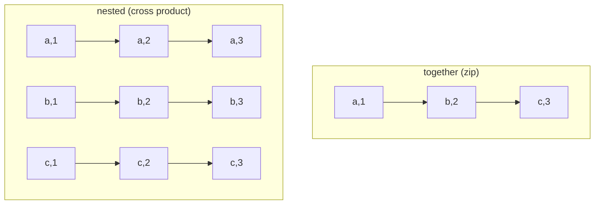

# How to Use the Ansible nested Lookup Plugin

Author: [nawazdhandala](https://www.github.com/nawazdhandala)

Tags: Ansible, Lookup Plugins, Loops, Cross Product

Description: Learn how to use the Ansible nested lookup plugin to generate cross-product iterations from multiple lists in your playbooks.

---

There are times when you need to iterate over every possible combination of items from two or more lists. For example, creating a user account on every database, or granting access to every environment for every team member. The `nested` lookup plugin produces the Cartesian product (cross product) of multiple lists, giving you every possible combination as a loop iteration.

## What the nested Lookup Does

The `nested` lookup takes two or more lists and produces all possible combinations. If you have a list of 3 users and a list of 4 databases, `nested` produces 12 iterations covering every user-database pair. This is different from `together`, which pairs items by position.

## Basic Usage

The simplest form combines two lists.

This playbook creates directories for every combination of environment and service:

```yaml
# playbook.yml - Create cross-product of directories
---
- name: Create environment-service directory structure
  hosts: localhost
  vars:
    environments:
      - development
      - staging
      - production
    services:
      - web
      - api
      - worker
  tasks:
    - name: Create directory for each environment-service pair
      ansible.builtin.file:
        path: "/opt/deployments/{{ item.0 }}/{{ item.1 }}"
        state: directory
        mode: '0755'
      loop: "{{ lookup('nested', environments, services, wantlist=True) }}"
```

This creates 9 directories (3 environments x 3 services):

```
/opt/deployments/development/web
/opt/deployments/development/api
/opt/deployments/development/worker
/opt/deployments/staging/web
/opt/deployments/staging/api
/opt/deployments/staging/worker
/opt/deployments/production/web
/opt/deployments/production/api
/opt/deployments/production/worker
```

## Visualizing the Cross Product

Here is how nested iteration works compared to together:



## Practical Example: Database User Permissions

One of the most common use cases is granting database permissions across multiple databases.

```yaml
# playbook.yml - Grant database permissions for all user-database combinations
---
- name: Configure database access matrix
  hosts: dbservers
  vars:
    db_users:
      - app_reader
      - app_writer
      - analytics_user
    databases:
      - production
      - staging
      - analytics
  tasks:
    - name: Create database users
      community.mysql.mysql_user:
        name: "{{ item }}"
        password: "{{ lookup('password', 'credentials/' + item + '.txt') }}"
        state: present
      loop: "{{ db_users }}"

    - name: Grant SELECT on all databases to all users
      community.mysql.mysql_user:
        name: "{{ item.0 }}"
        priv: "{{ item.1 }}.*:SELECT"
        append_privs: true
        state: present
      loop: "{{ lookup('nested', db_users, databases, wantlist=True) }}"
```

## Monitoring Configuration Matrix

When setting up monitoring, you often need to create checks for every service on every host.

```yaml
# playbook.yml - Create monitoring checks for all host-service combinations
---
- name: Configure monitoring matrix
  hosts: monitoring_server
  vars:
    monitored_hosts:
      - web01.example.com
      - web02.example.com
      - api01.example.com
    health_checks:
      - name: http
        port: 80
        path: /health
      - name: https
        port: 443
        path: /health
      - name: ssh
        port: 22
        path: null
  tasks:
    - name: Create monitoring check for each host-check combination
      ansible.builtin.template:
        src: monitoring_check.j2
        dest: "/etc/monitoring/checks/{{ item.0 | regex_replace('\\.', '_') }}_{{ item.1.name }}.conf"
        mode: '0644'
      loop: "{{ lookup('nested', monitored_hosts, health_checks, wantlist=True) }}"
      vars:
        target_host: "{{ item.0 }}"
        check_config: "{{ item.1 }}"
```

The template:

```
# templates/monitoring_check.j2
[check]
host = {{ target_host }}
type = {{ check_config.name }}
port = {{ check_config.port }}

path = {{ check_config.path }}

interval = 60
timeout = 10
```

## Multi-Region Deployment

Deploying resources across multiple regions and availability zones:

```yaml
# playbook.yml - Multi-region resource deployment
---
- name: Deploy resources across regions and AZs
  hosts: localhost
  vars:
    regions:
      - us-east-1
      - us-west-2
      - eu-west-1
    availability_zones:
      - a
      - b
      - c
  tasks:
    - name: Show all deployment targets
      ansible.builtin.debug:
        msg: "Deploy to {{ item.0 }}{{ item.1 }}"
      loop: "{{ lookup('nested', regions, availability_zones, wantlist=True) }}"

    - name: Create subnet configuration for each region-AZ pair
      ansible.builtin.copy:
        content: |
          region: {{ item.0 }}
          az: {{ item.0 }}{{ item.1 }}
          cidr: "10.{{ loop_index }}.0.0/24"
        dest: "/etc/terraform/subnets/{{ item.0 }}-{{ item.1 }}.yml"
        mode: '0644'
      loop: "{{ lookup('nested', regions, availability_zones, wantlist=True) }}"
      loop_control:
        index_var: loop_index
```

## Three-Way Cross Product

You can nest three or more lists for more complex combinations.

```yaml
# playbook.yml - Three-way cross product for test matrix
---
- name: Generate test configurations
  hosts: localhost
  vars:
    python_versions:
      - "3.9"
      - "3.10"
      - "3.11"
    operating_systems:
      - ubuntu
      - debian
      - rocky
    test_suites:
      - unit
      - integration
  tasks:
    - name: Generate CI matrix entries
      ansible.builtin.debug:
        msg: "Test: Python {{ item.0 }} on {{ item.1 }} running {{ item.2 }} tests"
      loop: "{{ lookup('nested', python_versions, operating_systems, test_suites, wantlist=True) }}"

    - name: Count total combinations
      ansible.builtin.debug:
        msg: "Total test combinations: {{ python_versions | length * operating_systems | length * test_suites | length }}"
```

This generates 18 combinations (3 x 3 x 2).

## Generating Firewall Rules

Firewall rules often need to cover all source-destination combinations.

```yaml
# playbook.yml - Generate firewall rules from source/destination lists
---
- name: Configure firewall access matrix
  hosts: firewalls
  vars:
    source_networks:
      - "10.0.1.0/24"   # Web tier
      - "10.0.2.0/24"   # App tier
    destination_ports:
      - 5432   # PostgreSQL
      - 6379   # Redis
      - 9200   # Elasticsearch
  tasks:
    - name: Allow source networks to reach all backend ports
      ansible.builtin.iptables:
        chain: FORWARD
        source: "{{ item.0 }}"
        protocol: tcp
        destination_port: "{{ item.1 }}"
        jump: ACCEPT
        comment: "Allow {{ item.0 }} to port {{ item.1 }}"
      loop: "{{ lookup('nested', source_networks, destination_ports, wantlist=True) }}"
```

## Selective Cross Products with Conditionals

You do not always want every combination. Use `when` to filter.

```yaml
# playbook.yml - Selective cross product with filtering
---
- name: Create selective access rules
  hosts: localhost
  vars:
    teams:
      - name: frontend
        level: standard
      - name: backend
        level: standard
      - name: devops
        level: admin
    environments:
      - name: development
        restricted: false
      - name: staging
        restricted: false
      - name: production
        restricted: true
  tasks:
    # Only admins get production access
    - name: Grant environment access based on team level
      ansible.builtin.debug:
        msg: "Granting {{ item.0.name }} access to {{ item.1.name }}"
      loop: "{{ lookup('nested', teams, environments, wantlist=True) }}"
      when: not item.1.restricted or item.0.level == 'admin'
```

## nested vs product Filter

Modern Ansible provides a `product` filter that does the same thing:

```yaml
# playbook.yml - nested lookup vs product filter
---
- name: Compare nested and product
  hosts: localhost
  vars:
    list_a: [1, 2, 3]
    list_b: [x, y]
  tasks:
    # Using nested lookup
    - name: With nested
      ansible.builtin.debug:
        msg: "{{ item.0 }}-{{ item.1 }}"
      loop: "{{ lookup('nested', list_a, list_b, wantlist=True) }}"

    # Using product filter (modern approach)
    - name: With product filter
      ansible.builtin.debug:
        msg: "{{ item.0 }}-{{ item.1 }}"
      loop: "{{ list_a | product(list_b) | list }}"
```

The `product` filter is generally preferred in modern playbooks because it chains nicely with other filters and is more Pythonic.

## Performance Considerations

The cross product grows multiplicatively. Be careful with large lists.

```yaml
# This creates 1,000,000 iterations - probably not what you want
# 100 x 100 x 100 = 1,000,000
# loop: "{{ lookup('nested', large_list_a, large_list_b, large_list_c, wantlist=True) }}"
```

If you have large lists and only need specific combinations, filter first:

```yaml
# Better: filter before creating the cross product
- name: Create limited combinations
  ansible.builtin.debug:
    msg: "{{ item.0 }}-{{ item.1 }}"
  loop: "{{ lookup('nested', list_a[:10], list_b[:10], wantlist=True) }}"
```

## Tips

1. **Iteration order**: The outer list (first argument) changes slowest, the inner list (last argument) changes fastest. For `nested(A, B)` where A=[1,2] and B=[x,y], the order is: (1,x), (1,y), (2,x), (2,y).

2. **Use wantlist=True**: Always include this when using with `loop` to ensure proper list handling.

3. **Consider the explosion**: Before nesting three or more lists, calculate the total number of iterations (multiply the lengths). Make sure it is reasonable.

4. **Readability**: For anything beyond two lists, add a comment explaining what each item index refers to, since `item.0`, `item.1`, `item.2` gets confusing quickly.

5. **Alternative**: If the combinations are complex and conditionally filtered, it might be cleaner to build the list explicitly in a `set_fact` task with Jinja2 rather than using `nested` with many `when` conditions.

The `nested` lookup is the tool for "for each X, for each Y" patterns. It is simple, predictable, and handles the Cartesian product that would otherwise require nested Jinja2 loops or multiple tasks.
