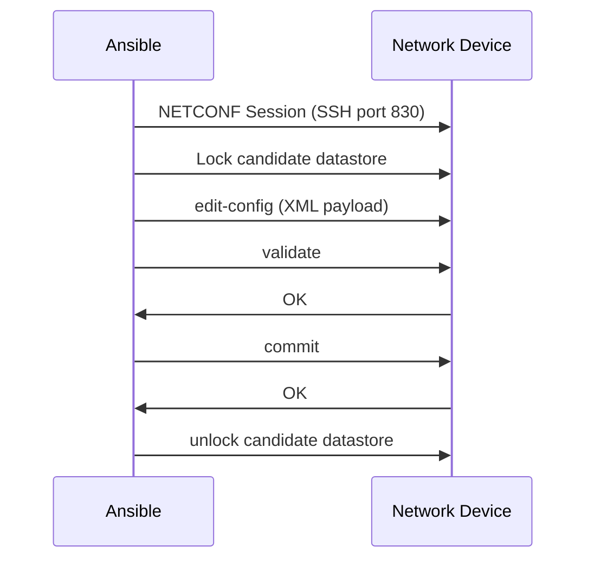

# How to Use Ansible netconf_config Module

Author: [nawazdhandala](https://www.github.com/nawazdhandala)

Tags: Ansible, NETCONF, YANG, Network Automation

Description: Learn how to use the Ansible netconf_config module to push XML-based configuration changes to network devices with transactional safety and validation.

---

The `netconf_config` module is Ansible's direct interface to the NETCONF protocol. While platform-specific modules like `ios_config` or `junos_config` abstract away the protocol details, `netconf_config` lets you work directly with XML payloads and YANG data models. This gives you maximum control over what gets sent to the device and how the configuration transaction is handled.

This is the module you reach for when you need features that platform modules do not expose: candidate datastore operations, configuration locking, validation before commit, and granular edit operations.

## NETCONF Fundamentals

NETCONF (RFC 6241) uses SSH as its transport and XML for data encoding. It provides several key capabilities:

- **Configuration datastores** - Separate running and candidate configurations
- **Atomic transactions** - Changes are all-or-nothing
- **Locking** - Prevent concurrent modifications
- **Validation** - Check config validity before applying
- **Rollback** - Revert to previous configuration on failure



## Setting Up NETCONF Connections

Configure your inventory to use the NETCONF connection plugin.

```yaml
# inventory/netconf_devices.yml - Devices with NETCONF enabled
---
all:
  children:
    netconf_devices:
      children:
        junos_routers:
          hosts:
            junos-rtr01:
              ansible_host: 10.1.1.1
          vars:
            ansible_network_os: junipernetworks.junos.junos
        iosxe_routers:
          hosts:
            iosxe-rtr01:
              ansible_host: 10.1.1.2
          vars:
            ansible_network_os: cisco.ios.ios
      vars:
        ansible_connection: ansible.netcommon.netconf
        ansible_port: 830
        ansible_user: admin
        ansible_password: "{{ vault_password }}"
```

Install the required Python library on your control node.

```bash
# ncclient is the Python NETCONF client library used by Ansible
pip install ncclient
ansible-galaxy collection install ansible.netcommon
```

## Basic Configuration Push

The simplest use of `netconf_config` is pushing an XML configuration snippet.

```yaml
# basic_netconf_config.yml - Push a basic configuration via NETCONF
---
- name: Configure device via NETCONF
  hosts: junos_routers
  gather_facts: false

  tasks:
    - name: Configure interface description via NETCONF
      ansible.netcommon.netconf_config:
        content: |
          <config>
            <configuration xmlns="http://xml.juniper.net/xnm/1.1/xnm">
              <interfaces>
                <interface>
                  <name>ge-0/0/0</name>
                  <description>WAN Uplink - Configured by Ansible</description>
                </interface>
              </interfaces>
            </configuration>
          </config>
      register: result

    - name: Show result
      ansible.builtin.debug:
        var: result
```

For Cisco IOS-XE devices, the XML format follows YANG models.

```yaml
# iosxe_netconf_config.yml - Push config to IOS-XE via NETCONF
---
- name: Configure IOS-XE via NETCONF
  hosts: iosxe_routers
  gather_facts: false

  tasks:
    - name: Configure interface via NETCONF
      ansible.netcommon.netconf_config:
        content: |
          <config xmlns:xc="urn:ietf:params:xml:ns:netconf:base:1.0">
            <native xmlns="http://cisco.com/ns/yang/Cisco-IOS-XE-native">
              <interface>
                <GigabitEthernet>
                  <name>1</name>
                  <description>Configured via NETCONF</description>
                  <ip>
                    <address>
                      <primary>
                        <address>10.1.1.1</address>
                        <mask>255.255.255.0</mask>
                      </primary>
                    </address>
                  </ip>
                </GigabitEthernet>
              </interface>
            </native>
          </config>
```

## Working with the Candidate Datastore

NETCONF's candidate datastore lets you stage changes before committing them. This is essential for transactional safety.

```yaml
# candidate_config.yml - Use candidate datastore for transactional changes
---
- name: Configure with candidate datastore
  hosts: junos_routers
  gather_facts: false

  tasks:
    # Lock the candidate to prevent other sessions from modifying it
    - name: Lock candidate datastore
      ansible.netcommon.netconf_config:
        lock: always
        target: candidate
        content: |
          <config>
            <configuration xmlns="http://xml.juniper.net/xnm/1.1/xnm">
              <interfaces>
                <interface>
                  <name>ge-0/0/0</name>
                  <unit>
                    <name>0</name>
                    <family>
                      <inet>
                        <address>
                          <name>10.1.1.1/24</name>
                        </address>
                      </inet>
                    </family>
                  </unit>
                </interface>
                <interface>
                  <name>ge-0/0/1</name>
                  <unit>
                    <name>0</name>
                    <family>
                      <inet>
                        <address>
                          <name>10.1.2.1/24</name>
                        </address>
                      </inet>
                    </family>
                  </unit>
                </interface>
              </interfaces>
            </configuration>
          </config>
        # Validate the candidate config before committing
        validate: true
        # Commit with a comment
        commit: true
```

## Using Default and Delete Operations

NETCONF supports several edit operations that control how the XML payload is applied to the configuration.

```yaml
# edit_operations.yml - Demonstrate NETCONF edit operations
---
- name: NETCONF edit operations
  hosts: junos_routers
  gather_facts: false

  tasks:
    # Merge operation (default) - adds or updates config
    - name: Merge new configuration
      ansible.netcommon.netconf_config:
        content: |
          <config>
            <configuration xmlns="http://xml.juniper.net/xnm/1.1/xnm">
              <system>
                <host-name>junos-rtr01</host-name>
                <domain-name>lab.example.com</domain-name>
              </system>
            </configuration>
          </config>
        default_operation: merge

    # Replace operation - replaces the specified subtree entirely
    - name: Replace NTP configuration
      ansible.netcommon.netconf_config:
        content: |
          <config>
            <configuration xmlns="http://xml.juniper.net/xnm/1.1/xnm">
              <system>
                <ntp xmlns:xc="urn:ietf:params:xml:ns:netconf:base:1.0" xc:operation="replace">
                  <server>
                    <name>10.10.1.10</name>
                    <prefer/>
                  </server>
                  <server>
                    <name>10.10.1.11</name>
                  </server>
                </ntp>
              </system>
            </configuration>
          </config>
        default_operation: none

    # Delete operation - removes specific configuration
    - name: Delete a static route
      ansible.netcommon.netconf_config:
        content: |
          <config>
            <configuration xmlns="http://xml.juniper.net/xnm/1.1/xnm">
              <routing-options>
                <static>
                  <route xmlns:xc="urn:ietf:params:xml:ns:netconf:base:1.0" xc:operation="delete">
                    <name>192.168.99.0/24</name>
                  </route>
                </static>
              </routing-options>
            </configuration>
          </config>
        default_operation: none
```

## Confirmed Commit with Rollback Timer

NETCONF supports confirmed commits with an automatic rollback timer. If you do not confirm the commit within the timeout, the device automatically rolls back. This is a safety net for remote changes.

```yaml
# confirmed_commit.yml - Use confirmed commit for safe remote changes
---
- name: Safe configuration change with confirmed commit
  hosts: junos_routers
  gather_facts: false

  tasks:
    # Make the change with a rollback timer
    - name: Apply config with confirmed commit (5-minute timer)
      ansible.netcommon.netconf_config:
        content: |
          <config>
            <configuration xmlns="http://xml.juniper.net/xnm/1.1/xnm">
              <interfaces>
                <interface>
                  <name>ge-0/0/0</name>
                  <unit>
                    <name>0</name>
                    <family>
                      <inet>
                        <address>
                          <name>10.99.99.1/24</name>
                        </address>
                      </inet>
                    </family>
                  </unit>
                </interface>
              </interfaces>
            </configuration>
          </config>
        confirm: 300
        target: candidate
        commit: true

    # Verify the change is working
    - name: Verify connectivity after change
      ansible.netcommon.netconf_get:
        filter: |
          <configuration>
            <interfaces>
              <interface>
                <name>ge-0/0/0</name>
              </interface>
            </interfaces>
          </configuration>
      register: verify

    # If verification passes, confirm the commit
    - name: Confirm the commit (make it permanent)
      ansible.netcommon.netconf_rpc:
        rpc: commit
        content: |
          <confirmed/>
```

## Using Templates for XML Content

Hard-coding XML in playbooks gets unwieldy. Use Jinja2 templates to generate the XML dynamically.

```yaml
# template_netconf.yml - Use Jinja2 templates to generate NETCONF XML
---
- name: Configure via NETCONF with templates
  hosts: junos_routers
  gather_facts: false

  vars:
    interfaces:
      - name: ge-0/0/0
        description: "WAN Uplink"
        ip: "10.1.1.1/30"
        unit: 0
      - name: ge-0/0/1
        description: "LAN Segment"
        ip: "10.1.2.1/24"
        unit: 0

  tasks:
    - name: Push interface config from template
      ansible.netcommon.netconf_config:
        content: "{{ lookup('template', 'templates/junos_interfaces.xml.j2') }}"
        target: candidate
        validate: true
        commit: true
```

The Jinja2 template generates the XML dynamically.

```xml
{# templates/junos_interfaces.xml.j2 - Generate NETCONF XML from variables #}
<config>
  <configuration xmlns="http://xml.juniper.net/xnm/1.1/xnm">
    <interfaces>

      <interface>
        <name>{{ intf.name }}</name>
        <description>{{ intf.description }}</description>
        <unit>
          <name>{{ intf.unit }}</name>
          <family>
            <inet>
              <address>
                <name>{{ intf.ip }}</name>
              </address>
            </inet>
          </family>
        </unit>
      </interface>

    </interfaces>
  </configuration>
</config>
```

## Error Handling

NETCONF provides structured error responses. Handle them properly in your playbooks.

```yaml
# error_handling.yml - Handle NETCONF errors gracefully
---
- name: NETCONF with error handling
  hosts: netconf_devices
  gather_facts: false

  tasks:
    - name: Attempt configuration change
      ansible.netcommon.netconf_config:
        content: |
          <config>
            <configuration xmlns="http://xml.juniper.net/xnm/1.1/xnm">
              <interfaces>
                <interface>
                  <name>ge-0/0/0</name>
                  <description>Test Change</description>
                </interface>
              </interfaces>
            </configuration>
          </config>
        target: candidate
        validate: true
        commit: true
        lock: always
      register: config_result
      ignore_errors: true

    - name: Handle successful change
      ansible.builtin.debug:
        msg: "Configuration applied successfully"
      when: config_result is succeeded

    - name: Handle failed change
      block:
        - name: Log the error
          ansible.builtin.debug:
            msg: "Configuration failed: {{ config_result.msg | default('Unknown error') }}"

        # Discard any pending candidate changes
        - name: Discard candidate changes
          ansible.netcommon.netconf_rpc:
            rpc: discard-changes
          ignore_errors: true
      when: config_result is failed
```

The `netconf_config` module is the right tool when you need the full power of NETCONF, the transactional safety of candidate datastores, confirmed commits, and precise edit operations. It requires more XML knowledge than platform-specific modules, but it gives you capabilities that those modules simply do not offer. For critical infrastructure changes where you cannot afford partial application, NETCONF and this module are the way to go.
