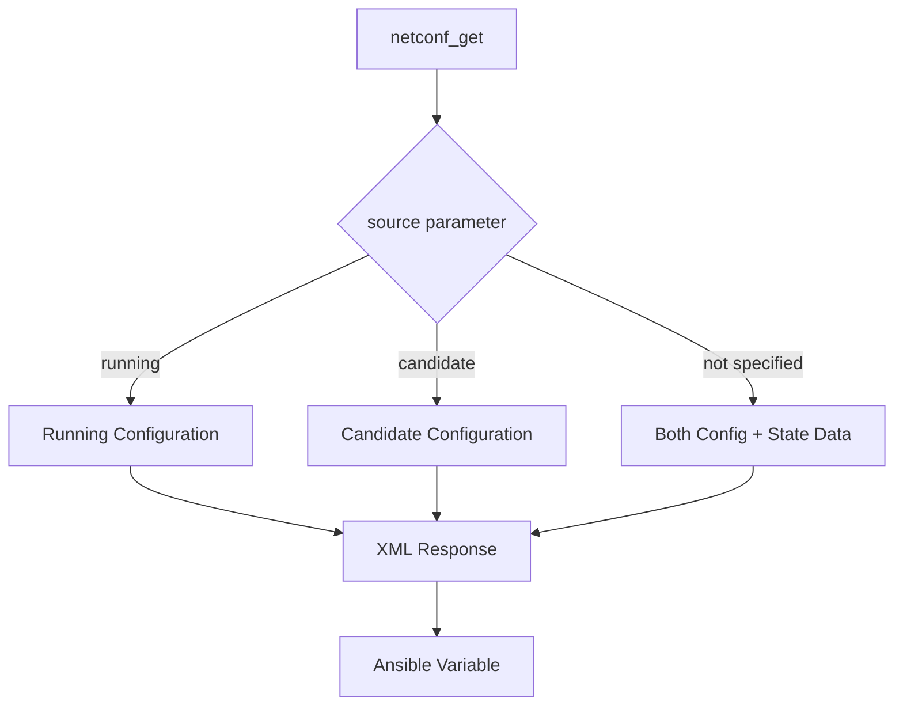

# How to Use Ansible netconf_get Module

Author: [nawazdhandala](https://www.github.com/nawazdhandala)

Tags: Ansible, NETCONF, YANG, Network Monitoring

Description: Master the Ansible netconf_get module to retrieve configuration and operational state data from network devices using NETCONF and YANG models.

---

The `netconf_get` module is the read side of Ansible's NETCONF support. While `netconf_config` pushes configuration, `netconf_get` pulls data out of network devices. It supports both configuration data retrieval and operational state queries, giving you access to the same structured data that the device uses internally.

This module is particularly useful for building inventory systems, compliance checking, monitoring operational state, and generating reports from live device data. The data comes back as structured XML (or converted to JSON), which means no text parsing required.

## What netconf_get Can Retrieve

NETCONF defines two types of data:

- **Configuration data** - What you have configured on the device (interfaces, routing, ACLs, etc.)
- **Operational state data** - Runtime state information (interface counters, routing table entries, CPU usage, etc.)

The `netconf_get` module supports both through its `source` parameter.



## Basic Usage

Start with a simple query to retrieve the full running configuration.

```yaml
# basic_netconf_get.yml - Retrieve running configuration via NETCONF
---
- name: Get device configuration
  hosts: netconf_devices
  gather_facts: false
  connection: ansible.netcommon.netconf

  tasks:
    # Get the entire running configuration
    - name: Retrieve full running config
      ansible.netcommon.netconf_get:
        source: running
      register: full_config

    - name: Display config
      ansible.builtin.debug:
        var: full_config.output
```

## Filtering with Subtree Filters

Retrieving the full configuration is rarely what you want. Subtree filters let you request only the sections you need.

```yaml
# filtered_get.yml - Retrieve specific configuration sections
---
- name: Get filtered configuration
  hosts: junos_routers
  gather_facts: false
  connection: ansible.netcommon.netconf

  tasks:
    # Get only interface configuration
    - name: Get interface configuration
      ansible.netcommon.netconf_get:
        source: running
        filter: |
          <configuration>
            <interfaces/>
          </configuration>
      register: interfaces

    - name: Display interface data
      ansible.builtin.debug:
        var: interfaces.output

    # Get only OSPF configuration
    - name: Get OSPF configuration
      ansible.netcommon.netconf_get:
        source: running
        filter: |
          <configuration>
            <protocols>
              <ospf/>
            </protocols>
          </configuration>
      register: ospf_config

    - name: Display OSPF config
      ansible.builtin.debug:
        var: ospf_config.output

    # Get specific interface by name
    - name: Get single interface config
      ansible.netcommon.netconf_get:
        source: running
        filter: |
          <configuration>
            <interfaces>
              <interface>
                <name>ge-0/0/0</name>
              </interface>
            </interfaces>
          </configuration>
      register: single_interface

    - name: Display single interface
      ansible.builtin.debug:
        var: single_interface.output
```

## Retrieving Operational State Data

To get runtime state (not just configuration), omit the `source` parameter or use the default `get` RPC.

```yaml
# get_operational_state.yml - Retrieve runtime operational data
---
- name: Get operational state data
  hosts: junos_routers
  gather_facts: false
  connection: ansible.netcommon.netconf

  tasks:
    # Get interface operational state (counters, status, etc.)
    - name: Get interface operational state
      ansible.netcommon.netconf_get:
        filter: |
          <interface-information xmlns="http://xml.juniper.net/junos/*/junos-interface">
            <physical-interface>
              <name>ge-0/0/0</name>
            </physical-interface>
          </interface-information>
      register: intf_state

    - name: Display interface state
      ansible.builtin.debug:
        var: intf_state.output

    # Get routing table entries
    - name: Get routing table
      ansible.netcommon.netconf_get:
        filter: |
          <route-information xmlns="http://xml.juniper.net/junos/*/junos-routing">
          </route-information>
      register: routes

    # Get system information
    - name: Get system info
      ansible.netcommon.netconf_get:
        filter: |
          <system-information xmlns="http://xml.juniper.net/junos/*/junos">
          </system-information>
      register: sysinfo

    - name: Display system info
      ansible.builtin.debug:
        var: sysinfo.output
```

## Cisco IOS-XE NETCONF Queries

For Cisco IOS-XE devices, the filter uses Cisco-specific YANG namespaces.

```yaml
# iosxe_netconf_get.yml - Query IOS-XE devices via NETCONF
---
- name: Get IOS-XE data via NETCONF
  hosts: iosxe_routers
  gather_facts: false
  connection: ansible.netcommon.netconf

  tasks:
    # Get interface configuration from IOS-XE
    - name: Get interfaces from IOS-XE
      ansible.netcommon.netconf_get:
        source: running
        filter: |
          <native xmlns="http://cisco.com/ns/yang/Cisco-IOS-XE-native">
            <interface/>
          </native>
      register: iosxe_interfaces

    - name: Display IOS-XE interfaces
      ansible.builtin.debug:
        var: iosxe_interfaces.output

    # Get OSPF configuration
    - name: Get OSPF config from IOS-XE
      ansible.netcommon.netconf_get:
        source: running
        filter: |
          <native xmlns="http://cisco.com/ns/yang/Cisco-IOS-XE-native">
            <router>
              <ospf xmlns="http://cisco.com/ns/yang/Cisco-IOS-XE-ospf"/>
            </router>
          </native>
      register: iosxe_ospf

    # Get operational interface statistics
    - name: Get interface stats from IOS-XE
      ansible.netcommon.netconf_get:
        filter: |
          <interfaces-state xmlns="urn:ietf:params:xml:ns:yang:ietf-interfaces"/>
      register: intf_stats

    - name: Display interface statistics
      ansible.builtin.debug:
        var: intf_stats.output
```

## Converting XML Output to Usable Data

NETCONF returns XML, which is not the easiest format to work with in Ansible. Convert it to a dictionary for easier processing.

```yaml
# parse_netconf_output.yml - Convert NETCONF XML to structured data
---
- name: Parse NETCONF output
  hosts: junos_routers
  gather_facts: false
  connection: ansible.netcommon.netconf

  tasks:
    - name: Get interface config
      ansible.netcommon.netconf_get:
        source: running
        filter: |
          <configuration>
            <interfaces/>
          </configuration>
        display: json
      register: interfaces_json

    - name: Display as JSON
      ansible.builtin.debug:
        var: interfaces_json.output

    # Access specific values from the parsed data
    - name: Get interface config as XML
      ansible.netcommon.netconf_get:
        source: running
        filter: |
          <configuration>
            <interfaces/>
          </configuration>
        display: xml
      register: interfaces_xml

    # Convert XML to dict using xmltodict
    - name: Convert XML to dictionary
      ansible.builtin.set_fact:
        intf_data: "{{ interfaces_xml.output | ansible.netcommon.parse_xml('templates/interfaces_spec.yml') }}"
      ignore_errors: true
```

## Building a NETCONF-Based Inventory

Use `netconf_get` to build a dynamic device inventory.

```yaml
# netconf_inventory.yml - Build device inventory from NETCONF data
---
- name: Build network inventory via NETCONF
  hosts: netconf_devices
  gather_facts: false
  connection: ansible.netcommon.netconf

  tasks:
    # Gather system information
    - name: Get system hostname
      ansible.netcommon.netconf_get:
        source: running
        filter: |
          <configuration>
            <system>
              <host-name/>
            </system>
          </configuration>
        display: json
      register: hostname_data

    # Gather interface inventory
    - name: Get all interfaces
      ansible.netcommon.netconf_get:
        source: running
        filter: |
          <configuration>
            <interfaces/>
          </configuration>
        display: json
      register: interface_data

    # Gather routing protocol info
    - name: Get routing protocols
      ansible.netcommon.netconf_get:
        source: running
        filter: |
          <configuration>
            <protocols/>
          </configuration>
        display: json
      register: protocol_data

    # Compile inventory record
    - name: Save device inventory
      ansible.builtin.copy:
        content: |
          {
            "device": "{{ inventory_hostname }}",
            "hostname_data": {{ hostname_data.output | default('{}') | to_nice_json }},
            "interface_data": {{ interface_data.output | default('{}') | to_nice_json }},
            "protocol_data": {{ protocol_data.output | default('{}') | to_nice_json }},
            "collected_at": "{{ lookup('pipe', 'date -u +%Y-%m-%dT%H:%M:%SZ') }}"
          }
        dest: "inventory/{{ inventory_hostname }}_netconf.json"
      delegate_to: localhost
```

## Compliance Checking with NETCONF

Use `netconf_get` to pull specific configuration sections and validate them against your standards.

```yaml
# netconf_compliance.yml - Compliance checking via NETCONF queries
---
- name: NETCONF-based compliance check
  hosts: junos_routers
  gather_facts: false
  connection: ansible.netcommon.netconf

  tasks:
    # Check NTP configuration
    - name: Get NTP config
      ansible.netcommon.netconf_get:
        source: running
        filter: |
          <configuration>
            <system>
              <ntp/>
            </system>
          </configuration>
        display: json
      register: ntp_config

    - name: Verify NTP is configured
      ansible.builtin.assert:
        that:
          - ntp_config.output | length > 10
        fail_msg: "NTP not configured on {{ inventory_hostname }}"
        success_msg: "NTP configuration found"

    # Check syslog configuration
    - name: Get syslog config
      ansible.netcommon.netconf_get:
        source: running
        filter: |
          <configuration>
            <system>
              <syslog/>
            </system>
          </configuration>
        display: json
      register: syslog_config

    - name: Verify syslog is configured
      ansible.builtin.assert:
        that:
          - syslog_config.output | length > 10
        fail_msg: "Syslog not configured on {{ inventory_hostname }}"
        success_msg: "Syslog configuration found"

    # Check for SNMP configuration
    - name: Get SNMP config
      ansible.netcommon.netconf_get:
        source: running
        filter: |
          <configuration>
            <snmp/>
          </configuration>
        display: json
      register: snmp_config

    - name: Verify SNMP is configured
      ansible.builtin.assert:
        that:
          - snmp_config.output | length > 10
        fail_msg: "SNMP not configured on {{ inventory_hostname }}"
        success_msg: "SNMP configuration found"
```

## Monitoring with netconf_get

Pull operational counters periodically for monitoring and trend analysis.

```yaml
# netconf_monitoring.yml - Pull operational counters for monitoring
---
- name: Collect operational metrics via NETCONF
  hosts: netconf_devices
  gather_facts: false
  connection: ansible.netcommon.netconf

  tasks:
    # Get interface counters
    - name: Get interface counters
      ansible.netcommon.netconf_get:
        filter: |
          <interfaces-state xmlns="urn:ietf:params:xml:ns:yang:ietf-interfaces">
            <interface>
              <statistics/>
            </interface>
          </interfaces-state>
        display: json
      register: counters

    - name: Save counter snapshot
      ansible.builtin.copy:
        content: |
          {
            "device": "{{ inventory_hostname }}",
            "timestamp": "{{ lookup('pipe', 'date -u +%Y-%m-%dT%H:%M:%SZ') }}",
            "counters": {{ counters.output | to_nice_json }}
          }
        dest: "metrics/{{ inventory_hostname }}_{{ lookup('pipe', 'date +%Y%m%d_%H%M%S') }}.json"
      delegate_to: localhost
```

The `netconf_get` module is your window into the structured data that network devices maintain. It removes the need for text parsing by returning XML or JSON that you can work with directly. Use it for inventory building, compliance checking, operational monitoring, and any situation where you need to read device data without making changes.
