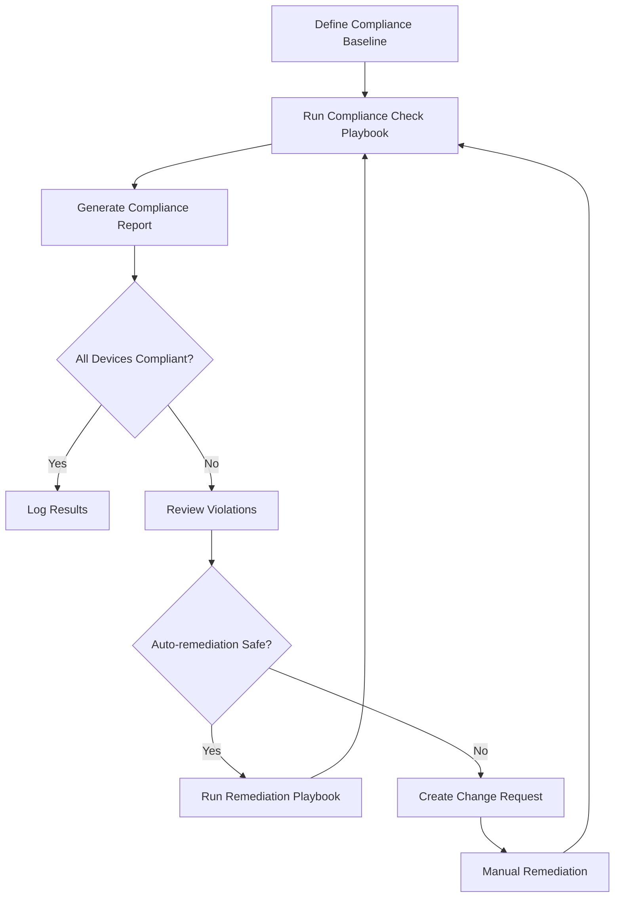

# How to Use Ansible to Perform Network Compliance Checks

Author: [nawazdhandala](https://www.github.com/nawazdhandala)

Tags: Ansible, Compliance, Network Security, Automation

Description: Build automated network compliance checks with Ansible to validate device configurations against security baselines and organizational standards.

---

Every network has standards. Security baselines, naming conventions, required services, forbidden configurations. The challenge is making sure every device actually complies. Manual audits are time-consuming and only give you a snapshot. Ansible lets you check compliance continuously, report violations, and even fix them automatically.

This post shows you how to build a comprehensive compliance checking framework with Ansible that validates network device configurations against your organizational standards.

## Defining Your Compliance Baseline

Start by defining what "compliant" means for your environment. Store these standards in variables.

```yaml
# group_vars/all_network/compliance.yml - Network compliance baseline
---
compliance_baseline:
  # Required NTP servers
  ntp_servers:
    - 10.10.1.10
    - 10.10.1.11

  # Required SNMP settings
  snmp:
    required_acl: SNMP_ACCESS
    forbidden_communities:
      - public
      - private
    required_v3_user: monitoring_user

  # Required AAA settings
  aaa:
    required_method: tacacs+
    fallback_method: local

  # Required logging settings
  logging:
    required_servers:
      - 10.10.1.50
      - 10.10.1.51
    required_severity: informational
    timestamp_format: datetime_msec

  # Security hardening requirements
  security:
    ssh_version: 2
    telnet_disabled: true
    http_server_disabled: true
    password_encryption: true
    banner_required: true
    unused_ports_shutdown: true

  # Required services
  required_services:
    - service timestamps log datetime msec
    - service timestamps debug datetime msec
    - service password-encryption

  # Forbidden services
  forbidden_services:
    - ip http server
    - service pad
    - ip bootp server
    - ip finger
    - ip source-route
```

## Basic Compliance Check Playbook

Here is a compliance playbook that checks the running configuration against the baseline.

```yaml
# compliance_check.yml - Validate device config against compliance baseline
---
- name: Network compliance check
  hosts: all_network
  gather_facts: false
  connection: network_cli

  vars:
    compliance_results: []

  tasks:
    # Grab the full running config for analysis
    - name: Get running configuration
      cisco.ios.ios_command:
        commands:
          - show running-config
      register: running_config

    - name: Store config as fact
      ansible.builtin.set_fact:
        device_config: "{{ running_config.stdout[0] }}"

    # Check NTP compliance
    - name: Verify NTP servers are configured
      ansible.builtin.set_fact:
        ntp_compliant: "{{ 'ntp server ' + item in device_config }}"
      loop: "{{ compliance_baseline.ntp_servers }}"
      register: ntp_checks

    - name: Report NTP compliance
      ansible.builtin.debug:
        msg: "{{ 'PASS' if item.ansible_facts.ntp_compliant else 'FAIL' }}: NTP server {{ item.item }}"
      loop: "{{ ntp_checks.results }}"

    # Check for forbidden SNMP communities
    - name: Check for forbidden SNMP communities
      ansible.builtin.assert:
        that:
          - "'community ' + item not in device_config"
        fail_msg: "FAIL: Forbidden SNMP community '{{ item }}' found on {{ inventory_hostname }}"
        success_msg: "PASS: SNMP community '{{ item }}' not present"
      loop: "{{ compliance_baseline.snmp.forbidden_communities }}"
      ignore_errors: true
      register: snmp_checks

    # Check SSH version
    - name: Verify SSH version 2
      ansible.builtin.assert:
        that:
          - "'ip ssh version 2' in device_config"
        fail_msg: "FAIL: SSH version 2 not configured on {{ inventory_hostname }}"
        success_msg: "PASS: SSH version 2 is configured"
      ignore_errors: true

    # Check that telnet is disabled
    - name: Verify telnet is disabled
      ansible.builtin.assert:
        that:
          - "'transport input ssh' in device_config"
        fail_msg: "FAIL: Telnet may be enabled on {{ inventory_hostname }}"
        success_msg: "PASS: SSH-only transport configured"
      ignore_errors: true

    # Check HTTP server is disabled
    - name: Verify HTTP server is disabled
      ansible.builtin.assert:
        that:
          - "'no ip http server' in device_config"
        fail_msg: "FAIL: HTTP server is enabled on {{ inventory_hostname }}"
        success_msg: "PASS: HTTP server is disabled"
      ignore_errors: true

    # Check logging servers
    - name: Verify syslog servers are configured
      ansible.builtin.assert:
        that:
          - "'logging host ' + item in device_config or 'logging server ' + item in device_config"
        fail_msg: "FAIL: Syslog server {{ item }} not configured on {{ inventory_hostname }}"
        success_msg: "PASS: Syslog server {{ item }} is configured"
      loop: "{{ compliance_baseline.logging.required_servers }}"
      ignore_errors: true

    # Check for forbidden services
    - name: Check for forbidden services
      ansible.builtin.debug:
        msg: "{{ 'FAIL: Forbidden service found' if item in device_config else 'PASS: Service not present' }}: {{ item }}"
      loop: "{{ compliance_baseline.forbidden_services }}"

    # Check for required services
    - name: Check for required services
      ansible.builtin.debug:
        msg: "{{ 'PASS' if item in device_config else 'FAIL' }}: {{ item }}"
      loop: "{{ compliance_baseline.required_services }}"
```

## Generating Compliance Reports

Collect all check results and generate a structured compliance report.

```yaml
# compliance_report.yml - Generate a detailed compliance report
---
- name: Generate compliance report
  hosts: all_network
  gather_facts: false
  connection: network_cli

  tasks:
    - name: Get running configuration
      cisco.ios.ios_command:
        commands:
          - show running-config
      register: running_config

    - name: Store config
      ansible.builtin.set_fact:
        cfg: "{{ running_config.stdout[0] }}"

    # Run all compliance checks and build a results dictionary
    - name: Build compliance results
      ansible.builtin.set_fact:
        compliance_report:
          hostname: "{{ inventory_hostname }}"
          timestamp: "{{ lookup('pipe', 'date -u +%Y-%m-%dT%H:%M:%SZ') }}"
          checks:
            ssh_v2: "{{ 'ip ssh version 2' in cfg }}"
            no_telnet: "{{ 'transport input ssh' in cfg }}"
            no_http: "{{ 'no ip http server' in cfg }}"
            password_encryption: "{{ 'service password-encryption' in cfg }}"
            ntp_server_1: "{{ 'ntp server ' + compliance_baseline.ntp_servers[0] in cfg }}"
            ntp_server_2: "{{ 'ntp server ' + compliance_baseline.ntp_servers[1] in cfg }}"
            syslog_server_1: "{{ 'logging host ' + compliance_baseline.logging.required_servers[0] in cfg }}"
            syslog_server_2: "{{ 'logging host ' + compliance_baseline.logging.required_servers[1] in cfg }}"
            no_public_community: "{{ 'community public' not in cfg }}"
            no_private_community: "{{ 'community private' not in cfg }}"
            no_ip_source_route: "{{ 'no ip source-route' in cfg }}"
            timestamps_enabled: "{{ 'service timestamps log datetime msec' in cfg }}"
            banner_configured: "{{ 'banner motd' in cfg or 'banner login' in cfg }}"

    # Calculate compliance score
    - name: Calculate compliance percentage
      ansible.builtin.set_fact:
        compliance_score: "{{ ((compliance_report.checks.values() | select('equalto', true) | list | length) / (compliance_report.checks | length) * 100) | round(1) }}"

    - name: Add score to report
      ansible.builtin.set_fact:
        compliance_report: "{{ compliance_report | combine({'score': compliance_score ~ '%'}) }}"

    - name: Display compliance score
      ansible.builtin.debug:
        msg: "{{ inventory_hostname }}: Compliance score {{ compliance_score }}%"

    # Save individual device report
    - name: Save device compliance report
      ansible.builtin.copy:
        content: "{{ compliance_report | to_nice_json }}"
        dest: "reports/compliance/{{ inventory_hostname }}.json"
      delegate_to: localhost

# Aggregate all results into a summary report
- name: Generate summary report
  hosts: localhost
  gather_facts: false

  tasks:
    - name: Build summary
      ansible.builtin.set_fact:
        summary: |
          Network Compliance Summary
          Generated: {{ lookup('pipe', 'date') }}
          ==========================================
          
          {{ host }}: {{ hostvars[host].compliance_score | default('N/A') }}% compliant
          

    - name: Save summary report
      ansible.builtin.copy:
        content: "{{ summary }}"
        dest: "reports/compliance/summary.txt"
```

## Auto-Remediation of Compliance Violations

Once you know what is wrong, you can automatically fix it. Be careful with this and always review what will be changed.

```yaml
# remediate_compliance.yml - Fix common compliance violations automatically
---
- name: Remediate compliance violations
  hosts: all_network
  gather_facts: false
  connection: network_cli

  tasks:
    - name: Get running configuration
      cisco.ios.ios_command:
        commands:
          - show running-config
      register: running_config

    - name: Store config
      ansible.builtin.set_fact:
        cfg: "{{ running_config.stdout[0] }}"

    # Fix: Enable password encryption
    - name: Enable password encryption
      cisco.ios.ios_config:
        lines:
          - service password-encryption
      when: "'service password-encryption' not in cfg"

    # Fix: Disable HTTP server
    - name: Disable HTTP server
      cisco.ios.ios_config:
        lines:
          - no ip http server
          - no ip http secure-server
      when: "'no ip http server' not in cfg"

    # Fix: Force SSH version 2
    - name: Set SSH version 2
      cisco.ios.ios_config:
        lines:
          - ip ssh version 2
      when: "'ip ssh version 2' not in cfg"

    # Fix: Disable source routing
    - name: Disable IP source routing
      cisco.ios.ios_config:
        lines:
          - no ip source-route
      when: "'no ip source-route' not in cfg"

    # Fix: Add missing NTP servers
    - name: Configure NTP servers
      cisco.ios.ios_config:
        lines:
          - "ntp server {{ item }}"
      loop: "{{ compliance_baseline.ntp_servers }}"
      when: "'ntp server ' + item not in cfg"

    # Fix: Add missing syslog servers
    - name: Configure syslog servers
      cisco.ios.ios_config:
        lines:
          - "logging host {{ item }}"
      loop: "{{ compliance_baseline.logging.required_servers }}"
      when: "'logging host ' + item not in cfg"

    # Fix: Enable timestamps
    - name: Enable log timestamps
      cisco.ios.ios_config:
        lines:
          - service timestamps log datetime msec localtime show-timezone
          - service timestamps debug datetime msec localtime show-timezone
      when: "'service timestamps log datetime msec' not in cfg"

    # Fix: Restrict VTY to SSH only
    - name: Restrict VTY to SSH
      cisco.ios.ios_config:
        lines:
          - transport input ssh
        parents: line vty 0 15
      when: "'transport input ssh' not in cfg"

    # Save after remediation
    - name: Save configuration
      cisco.ios.ios_command:
        commands:
          - write memory
```

## Compliance Check Workflow



Network compliance checking with Ansible turns a manual, periodic audit into a continuous, automated process. Define your standards once, check them as often as you want, and fix violations automatically when it is safe to do so. That is the difference between hoping your network is compliant and knowing it is.
