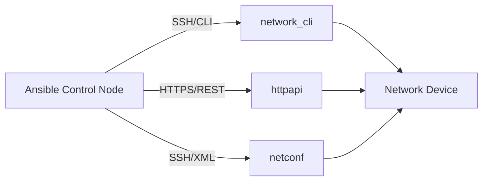
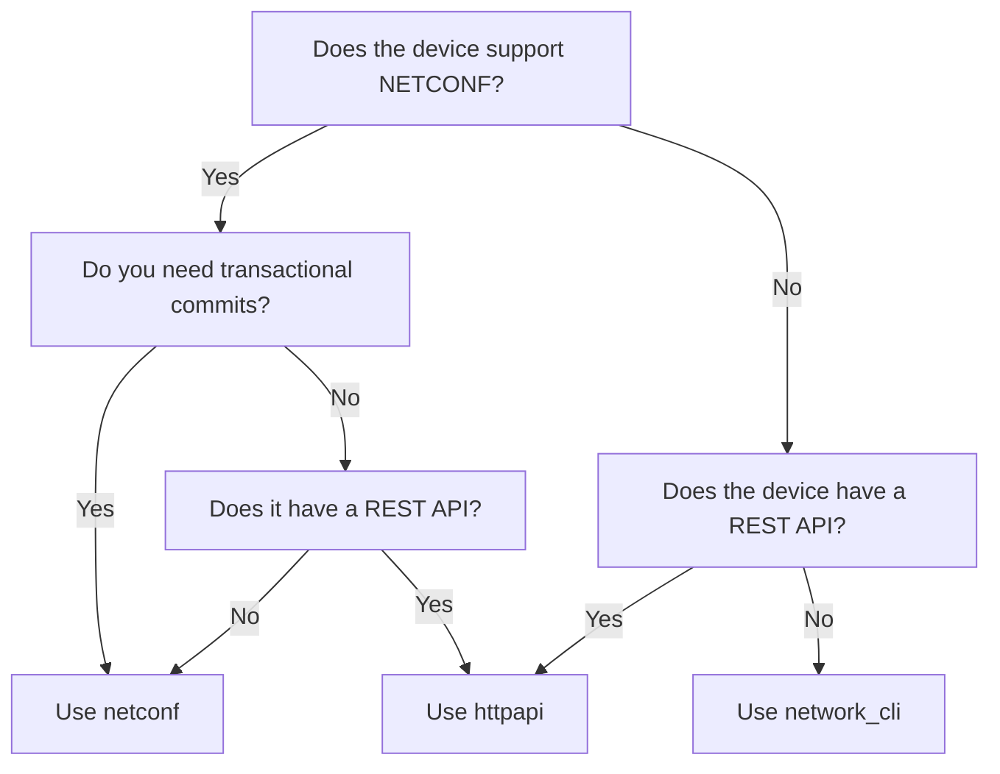

# How to Use Ansible Network Connection Types (network_cli, httpapi, netconf)

Author: [nawazdhandala](https://www.github.com/nawazdhandala)

Tags: Ansible, Networking, Connection Plugins, NETCONF, REST API

Description: Understand the three main Ansible network connection types and learn when to use network_cli, httpapi, or netconf for your automation projects.

---

When you automate servers with Ansible, the connection type is almost always SSH. You set `ansible_connection=ssh` and move on. Network devices are different. They support multiple management interfaces, and choosing the right one has a big impact on what you can do and how reliable your automation will be.

Ansible provides three primary connection plugins for network devices: `network_cli`, `httpapi`, and `netconf`. Each one speaks a different protocol to the device, and each one unlocks different capabilities. This post breaks down all three so you can make informed choices for your network automation projects.

## The Three Connection Types at a Glance



| Connection | Protocol | Data Format | Best For |
|---|---|---|---|
| network_cli | SSH | Unstructured text | Legacy devices, CLI-only platforms |
| httpapi | HTTPS | JSON/XML | Modern devices with REST APIs |
| netconf | SSH (port 830) | XML/YANG | Devices supporting NETCONF/YANG |

## network_cli: The SSH/CLI Connection

`network_cli` is the most widely supported connection type. It opens an SSH session to the device and interacts through the command-line interface, just like a human would in a terminal. This is the go-to choice for older devices or platforms where CLI is the primary management interface.

### Configuration

```yaml
# inventory/hosts.yml - Configure network_cli for Cisco IOS devices
---
all:
  children:
    ios_devices:
      hosts:
        router1:
          ansible_host: 10.1.1.1
        switch1:
          ansible_host: 10.1.1.2
      vars:
        ansible_connection: ansible.netcommon.network_cli
        ansible_network_os: cisco.ios.ios
        ansible_user: admin
        ansible_password: "{{ vault_network_password }}"
        ansible_become: true
        ansible_become_method: enable
        ansible_become_password: "{{ vault_enable_password }}"
```

### How It Works

When Ansible connects via `network_cli`, it:

1. Opens an SSH session to the device
2. Detects the CLI prompt
3. Sends commands as text strings
4. Reads back text responses
5. Modules parse the text responses into structured data when possible

### Example Playbook

```yaml
# network_cli_example.yml - Typical network_cli usage with Cisco IOS
---
- name: Configure device via CLI
  hosts: ios_devices
  gather_facts: false

  tasks:
    - name: Run show commands
      cisco.ios.ios_command:
        commands:
          - show version
          - show ip interface brief
      register: output

    - name: Configure an interface
      cisco.ios.ios_config:
        lines:
          - description Uplink to Core
          - ip address 10.1.1.1 255.255.255.0
          - no shutdown
        parents: interface GigabitEthernet0/0

    - name: Use resource modules
      cisco.ios.ios_vlans:
        config:
          - vlan_id: 100
            name: SERVERS
            state: active
        state: merged
```

### Tuning network_cli

There are several variables you can set to tune the SSH connection behavior.

```yaml
# group_vars/ios_devices.yml - Tune network_cli connection parameters
---
ansible_connection: ansible.netcommon.network_cli
ansible_network_os: cisco.ios.ios

# Timeout for establishing the SSH connection (seconds)
ansible_connect_timeout: 30

# Timeout for individual command execution (seconds)
ansible_command_timeout: 60

# Number of retries for persistent connection
ansible_persistent_connect_retry_timeout: 15

# Keep the connection alive between tasks
ansible_persistent_command_timeout: 30

# SSH options
ansible_ssh_common_args: '-o StrictHostKeyChecking=no'
```

## httpapi: The REST API Connection

`httpapi` connects to devices over HTTPS and communicates using REST APIs. This is faster than CLI scraping and returns structured data (usually JSON) natively. Platforms like Arista EOS (eAPI), Cisco NX-OS (NX-API), and F5 BIG-IP support this.

### Configuration

```yaml
# inventory/hosts.yml - Configure httpapi for Arista EOS devices
---
all:
  children:
    eos_devices:
      hosts:
        spine1:
          ansible_host: 10.2.1.1
        spine2:
          ansible_host: 10.2.1.2
      vars:
        ansible_connection: ansible.netcommon.httpapi
        ansible_network_os: arista.eos.eos
        ansible_user: admin
        ansible_password: "{{ vault_eos_password }}"
        ansible_httpapi_use_ssl: true
        ansible_httpapi_validate_certs: false
        ansible_become: true
        ansible_become_method: enable
```

### How It Works

The httpapi connection:

1. Establishes an HTTPS session to the device API endpoint
2. Sends requests as JSON payloads
3. Receives JSON responses
4. No text parsing needed since data is already structured

### Example Playbook

```yaml
# httpapi_example.yml - Configure Arista EOS via eAPI
---
- name: Configure EOS via REST API
  hosts: eos_devices
  gather_facts: false

  tasks:
    - name: Configure VLANs via API
      arista.eos.eos_vlans:
        config:
          - vlan_id: 100
            name: PRODUCTION
            state: active
          - vlan_id: 200
            name: DEVELOPMENT
            state: active
        state: merged

    - name: Run EOS commands via API
      arista.eos.eos_command:
        commands:
          - show vlan brief
          - show interfaces status
      register: eos_output

    # eAPI returns JSON by default, so data is already structured
    - name: Display VLAN info
      ansible.builtin.debug:
        var: eos_output.stdout[0]
```

### httpapi for Cisco NX-OS

```yaml
# inventory/nxos_hosts.yml - NX-API configuration for Cisco NX-OS
---
all:
  children:
    nxos_devices:
      hosts:
        nexus1:
          ansible_host: 10.3.1.1
      vars:
        ansible_connection: ansible.netcommon.httpapi
        ansible_network_os: cisco.nxos.nxos
        ansible_user: admin
        ansible_password: "{{ vault_nxos_password }}"
        ansible_httpapi_use_ssl: true
        ansible_httpapi_validate_certs: false
```

```yaml
# nxos_httpapi.yml - Use NX-API for Nexus switch automation
---
- name: Configure NX-OS via NX-API
  hosts: nxos_devices
  gather_facts: false

  tasks:
    - name: Configure interfaces
      cisco.nxos.nxos_interfaces:
        config:
          - name: Ethernet1/1
            description: "Server Port"
            enabled: true
            mode: layer2
        state: merged

    - name: Get structured data from NX-OS
      cisco.nxos.nxos_command:
        commands:
          - command: show vlan brief
            output: json
      register: nxos_vlans
```

## netconf: The YANG/XML Connection

NETCONF is a network management protocol defined in RFC 6241. It runs over SSH (typically on port 830) and uses XML for data encoding. The big advantage is that NETCONF operations are transactional. If part of a configuration change fails, the entire change can be rolled back.

### Configuration

```yaml
# inventory/hosts.yml - Configure netconf for Juniper Junos devices
---
all:
  children:
    junos_devices:
      hosts:
        junos_router1:
          ansible_host: 10.4.1.1
      vars:
        ansible_connection: ansible.netcommon.netconf
        ansible_network_os: junipernetworks.junos.junos
        ansible_user: admin
        ansible_password: "{{ vault_junos_password }}"
        # NETCONF uses port 830 by default
        ansible_port: 830
```

### How It Works

NETCONF provides several key operations:

- **get** - Retrieve operational data
- **get-config** - Retrieve configuration data
- **edit-config** - Modify configuration
- **lock/unlock** - Prevent concurrent changes
- **commit/discard** - Transactional configuration changes
- **validate** - Check configuration validity before applying

### Example Playbook

```yaml
# netconf_example.yml - Manage Juniper devices via NETCONF
---
- name: Configure Junos via NETCONF
  hosts: junos_devices
  gather_facts: false

  tasks:
    - name: Get device configuration via NETCONF
      junipernetworks.junos.junos_command:
        commands:
          - show configuration interfaces
        display: xml
      register: config_output

    - name: Configure interface via NETCONF
      junipernetworks.junos.junos_config:
        lines:
          - set interfaces ge-0/0/0 description "WAN Uplink"
          - set interfaces ge-0/0/0 unit 0 family inet address 10.0.0.1/30
        comment: "Configured by Ansible"

    - name: Use NETCONF module directly
      ansible.netcommon.netconf_config:
        content: |
          <config>
            <configuration>
              <interfaces>
                <interface>
                  <name>ge-0/0/0</name>
                  <description>WAN Uplink</description>
                </interface>
              </interfaces>
            </configuration>
          </config>
```

### NETCONF for Cisco IOS-XE

Modern Cisco IOS-XE devices also support NETCONF.

```yaml
# inventory/iosxe_netconf.yml - NETCONF for Cisco IOS-XE
---
all:
  children:
    iosxe_devices:
      hosts:
        csr1:
          ansible_host: 10.5.1.1
      vars:
        ansible_connection: ansible.netcommon.netconf
        ansible_network_os: cisco.ios.ios
        ansible_user: admin
        ansible_password: "{{ vault_iosxe_password }}"
        ansible_port: 830
```

## Choosing the Right Connection Type

Here is a decision tree to help you pick.



General guidelines:

- **Use network_cli** when the device only supports CLI, or when you are working with modules that are CLI-specific.
- **Use httpapi** when the device has a good REST API and you want structured JSON responses without parsing overhead.
- **Use netconf** when you need transactional configuration changes, YANG model compliance, or when working with Juniper devices.

## Multi-Connection Inventory

In the real world, you will likely have devices using different connection types in the same inventory.

```yaml
# inventory/network.yml - Mixed connection types in one inventory
---
all:
  children:
    cli_devices:
      hosts:
        ios_sw1:
          ansible_host: 10.1.1.1
      vars:
        ansible_connection: ansible.netcommon.network_cli
        ansible_network_os: cisco.ios.ios

    api_devices:
      hosts:
        eos_sw1:
          ansible_host: 10.2.1.1
      vars:
        ansible_connection: ansible.netcommon.httpapi
        ansible_network_os: arista.eos.eos
        ansible_httpapi_use_ssl: true

    netconf_devices:
      hosts:
        junos_rtr1:
          ansible_host: 10.3.1.1
      vars:
        ansible_connection: ansible.netcommon.netconf
        ansible_network_os: junipernetworks.junos.junos
```

Understanding these three connection types is foundational knowledge for network automation with Ansible. The connection type determines what is possible, how fast it runs, and how reliable the results will be. Pick the most capable connection type your devices support, and build your playbooks around its strengths.
