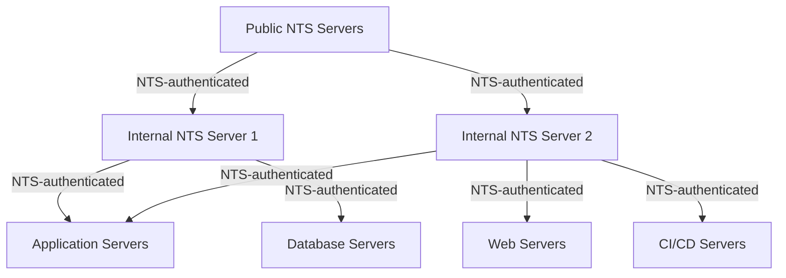

# How to Use Ansible to Configure Network Time Security (NTS)

Author: [nawazdhandala](https://www.github.com/nawazdhandala)

Tags: Ansible, NTS, Security, Chrony, Time Synchronization

Description: Automate the deployment and configuration of Network Time Security (NTS) across your infrastructure using Ansible and Chrony for authenticated time synchronization.

---

Network Time Protocol (NTP) has been the backbone of time synchronization for decades, but it was never designed with security in mind. Anyone sitting between your server and the NTP source could tamper with time responses. Network Time Security (NTS) fixes this by adding authentication and encryption to time synchronization. In this post, I will show you how to roll out NTS across your fleet using Ansible.

## What NTS Brings to the Table

NTS is an extension to NTP that uses TLS to establish trust between client and server. After the TLS handshake (called NTS-KE, or NTS Key Establishment), the client and server share cookies that authenticate subsequent NTP packets. This prevents man-in-the-middle attacks on time synchronization, which matter more than you might think. Kerberos, TLS certificates, DNSSEC, log timestamps, and scheduled jobs all depend on accurate time.

## Prerequisites

NTS support requires Chrony version 4.0 or later. The older ntpd does not support NTS. Most modern Linux distributions ship with Chrony 4+, but we will verify that in our playbook.

## Installing and Configuring Chrony with NTS

Let us start with a playbook that installs Chrony and configures NTS on client machines.

This playbook installs Chrony and deploys an NTS-enabled configuration:

```yaml
# configure-nts-clients.yml - Set up NTS time sync on all servers
---
- name: Configure NTS Time Synchronization
  hosts: all
  become: true
  vars:
    # Public NTS-capable time servers
    nts_servers:
      - name: time.cloudflare.com
        options: "iburst nts"
      - name: nts.netnod.se
        options: "iburst nts"
      - name: ptbtime1.ptb.de
        options: "iburst nts"
      - name: ntppool1.time.nl
        options: "iburst nts"
    chrony_config_path: /etc/chrony.conf
    chrony_nts_cookie_dir: /var/lib/chrony

  tasks:
    - name: Install Chrony on RHEL-based systems
      ansible.builtin.yum:
        name: chrony
        state: present
      when: ansible_os_family == "RedHat"

    - name: Install Chrony on Debian-based systems
      ansible.builtin.apt:
        name: chrony
        state: present
        update_cache: true
      when: ansible_os_family == "Debian"

    - name: Check Chrony version supports NTS (4.0+)
      ansible.builtin.command: chronyd --version
      register: chrony_version
      changed_when: false

    - name: Verify Chrony version is 4.0 or higher
      ansible.builtin.assert:
        that:
          - chrony_version.stdout | regex_search('(\d+)\.(\d+)') | regex_search('^\d+') | int >= 4
        fail_msg: "Chrony version must be 4.0+ for NTS support. Found: {{ chrony_version.stdout }}"

    - name: Deploy NTS-enabled Chrony configuration
      ansible.builtin.template:
        src: chrony-nts.conf.j2
        dest: "{{ chrony_config_path }}"
        owner: root
        group: root
        mode: '0644'
        backup: true
      notify: Restart chronyd

    - name: Ensure NTS cookie directory exists
      ansible.builtin.file:
        path: "{{ chrony_nts_cookie_dir }}"
        state: directory
        owner: chrony
        group: chrony
        mode: '0750'

    - name: Enable and start Chrony service
      ansible.builtin.systemd:
        name: chronyd
        enabled: true
        state: started

  handlers:
    - name: Restart chronyd
      ansible.builtin.systemd:
        name: chronyd
        state: restarted
```

## The Chrony Configuration Template

Here is the Jinja2 template that generates the NTS-enabled Chrony configuration:

```jinja2
# chrony-nts.conf.j2 - Chrony config with NTS authentication enabled
# Managed by Ansible - do not edit manually

# NTS-enabled time servers

server {{ server.name }} {{ server.options }}


# Allow the system clock to be stepped in the first three updates
# if its offset is larger than 1 second
makestep 1.0 3

# Enable kernel synchronization of the real-time clock
rtcsync

# Enable hardware timestamping on all interfaces that support it
hwtimestamp *

# Specify the directory for NTS cookie storage
ntsdumpdir {{ chrony_nts_cookie_dir }}

# Record the rate at which the system clock gains/losses time
driftfile /var/lib/chrony/drift

# Log tracking, measurements, and statistics
logdir /var/log/chrony
log tracking measurements statistics

# Minimum number of selectable sources required to adjust the system clock
minsources 2

# Allow NTP client access from local network (adjust as needed)
# allow 192.168.0.0/16

# Serve time even if not synchronized to a time source
# local stratum 10
```

## Setting Up an Internal NTS Server

If you want to run your own NTS server for internal clients (which reduces external dependencies), you need a TLS certificate. Here is how to configure that.

This playbook sets up a Chrony NTS server with TLS certificates:

```yaml
# configure-nts-server.yml - Set up internal NTS time server
---
- name: Configure Internal NTS Server
  hosts: nts_servers
  become: true
  vars:
    nts_cert_path: /etc/pki/tls/certs/nts-server.crt
    nts_key_path: /etc/pki/tls/private/nts-server.key
    upstream_nts_servers:
      - name: time.cloudflare.com
        options: "iburst nts"
      - name: nts.netnod.se
        options: "iburst nts"

  tasks:
    - name: Install Chrony
      ansible.builtin.yum:
        name: chrony
        state: present

    - name: Create TLS directories
      ansible.builtin.file:
        path: "{{ item }}"
        state: directory
        mode: '0755'
      loop:
        - /etc/pki/tls/certs
        - /etc/pki/tls/private

    - name: Copy NTS server TLS certificate
      ansible.builtin.copy:
        src: "files/nts-certs/{{ inventory_hostname }}.crt"
        dest: "{{ nts_cert_path }}"
        owner: root
        group: chrony
        mode: '0644'
      notify: Restart chronyd

    - name: Copy NTS server TLS private key
      ansible.builtin.copy:
        src: "files/nts-certs/{{ inventory_hostname }}.key"
        dest: "{{ nts_key_path }}"
        owner: root
        group: chrony
        mode: '0640'
      notify: Restart chronyd

    - name: Deploy NTS server configuration
      ansible.builtin.copy:
        dest: /etc/chrony.conf
        owner: root
        group: root
        mode: '0644'
        content: |
          # NTS Server Configuration - Managed by Ansible
          
          server {{ server.name }} {{ server.options }}
          

          # NTS server settings
          ntsserverkey {{ nts_key_path }}
          ntsservercert {{ nts_cert_path }}
          ntsprocesses 2
          ntsdumpdir /var/lib/chrony

          # Allow NTP/NTS clients from internal network
          allow 10.0.0.0/8
          allow 172.16.0.0/12
          allow 192.168.0.0/16

          # General settings
          makestep 1.0 3
          rtcsync
          driftfile /var/lib/chrony/drift
          logdir /var/log/chrony
          log tracking measurements statistics
      notify: Restart chronyd

    - name: Open NTP port in firewall (UDP 123)
      ansible.posix.firewalld:
        port: 123/udp
        permanent: true
        state: enabled
        immediate: true

    - name: Open NTS-KE port in firewall (TCP 4460)
      ansible.posix.firewalld:
        port: 4460/tcp
        permanent: true
        state: enabled
        immediate: true

    - name: Enable and start Chrony
      ansible.builtin.systemd:
        name: chronyd
        enabled: true
        state: started

  handlers:
    - name: Restart chronyd
      ansible.builtin.systemd:
        name: chronyd
        state: restarted
```

## Verifying NTS Is Working

After deployment, you want to confirm NTS is actually being used. This playbook checks NTS status across all hosts.

This playbook verifies NTS authentication is active on each host:

```yaml
# verify-nts.yml - Check NTS status across the fleet
---
- name: Verify NTS Configuration
  hosts: all
  become: true
  tasks:
    - name: Check chronyc sources with NTS info
      ansible.builtin.command: chronyc -N authdata
      register: nts_authdata
      changed_when: false

    - name: Display NTS authentication status
      ansible.builtin.debug:
        msg: "{{ nts_authdata.stdout_lines }}"

    - name: Verify at least one NTS source is authenticated
      ansible.builtin.shell: |
        # Check that we have at least one NTS-authenticated source
        chronyc -N authdata | grep -c "NTS" || echo "0"
      register: nts_count
      changed_when: false
      failed_when: nts_count.stdout | int < 1

    - name: Check time synchronization status
      ansible.builtin.command: chronyc tracking
      register: tracking_info
      changed_when: false

    - name: Show synchronization details
      ansible.builtin.debug:
        msg: "{{ tracking_info.stdout_lines }}"
```

## NTS Deployment Architecture

Here is how the NTS deployment looks in a typical environment:



## Monitoring NTS Health

You should monitor NTS to catch issues before they affect your infrastructure.

This playbook collects NTS metrics and flags problems:

```yaml
# monitor-nts.yml - Collect NTS health metrics
---
- name: Monitor NTS Health
  hosts: all
  become: true
  tasks:
    - name: Get NTS-KE connection stats
      ansible.builtin.shell: |
        chronyc ntpdata | grep -E "NTS|Cookie"
      register: nts_stats
      changed_when: false
      failed_when: false

    - name: Check system clock offset
      ansible.builtin.shell: |
        # Extract the system time offset in seconds
        chronyc tracking | grep "System time" | awk '{print $4}'
      register: clock_offset
      changed_when: false

    - name: Alert if clock offset exceeds threshold
      ansible.builtin.debug:
        msg: "WARNING: Clock offset on {{ inventory_hostname }} is {{ clock_offset.stdout }} seconds"
      when: clock_offset.stdout | float > 0.1
```

## Troubleshooting Common Issues

A few things tend to trip people up when deploying NTS:

**Firewall blocking port 4460**: NTS-KE uses TCP port 4460. If this port is blocked, the TLS handshake fails and Chrony falls back to unauthenticated NTP. Your time will still sync, but without the security guarantees.

**Old Chrony version**: Distributions like CentOS 7 ship with Chrony 3.x, which has zero NTS support. You will need to use a newer OS or build Chrony from source.

**Certificate issues on internal servers**: If your internal NTS server uses a private CA, clients need that CA certificate in their trust store, or Chrony will reject the NTS-KE connection.

**DNS resolution failures**: NTS-KE connects by hostname and validates the TLS certificate against that hostname. If DNS is not working, NTS will fail even if you have the server IP in your config.

NTS is one of those upgrades that is straightforward to deploy but provides meaningful security improvement. With Ansible handling the rollout, you can have authenticated time sync across your entire infrastructure in an afternoon.
