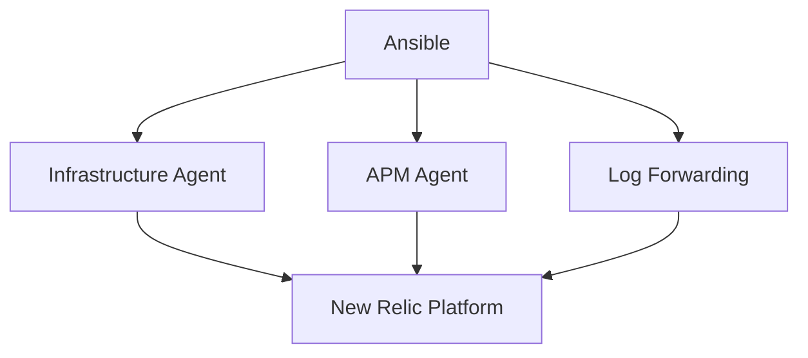

# How to Use Ansible with New Relic for APM

Author: [nawazdhandala](https://www.github.com/nawazdhandala)

Tags: Ansible, New Relic, APM, Monitoring

Description: Deploy New Relic infrastructure and APM agents with Ansible for application performance monitoring across your server fleet.

---

New Relic provides application performance monitoring (APM), infrastructure monitoring, and log management. Ansible can deploy both the infrastructure agent and language-specific APM agents across your servers.

## New Relic Components



## Installing the Infrastructure Agent

```yaml
# roles/newrelic_infra/tasks/main.yml
---
- name: Add New Relic GPG key
  ansible.builtin.apt_key:
    url: https://download.newrelic.com/infrastructure_agent/gpg/newrelic-infra.gpg
    state: present

- name: Add New Relic repository
  ansible.builtin.apt_repository:
    repo: "deb https://download.newrelic.com/infrastructure_agent/linux/apt {{ ansible_distribution_release }} main"
    state: present

- name: Install New Relic infrastructure agent
  ansible.builtin.apt:
    name: newrelic-infra
    state: present
    update_cache: true

- name: Configure infrastructure agent
  ansible.builtin.template:
    src: newrelic-infra.yml.j2
    dest: /etc/newrelic-infra.yml
    mode: '0640'
  notify: restart newrelic-infra

- name: Ensure agent is running
  ansible.builtin.service:
    name: newrelic-infra
    state: started
    enabled: true
```

## Configuration Template

```yaml
# roles/newrelic_infra/templates/newrelic-infra.yml.j2
license_key: {{ newrelic_license_key }}
display_name: {{ inventory_hostname }}
custom_attributes:
  environment: {{ environment_name }}
  role: {{ server_role | default('unknown') }}
  team: {{ team_name | default('platform') }}
log:
  level: info
  forward: true
```

## Deploying APM Agent for Python

```yaml
# roles/newrelic_apm_python/tasks/main.yml
---
- name: Install New Relic Python agent
  ansible.builtin.pip:
    name: newrelic
    state: present
    virtualenv: "{{ app_venv_path }}"

- name: Generate New Relic config
  ansible.builtin.command:
    cmd: "{{ app_venv_path }}/bin/newrelic-admin generate-config {{ newrelic_license_key }} {{ app_config_dir }}/newrelic.ini"
    creates: "{{ app_config_dir }}/newrelic.ini"

- name: Configure APM settings
  ansible.builtin.lineinfile:
    path: "{{ app_config_dir }}/newrelic.ini"
    regexp: "{{ item.regexp }}"
    line: "{{ item.line }}"
  loop:
    - { regexp: '^app_name', line: "app_name = {{ app_name }} ({{ environment_name }})" }
    - { regexp: '^log_file', line: "log_file = /var/log/newrelic/python-agent.log" }
  notify: restart application
```

## Deploying APM Agent for Java

```yaml
# roles/newrelic_apm_java/tasks/main.yml
---
- name: Download New Relic Java agent
  ansible.builtin.get_url:
    url: "https://download.newrelic.com/newrelic/java-agent/newrelic-agent/current/newrelic-java.zip"
    dest: /tmp/newrelic-java.zip
    mode: '0644'

- name: Extract Java agent
  ansible.builtin.unarchive:
    src: /tmp/newrelic-java.zip
    dest: "{{ app_dir }}"
    remote_src: true

- name: Configure Java agent
  ansible.builtin.template:
    src: newrelic.yml.j2
    dest: "{{ app_dir }}/newrelic/newrelic.yml"
    mode: '0640'
  notify: restart application
```

## Key Takeaways

Ansible simplifies New Relic deployment across your infrastructure. Install the infrastructure agent on all servers for system metrics. Deploy language-specific APM agents on application servers. Use templates to set environment-specific configuration like app names and custom attributes. This ensures consistent observability across your fleet.

## Common Use Cases

Here are several practical scenarios where this module proves essential in real-world playbooks.

### Infrastructure Provisioning Workflow

```yaml
# Complete workflow incorporating this module
- name: Infrastructure provisioning
  hosts: all
  become: true
  gather_facts: true
  tasks:
    - name: Gather system information
      ansible.builtin.setup:
        gather_subset:
          - hardware
          - network

    - name: Display system summary
      ansible.builtin.debug:
        msg: >-
          Host {{ inventory_hostname }} has
          {{ ansible_memtotal_mb }}MB RAM,
          {{ ansible_processor_vcpus }} vCPUs,
          running {{ ansible_distribution }} {{ ansible_distribution_version }}

    - name: Install required packages
      ansible.builtin.package:
        name:
          - curl
          - wget
          - git
          - vim
          - htop
          - jq
        state: present

    - name: Configure system timezone
      ansible.builtin.timezone:
        name: "{{ system_timezone | default('UTC') }}"

    - name: Configure hostname
      ansible.builtin.hostname:
        name: "{{ inventory_hostname }}"

    - name: Update /etc/hosts
      ansible.builtin.lineinfile:
        path: /etc/hosts
        regexp: '^127\.0\.1\.1'
        line: "127.0.1.1 {{ inventory_hostname }}"

    - name: Configure SSH hardening
      ansible.builtin.lineinfile:
        path: /etc/ssh/sshd_config
        regexp: "{{ item.regexp }}"
        line: "{{ item.line }}"
      loop:
        - { regexp: '^PermitRootLogin', line: 'PermitRootLogin no' }
        - { regexp: '^PasswordAuthentication', line: 'PasswordAuthentication no' }
      notify: restart sshd

    - name: Configure firewall rules
      community.general.ufw:
        rule: allow
        port: "{{ item }}"
        proto: tcp
      loop:
        - "22"
        - "80"
        - "443"

    - name: Enable firewall
      community.general.ufw:
        state: enabled
        policy: deny

  handlers:
    - name: restart sshd
      ansible.builtin.service:
        name: sshd
        state: restarted
```

### Integration with Monitoring

```yaml
# Using gathered facts to configure monitoring thresholds
- name: Configure monitoring based on system specs
  hosts: all
  become: true
  tasks:
    - name: Set monitoring thresholds based on hardware
      ansible.builtin.template:
        src: monitoring_config.yml.j2
        dest: /etc/monitoring/config.yml
      vars:
        memory_warning_threshold: "{{ (ansible_memtotal_mb * 0.8) | int }}"
        memory_critical_threshold: "{{ (ansible_memtotal_mb * 0.95) | int }}"
        cpu_warning_threshold: 80
        cpu_critical_threshold: 95

    - name: Register host with monitoring system
      ansible.builtin.uri:
        url: "https://monitoring.example.com/api/hosts"
        method: POST
        body_format: json
        body:
          hostname: "{{ inventory_hostname }}"
          ip_address: "{{ ansible_default_ipv4.address }}"
          os: "{{ ansible_distribution }}"
          memory_mb: "{{ ansible_memtotal_mb }}"
          cpus: "{{ ansible_processor_vcpus }}"
        headers:
          Authorization: "Bearer {{ monitoring_api_token }}"
        status_code: [200, 201, 409]
```

### Error Handling Patterns

```yaml
# Robust error handling with this module
- name: Robust task execution
  hosts: all
  tasks:
    - name: Attempt primary operation
      ansible.builtin.command: /opt/app/primary-task.sh
      register: primary_result
      failed_when: false

    - name: Handle primary failure with fallback
      ansible.builtin.command: /opt/app/fallback-task.sh
      when: primary_result.rc != 0
      register: fallback_result

    - name: Report final status
      ansible.builtin.debug:
        msg: >-
          Task completed via {{ 'primary' if primary_result.rc == 0 else 'fallback' }} path.
          Return code: {{ primary_result.rc if primary_result.rc == 0 else fallback_result.rc }}

    - name: Fail if both paths failed
      ansible.builtin.fail:
        msg: "Both primary and fallback operations failed"
      when:
        - primary_result.rc != 0
        - fallback_result is defined
        - fallback_result.rc != 0
```

### Scheduling and Automation

```yaml
# Set up scheduled compliance scans using cron
- name: Configure automated scans
  hosts: all
  become: true
  tasks:
    - name: Create scan script
      ansible.builtin.copy:
        dest: /opt/scripts/compliance_scan.sh
        mode: '0755'
        content: |
          #!/bin/bash
          cd /opt/ansible
          ansible-playbook playbooks/validate.yml -i inventory/ > /var/log/compliance_scan.log 2>&1
          EXIT_CODE=$?
          if [ $EXIT_CODE -ne 0 ]; then
            curl -X POST https://hooks.example.com/alert \
              -H "Content-Type: application/json" \
              -d "{\"text\":\"Compliance scan failed on $(hostname)\"}"
          fi
          exit $EXIT_CODE

    - name: Schedule weekly compliance scan
      ansible.builtin.cron:
        name: "Weekly compliance scan"
        minute: "0"
        hour: "3"
        weekday: "1"
        job: "/opt/scripts/compliance_scan.sh"
        user: ansible
```

