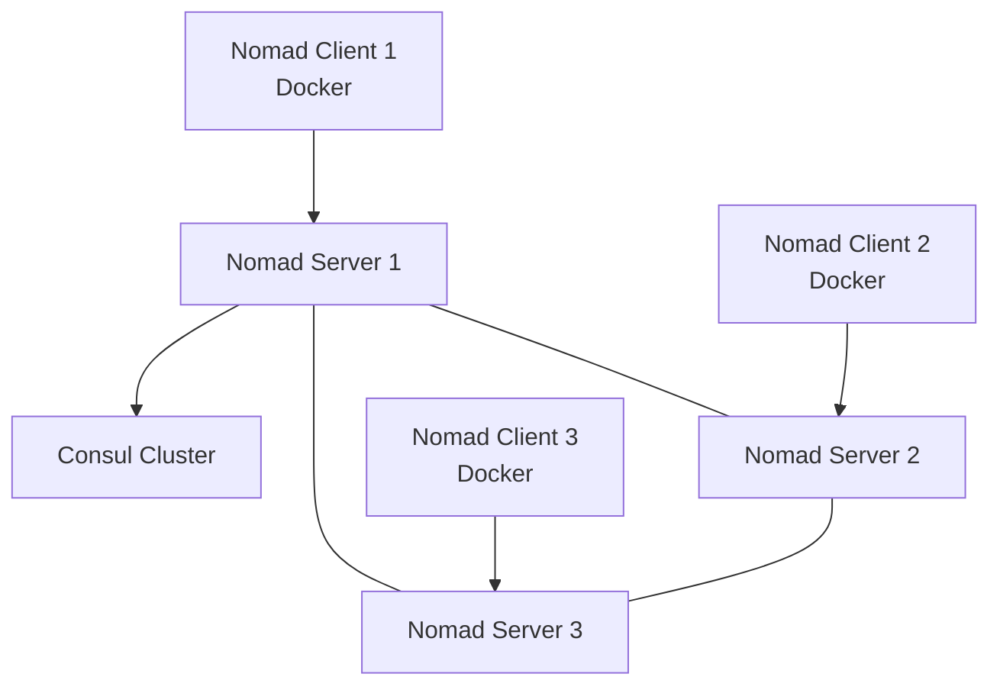

# How to Use Ansible to Set Up a Nomad Cluster

Author: [nawazdhandala](https://www.github.com/nawazdhandala)

Tags: Ansible, Nomad, HashiCorp, Orchestration, DevOps

Description: Deploy a HashiCorp Nomad cluster for workload orchestration with Docker driver, Consul integration, and job scheduling using Ansible.

---

Nomad is HashiCorp's workload orchestrator, sitting in the same space as Kubernetes but with significantly less complexity. It handles containers, VMs, Java applications, and standalone binaries using a unified job specification. For teams that find Kubernetes overkill for their needs, Nomad offers a simpler alternative with built-in support for multi-region, multi-cloud deployments. Deploying a Nomad cluster involves setting up server nodes for scheduling, client nodes for running workloads, and integrating with Consul for service discovery.

## Architecture



## Role Defaults

```yaml
# roles/nomad/defaults/main.yml - Nomad cluster configuration
nomad_version: "1.7.2"
nomad_datacenter: dc1
nomad_region: global
nomad_data_dir: /opt/nomad/data
nomad_config_dir: /etc/nomad.d
nomad_http_port: 4646
nomad_rpc_port: 4647
nomad_serf_port: 4648

nomad_server: false
nomad_client: false
nomad_bootstrap_expect: 3

nomad_encrypt_key: "{{ vault_nomad_encrypt_key }}"

# Consul integration
nomad_consul_address: "127.0.0.1:8500"

# Docker driver settings (for clients)
nomad_docker_enabled: true
nomad_docker_volumes_enabled: true

# Server addresses for bootstrapping
nomad_retry_join:
  - 10.0.1.10
  - 10.0.1.11
  - 10.0.1.12
```

## Main Tasks

```yaml
# roles/nomad/tasks/main.yml - Install and configure Nomad
---
- name: Create nomad system user
  user:
    name: nomad
    system: yes
    shell: /usr/sbin/nologin
    create_home: no

- name: Create Nomad directories
  file:
    path: "{{ item }}"
    state: directory
    owner: nomad
    group: nomad
    mode: '0755'
  loop:
    - "{{ nomad_data_dir }}"
    - "{{ nomad_config_dir }}"

- name: Download Nomad
  get_url:
    url: "https://releases.hashicorp.com/nomad/{{ nomad_version }}/nomad_{{ nomad_version }}_linux_amd64.zip"
    dest: /tmp/nomad.zip

- name: Extract Nomad binary
  unarchive:
    src: /tmp/nomad.zip
    dest: /usr/local/bin/
    remote_src: yes
    creates: /usr/local/bin/nomad

- name: Deploy Nomad base configuration
  template:
    src: nomad.hcl.j2
    dest: "{{ nomad_config_dir }}/nomad.hcl"
    owner: nomad
    group: nomad
    mode: '0640'
  notify: restart nomad

- name: Deploy server configuration
  template:
    src: server.hcl.j2
    dest: "{{ nomad_config_dir }}/server.hcl"
    owner: nomad
    group: nomad
    mode: '0640'
  when: nomad_server
  notify: restart nomad

- name: Deploy client configuration
  template:
    src: client.hcl.j2
    dest: "{{ nomad_config_dir }}/client.hcl"
    owner: nomad
    group: nomad
    mode: '0640'
  when: nomad_client
  notify: restart nomad

- name: Install Docker for Nomad clients
  apt:
    name:
      - docker-ce
      - docker-ce-cli
    state: present
  when: nomad_client and nomad_docker_enabled

- name: Create Nomad systemd service
  template:
    src: nomad.service.j2
    dest: /etc/systemd/system/nomad.service
    mode: '0644'
  notify:
    - reload systemd
    - restart nomad

- name: Start and enable Nomad
  systemd:
    name: nomad
    state: started
    enabled: yes
    daemon_reload: yes
```

## Nomad Base Configuration

```hcl
# roles/nomad/templates/nomad.hcl.j2 - Shared configuration
datacenter = "{{ nomad_datacenter }}"
region     = "{{ nomad_region }}"
data_dir   = "{{ nomad_data_dir }}"

bind_addr = "0.0.0.0"

advertise {
  http = "{{ ansible_default_ipv4.address }}"
  rpc  = "{{ ansible_default_ipv4.address }}"
  serf = "{{ ansible_default_ipv4.address }}"
}

consul {
  address = "{{ nomad_consul_address }}"
}

telemetry {
  collection_interval        = "1s"
  disable_hostname           = true
  prometheus_metrics         = true
  publish_allocation_metrics = true
  publish_node_metrics       = true
}
```

## Server Configuration

```hcl
# roles/nomad/templates/server.hcl.j2
server {
  enabled          = true
  bootstrap_expect = {{ nomad_bootstrap_expect }}

  encrypt = "{{ nomad_encrypt_key }}"

  server_join {
    retry_join = {{ nomad_retry_join | to_json }}
  }
}
```

## Client Configuration

```hcl
# roles/nomad/templates/client.hcl.j2
client {
  enabled = true

  server_join {
    retry_join = {{ nomad_retry_join | to_json }}
  }


  options {
    "driver.allowlist" = "docker,exec,raw_exec"
  }

}


plugin "docker" {
  config {
    volumes {
      enabled = {{ nomad_docker_volumes_enabled | lower }}
    }
  }
}

```

## Sample Nomad Job

```yaml
# Task to deploy a sample Nomad job
- name: Deploy sample web service job
  copy:
    content: |
      job "web" {
        datacenters = ["{{ nomad_datacenter }}"]
        type = "service"

        group "web" {
          count = 3

          network {
            port "http" { to = 80 }
          }

          service {
            name = "web"
            port = "http"
            provider = "consul"
            check {
              type     = "http"
              path     = "/"
              interval = "10s"
              timeout  = "2s"
            }
          }

          task "nginx" {
            driver = "docker"
            config {
              image = "nginx:alpine"
              ports = ["http"]
            }
            resources {
              cpu    = 100
              memory = 128
            }
          }
        }
      }
    dest: /tmp/web.nomad
  when: nomad_server

- name: Run sample job
  command: nomad job run /tmp/web.nomad
  when: nomad_server
  run_once: true
```

## Handlers

```yaml
# roles/nomad/handlers/main.yml
---
- name: restart nomad
  systemd:
    name: nomad
    state: restarted

- name: reload systemd
  systemd:
    daemon_reload: yes
```

## Running the Playbook

```bash
# Deploy Nomad cluster
ansible-playbook -i inventory/hosts.ini playbook.yml --ask-vault-pass

# Check cluster status
nomad server members
nomad node status
nomad job status
```

## Summary

This Ansible playbook deploys a Nomad cluster with server and client separation, Consul integration for service discovery, and Docker as the task driver. Nomad's simplicity compared to Kubernetes makes it an excellent choice for teams that need container orchestration without the operational overhead. The playbook scales from a development setup to production by adjusting the inventory and bootstrap_expect value.
