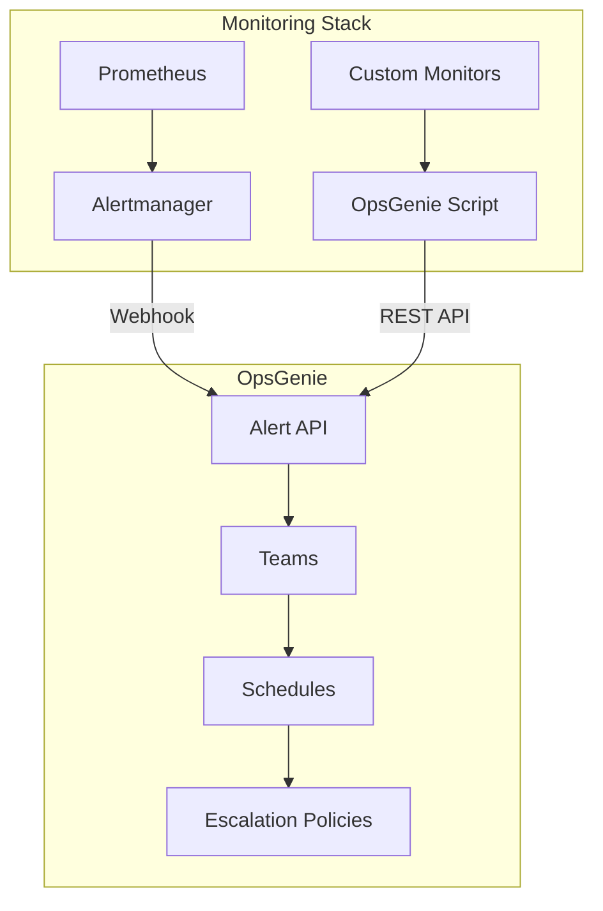

# How to Use Ansible to Configure OpsGenie Integration

Author: [nawazdhandala](https://www.github.com/nawazdhandala)

Tags: Ansible, OpsGenie, Incident Management, Alerting, DevOps

Description: Set up Atlassian OpsGenie alert integrations with Ansible for Prometheus Alertmanager, custom monitors, and automated incident workflows.

---

OpsGenie (now part of Atlassian) is a popular incident management and alerting platform, especially for teams already in the Atlassian ecosystem with Jira and Confluence. It handles alert routing, on-call schedules, escalation policies, and integrates well with dozens of monitoring tools. Setting up these integrations manually through the web UI works for one environment, but if you manage multiple environments or need reproducible configurations, Ansible is the way to go.

In this guide, I will walk through automating OpsGenie integration setup using Ansible. We will configure Prometheus Alertmanager to route alerts to OpsGenie, use the OpsGenie API to manage teams and integrations, and deploy custom alerting scripts for systems that need a direct integration.

## Integration Architecture



## Variables

```yaml
# group_vars/all.yml
opsgenie_api_key: "{{ vault_opsgenie_api_key }}"
opsgenie_api_url: "https://api.opsgenie.com/v2"
opsgenie_alert_api_url: "https://api.opsgenie.com/v2/alerts"

# OpsGenie team configurations
opsgenie_teams:
  - name: platform-team
    api_key: "{{ vault_og_platform_key }}"
    description: "Platform and infrastructure team"
  - name: application-team
    api_key: "{{ vault_og_app_key }}"
    description: "Application development team"
  - name: database-team
    api_key: "{{ vault_og_db_key }}"
    description: "Database administration team"

# Alert routing from Alertmanager to OpsGenie
opsgenie_alert_routing:
  - match:
      severity: critical
      team: platform
    opsgenie_team: platform-team
    priority: P1
    repeat_interval: 30m

  - match:
      severity: critical
      team: application
    opsgenie_team: application-team
    priority: P1
    repeat_interval: 30m

  - match:
      severity: warning
    opsgenie_team: platform-team
    priority: P3
    repeat_interval: 4h

# Alertmanager settings
alertmanager_port: 9093
```

## Alertmanager OpsGenie Configuration

Configure Alertmanager to send alerts to OpsGenie via its webhook receiver.

```yaml
# roles/alertmanager-opsgenie/tasks/main.yml
---
- name: Ensure Alertmanager directories exist
  ansible.builtin.file:
    path: "{{ item }}"
    state: directory
    owner: alertmanager
    group: alertmanager
    mode: '0755'
  loop:
    - /etc/alertmanager
    - /etc/alertmanager/templates

- name: Deploy Alertmanager configuration with OpsGenie
  ansible.builtin.template:
    src: alertmanager.yml.j2
    dest: /etc/alertmanager/alertmanager.yml
    owner: alertmanager
    group: alertmanager
    mode: '0640'
  notify: Restart Alertmanager

- name: Validate configuration
  ansible.builtin.command:
    cmd: /usr/local/bin/amtool check-config /etc/alertmanager/alertmanager.yml
  changed_when: false

- name: Deploy OpsGenie notification template
  ansible.builtin.template:
    src: opsgenie-template.tmpl.j2
    dest: /etc/alertmanager/templates/opsgenie.tmpl
    owner: alertmanager
    group: alertmanager
    mode: '0644'
  notify: Restart Alertmanager
```

The Alertmanager configuration uses OpsGenie's native receiver type.

```jinja2
# roles/alertmanager-opsgenie/templates/alertmanager.yml.j2
# Alertmanager with OpsGenie - Managed by Ansible
global:
  resolve_timeout: 5m
  opsgenie_api_url: '{{ opsgenie_alert_api_url }}'
  opsgenie_api_key: '{{ opsgenie_api_key }}'

templates:
  - '/etc/alertmanager/templates/*.tmpl'

route:
  group_by: ['alertname', 'cluster', 'service']
  group_wait: 30s
  group_interval: 5m
  repeat_interval: 4h
  receiver: 'opsgenie-default'

  routes:

    - match:

        {{ key }}: '{{ value }}'

      receiver: 'opsgenie-{{ rule.opsgenie_team }}'
      repeat_interval: {{ rule.repeat_interval }}


receivers:
  - name: 'opsgenie-default'
    opsgenie_configs:
      - api_key: '{{ opsgenie_api_key }}'
        message: '{{ "{{ .GroupLabels.alertname }}" }}: {{ "{{ .CommonAnnotations.summary }}" }}'
        priority: 'P3'
        tags: 'ansible,prometheus,{{ "{{ .GroupLabels.alertname }}" }}'
        note: '{{ "{{ template \"opsgenie.note\" . }}" }}'
        send_resolved: true


  - name: 'opsgenie-{{ team.name }}'
    opsgenie_configs:
      - api_key: '{{ team.api_key }}'
        message: '{{ "{{ .GroupLabels.alertname }}" }}: {{ "{{ .CommonAnnotations.summary }}" }}'
        priority: '{{ (opsgenie_alert_routing | selectattr("opsgenie_team", "equalto", team.name) | first).priority | default("P3") }}'
        tags: 'ansible,prometheus,{{ team.name }},{{ "{{ .GroupLabels.alertname }}" }}'
        responders:
          - name: '{{ team.name }}'
            type: 'team'
        note: '{{ "{{ template \"opsgenie.note\" . }}" }}'
        send_resolved: true


inhibit_rules:
  - source_match:
      severity: 'critical'
    target_match:
      severity: 'warning'
    equal: ['alertname', 'instance']
```

## OpsGenie Notification Template

```jinja2
# roles/alertmanager-opsgenie/templates/opsgenie-template.tmpl.j2
{{ "{{ define \"opsgenie.note\" }}" }}
{{ "{{ range .Alerts }}" }}
Alert: {{ "{{ .Labels.alertname }}" }}
Instance: {{ "{{ .Labels.instance }}" }}
Severity: {{ "{{ .Labels.severity }}" }}
Description: {{ "{{ .Annotations.description }}" }}
Started: {{ "{{ .StartsAt.Format \"2006-01-02 15:04:05\" }}" }}
{{ "{{ end }}" }}
{{ "{{ end }}" }}
```

## OpsGenie API Management

Manage OpsGenie teams and integrations through the API.

```yaml
# roles/opsgenie-setup/tasks/main.yml
---
- name: Create OpsGenie teams
  ansible.builtin.uri:
    url: "{{ opsgenie_api_url }}/teams"
    method: POST
    headers:
      Authorization: "GenieKey {{ opsgenie_api_key }}"
      Content-Type: "application/json"
    body_format: json
    body:
      name: "{{ item.name }}"
      description: "{{ item.description }}"
    status_code:
      - 201
      - 202
      - 409  # Already exists
  loop: "{{ opsgenie_teams }}"
  register: team_creation

- name: Create API integrations for each team
  ansible.builtin.uri:
    url: "{{ opsgenie_api_url }}/integrations"
    method: POST
    headers:
      Authorization: "GenieKey {{ opsgenie_api_key }}"
      Content-Type: "application/json"
    body_format: json
    body:
      name: "Prometheus-{{ item.name }}"
      type: "API"
      ownerTeam:
        name: "{{ item.name }}"
      allowWriteAccess: true
      suppressNotifications: false
      enabled: true
    status_code:
      - 201
      - 202
  loop: "{{ opsgenie_teams }}"
  register: integrations
  ignore_errors: yes

- name: Display integration API keys
  ansible.builtin.debug:
    msg: "Team: {{ item.item.name }} - Integration created"
  loop: "{{ integrations.results }}"
  when: item is success
```

## OpsGenie Alert Script

Deploy a standalone script for sending alerts directly to OpsGenie from any system.

```yaml
# roles/opsgenie-trigger/tasks/main.yml
---
- name: Deploy OpsGenie alert script
  ansible.builtin.template:
    src: og-alert.sh.j2
    dest: /usr/local/bin/og-alert
    owner: root
    group: root
    mode: '0755'
```

```jinja2
# roles/opsgenie-trigger/templates/og-alert.sh.j2
#!/bin/bash
# OpsGenie alert trigger - Managed by Ansible
# Usage: og-alert <priority> <message> [description] [team]
# Priorities: P1, P2, P3, P4, P5

PRIORITY="${1:-P3}"
MESSAGE="${2:-Alert from $(hostname)}"
DESCRIPTION="${3:-No description provided}"
TEAM="${4:-{{ opsgenie_teams[0].name }}}"
API_KEY="${OG_API_KEY:-{{ opsgenie_api_key }}}"

# Trigger alert
RESPONSE=$(curl -s -X POST \
  "{{ opsgenie_alert_api_url }}" \
  -H "Content-Type: application/json" \
  -H "Authorization: GenieKey ${API_KEY}" \
  -d "{
    \"message\": \"${MESSAGE}\",
    \"description\": \"${DESCRIPTION}\",
    \"priority\": \"${PRIORITY}\",
    \"source\": \"$(hostname)\",
    \"tags\": [\"ansible\", \"automated\"],
    \"responders\": [
      {\"name\": \"${TEAM}\", \"type\": \"team\"}
    ],
    \"details\": {
      \"hostname\": \"$(hostname)\",
      \"timestamp\": \"$(date -Iseconds)\",
      \"user\": \"$(whoami)\"
    }
  }")

echo "OpsGenie response: ${RESPONSE}"
```

## Heartbeat Monitoring

OpsGenie heartbeats let you know when a monitoring system stops sending data. Configure heartbeats through Ansible.

```yaml
# roles/opsgenie-heartbeat/tasks/main.yml
---
- name: Create OpsGenie heartbeats
  ansible.builtin.uri:
    url: "{{ opsgenie_api_url }}/heartbeats"
    method: POST
    headers:
      Authorization: "GenieKey {{ opsgenie_api_key }}"
      Content-Type: "application/json"
    body_format: json
    body:
      name: "{{ item.name }}"
      description: "{{ item.description }}"
      interval: "{{ item.interval }}"
      intervalUnit: "{{ item.unit }}"
      enabled: true
      ownerTeam:
        name: "{{ item.team }}"
    status_code:
      - 201
      - 202
      - 409
  loop:
    - name: "prometheus-{{ ansible_hostname }}"
      description: "Prometheus on {{ ansible_hostname }}"
      interval: 5
      unit: minutes
      team: "{{ opsgenie_teams[0].name }}"

- name: Set up heartbeat ping cron job
  ansible.builtin.cron:
    name: "OpsGenie heartbeat ping"
    minute: "*/5"
    job: >
      curl -s -X GET
      "https://api.opsgenie.com/v2/heartbeats/prometheus-{{ ansible_hostname }}/ping"
      -H "Authorization: GenieKey {{ opsgenie_api_key }}"
      > /dev/null 2>&1
```

## Testing the Integration

```yaml
# test-opsgenie.yml
---
- name: Test OpsGenie integration
  hosts: monitoring
  tasks:
    - name: Send test alert via Alertmanager
      ansible.builtin.uri:
        url: "http://localhost:{{ alertmanager_port }}/api/v1/alerts"
        method: POST
        body_format: json
        body:
          - labels:
              alertname: "OpsGenieIntegrationTest"
              severity: "warning"
              team: "platform"
            annotations:
              summary: "Test alert from Ansible OpsGenie integration"
              description: "This is a test. Please close this alert."
            startsAt: "{{ ansible_date_time.iso8601 }}"
        status_code: 200

    - name: Send test alert via direct API
      ansible.builtin.uri:
        url: "{{ opsgenie_alert_api_url }}"
        method: POST
        headers:
          Authorization: "GenieKey {{ opsgenie_api_key }}"
          Content-Type: "application/json"
        body_format: json
        body:
          message: "Ansible OpsGenie direct API test"
          description: "Testing direct OpsGenie API integration from Ansible"
          priority: "P5"
          tags:
            - ansible
            - test
        status_code:
          - 202
```

## Running the Playbooks

```bash
# Deploy OpsGenie integration
ansible-playbook -i inventory/hosts.ini site.yml

# Set up teams and integrations via API
ansible-playbook -i inventory/hosts.ini site.yml --tags opsgenie-setup

# Test the integration
ansible-playbook -i inventory/hosts.ini test-opsgenie.yml
```

## Wrapping Up

Automating OpsGenie integration with Ansible ensures your incident management pipeline is consistent and reproducible. The Alertmanager integration handles the bulk of alert routing, while the direct API integration and trigger script cover edge cases where you need to send alerts from custom monitors or scripts. The heartbeat monitoring is particularly valuable because it alerts you when your monitoring system itself stops functioning. Keep your API keys in Ansible Vault, version control your routing rules, and you have a solid incident management foundation.
