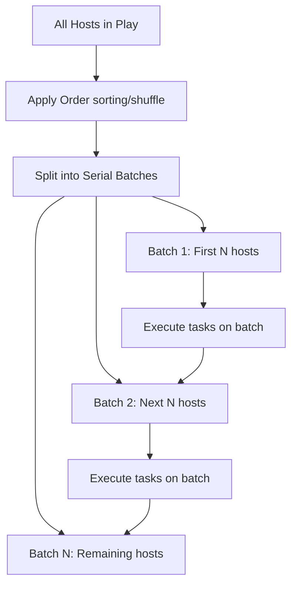

# How to Use the order Parameter to Control Host Execution Order

Author: [nawazdhandala](https://www.github.com/nawazdhandala)

Tags: Ansible, Playbook, Host Order, Execution Control

Description: Learn how to control the order in which Ansible processes hosts using the order parameter, including sorted, reverse, and shuffled modes.

---

By default, Ansible processes hosts in the order they appear in your inventory file. But sometimes you need a different order. Maybe you want to process hosts alphabetically for consistent output. Maybe you want a random order to avoid always hitting the same server first. Or maybe you want to reverse the order for a specific reason. The `order` parameter at the play level gives you this control.

## Available Order Options

The `order` parameter accepts five values:

- **inventory** (default): Process hosts in the order they appear in the inventory
- **sorted**: Process hosts in alphabetical order by name
- **reverse_sorted**: Process hosts in reverse alphabetical order
- **reverse_inventory**: Process hosts in reverse inventory order
- **shuffle**: Process hosts in random order (different every run)

## Basic Usage

Set the `order` parameter at the play level.

```yaml
# ordered-playbook.yml - processes hosts in alphabetical order
---
- name: Update all servers in alphabetical order
  hosts: all
  become: yes
  order: sorted

  tasks:
    - name: Show processing order
      debug:
        msg: "Processing {{ inventory_hostname }}"

    - name: Update packages
      apt:
        upgrade: safe
        update_cache: yes
```

## Inventory Order (Default)

With the default `inventory` order, hosts run in the sequence they are listed.

```ini
# inventory.ini
[webservers]
web-gamma
web-alpha
web-beta
```

```yaml
# default-order.yml - uses inventory order
---
- name: Process in inventory order
  hosts: webservers
  order: inventory

  tasks:
    - name: Show order
      debug:
        msg: "{{ inventory_hostname }}"
```

Output order: `web-gamma`, `web-alpha`, `web-beta` (exactly as listed in the inventory).

## Sorted Order

The `sorted` option processes hosts in alphabetical order by hostname, regardless of how they appear in the inventory.

```yaml
# sorted-order.yml - alphabetical processing
---
- name: Process alphabetically
  hosts: webservers
  order: sorted

  tasks:
    - name: Show order
      debug:
        msg: "{{ inventory_hostname }}"
```

Output order: `web-alpha`, `web-beta`, `web-gamma`.

This is useful for generating consistent, readable output. When you review playbook logs, having hosts in alphabetical order makes it easier to find a specific host's results.

## Reverse Sorted Order

The `reverse_sorted` option is the mirror of `sorted`.

```yaml
# reverse-sorted.yml - reverse alphabetical processing
---
- name: Process in reverse alphabetical order
  hosts: webservers
  order: reverse_sorted

  tasks:
    - name: Show order
      debug:
        msg: "{{ inventory_hostname }}"
```

Output order: `web-gamma`, `web-beta`, `web-alpha`.

## Shuffle Order

The `shuffle` option randomizes host order on every playbook run.

```yaml
# shuffled-order.yml - random order each time
---
- name: Process in random order
  hosts: webservers
  order: shuffle

  tasks:
    - name: Show order
      debug:
        msg: "{{ inventory_hostname }}"
```

Each run produces a different order. First run might be `web-beta`, `web-gamma`, `web-alpha`. Next run might be `web-alpha`, `web-gamma`, `web-beta`.

## Practical Use Cases

### Avoiding Thundering Herd with Shuffle

When you have hundreds of servers all pulling from the same package repository or artifact server, processing them in the same order every time can create predictable load spikes. Shuffling distributes the load more evenly.

```yaml
# distributed-update.yml - randomizes to spread load
---
- name: Update packages across fleet
  hosts: all
  become: yes
  order: shuffle
  serial: 10

  tasks:
    - name: Update apt cache
      apt:
        update_cache: yes

    - name: Upgrade packages
      apt:
        upgrade: safe
```

### Consistent Reporting with Sorted

For compliance reporting or auditing, having hosts processed in a predictable order makes reports easier to compare across runs.

```yaml
# compliance-check.yml - sorted for consistent reporting
---
- name: Security compliance check
  hosts: all
  order: sorted

  tasks:
    - name: Check SSH configuration
      command: grep "PermitRootLogin no" /etc/ssh/sshd_config
      register: ssh_check
      changed_when: false
      failed_when: false

    - name: Check firewall status
      command: ufw status
      register: fw_check
      changed_when: false

    - name: Report compliance status
      debug:
        msg: >
          Host: {{ inventory_hostname }} |
          SSH: {{ 'PASS' if ssh_check.rc == 0 else 'FAIL' }} |
          Firewall: {{ 'PASS' if 'active' in fw_check.stdout else 'FAIL' }}
```

### Canary-First with Inventory Order

Structure your inventory so canary hosts are listed first, then use inventory order to ensure they get updated before the rest.

```ini
# inventory.ini - canary hosts listed first
[webservers]
# Canary hosts (always processed first)
web-canary-01
web-canary-02

# Production hosts (processed after canaries)
web-prod-01
web-prod-02
web-prod-03
web-prod-04
web-prod-05
```

```yaml
# canary-deploy.yml - canaries first, then production
---
- name: Deploy with canary strategy
  hosts: webservers
  become: yes
  order: inventory
  serial: 2

  tasks:
    - name: Deploy application
      synchronize:
        src: /opt/releases/current/
        dest: /var/www/myapp/

    - name: Restart service
      service:
        name: myapp
        state: restarted

    - name: Health check
      uri:
        url: "http://localhost:8080/health"
        status_code: 200
      retries: 5
      delay: 3
```

## Order with Serial Batching

The `order` parameter interacts with `serial` to determine which hosts go in which batch.



For example, with `order: sorted` and `serial: 2` on hosts `[web-gamma, web-alpha, web-beta]`:

1. Hosts are sorted: `web-alpha, web-beta, web-gamma`
2. Batch 1: `web-alpha, web-beta`
3. Batch 2: `web-gamma`

## Different Orders for Different Plays

You can use different orders for different plays within the same playbook.

```yaml
# multi-order.yml - different ordering strategies per play
---
# Validation in sorted order for readable output
- name: Validate all hosts
  hosts: all
  order: sorted

  tasks:
    - name: Run validation
      command: /opt/scripts/validate.sh
      changed_when: false

# Deployment in shuffled order to spread load
- name: Deploy application
  hosts: webservers
  become: yes
  order: shuffle
  serial: 5

  tasks:
    - name: Deploy
      synchronize:
        src: /opt/releases/current/
        dest: /var/www/myapp/

# Verification in reverse sorted order (just because)
- name: Post-deployment verification
  hosts: webservers
  order: reverse_sorted

  tasks:
    - name: Verify
      uri:
        url: "http://{{ inventory_hostname }}:8080/health"
        status_code: 200
```

## A Note on Performance

The `order` parameter only affects the sequence in which hosts are processed. It does not change the parallelism of execution. If your `forks` setting is 5, Ansible still processes 5 hosts in parallel. The order determines which 5 hosts go first, not how many run simultaneously.

The `order` parameter is a small feature, but it gives you meaningful control over playbook execution behavior. Whether you need consistent output for reports, random distribution for load balancing, or specific sequencing for canary deployments, it handles the job with a single line of configuration.
