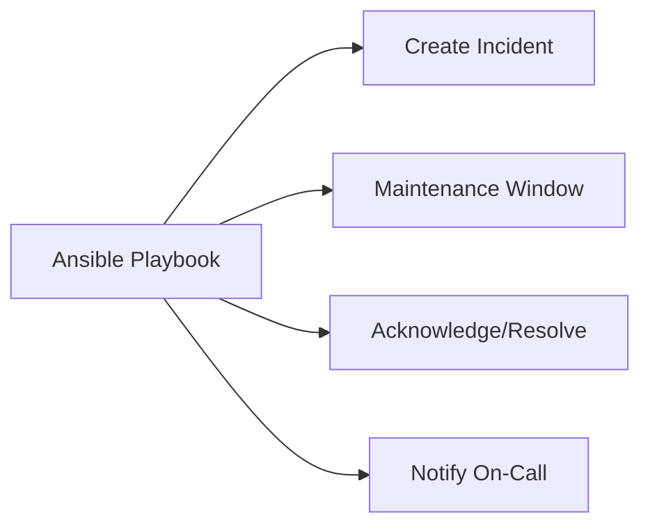

# How to Use Ansible with PagerDuty for Alerting

Author: [nawazdhandala](https://www.github.com/nawazdhandala)

Tags: Ansible, PagerDuty, Alerting, Incident Management

Description: Integrate Ansible with PagerDuty for automated incident creation, escalation, and acknowledgment during deployments and runbook execution.

---

PagerDuty is an incident management platform that routes alerts to on-call engineers. Ansible can interact with PagerDuty to create incidents, acknowledge them, add notes, and manage maintenance windows during deployments.

## Integration Points



## Creating PagerDuty Incidents

```yaml
# tasks/pagerduty-incident.yml
---
- name: Create PagerDuty incident
  community.general.pagerduty_alert:
    service_id: "{{ pagerduty_service_id }}"
    api_key: "{{ pagerduty_api_key }}"
    state: triggered
    desc: "{{ incident_description }}"
    incident_key: "{{ incident_key }}"
  register: pd_incident

- name: Add context to incident
  ansible.builtin.uri:
    url: "https://api.pagerduty.com/incidents/{{ pd_incident.incident_key }}/notes"
    method: POST
    headers:
      Authorization: "Token token={{ pagerduty_api_key }}"
    body_format: json
    body:
      note:
        content: "Automated incident from Ansible playbook. Runbook: {{ ansible_play_name }}"
```

## Maintenance Windows

```yaml
# tasks/pagerduty-maintenance.yml
---
- name: Create maintenance window for deployment
  ansible.builtin.uri:
    url: "https://api.pagerduty.com/maintenance_windows"
    method: POST
    headers:
      Authorization: "Token token={{ pagerduty_api_key }}"
    body_format: json
    body:
      maintenance_window:
        type: maintenance_window
        start_time: "{{ ansible_date_time.iso8601 }}"
        end_time: "{{ (ansible_date_time.epoch | int + maintenance_duration_seconds) | strftime('%Y-%m-%dT%H:%M:%SZ') }}"
        description: "Deployment of {{ app_version }}"
        services:
          - id: "{{ pagerduty_service_id }}"
            type: service_reference
  register: maintenance_window
```

## Deployment Notifications

```yaml
# playbooks/deploy-with-pagerduty.yml
---
- name: Deploy with PagerDuty integration
  hosts: app_servers
  become: true
  serial: "25%"

  pre_tasks:
    - name: Create maintenance window
      ansible.builtin.include_tasks: tasks/pagerduty-maintenance.yml
      run_once: true
      vars:
        maintenance_duration_seconds: 1800

  roles:
    - app_deploy

  post_tasks:
    - name: Close maintenance window
      ansible.builtin.uri:
        url: "https://api.pagerduty.com/maintenance_windows/{{ maintenance_window.json.maintenance_window.id }}"
        method: DELETE
        headers:
          Authorization: "Token token={{ pagerduty_api_key }}"
      run_once: true
      when: ansible_play_hosts_all[-1] == inventory_hostname
```

## Key Takeaways

Integrating Ansible with PagerDuty gives you automated incident management during operations. Create maintenance windows before deployments to suppress false alerts. Trigger incidents when runbooks detect failures. Acknowledge and resolve incidents programmatically when issues are fixed. This keeps your on-call team informed without manual intervention.

## Common Use Cases

Here are several practical scenarios where this module proves essential in real-world playbooks.

### Infrastructure Provisioning Workflow

```yaml
# Complete workflow incorporating this module
- name: Infrastructure provisioning
  hosts: all
  become: true
  gather_facts: true
  tasks:
    - name: Gather system information
      ansible.builtin.setup:
        gather_subset:
          - hardware
          - network

    - name: Display system summary
      ansible.builtin.debug:
        msg: >-
          Host {{ inventory_hostname }} has
          {{ ansible_memtotal_mb }}MB RAM,
          {{ ansible_processor_vcpus }} vCPUs,
          running {{ ansible_distribution }} {{ ansible_distribution_version }}

    - name: Install required packages
      ansible.builtin.package:
        name:
          - curl
          - wget
          - git
          - vim
          - htop
          - jq
        state: present

    - name: Configure system timezone
      ansible.builtin.timezone:
        name: "{{ system_timezone | default('UTC') }}"

    - name: Configure hostname
      ansible.builtin.hostname:
        name: "{{ inventory_hostname }}"

    - name: Update /etc/hosts
      ansible.builtin.lineinfile:
        path: /etc/hosts
        regexp: '^127\.0\.1\.1'
        line: "127.0.1.1 {{ inventory_hostname }}"

    - name: Configure SSH hardening
      ansible.builtin.lineinfile:
        path: /etc/ssh/sshd_config
        regexp: "{{ item.regexp }}"
        line: "{{ item.line }}"
      loop:
        - { regexp: '^PermitRootLogin', line: 'PermitRootLogin no' }
        - { regexp: '^PasswordAuthentication', line: 'PasswordAuthentication no' }
      notify: restart sshd

    - name: Configure firewall rules
      community.general.ufw:
        rule: allow
        port: "{{ item }}"
        proto: tcp
      loop:
        - "22"
        - "80"
        - "443"

    - name: Enable firewall
      community.general.ufw:
        state: enabled
        policy: deny

  handlers:
    - name: restart sshd
      ansible.builtin.service:
        name: sshd
        state: restarted
```

### Integration with Monitoring

```yaml
# Using gathered facts to configure monitoring thresholds
- name: Configure monitoring based on system specs
  hosts: all
  become: true
  tasks:
    - name: Set monitoring thresholds based on hardware
      ansible.builtin.template:
        src: monitoring_config.yml.j2
        dest: /etc/monitoring/config.yml
      vars:
        memory_warning_threshold: "{{ (ansible_memtotal_mb * 0.8) | int }}"
        memory_critical_threshold: "{{ (ansible_memtotal_mb * 0.95) | int }}"
        cpu_warning_threshold: 80
        cpu_critical_threshold: 95

    - name: Register host with monitoring system
      ansible.builtin.uri:
        url: "https://monitoring.example.com/api/hosts"
        method: POST
        body_format: json
        body:
          hostname: "{{ inventory_hostname }}"
          ip_address: "{{ ansible_default_ipv4.address }}"
          os: "{{ ansible_distribution }}"
          memory_mb: "{{ ansible_memtotal_mb }}"
          cpus: "{{ ansible_processor_vcpus }}"
        headers:
          Authorization: "Bearer {{ monitoring_api_token }}"
        status_code: [200, 201, 409]
```

### Error Handling Patterns

```yaml
# Robust error handling with this module
- name: Robust task execution
  hosts: all
  tasks:
    - name: Attempt primary operation
      ansible.builtin.command: /opt/app/primary-task.sh
      register: primary_result
      failed_when: false

    - name: Handle primary failure with fallback
      ansible.builtin.command: /opt/app/fallback-task.sh
      when: primary_result.rc != 0
      register: fallback_result

    - name: Report final status
      ansible.builtin.debug:
        msg: >-
          Task completed via {{ 'primary' if primary_result.rc == 0 else 'fallback' }} path.
          Return code: {{ primary_result.rc if primary_result.rc == 0 else fallback_result.rc }}

    - name: Fail if both paths failed
      ansible.builtin.fail:
        msg: "Both primary and fallback operations failed"
      when:
        - primary_result.rc != 0
        - fallback_result is defined
        - fallback_result.rc != 0
```

### Scheduling and Automation

```yaml
# Set up scheduled compliance scans using cron
- name: Configure automated scans
  hosts: all
  become: true
  tasks:
    - name: Create scan script
      ansible.builtin.copy:
        dest: /opt/scripts/compliance_scan.sh
        mode: '0755'
        content: |
          #!/bin/bash
          cd /opt/ansible
          ansible-playbook playbooks/validate.yml -i inventory/ > /var/log/compliance_scan.log 2>&1
          EXIT_CODE=$?
          if [ $EXIT_CODE -ne 0 ]; then
            curl -X POST https://hooks.example.com/alert \
              -H "Content-Type: application/json" \
              -d "{\"text\":\"Compliance scan failed on $(hostname)\"}"
          fi
          exit $EXIT_CODE

    - name: Schedule weekly compliance scan
      ansible.builtin.cron:
        name: "Weekly compliance scan"
        minute: "0"
        hour: "3"
        weekday: "1"
        job: "/opt/scripts/compliance_scan.sh"
        user: ansible
```

