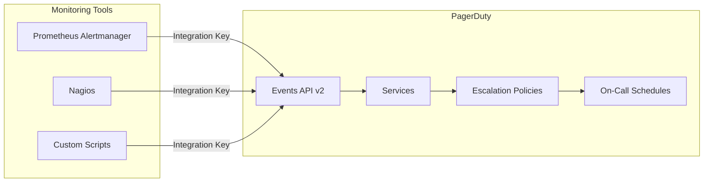

# How to Use Ansible to Configure PagerDuty Integration

Author: [nawazdhandala](https://www.github.com/nawazdhandala)

Tags: Ansible, PagerDuty, Incident Management, Alerting, DevOps

Description: Automate PagerDuty integration setup with Ansible for Prometheus Alertmanager, Nagios, and custom webhook-based alerting pipelines.

---

PagerDuty is the incident management platform that most operations teams either use or have considered using. It handles alert routing, on-call schedules, escalation policies, and incident tracking. Integrating it with your monitoring stack is straightforward, but doing it consistently across environments and keeping the configuration in sync with your infrastructure changes requires automation.

Ansible is a natural fit for this. You can define your PagerDuty integrations as variables, deploy the configuration to Alertmanager or other monitoring tools, and even use the PagerDuty API to manage services and escalation policies programmatically. In this post, I will cover integrating PagerDuty with Prometheus Alertmanager, Nagios, and custom webhook endpoints, all managed through Ansible.

## Integration Architecture



## Variables

Store PagerDuty configuration as Ansible variables, with sensitive keys in Ansible Vault.

```yaml
# group_vars/all.yml
pagerduty_api_token: "{{ vault_pagerduty_api_token }}"
pagerduty_events_url: "https://events.pagerduty.com/v2/enqueue"

# Service integration keys (from PagerDuty service settings)
pagerduty_services:
  production_critical:
    integration_key: "{{ vault_pd_prod_critical_key }}"
    severity: critical
    description: "Production critical alerts"

  production_warning:
    integration_key: "{{ vault_pd_prod_warning_key }}"
    severity: warning
    description: "Production warning alerts"

  staging:
    integration_key: "{{ vault_pd_staging_key }}"
    severity: warning
    description: "Staging environment alerts"

# Alertmanager configuration
alertmanager_version: "0.27.0"
alertmanager_port: 9093

# Alert routing rules
pagerduty_routing:
  - match:
      severity: critical
      environment: production
    service: production_critical
    repeat_interval: 30m

  - match:
      severity: warning
      environment: production
    service: production_warning
    repeat_interval: 4h

  - match:
      environment: staging
    service: staging
    repeat_interval: 8h
```

## Alertmanager PagerDuty Integration

The most common integration point. This role configures Alertmanager to route alerts to PagerDuty.

```yaml
# roles/alertmanager-pagerduty/tasks/main.yml
---
- name: Create Alertmanager configuration directory
  ansible.builtin.file:
    path: /etc/alertmanager
    state: directory
    owner: alertmanager
    group: alertmanager
    mode: '0755'

- name: Deploy Alertmanager configuration with PagerDuty receivers
  ansible.builtin.template:
    src: alertmanager.yml.j2
    dest: /etc/alertmanager/alertmanager.yml
    owner: alertmanager
    group: alertmanager
    mode: '0640'
  notify: Restart Alertmanager

- name: Validate Alertmanager configuration
  ansible.builtin.command:
    cmd: /usr/local/bin/amtool check-config /etc/alertmanager/alertmanager.yml
  changed_when: false

- name: Deploy custom notification templates
  ansible.builtin.template:
    src: pagerduty-template.tmpl.j2
    dest: /etc/alertmanager/templates/pagerduty.tmpl
    owner: alertmanager
    group: alertmanager
    mode: '0644'
  notify: Restart Alertmanager
```

The Alertmanager configuration template with PagerDuty receivers.

```jinja2
# roles/alertmanager-pagerduty/templates/alertmanager.yml.j2
# Alertmanager with PagerDuty - Managed by Ansible
global:
  resolve_timeout: 5m
  pagerduty_url: '{{ pagerduty_events_url }}'

templates:
  - '/etc/alertmanager/templates/*.tmpl'

route:
  group_by: ['alertname', 'cluster', 'service']
  group_wait: 30s
  group_interval: 5m
  repeat_interval: 4h
  receiver: 'default-pagerduty'

  routes:

    - match:

        {{ key }}: '{{ value }}'

      receiver: 'pagerduty-{{ rule.service }}'
      repeat_interval: {{ rule.repeat_interval }}
      continue: false


receivers:
  - name: 'default-pagerduty'
    pagerduty_configs:
      - service_key: '{{ pagerduty_services.production_warning.integration_key }}'
        severity: 'warning'
        description: '{{ "{{ template \"pagerduty.description\" . }}" }}'
        client: 'Prometheus Alertmanager'
        client_url: 'http://{{ ansible_fqdn }}:{{ alertmanager_port }}'
        details:
          firing: '{{ "{{ template \"pagerduty.firing\" . }}" }}'
          num_firing: '{{ "{{ .Alerts.Firing | len }}" }}'
          num_resolved: '{{ "{{ .Alerts.Resolved | len }}" }}'


  - name: 'pagerduty-{{ service_name }}'
    pagerduty_configs:
      - service_key: '{{ service_config.integration_key }}'
        severity: '{{ service_config.severity }}'
        description: '{{ "{{ template \"pagerduty.description\" . }}" }}'
        client: 'Prometheus Alertmanager'
        client_url: 'http://{{ ansible_fqdn }}:{{ alertmanager_port }}'
        details:
          firing: '{{ "{{ template \"pagerduty.firing\" . }}" }}'
          environment: '{{ service_name.split("_")[0] | default("unknown") }}'
          num_firing: '{{ "{{ .Alerts.Firing | len }}" }}'
          num_resolved: '{{ "{{ .Alerts.Resolved | len }}" }}'


inhibit_rules:
  - source_match:
      severity: 'critical'
    target_match:
      severity: 'warning'
    equal: ['alertname', 'cluster', 'service']
```

## Custom PagerDuty Notification Template

```jinja2
# roles/alertmanager-pagerduty/templates/pagerduty-template.tmpl.j2
{{ "{{ define \"pagerduty.description\" }}" }}
{{ "{{ .GroupLabels.SortedPairs.Values | join \" \" }}" }} - {{ "{{ .CommonAnnotations.summary }}" }}
{{ "{{ end }}" }}

{{ "{{ define \"pagerduty.firing\" }}" }}
{{ "{{ range .Alerts.Firing }}" }}
Alert: {{ "{{ .Labels.alertname }}" }}
Instance: {{ "{{ .Labels.instance }}" }}
Severity: {{ "{{ .Labels.severity }}" }}
Summary: {{ "{{ .Annotations.summary }}" }}
Description: {{ "{{ .Annotations.description }}" }}
Started: {{ "{{ .StartsAt.Format \"2006-01-02 15:04:05 MST\" }}" }}

{{ "{{ end }}" }}
{{ "{{ end }}" }}
```

## PagerDuty API Management

Use the PagerDuty API through Ansible to manage services and integrations programmatically.

```yaml
# roles/pagerduty-setup/tasks/main.yml
---
- name: Create PagerDuty service
  ansible.builtin.uri:
    url: "https://api.pagerduty.com/services"
    method: POST
    headers:
      Authorization: "Token token={{ pagerduty_api_token }}"
      Content-Type: "application/json"
    body_format: json
    body:
      service:
        name: "{{ item.name }}"
        description: "{{ item.description }}"
        escalation_policy:
          id: "{{ item.escalation_policy_id }}"
          type: "escalation_policy_reference"
        alert_creation: "create_alerts_and_incidents"
        auto_resolve_timeout: 14400
        acknowledgement_timeout: 1800
    status_code:
      - 201
      - 200
  loop: "{{ pagerduty_managed_services | default([]) }}"
  register: created_services

- name: Create Events API v2 integration on each service
  ansible.builtin.uri:
    url: "https://api.pagerduty.com/services/{{ item.json.service.id }}/integrations"
    method: POST
    headers:
      Authorization: "Token token={{ pagerduty_api_token }}"
      Content-Type: "application/json"
    body_format: json
    body:
      integration:
        name: "Prometheus Alertmanager"
        type: "events_api_v2_inbound_integration"
    status_code:
      - 201
      - 200
  loop: "{{ created_services.results }}"
  when: item is success
  register: created_integrations

- name: Display integration keys
  ansible.builtin.debug:
    msg: "Service: {{ item.json.integration.service.summary }} - Key: {{ item.json.integration.integration_key }}"
  loop: "{{ created_integrations.results }}"
  when: item is success
```

## Custom PagerDuty Trigger Script

For systems that do not have native PagerDuty support, deploy a reusable trigger script.

```yaml
# roles/pagerduty-trigger/tasks/main.yml
---
- name: Deploy PagerDuty trigger script
  ansible.builtin.template:
    src: pd-trigger.sh.j2
    dest: /usr/local/bin/pd-trigger
    owner: root
    group: root
    mode: '0755'
```

```jinja2
# roles/pagerduty-trigger/templates/pd-trigger.sh.j2
#!/bin/bash
# PagerDuty event trigger - Managed by Ansible
# Usage: pd-trigger <severity> <summary> <source> [details]
# Severities: critical, error, warning, info

SEVERITY="${1:-warning}"
SUMMARY="${2:-No summary provided}"
SOURCE="${3:-$(hostname)}"
DETAILS="${4:-}"
INTEGRATION_KEY="${PD_INTEGRATION_KEY:-{{ pagerduty_services.production_critical.integration_key }}}"

PAYLOAD=$(cat <<EOF
{
  "routing_key": "${INTEGRATION_KEY}",
  "event_action": "trigger",
  "payload": {
    "summary": "${SUMMARY}",
    "source": "${SOURCE}",
    "severity": "${SEVERITY}",
    "component": "${SOURCE}",
    "custom_details": {
      "details": "${DETAILS}",
      "hostname": "$(hostname)",
      "timestamp": "$(date -Iseconds)"
    }
  }
}
EOF
)

RESPONSE=$(curl -s -X POST \
  -H "Content-Type: application/json" \
  -d "${PAYLOAD}" \
  "{{ pagerduty_events_url }}")

echo "PagerDuty response: ${RESPONSE}"
```

## Testing the Integration

```yaml
# test-pagerduty.yml
---
- name: Test PagerDuty integration
  hosts: monitoring
  tasks:
    - name: Send a test alert through Alertmanager
      ansible.builtin.uri:
        url: "http://localhost:{{ alertmanager_port }}/api/v1/alerts"
        method: POST
        body_format: json
        body:
          - labels:
              alertname: "AnsiblePagerDutyTest"
              severity: "warning"
              environment: "production"
              service: "test"
            annotations:
              summary: "Test alert from Ansible PagerDuty integration"
              description: "This is a test alert to verify PagerDuty integration. Please acknowledge and resolve."
            startsAt: "{{ ansible_date_time.iso8601 }}"
        status_code: 200

    - name: Wait for alert to be sent
      ansible.builtin.pause:
        seconds: 15
        prompt: "Check PagerDuty for the test incident, then press Enter to resolve it"

    - name: Resolve the test alert
      ansible.builtin.uri:
        url: "http://localhost:{{ alertmanager_port }}/api/v1/alerts"
        method: POST
        body_format: json
        body:
          - labels:
              alertname: "AnsiblePagerDutyTest"
              severity: "warning"
              environment: "production"
              service: "test"
            endsAt: "{{ ansible_date_time.iso8601 }}"
        status_code: 200
```

## Handlers

```yaml
# roles/alertmanager-pagerduty/handlers/main.yml
---
- name: Restart Alertmanager
  ansible.builtin.service:
    name: alertmanager
    state: restarted
```

## Running the Playbook

```bash
# Deploy PagerDuty integration
ansible-playbook -i inventory/hosts.ini site.yml

# Test the integration
ansible-playbook -i inventory/hosts.ini test-pagerduty.yml

# Update only the Alertmanager configuration
ansible-playbook -i inventory/hosts.ini site.yml --tags alertmanager-config
```

## Wrapping Up

Managing PagerDuty integrations through Ansible gives you version-controlled alert routing, consistent configuration across environments, and easy testing of the entire incident pipeline. The key pieces are the Alertmanager configuration for routing alerts based on severity and environment labels, the PagerDuty API tasks for programmatic service management, and the trigger script for systems that need a simple CLI interface to PagerDuty. Keep your integration keys in Ansible Vault, and you have a secure, reproducible incident management integration.
