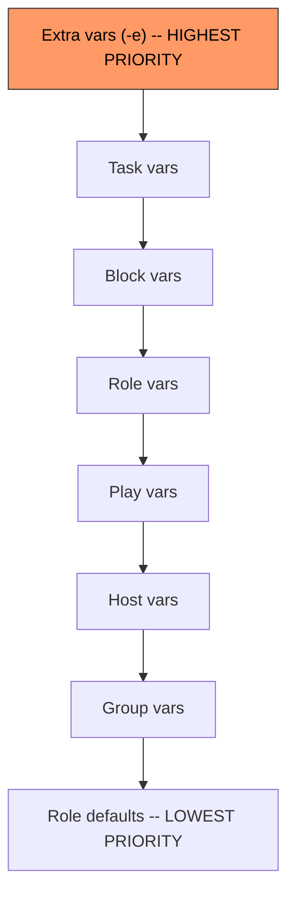

# How to Pass Extra Variables to an Ansible Playbook from Command Line

Author: [nawazdhandala](https://www.github.com/nawazdhandala)

Tags: Ansible, Variables, Command Line, Playbook

Description: Learn multiple ways to pass extra variables to Ansible playbooks using the command line, including key-value pairs, JSON, and files.

---

Variables are what make Ansible playbooks flexible and reusable. Instead of hardcoding values like server names, package versions, or deployment paths, you define variables and set them at runtime. The `-e` (or `--extra-vars`) flag is the most direct way to pass variables to a playbook without editing any files.

Extra variables passed via the command line have the highest precedence in Ansible's variable hierarchy. This means they override variables defined anywhere else, including in `group_vars`, `host_vars`, roles, and even the playbook itself.

## Basic Key-Value Pairs

The simplest form passes a single key-value pair.

```bash
# Pass a single variable to the playbook
ansible-playbook -i inventory.ini deploy.yml -e "app_version=2.4.1"
```

Your playbook can then reference this variable.

```yaml
# deploy.yml - uses the app_version variable
---
- name: Deploy application
  hosts: webservers
  become: yes

  tasks:
    - name: Download release artifact
      get_url:
        url: "https://releases.example.com/myapp-{{ app_version }}.tar.gz"
        dest: "/tmp/myapp-{{ app_version }}.tar.gz"

    - name: Extract to deploy directory
      unarchive:
        src: "/tmp/myapp-{{ app_version }}.tar.gz"
        dest: /var/www/myapp/
        remote_src: yes
```

## Multiple Variables

Pass multiple variables in a single `-e` flag by separating them with spaces inside quotes.

```bash
# Pass multiple variables at once
ansible-playbook -i inventory.ini deploy.yml -e "app_version=2.4.1 deploy_env=production max_workers=8"
```

You can also use multiple `-e` flags. This is cleaner when values contain spaces.

```bash
# Multiple -e flags for clarity
ansible-playbook -i inventory.ini deploy.yml \
  -e "app_version=2.4.1" \
  -e "deploy_env=production" \
  -e "deploy_message=Deploying hotfix for ticket JIRA-1234"
```

## Passing JSON Data

For complex data structures like lists or dictionaries, use JSON format.

```bash
# Pass a list as JSON
ansible-playbook -i inventory.ini configure.yml -e '{"packages": ["nginx", "redis", "postgresql"]}'

# Pass a dictionary as JSON
ansible-playbook -i inventory.ini configure.yml -e '{"database": {"host": "db01.example.com", "port": 5432, "name": "myapp_prod"}}'
```

In your playbook, access these just like any other variable.

```yaml
# configure.yml - uses complex variables from JSON
---
- name: Configure application stack
  hosts: appservers
  become: yes

  tasks:
    - name: Install required packages
      apt:
        name: "{{ item }}"
        state: present
      loop: "{{ packages }}"

    - name: Write database config
      template:
        src: templates/db.conf.j2
        dest: /etc/myapp/db.conf
      vars:
        db_host: "{{ database.host }}"
        db_port: "{{ database.port }}"
        db_name: "{{ database.name }}"
```

## Passing Variables from a File

When you have many variables, putting them in a file is much cleaner than cramming everything on the command line. Use the `@` prefix to load from a file.

```yaml
# vars/production.yml - variable file for production deployment
---
app_version: "2.4.1"
deploy_env: production
max_workers: 8
database:
  host: db01.example.com
  port: 5432
  name: myapp_prod
  pool_size: 20
redis:
  host: redis01.example.com
  port: 6379
```

```bash
# Load variables from a YAML file
ansible-playbook -i inventory.ini deploy.yml -e "@vars/production.yml"
```

You can also use JSON files.

```json
{
  "app_version": "2.4.1",
  "deploy_env": "production",
  "max_workers": 8
}
```

```bash
# Load variables from a JSON file
ansible-playbook -i inventory.ini deploy.yml -e "@vars/production.json"
```

## Combining Multiple Sources

You can mix and match all of these approaches. Later `-e` flags override earlier ones.

```bash
# Load from file, then override specific values
ansible-playbook -i inventory.ini deploy.yml \
  -e "@vars/production.yml" \
  -e "app_version=2.4.2" \
  -e "max_workers=16"
```

In this example, all values from `production.yml` apply, but `app_version` and `max_workers` get overridden by the inline values.

## Variable Precedence

Extra variables sit at the top of Ansible's 22-level variable precedence hierarchy. Here is a simplified view showing where extra vars fit in.



This means if you set `app_version: "1.0"` in `group_vars` and pass `-e "app_version=2.0"` on the command line, the value will be "2.0". Extra vars always win.

## Practical Scenarios

### CI/CD Pipeline Integration

In a CI/CD pipeline, you typically pass build-specific values as extra variables.

```bash
# Jenkins or GitLab CI example
ansible-playbook -i production.ini deploy.yml \
  -e "app_version=${BUILD_VERSION}" \
  -e "git_commit=${GIT_COMMIT}" \
  -e "deployed_by=${BUILD_USER}" \
  -e "build_number=${BUILD_NUMBER}"
```

### Environment-Specific Deployments

Use variable files for each environment and override as needed.

```bash
# Deploy to staging
ansible-playbook -i staging.ini deploy.yml -e "@vars/staging.yml"

# Deploy to production with a specific version
ansible-playbook -i production.ini deploy.yml -e "@vars/production.yml" -e "app_version=2.4.1"
```

### Feature Flags

Pass boolean flags to enable or disable features during deployment.

```bash
# Enable maintenance mode during deployment
ansible-playbook -i production.ini deploy.yml \
  -e "maintenance_mode=true" \
  -e "enable_debug_logging=false"
```

```yaml
# deploy.yml - uses boolean flags to control behavior
---
- name: Deploy with feature flags
  hosts: webservers
  become: yes

  tasks:
    - name: Enable maintenance page
      copy:
        src: files/maintenance.html
        dest: /var/www/html/maintenance.html
      when: maintenance_mode | bool

    - name: Set debug logging level
      lineinfile:
        path: /etc/myapp/logging.conf
        regexp: '^log_level='
        line: "log_level={{ 'DEBUG' if enable_debug_logging | bool else 'INFO' }}"
```

Note the `| bool` filter. When you pass variables on the command line, they come in as strings. The string "false" is truthy in Python/Jinja2 (any non-empty string is truthy). The `| bool` filter properly converts string values like "true", "false", "yes", "no" to actual booleans.

### Dynamic Host Selection

You can even pass the target host as an extra variable.

```yaml
# targeted-action.yml - runs on a dynamically specified host
---
- name: Run maintenance on specific host
  hosts: "{{ target_host }}"
  become: yes

  tasks:
    - name: Restart application service
      service:
        name: myapp
        state: restarted
```

```bash
# Specify the target host at runtime
ansible-playbook -i inventory.ini targeted-action.yml -e "target_host=web03"
```

## Security Considerations

Be careful about passing sensitive data like passwords on the command line. Command-line arguments are visible in process listings (`ps aux`) and shell history.

```bash
# BAD: Password visible in process list and shell history
ansible-playbook deploy.yml -e "db_password=supersecret123"

# BETTER: Use a file that is not committed to version control
ansible-playbook deploy.yml -e "@secrets/db-creds.yml"

# BEST: Use Ansible Vault for encrypted secrets
ansible-playbook deploy.yml -e "@secrets/db-creds.vault.yml" --ask-vault-pass
```

Extra variables are one of the most frequently used Ansible features in real-world automation. They turn static playbooks into flexible tools that adapt to different environments, versions, and scenarios. Master the `-e` flag and you will write playbooks that work across your entire infrastructure without modification.
