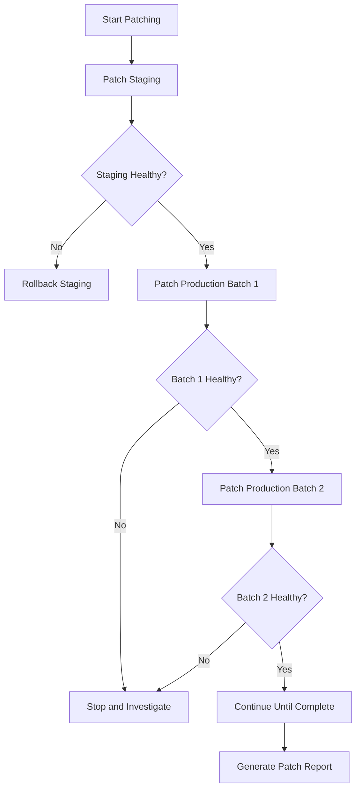

# How to Use Ansible to Patch Linux Servers

Author: [nawazdhandala](https://www.github.com/nawazdhandala)

Tags: Ansible, Patching, Security, Linux Administration

Description: Automate Linux server patching with Ansible for consistent, controlled, and documented updates across your entire fleet.

---

Patching Linux servers is one of those tasks that is simple in concept but tricky in practice. On one server, you run `yum update` and move on. But when you have hundreds of servers across multiple environments, patching becomes a coordination exercise. You need to patch staging first, verify nothing broke, patch production in controlled batches, handle servers that need reboots, and document everything for compliance.

Ansible turns this process into a repeatable workflow that handles all these concerns. This guide covers practical patching strategies from simple updates to sophisticated rolling patch deployments.

## Basic Patching Playbook

Let us start with the fundamentals. This playbook updates all packages on a group of servers:

```yaml
# patch-servers.yml - Basic server patching playbook
---
- name: Patch Linux servers
  hosts: "{{ target_group | default('staging') }}"
  become: true
  serial: "{{ batch_size | default(5) }}"

  tasks:
    # Update the package cache first
    - name: Update package cache (RedHat)
      ansible.builtin.yum:
        update_cache: true
      when: ansible_os_family == "RedHat"

    - name: Update package cache (Debian)
      ansible.builtin.apt:
        update_cache: true
        cache_valid_time: 3600
      when: ansible_os_family == "Debian"

    # Apply all available updates
    - name: Apply all updates (RedHat)
      ansible.builtin.yum:
        name: "*"
        state: latest
        security: "{{ security_only | default(false) }}"
      register: yum_result
      when: ansible_os_family == "RedHat"

    - name: Apply all updates (Debian)
      ansible.builtin.apt:
        upgrade: safe
      register: apt_result
      when: ansible_os_family == "Debian"

    # Display what was updated
    - name: Show updated packages (RedHat)
      ansible.builtin.debug:
        msg: "{{ yum_result.changes.updated | default([]) | length }} packages updated"
      when: ansible_os_family == "RedHat" and yum_result is changed

    - name: Show updated packages (Debian)
      ansible.builtin.debug:
        msg: "Packages updated on {{ inventory_hostname }}"
      when: ansible_os_family == "Debian" and apt_result is changed

    # Check if a reboot is required
    - name: Check if reboot is needed (RedHat)
      ansible.builtin.command:
        cmd: needs-restarting -r
      register: reboot_check
      changed_when: false
      failed_when: false
      when: ansible_os_family == "RedHat"

    - name: Check if reboot is needed (Debian)
      ansible.builtin.stat:
        path: /var/run/reboot-required
      register: reboot_file
      when: ansible_os_family == "Debian"

    # Flag servers that need reboot
    - name: Report reboot requirement
      ansible.builtin.debug:
        msg: "REBOOT REQUIRED on {{ inventory_hostname }}"
      when: >
        (ansible_os_family == "RedHat" and reboot_check.rc | default(0) == 1) or
        (ansible_os_family == "Debian" and reboot_file.stat.exists | default(false))
```

## Security-Only Patching

Sometimes you only want to apply security patches, especially on production systems:

```yaml
# security-patch.yml - Apply only security updates
---
- name: Apply security patches only
  hosts: production
  become: true
  serial: 3

  tasks:
    # Install yum-plugin-security if needed (RHEL/CentOS 7)
    - name: Install security plugin
      ansible.builtin.yum:
        name: yum-plugin-security
        state: present
      when:
        - ansible_os_family == "RedHat"
        - ansible_distribution_major_version | int <= 7

    # List available security updates before applying
    - name: List available security updates
      ansible.builtin.shell:
        cmd: "yum updateinfo list security --available 2>/dev/null || dnf updateinfo list --security --available"
      register: security_list
      changed_when: false
      when: ansible_os_family == "RedHat"

    - name: Display available security updates
      ansible.builtin.debug:
        var: security_list.stdout_lines
      when: ansible_os_family == "RedHat"

    # Apply security-only updates
    - name: Apply security updates (RedHat)
      ansible.builtin.yum:
        name: "*"
        state: latest
        security: true
      register: security_update
      when: ansible_os_family == "RedHat"

    - name: Apply security updates (Debian)
      ansible.builtin.shell:
        cmd: "apt-get -s dist-upgrade | grep '^Inst' | grep -i security | awk '{print $2}' | xargs apt-get install -y"
      register: security_update_deb
      when: ansible_os_family == "Debian"
      changed_when: "'0 newly installed' not in security_update_deb.stdout"

    # Record what was patched
    - name: Log patching activity
      ansible.builtin.lineinfile:
        path: /var/log/patch-history.log
        line: "{{ ansible_date_time.iso8601 }} - Security patches applied by Ansible"
        create: true
        mode: '0644'
```

## Rolling Patch Strategy with Validation

For production environments, you need a more careful approach. Patch in small batches, verify services are healthy after each batch, and stop if something goes wrong:

```yaml
# rolling-patch.yml - Rolling patch with health checks
---
- name: Rolling production patch
  hosts: production_web
  become: true
  serial: 2
  max_fail_percentage: 0  # Stop immediately if any server fails

  pre_tasks:
    # Take the server out of the load balancer
    - name: Disable server in load balancer
      ansible.builtin.uri:
        url: "http://{{ lb_api }}/api/servers/{{ inventory_hostname }}/disable"
        method: POST
      delegate_to: localhost

    # Wait for active connections to drain
    - name: Wait for connections to drain
      ansible.builtin.pause:
        seconds: 30

  tasks:
    # Create a snapshot/checkpoint before patching
    - name: Record pre-patch package state
      ansible.builtin.shell:
        cmd: "rpm -qa --qf '%{NAME}-%{VERSION}-%{RELEASE}\n' | sort > /var/log/packages-before-patch-$(date +%Y%m%d).txt"
      changed_when: true
      when: ansible_os_family == "RedHat"

    # Apply updates
    - name: Apply all updates
      ansible.builtin.yum:
        name: "*"
        state: latest
      register: patch_result
      when: ansible_os_family == "RedHat"

    # Record post-patch state
    - name: Record post-patch package state
      ansible.builtin.shell:
        cmd: "rpm -qa --qf '%{NAME}-%{VERSION}-%{RELEASE}\n' | sort > /var/log/packages-after-patch-$(date +%Y%m%d).txt"
      changed_when: true
      when: ansible_os_family == "RedHat"

    # Reboot if necessary
    - name: Check if reboot is needed
      ansible.builtin.command:
        cmd: needs-restarting -r
      register: reboot_needed
      changed_when: false
      failed_when: false
      when: ansible_os_family == "RedHat"

    - name: Reboot server if needed
      ansible.builtin.reboot:
        reboot_timeout: 300
        msg: "Rebooting for kernel/system update"
      when: reboot_needed.rc | default(0) == 1

  post_tasks:
    # Verify the server is healthy after patching
    - name: Wait for application to start
      ansible.builtin.wait_for:
        port: 8080
        timeout: 120

    # Run health check
    - name: Verify application health
      ansible.builtin.uri:
        url: "http://localhost:8080/health"
        status_code: 200
        timeout: 10
      register: health_check
      retries: 5
      delay: 10
      until: health_check.status == 200

    # Re-enable in load balancer
    - name: Enable server in load balancer
      ansible.builtin.uri:
        url: "http://{{ lb_api }}/api/servers/{{ inventory_hostname }}/enable"
        method: POST
      delegate_to: localhost

    # Wait for load balancer to mark as healthy
    - name: Wait for LB health check
      ansible.builtin.pause:
        seconds: 30
```

## Patching Workflow



## Generating Patch Compliance Reports

For auditing purposes, you often need a report of what was patched:

```yaml
# patch-report.yml - Generate patching compliance report
---
- name: Generate patch compliance report
  hosts: all
  become: true

  tasks:
    # Get list of installed updates
    - name: Get recent package updates (RedHat)
      ansible.builtin.shell:
        cmd: "rpm -qa --last | head -50"
      register: recent_updates
      changed_when: false
      when: ansible_os_family == "RedHat"

    # Check for pending updates
    - name: Check for pending updates (RedHat)
      ansible.builtin.shell:
        cmd: "yum check-update --quiet 2>/dev/null | wc -l"
      register: pending_count
      changed_when: false
      failed_when: false
      when: ansible_os_family == "RedHat"

    # Check kernel version
    - name: Get running kernel
      ansible.builtin.command:
        cmd: uname -r
      register: running_kernel
      changed_when: false

    # Get latest installed kernel
    - name: Get latest installed kernel (RedHat)
      ansible.builtin.shell:
        cmd: "rpm -q kernel --last | head -1 | awk '{print $1}' | sed 's/kernel-//'"
      register: latest_kernel
      changed_when: false
      when: ansible_os_family == "RedHat"

    # Build the report
    - name: Build compliance report
      ansible.builtin.set_fact:
        patch_report:
          hostname: "{{ inventory_hostname }}"
          os: "{{ ansible_distribution }} {{ ansible_distribution_version }}"
          running_kernel: "{{ running_kernel.stdout }}"
          latest_kernel: "{{ latest_kernel.stdout | default('N/A') }}"
          kernel_current: "{{ running_kernel.stdout == (latest_kernel.stdout | default('')) }}"
          pending_updates: "{{ pending_count.stdout | default('unknown') }}"

    - name: Display compliance report
      ansible.builtin.debug:
        var: patch_report

    # Write report to local file
    - name: Save report
      ansible.builtin.copy:
        content: "{{ patch_report | to_nice_yaml }}"
        dest: "/tmp/patch-report-{{ inventory_hostname }}.yml"
        mode: '0644'
      delegate_to: localhost
```

## Excluding Specific Packages

Sometimes you need to hold certain packages at a specific version:

```yaml
# patch-with-exclusions.yml - Patch with package exclusions
---
- name: Patch with exclusions
  hosts: all
  become: true

  vars:
    exclude_packages:
      - kernel*
      - docker-ce*
      - kubelet*
      - kubeadm*

  tasks:
    # Apply updates excluding specified packages
    - name: Apply updates with exclusions (RedHat)
      ansible.builtin.yum:
        name: "*"
        state: latest
        exclude: "{{ exclude_packages | join(',') }}"
      when: ansible_os_family == "RedHat"

    - name: Apply updates with holds (Debian)
      ansible.builtin.shell:
        cmd: |
          
          apt-mark hold {{ pkg }}
          
          apt-get upgrade -y
      when: ansible_os_family == "Debian"
      changed_when: true
```

## Practical Patching Tips

From years of patching production servers:

1. Always patch staging first and wait at least 24 hours before touching production. Some issues only show up under load or after a certain amount of uptime.

2. Use `serial` to control batch sizes. Start with small batches (2-3 servers) and increase as confidence grows. The `max_fail_percentage: 0` setting ensures the playbook stops immediately if any server in a batch fails.

3. Document your exclusions. If you exclude packages from patching, make sure there is a documented reason. "We always exclude kernel updates" without a reason is a red flag.

4. Track which servers need reboots separately from the patching itself. Not every update requires a reboot, and forcing unnecessary reboots causes downtime.

5. Maintain a rollback plan. On RHEL-family systems, `yum history undo` can revert the last transaction. On Debian, it is harder, so snapshot your servers before major patch cycles.

6. Schedule patching regularly. Monthly is the most common cadence for production systems. Falling behind on patches makes each patch cycle riskier because there are more changes.

7. Use `needs-restarting` (RHEL) or check `/var/run/reboot-required` (Debian) to determine if a reboot is actually needed. Kernel, glibc, and systemd updates typically require reboots. Most other packages do not.

Patching with Ansible gives you the consistency and documentation that manual patching never provides. Every patch cycle is identical, auditable, and repeatable.
