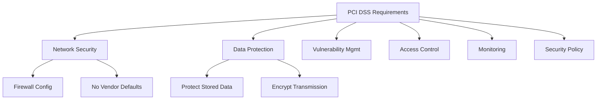

# How to Use Ansible to Automate PCI DSS Compliance

Author: [nawazdhandala](https://www.github.com/nawazdhandala)

Tags: Ansible, PCI DSS, Compliance, Security, Automation

Description: Automate PCI DSS compliance checks and remediation with Ansible covering network segmentation, encryption, access controls, and audit logging.

---

PCI DSS (Payment Card Industry Data Security Standard) compliance is mandatory for any organization that processes, stores, or transmits credit card data. The standard has 12 main requirements spanning network security, data protection, vulnerability management, access control, monitoring, and security policies. Manually verifying compliance across all systems in your cardholder data environment (CDE) is a massive undertaking. Ansible automates both the compliance checking and the remediation.

## PCI DSS Requirements Overview



## Compliance Check Tasks

```yaml
# roles/pci_dss/tasks/main.yml - PCI DSS compliance automation
---
- name: "Req 1: Install and maintain a firewall"
  include_tasks: req1_firewall.yml

- name: "Req 2: Do not use vendor-supplied defaults"
  include_tasks: req2_defaults.yml

- name: "Req 3: Protect stored cardholder data"
  include_tasks: req3_stored_data.yml

- name: "Req 4: Encrypt transmission of cardholder data"
  include_tasks: req4_encryption.yml

- name: "Req 5: Use and update anti-virus"
  include_tasks: req5_antivirus.yml

- name: "Req 6: Develop and maintain secure systems"
  include_tasks: req6_secure_systems.yml

- name: "Req 7: Restrict access to cardholder data"
  include_tasks: req7_access_control.yml

- name: "Req 8: Assign unique IDs"
  include_tasks: req8_unique_ids.yml

- name: "Req 10: Track and monitor all access"
  include_tasks: req10_monitoring.yml

- name: Generate PCI DSS compliance report
  template:
    src: pci_report.j2
    dest: "/opt/compliance/pci_dss_{{ inventory_hostname }}_{{ ansible_date_time.date }}.txt"
    mode: '0600'
```

## Requirement 1: Firewall Configuration

```yaml
# roles/pci_dss/tasks/req1_firewall.yml - Firewall compliance
---
- name: "1.1: Verify firewall is installed and active"
  command: ufw status
  register: firewall_status
  changed_when: false

- name: "1.1: Enable firewall if not active"
  ufw:
    state: enabled
  when: "'inactive' in firewall_status.stdout"

- name: "1.2: Deny all inbound by default"
  ufw:
    direction: incoming
    default: deny

- name: "1.3: Restrict inbound traffic to CDE"
  ufw:
    rule: allow
    port: "{{ item.port }}"
    proto: tcp
    src: "{{ item.src }}"
  loop: "{{ pci_allowed_inbound_rules }}"

- name: Record Requirement 1 results
  set_fact:
    pci_results: "{{ pci_results | default([]) + [{'req': '1', 'check': 'Firewall active', 'status': 'PASS' if 'active' in firewall_status.stdout else 'FAIL'}] }}"
```

## Requirement 4: Encryption in Transit

```yaml
# roles/pci_dss/tasks/req4_encryption.yml - Encryption compliance
---
- name: "4.1: Check TLS versions in use"
  command: openssl s_client -connect localhost:443 -tls1_1
  register: tls11_check
  ignore_errors: yes
  changed_when: false

- name: "4.1: Verify TLS 1.0 and 1.1 are disabled"
  set_fact:
    pci_results: "{{ pci_results | default([]) + [{'req': '4', 'check': 'TLS 1.1 disabled', 'status': 'PASS' if tls11_check.rc != 0 else 'FAIL'}] }}"

- name: "4.1: Enforce TLS 1.2+ in Nginx"
  lineinfile:
    path: /etc/nginx/nginx.conf
    regexp: 'ssl_protocols'
    line: '    ssl_protocols TLSv1.2 TLSv1.3;'
  when: pci_auto_remediate | default(false)
  notify: reload nginx
```

## Running the Compliance Check

```bash
# Run PCI DSS compliance audit
ansible-playbook -i inventory/cde.ini pci-audit.yml

# Run with auto-remediation
ansible-playbook -i inventory/cde.ini pci-audit.yml -e "pci_auto_remediate=true"
```

## Summary

Ansible transforms PCI DSS compliance from a periodic, manual audit into a continuous, automated process. By encoding each requirement as Ansible tasks, you can run compliance checks on demand or on a schedule, generating reports that document your compliance posture. The optional auto-remediation feature fixes common issues automatically, keeping your CDE in a compliant state between formal audits.

## Building Custom Compliance Roles

The most effective approach is creating a dedicated compliance role with tasks organized by control area:

```yaml
# roles/compliance_checks/tasks/main.yml
# Master task list for compliance validation
- name: Load compliance requirements
  ansible.builtin.include_vars:
    file: "requirements/{{ compliance_framework }}.yml"

- name: Run access control checks
  ansible.builtin.include_tasks: access_control.yml
  tags: [access]

- name: Run encryption checks
  ansible.builtin.include_tasks: encryption.yml
  tags: [encryption]

- name: Run logging checks
  ansible.builtin.include_tasks: logging.yml
  tags: [logging]

- name: Run network security checks
  ansible.builtin.include_tasks: network.yml
  tags: [network]

- name: Generate compliance report
  ansible.builtin.include_tasks: report.yml
  tags: [report]
```

## Encrypting Data at Rest

```yaml
# roles/compliance_checks/tasks/encryption.yml
# Verify encryption requirements are met
- name: Check if LUKS encryption is enabled on data volumes
  ansible.builtin.command: lsblk -f
  register: block_devices
  changed_when: false

- name: Check TLS certificate validity
  ansible.builtin.command: >
    openssl x509 -in /etc/ssl/certs/app.pem -noout -dates
  register: cert_dates
  changed_when: false
  failed_when: false

- name: Verify certificate is not expired
  ansible.builtin.assert:
    that:
      - cert_dates.rc == 0
    fail_msg: "TLS certificate check failed"
    success_msg: "TLS certificate is valid"
```

## Networking and Firewall Validation

```yaml
# roles/compliance_checks/tasks/network.yml
# Validate network security controls
- name: Check firewall is active
  ansible.builtin.command: ufw status
  register: firewall_status
  changed_when: false
  failed_when: false

- name: Assert firewall is enabled
  ansible.builtin.assert:
    that:
      - "'Status: active' in firewall_status.stdout"
    fail_msg: "Firewall is not active"

- name: Check for unauthorized listening ports
  ansible.builtin.command: ss -tlnp
  register: listening_ports
  changed_when: false

- name: Verify only approved ports are open
  ansible.builtin.assert:
    that:
      - "item not in listening_ports.stdout"
    fail_msg: "Unauthorized port {{ item }} is listening"
  loop: "{{ prohibited_ports | default(['23', '21', '69']) }}"
```

## Automated Remediation Workflow

The real power of compliance automation is combining detection with remediation:

```yaml
# playbooks/remediate_compliance.yml
# Detect and fix compliance issues automatically
- name: Compliance remediation
  hosts: all
  become: true
  tasks:
    - name: Ensure SSH hardening
      ansible.builtin.lineinfile:
        path: /etc/ssh/sshd_config
        regexp: "{{ item.regexp }}"
        line: "{{ item.line }}"
      loop:
        - { regexp: '^PermitRootLogin', line: 'PermitRootLogin no' }
        - { regexp: '^PasswordAuthentication', line: 'PasswordAuthentication no' }
        - { regexp: '^X11Forwarding', line: 'X11Forwarding no' }
        - { regexp: '^MaxAuthTries', line: 'MaxAuthTries 4' }
        - { regexp: '^ClientAliveInterval', line: 'ClientAliveInterval 300' }
        - { regexp: '^ClientAliveCountMax', line: 'ClientAliveCountMax 0' }
      notify: restart sshd

    - name: Ensure audit logging is configured
      ansible.builtin.package:
        name: auditd
        state: present

    - name: Start and enable auditd
      ansible.builtin.service:
        name: auditd
        state: started
        enabled: true

    - name: Deploy audit rules
      ansible.builtin.copy:
        dest: /etc/audit/rules.d/compliance.rules
        content: |
          # Monitor authentication events
          -w /var/log/faillog -p wa -k logins
          -w /var/log/lastlog -p wa -k logins
          # Monitor user and group changes
          -w /etc/passwd -p wa -k identity
          -w /etc/group -p wa -k identity
          -w /etc/shadow -p wa -k identity
          # Monitor sudo usage
          -w /etc/sudoers -p wa -k actions
          -w /var/log/sudo.log -p wa -k actions
        mode: '0640'
      notify: restart auditd

    - name: Configure password aging
      ansible.builtin.lineinfile:
        path: /etc/login.defs
        regexp: "{{ item.regexp }}"
        line: "{{ item.line }}"
      loop:
        - { regexp: '^PASS_MAX_DAYS', line: 'PASS_MAX_DAYS 90' }
        - { regexp: '^PASS_MIN_DAYS', line: 'PASS_MIN_DAYS 7' }
        - { regexp: '^PASS_WARN_AGE', line: 'PASS_WARN_AGE 14' }

  handlers:
    - name: restart sshd
      ansible.builtin.service:
        name: sshd
        state: restarted

    - name: restart auditd
      ansible.builtin.service:
        name: auditd
        state: restarted
```

## Report Generation

```yaml
# playbooks/generate_report.yml
# Generate a human-readable compliance report
- name: Generate compliance report
  hosts: all
  become: true
  vars:
    checks_passed: []
    checks_failed: []
  tasks:
    - name: Check SSH root login
      ansible.builtin.command: sshd -T
      register: sshd_config
      changed_when: false

    - name: Record SSH check
      ansible.builtin.set_fact:
        checks_passed: "{{ checks_passed + ['SSH root login disabled'] }}"
      when: "'permitrootlogin no' in sshd_config.stdout"

    - name: Record SSH failure
      ansible.builtin.set_fact:
        checks_failed: "{{ checks_failed + ['SSH root login NOT disabled'] }}"
      when: "'permitrootlogin no' not in sshd_config.stdout"

    - name: Check password complexity
      ansible.builtin.command: grep -E '^minlen' /etc/security/pwquality.conf
      register: pwquality
      changed_when: false
      failed_when: false

    - name: Record password check
      ansible.builtin.set_fact:
        checks_passed: "{{ checks_passed + ['Password minimum length configured'] }}"
      when: pwquality.rc == 0

    - name: Print compliance summary
      ansible.builtin.debug:
        msg: |
          ========================================
          Compliance Report for {{ inventory_hostname }}
          Date: {{ ansible_date_time.iso8601 }}
          ========================================
          PASSED: {{ checks_passed | length }}
          
            [PASS] {{ check }}
          
          FAILED: {{ checks_failed | length }}
          
            [FAIL] {{ check }}
          
          ========================================
          Score: {{ (checks_passed | length * 100 / (checks_passed | length + checks_failed | length)) | round(1) }}%
```

