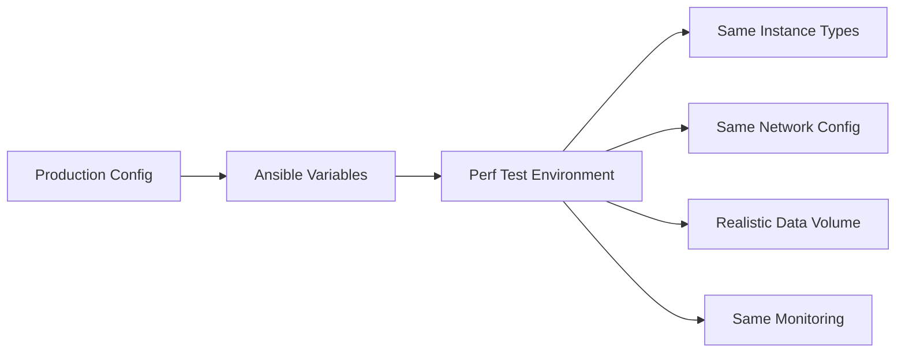

# How to Use Ansible for Performance Testing Environments

Author: [nawazdhandala](https://www.github.com/nawazdhandala)

Tags: Ansible, Performance Testing, DevOps, Infrastructure

Description: Build dedicated performance testing environments with Ansible that mirror production for accurate benchmarking and performance regression detection.

---

Performance testing only produces meaningful results when the test environment closely matches production. If you test on undersized instances or with a fraction of the data, your results will not predict real-world performance. Ansible can provision and configure performance testing environments that mirror your production setup, complete with realistic data, proper monitoring, and the right instance types.

This guide covers building performance testing environments with Ansible.

## Why Dedicated Performance Environments Matter

Testing performance on a shared staging environment gives misleading results. Other workloads compete for resources. The instance types are smaller. The database has less data. You need a dedicated environment that is as close to production as possible.



## Environment Specification

Define the performance environment to match production:

```yaml
# environments/performance.yml
# Performance testing environment - mirrors production
---
env_name: perf
env_domain: perf.internal.example.com

compute:
  web_servers:
    count: 3
    instance_type: c6g.xlarge  # Same as production
    ami: "{{ production_ami }}"
  app_servers:
    count: 3
    instance_type: m6g.xlarge  # Same as production
    ami: "{{ production_ami }}"
  db_servers:
    count: 2
    instance_type: r6g.2xlarge  # Same as production
    storage_size: 500  # Same as production

monitoring:
  enabled: true
  prometheus_retention: 30d
  grafana_enabled: true

data:
  seed_from_production: true
  anonymize: true
  data_volume_percentage: 100  # Full production data volume
```

## Provisioning the Environment

```yaml
# playbooks/provision-perf-env.yml
# Provision a production-mirror performance testing environment
---
- name: Provision performance test infrastructure
  hosts: localhost
  connection: local
  vars_files:
    - environments/performance.yml

  tasks:
    - name: Create VPC mirroring production network topology
      ansible.builtin.include_role:
        name: provision_network
      vars:
        vpc_cidr: 10.50.0.0/16
        create_nat_gateway: true

    - name: Launch compute instances
      ansible.builtin.include_role:
        name: provision_compute

    - name: Create RDS instance matching production specs
      amazon.aws.rds_instance:
        id: "perf-{{ db_name }}"
        instance_type: "{{ compute.db_servers.instance_type }}"
        engine: postgresql
        engine_version: "15"
        allocated_storage: "{{ compute.db_servers.storage_size }}"
        storage_type: gp3
        storage_iops: 3000
        db_name: "{{ db_name }}"
        master_username: "{{ db_admin_user }}"
        master_user_password: "{{ db_admin_password }}"
        vpc_security_group_ids:
          - "{{ db_sg_id }}"
        tags:
          Environment: perf
        state: present
      register: perf_db

- name: Configure base OS on all servers
  hosts: perf
  become: true
  roles:
    - common
    - monitoring_agent
    - security_baseline

- name: Configure web tier
  hosts: perf_webservers
  become: true
  roles:
    - nginx
    - ssl_certs

- name: Configure app tier
  hosts: perf_appservers
  become: true
  roles:
    - java_runtime
    - app_deploy
```

## Seeding Realistic Test Data

Performance tests need realistic data volumes:

```yaml
# roles/perf_data_seed/tasks/main.yml
# Seed the performance database with production-like data
---
- name: Check if data is already seeded
  community.postgresql.postgresql_query:
    db: "{{ db_name }}"
    login_host: "{{ perf_db_host }}"
    login_user: "{{ db_admin_user }}"
    login_password: "{{ db_admin_password }}"
    query: "SELECT count(*) as row_count FROM users;"
  register: data_check
  ignore_errors: true

- name: Create sanitized production dump
  ansible.builtin.command:
    cmd: >
      pg_dump -h {{ prod_db_host }} -U {{ prod_db_user }}
      --no-owner --no-privileges
      -T audit_logs -T sessions
      {{ prod_db_name }}
      | gzip > /tmp/prod_dump.sql.gz
  delegate_to: "{{ prod_db_bastion }}"
  when: data_check.query_result[0].row_count | int < 1000
  no_log: true

- name: Transfer dump to performance database host
  ansible.builtin.copy:
    src: /tmp/prod_dump.sql.gz
    dest: /tmp/prod_dump.sql.gz
    mode: '0600'
  when: data_check.query_result[0].row_count | int < 1000

- name: Restore data to performance database
  ansible.builtin.shell: |
    gunzip -c /tmp/prod_dump.sql.gz | \
    psql -h {{ perf_db_host }} -U {{ db_admin_user }} {{ db_name }}
  environment:
    PGPASSWORD: "{{ db_admin_password }}"
  when: data_check.query_result[0].row_count | int < 1000

- name: Anonymize personal data
  community.postgresql.postgresql_query:
    db: "{{ db_name }}"
    login_host: "{{ perf_db_host }}"
    login_user: "{{ db_admin_user }}"
    login_password: "{{ db_admin_password }}"
    query: |
      UPDATE users SET
        email = 'user_' || id || '@test.example.com',
        first_name = 'Test',
        last_name = 'User_' || id,
        phone = NULL;
      UPDATE payment_methods SET
        card_number = '4111111111111111',
        card_holder = 'TEST USER';

- name: Clean up dump file
  ansible.builtin.file:
    path: /tmp/prod_dump.sql.gz
    state: absent
```

## Setting Up Performance Monitoring

You need detailed monitoring during performance tests:

```yaml
# roles/perf_monitoring/tasks/main.yml
# Deploy monitoring stack for performance testing
---
- name: Deploy Prometheus for metrics collection
  community.docker.docker_compose_v2:
    project_src: /opt/monitoring
    state: present

- name: Deploy Prometheus configuration
  ansible.builtin.template:
    src: prometheus.yml.j2
    dest: /opt/monitoring/prometheus/prometheus.yml
    mode: '0644'
  notify: restart prometheus
```

```yaml
# roles/perf_monitoring/templates/prometheus.yml.j2
# Prometheus config for performance test monitoring
global:
  scrape_interval: 5s  # Higher frequency for perf testing
  evaluation_interval: 5s

scrape_configs:
  - job_name: 'app-servers'
    static_configs:

      - targets: ['{{ hostvars[host].ansible_host }}:{{ app_metrics_port }}']
        labels:
          instance: '{{ host }}'


  - job_name: 'web-servers'
    static_configs:

      - targets: ['{{ hostvars[host].ansible_host }}:9113']
        labels:
          instance: '{{ host }}'


  - job_name: 'postgres'
    static_configs:
      - targets: ['{{ perf_db_host }}:9187']

  - job_name: 'node'
    static_configs:

      - targets: ['{{ hostvars[host].ansible_host }}:9100']
        labels:
          instance: '{{ host }}'

```

## Running Performance Test Suites

```yaml
# playbooks/run-perf-tests.yml
# Execute performance test suite and collect results
---
- name: Prepare for performance test
  hosts: perf_appservers
  become: true
  tasks:
    - name: Clear application caches
      ansible.builtin.command:
        cmd: "curl -X POST http://localhost:{{ app_port }}/admin/cache/clear"
      changed_when: true

    - name: Restart services to clear memory state
      ansible.builtin.systemd:
        name: "{{ app_name }}"
        state: restarted

    - name: Wait for services to be ready
      ansible.builtin.uri:
        url: "http://localhost:{{ app_port }}/health"
        status_code: 200
      retries: 30
      delay: 5

- name: Run performance tests
  hosts: load_generators
  tasks:
    - name: Execute k6 performance test
      ansible.builtin.command:
        cmd: >
          k6 run
          --out json=/opt/results/{{ test_run_id }}.json
          --tag testrun={{ test_run_id }}
          /opt/load-tests/test.js
      async: 7200
      poll: 60
      register: test_result

    - name: Check for performance regressions
      ansible.builtin.assert:
        that:
          - "'✓' in test_result.stdout"
        fail_msg: "Performance test FAILED - regression detected"
        success_msg: "Performance test PASSED"
```

## Environment Teardown

```yaml
# playbooks/teardown-perf-env.yml
# Destroy performance testing environment
---
- name: Teardown performance environment
  hosts: localhost
  connection: local
  tasks:
    - name: Terminate EC2 instances
      amazon.aws.ec2_instance:
        state: absent
        filters:
          "tag:Environment": perf

    - name: Delete RDS instance
      amazon.aws.rds_instance:
        id: "perf-{{ db_name }}"
        state: absent
        skip_final_snapshot: true

    - name: Display teardown complete
      ansible.builtin.debug:
        msg: "Performance testing environment destroyed"
```

## Key Takeaways

Meaningful performance testing requires environments that match production. Use Ansible to provision these environments on demand with the same instance types, network topology, and data volumes as production. Always anonymize production data before loading it into test environments. Deploy comprehensive monitoring so you can identify bottlenecks. Automate the full lifecycle from provisioning to test execution to teardown so performance testing becomes a routine part of your release process rather than a special event.
