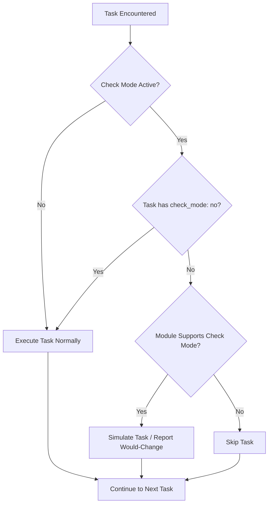

# How to Run an Ansible Playbook in Check Mode (Dry Run)

Author: [nawazdhandala](https://www.github.com/nawazdhandala)

Tags: Ansible, Playbook, Check Mode, DevOps, Testing

Description: Learn how to use Ansible check mode to preview changes before applying them, ensuring safe playbook execution in production.

---

Running a playbook directly in production without knowing what it will change is a gamble nobody should take. Ansible's check mode (also called dry run) lets you preview exactly what changes a playbook would make without actually modifying anything on your target hosts. This is an essential tool for validating playbooks before deploying to live environments.

## What Check Mode Does

When you run a playbook in check mode, Ansible goes through all the tasks and reports what it would change. It connects to the remote hosts, gathers facts, evaluates conditions, and checks the current state of resources. But it stops short of making any actual modifications.

Think of it as a "what if" scenario. The output looks the same as a normal run, but every task that would make a change shows up as "changed" without actually changing anything.

## Running Check Mode from the Command Line

The simplest way to use check mode is with the `--check` flag.

```bash
# Preview what the playbook would do without making changes
ansible-playbook -i inventory.ini site.yml --check
```

You can also combine it with `--diff` to see the actual content differences.

```bash
# Preview changes and show file diffs
ansible-playbook -i inventory.ini site.yml --check --diff
```

The output will look something like this:

```
TASK [Deploy nginx config] ****************************************************
--- before: /etc/nginx/nginx.conf
+++ after: /home/deploy/.ansible/tmp/nginx.conf
@@ -1,4 +1,4 @@
-worker_processes  1;
+worker_processes  4;

changed: [web01]
```

This tells you the playbook would change `worker_processes` from 1 to 4 in the nginx config, without actually doing it.

## Enabling Check Mode on Individual Tasks

You do not have to run the entire playbook in check mode. You can mark individual tasks to always run in check mode, or to never run in check mode, using the `check_mode` directive.

```yaml
# deploy.yml - demonstrates per-task check mode control
---
- name: Deploy application
  hosts: webservers
  become: yes

  tasks:
    # This task always runs in check mode, even during a real run
    - name: Verify disk space before deployment
      shell: df -h /var/www | tail -1 | awk '{print $5}' | sed 's/%//'
      register: disk_usage
      check_mode: yes
      changed_when: false

    # This task never runs in check mode (it always executes)
    - name: Log deployment attempt to audit system
      uri:
        url: "https://audit.example.com/api/deployments"
        method: POST
        body_format: json
        body:
          playbook: deploy
          timestamp: "{{ ansible_date_time.iso8601 }}"
      check_mode: no

    - name: Deploy application files
      synchronize:
        src: /opt/releases/current/
        dest: /var/www/app/
```

Setting `check_mode: yes` on a task means it will always operate in check mode, which is useful for validation tasks. Setting `check_mode: no` means the task will always execute, which makes sense for audit logging or read-only operations.

## Handling Modules That Do Not Support Check Mode

Not every Ansible module supports check mode. The `shell`, `command`, and `raw` modules are the biggest offenders because Ansible has no way to predict what a shell command will do without actually running it.

When check mode hits one of these tasks, it skips them entirely. This can cause issues if later tasks depend on the output of a skipped task.

```yaml
# workaround.yml - handles check mode for shell commands
---
- name: Database migration with check mode support
  hosts: dbservers
  become: yes

  tasks:
    # This shell task gets skipped in check mode, so register a default
    - name: Check current database schema version
      shell: psql -t -c "SELECT version FROM schema_info LIMIT 1;"
      register: schema_version
      changed_when: false
      check_mode: no

    - name: Run database migration
      shell: /opt/app/migrate.sh --to-version {{ target_version }}
      when: schema_version.stdout | trim | int < target_version | int
```

By setting `check_mode: no` on the first task, it will always execute (it is read-only anyway), so the registered variable will be available for the conditional on the second task.

## Check Mode Decision Flow

Here is how Ansible decides what to do with each task during check mode.



## Practical Use Cases

### Pre-deployment Validation

Before deploying to production, run check mode against your staging and production inventories to compare what would happen.

```bash
# Check what would change in staging
ansible-playbook -i staging.ini deploy.yml --check --diff > staging-changes.txt

# Check what would change in production
ansible-playbook -i production.ini deploy.yml --check --diff > production-changes.txt

# Compare the two
diff staging-changes.txt production-changes.txt
```

### Configuration Drift Detection

Use check mode on a schedule to detect when hosts have drifted from their expected state.

```yaml
# drift-check.yml - detects configuration drift across the fleet
---
- name: Check for configuration drift
  hosts: all
  become: yes

  tasks:
    - name: Verify sshd_config matches expected state
      copy:
        src: files/sshd_config
        dest: /etc/ssh/sshd_config
        owner: root
        group: root
        mode: '0600'
      register: sshd_result

    - name: Verify resolv.conf matches expected state
      copy:
        src: files/resolv.conf
        dest: /etc/resolv.conf
        owner: root
        group: root
        mode: '0644'
      register: resolv_result

    - name: Report drift detected
      debug:
        msg: "DRIFT DETECTED on {{ inventory_hostname }}: sshd={{ sshd_result.changed }}, resolv={{ resolv_result.changed }}"
      when: sshd_result.changed or resolv_result.changed
```

Run this with check mode on a cron job:

```bash
# Run drift detection every hour via cron
0 * * * * ansible-playbook -i production.ini drift-check.yml --check 2>&1 | grep "DRIFT DETECTED" >> /var/log/ansible-drift.log
```

### CI/CD Pipeline Integration

Add check mode as a validation step in your CI/CD pipeline before allowing deployments.

```bash
# In your CI pipeline script
# Step 1: Syntax check
ansible-playbook deploy.yml --syntax-check

# Step 2: Dry run to verify no unexpected changes
ansible-playbook -i production.ini deploy.yml --check --diff

# Step 3: If check mode passes review, do the real deployment
ansible-playbook -i production.ini deploy.yml
```

## Limitations to Keep in Mind

Check mode is not perfect. Here are the situations where it falls short:

**Dependent tasks chain**: If task B depends on output from task A, and task A gets skipped in check mode, task B might fail or report incorrect results.

**Idempotency assumptions**: Check mode assumes modules are idempotent, but `shell` and `command` modules cannot be checked because Ansible does not know what the command will do.

**External state changes**: If your playbook interacts with external APIs or services, check mode cannot predict how those services will respond to actual requests.

**File content from templates**: While check mode can detect that a template would change, the diff output depends on the current state of the remote file. If the remote file does not exist yet, the diff is less useful.

Despite these limitations, check mode is one of the most valuable safety nets in the Ansible toolbox. Make it a habit to run `--check --diff` before every production deployment, and you will catch problems before they become outages.
