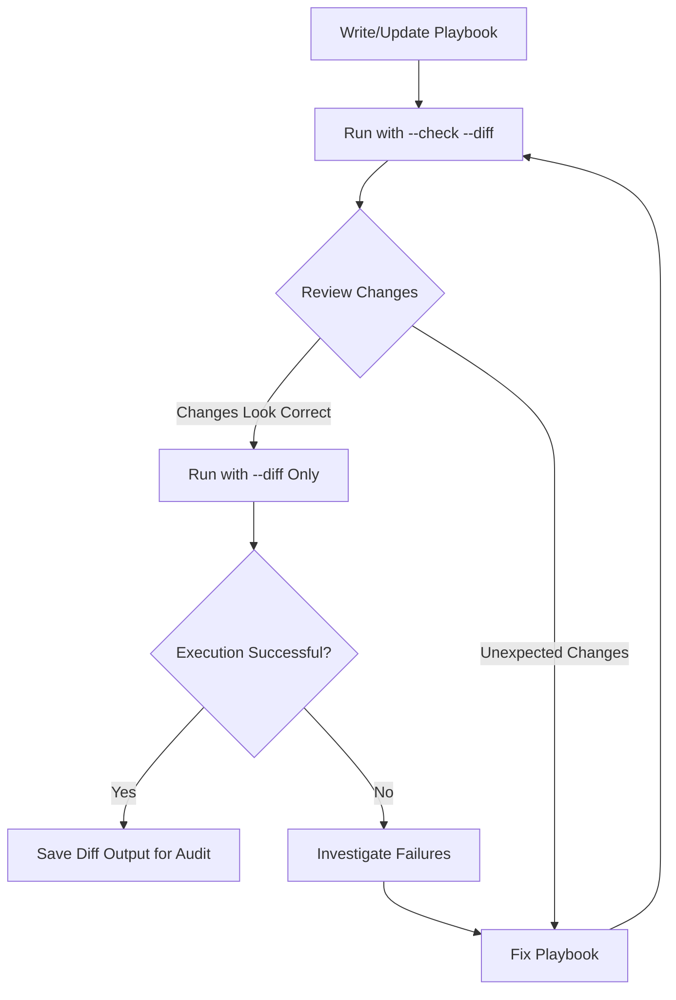

# How to Run an Ansible Playbook in Diff Mode

Author: [nawazdhandala](https://www.github.com/nawazdhandala)

Tags: Ansible, Playbook, Diff Mode, Configuration Management

Description: Learn how to use Ansible diff mode to see exactly what changes your playbook will make to files on remote hosts before and after execution.

---

When you run an Ansible playbook and it reports "changed," that single word does not tell you much. What exactly changed? Was it one line in a config file or the entire thing? Diff mode solves this by showing you the before-and-after content of every file that gets modified. It works like the `diff` command you already know from the terminal, applied to each file Ansible touches.

## Enabling Diff Mode

There are three ways to turn on diff mode, depending on how broadly you want it applied.

### Command Line Flag

The most common approach is using the `--diff` flag when running your playbook.

```bash
# Run the playbook with diff output enabled
ansible-playbook -i inventory.ini site.yml --diff
```

### In ansible.cfg

If you want diff mode enabled by default for all playbook runs, set it in your Ansible configuration file.

```ini
# ansible.cfg - enable diff mode globally
[defaults]
diff = True
```

### Per-Task Control

You can also enable or disable diff mode on individual tasks using the `diff` directive.

```yaml
# selective-diff.yml - control diff output per task
---
- name: Manage server configuration
  hosts: webservers
  become: yes

  tasks:
    # Show diff for this task
    - name: Update nginx configuration
      template:
        src: templates/nginx.conf.j2
        dest: /etc/nginx/nginx.conf
      diff: yes

    # Suppress diff for this task (useful for large or sensitive files)
    - name: Deploy application binary
      copy:
        src: files/myapp
        dest: /usr/local/bin/myapp
        mode: '0755'
      diff: no
```

## Reading Diff Output

The diff output uses the unified diff format that most developers are familiar with. Here is what it looks like in practice.

```
TASK [Update nginx worker count] **********************************************
--- before: /etc/nginx/nginx.conf
+++ after: /home/admin/.ansible/tmp/ansible-tmp-nginx.conf
@@ -1,7 +1,7 @@
 user www-data;
-worker_processes 2;
+worker_processes 4;
 pid /run/nginx.pid;

 events {
-    worker_connections 512;
+    worker_connections 1024;
 }
```

Lines starting with `-` show what was removed (the "before" state). Lines starting with `+` show what was added (the "after" state). Lines without a prefix are unchanged context lines.

## Combining Diff with Check Mode

The most powerful combination is `--check --diff`. This shows you what would change without actually changing anything.

```bash
# Preview all file changes without modifying anything
ansible-playbook -i production.ini deploy.yml --check --diff
```

This is the safest way to audit a playbook before running it against production. You get full visibility into every file modification without any risk.

## Practical Example: Managing Configuration Files

Let us walk through a real scenario where diff mode helps you catch issues. Suppose you manage sysctl settings across your fleet.

```yaml
# sysctl-hardening.yml - applies kernel security parameters
---
- name: Apply sysctl security hardening
  hosts: all
  become: yes

  vars:
    sysctl_settings:
      net.ipv4.ip_forward: 0
      net.ipv4.conf.all.send_redirects: 0
      net.ipv4.conf.default.send_redirects: 0
      net.ipv4.conf.all.accept_redirects: 0
      net.ipv4.conf.default.accept_redirects: 0
      net.ipv4.conf.all.log_martians: 1
      kernel.randomize_va_space: 2

  tasks:
    - name: Apply sysctl parameters
      sysctl:
        name: "{{ item.key }}"
        value: "{{ item.value }}"
        sysctl_set: yes
        state: present
        reload: yes
      loop: "{{ sysctl_settings | dict2items }}"
```

Running with diff mode gives you clear visibility.

```bash
# See which sysctl settings differ from the desired state
ansible-playbook -i inventory.ini sysctl-hardening.yml --diff
```

The output will show something like this for each changed parameter:

```
TASK [Apply sysctl parameters] ************************************************
--- before
+++ after
@@ -1,4 +1,4 @@
-net.ipv4.ip_forward = 1
+net.ipv4.ip_forward = 0

changed: [server01] => (item={'key': 'net.ipv4.ip_forward', 'value': 0})
```

Immediately you can see that `server01` had IP forwarding enabled and the playbook disabled it. That is actionable information.

## Diff Mode Workflow

Here is a workflow showing how diff mode fits into a safe deployment process.



## Suppressing Diff for Sensitive Content

Sometimes your files contain passwords, API keys, or other secrets. You do not want those showing up in diff output, especially if your Ansible runs are logged or piped to a CI system.

```yaml
# secrets-safe.yml - handles sensitive files without leaking content
---
- name: Deploy application with secrets
  hosts: appservers
  become: yes

  tasks:
    # Safe to show diff - no sensitive data
    - name: Deploy application config
      template:
        src: templates/app.conf.j2
        dest: /etc/myapp/app.conf
      diff: yes

    # Suppress diff - contains database credentials
    - name: Deploy database credentials
      template:
        src: templates/db-credentials.yml.j2
        dest: /etc/myapp/db-credentials.yml
        mode: '0600'
      diff: no
      no_log: yes

    # Suppress diff - contains TLS certificates
    - name: Deploy TLS certificate
      copy:
        src: "files/{{ inventory_hostname }}.pem"
        dest: /etc/ssl/certs/app.pem
        mode: '0644'
      diff: no
```

The `no_log: yes` directive goes a step further and suppresses all output for the task, including the module parameters. Use it when even the task arguments contain sensitive information.

## Capturing Diff Output for Auditing

In regulated environments, you might need to capture what changed and when. Here is how to save diff output for audit trails.

```bash
# Save diff output to a timestamped log file
ansible-playbook -i production.ini deploy.yml --diff 2>&1 | tee "deploy-$(date +%Y%m%d-%H%M%S).log"
```

For a more structured approach, you can use the `json` callback plugin to get machine-readable output.

```bash
# Get JSON output for parsing and storage
ANSIBLE_STDOUT_CALLBACK=json ansible-playbook -i production.ini deploy.yml --diff > deploy-output.json
```

This JSON output can then be parsed and stored in a database or sent to a logging system for compliance tracking.

## Modules That Support Diff Mode

Not all modules produce diff output. Here is a quick reference of modules that work well with diff mode:

- **template** and **copy**: Show file content differences
- **lineinfile** and **blockinfile**: Show line-level changes
- **file**: Shows permission and ownership changes
- **sysctl**: Shows parameter value changes
- **user** and **group**: Shows attribute differences
- **ini_file**: Shows configuration parameter changes

Modules like **shell**, **command**, and **raw** do not produce diff output because Ansible cannot predict what changes a shell command will make.

## Tips for Getting the Most Out of Diff Mode

**Use it in CI/CD**: Add `--check --diff` as a pipeline step to catch unintended configuration changes before they reach production.

**Combine with `--limit`**: When debugging, limit diff output to a single host to reduce noise: `ansible-playbook site.yml --diff --limit web01`.

**Watch for large diffs**: If a template change produces a massive diff, it might mean your template has diverged significantly from the deployed version. Investigate before applying.

**Pipe to a pager**: Long diff output scrolls past quickly. Pipe it through `less` for easier reading: `ansible-playbook site.yml --diff 2>&1 | less -R`.

Diff mode costs nothing in terms of performance and gives you full transparency into what Ansible is doing to your infrastructure. There is no good reason not to use it, at least during development and staging deployments.
