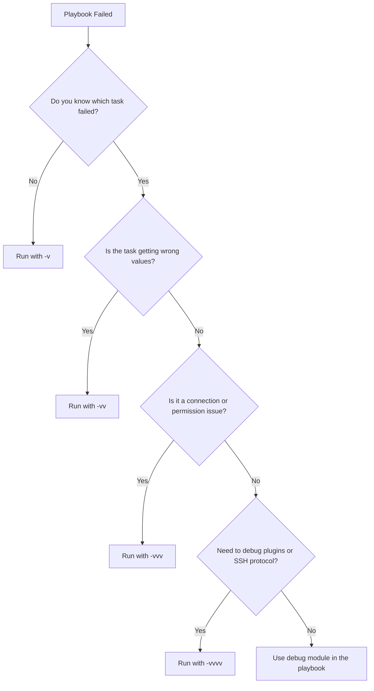

# How to Use ansible-playbook Verbose Mode for Debugging

Author: [nawazdhandala](https://www.github.com/nawazdhandala)

Tags: Ansible, Debugging, Verbose Mode, Troubleshooting

Description: Master Ansible verbose mode to debug playbook issues effectively, with practical examples of each verbosity level and debugging strategies.

---

When an Ansible playbook fails and the default output only says "FAILED," you need more information. Verbose mode is your first line of defense for debugging. It progressively reveals more detail about what Ansible is doing behind the scenes, from module arguments all the way down to raw SSH commands. Knowing which verbosity level to use and how to interpret the output will save you hours of guesswork.

## Verbosity Levels

Ansible supports four levels of verbosity, controlled by adding more `v` flags.

```bash
# Level 1: Shows task results and basic module output
ansible-playbook -i inventory.ini site.yml -v

# Level 2: Adds input parameters for each task
ansible-playbook -i inventory.ini site.yml -vv

# Level 3: Adds connection details and file paths
ansible-playbook -i inventory.ini site.yml -vvv

# Level 4: Adds raw SSH commands and plugin internals
ansible-playbook -i inventory.ini site.yml -vvvv
```

Each level adds more information on top of the previous one. Let me walk through what each level gives you.

## Level 1 (-v): Task Results

This is the lightest level. It shows the return values from each module, which are usually hidden in normal output.

```bash
# See what each task returned
ansible-playbook -i inventory.ini deploy.yml -v
```

Sample output:

```
TASK [Install nginx] **********************************************************
changed: [web01] => {"cache_update_time": 1708523041, "cache_updated": true, "changed": true}

TASK [Copy config file] *******************************************************
ok: [web01] => {"changed": false, "checksum": "a3f2b8c...", "dest": "/etc/nginx/nginx.conf", "gid": 0}
```

This is useful when you need to see return values from registered variables or when a task reports an unexpected status.

## Level 2 (-vv): Task Input Parameters

Level 2 adds the input parameters that were sent to each module. This helps you verify that variable substitution is working correctly.

```bash
# See both inputs and outputs for every task
ansible-playbook -i inventory.ini deploy.yml -vv
```

Sample output:

```
TASK [Copy config file] *******************************************************
task path: /home/admin/playbooks/deploy.yml:15
ok: [web01] => {"changed": false, "checksum": "a3f2b8c..."}
  ARGS: {"src": "templates/nginx.conf.j2", "dest": "/etc/nginx/nginx.conf", "owner": "root", "mode": "0644"}
```

This is where you catch issues like a variable resolving to an empty string or a path being wrong after template rendering.

## Level 3 (-vvv): Connection Details

Level 3 shows connection-level details including SSH arguments, temporary file paths, and module execution locations.

```bash
# See connection details and file transfer info
ansible-playbook -i inventory.ini deploy.yml -vvv
```

Sample output:

```
TASK [Install nginx] **********************************************************
task path: /home/admin/playbooks/deploy.yml:10
<192.168.1.10> ESTABLISH SSH CONNECTION FOR USER: admin
<192.168.1.10> SSH: EXEC ssh -C -o ControlMaster=auto -o ControlPersist=60s -o KbdInteractiveAuthentication=no
  -o PreferredAuthentications=publickey -o PasswordAuthentication=no -o ConnectTimeout=10
  -o ControlPath=/home/admin/.ansible/cp/abc123 192.168.1.10 '/bin/sh -c '"'"'/usr/bin/python3
  /home/admin/.ansible/tmp/ansible-tmp-1708523041/AnsiballZ_apt.py'"'"''
```

Use this level when you are debugging SSH connectivity problems, permission issues, or when you need to verify which Python interpreter Ansible is using on the remote host.

## Level 4 (-vvvv): Full Debug Output

Level 4 dumps everything, including the raw SSH protocol exchanges and internal plugin decisions.

```bash
# Maximum verbosity - use sparingly as output is very long
ansible-playbook -i inventory.ini deploy.yml -vvvv
```

This is rarely needed in day-to-day work. It is helpful when you are debugging custom plugins, connection issues at the protocol level, or when you need to report a bug to the Ansible project.

## Which Level to Use

Here is a quick decision guide.



## Combining Verbose Mode with the Debug Module

For targeted debugging, add `debug` tasks directly in your playbook. This is more surgical than cranking up verbosity on the entire run.

```yaml
# debug-example.yml - shows how to inspect variables during execution
---
- name: Deploy with debugging
  hosts: webservers
  become: yes

  vars:
    app_version: "2.4.1"
    deploy_path: "/var/www/{{ app_name | default('myapp') }}/{{ app_version }}"

  tasks:
    - name: Show the computed deploy path
      debug:
        msg: "Deploying to: {{ deploy_path }}"

    - name: Show all variables for this host
      debug:
        var: hostvars[inventory_hostname]
      verbosity: 2

    - name: Show just the ansible facts about the OS
      debug:
        msg: "OS: {{ ansible_distribution }} {{ ansible_distribution_version }}"

    - name: Deploy the application
      copy:
        src: "releases/{{ app_version }}/"
        dest: "{{ deploy_path }}"
```

Notice the `verbosity: 2` on the second debug task. This means it only runs when you use `-vv` or higher. It is a way to embed detailed debugging in your playbook without it cluttering normal runs.

## Debugging Registered Variables

One of the most common debugging scenarios is figuring out what a registered variable contains.

```yaml
# register-debug.yml - inspect registered variable contents
---
- name: Debug registered variables
  hosts: webservers

  tasks:
    - name: Check disk space
      command: df -h /
      register: disk_result
      changed_when: false

    - name: Show the full registered variable
      debug:
        var: disk_result

    - name: Show just stdout
      debug:
        msg: "Disk output: {{ disk_result.stdout }}"

    - name: Show stdout as a list of lines
      debug:
        var: disk_result.stdout_lines

    - name: Show the return code
      debug:
        msg: "Return code was: {{ disk_result.rc }}"
```

Running this with `-v` shows you the complete structure of `disk_result`, including all its attributes like `stdout`, `stderr`, `rc`, `stdout_lines`, and more.

## Redirecting Verbose Output to a File

Verbose output can be overwhelming on screen. Redirect it to a file for easier searching.

```bash
# Send verbose output to a file while keeping normal output on screen
ansible-playbook -i inventory.ini site.yml -vvv 2>&1 | tee ansible-debug.log

# Then search the log for specific issues
grep -i "error\|failed\|unreachable" ansible-debug.log
```

## Using the ANSIBLE_DEBUG Environment Variable

For even deeper debugging beyond `-vvvv`, you can enable the debug environment variable.

```bash
# Enable full internal debug logging
ANSIBLE_DEBUG=1 ansible-playbook -i inventory.ini site.yml -vvv 2>&1 | tee full-debug.log
```

This dumps internal Ansible framework messages that are not shown even at maximum verbosity. Use this only when you are truly stuck and need to understand Ansible's internal decision-making process.

## Limiting Verbose Output to Specific Hosts

When you are debugging an issue on one host but running against many, limit the run to reduce noise.

```bash
# Debug verbose output for just one host
ansible-playbook -i inventory.ini site.yml -vvv --limit web01
```

## Performance Considerations

Verbose mode, especially at levels 3 and 4, adds overhead. The SSH connection logging and module argument serialization take time. Do not leave high verbosity enabled in production scripts or CI/CD pipelines. Use it for debugging sessions, then drop back to normal output once you have found the issue.

A good practice is to set up your CI pipeline with `-v` (level 1) as the default, which gives you enough information to diagnose most failures without generating excessive log volume. When a job fails and you need more detail, rerun it manually with higher verbosity.

Verbose mode is the simplest debugging tool in the Ansible toolkit, and it solves the majority of "why is this failing?" questions. Start at `-v`, work your way up if needed, and combine it with the `debug` module for targeted inspection. Most issues become obvious once you can see the actual values flowing through your playbook.
