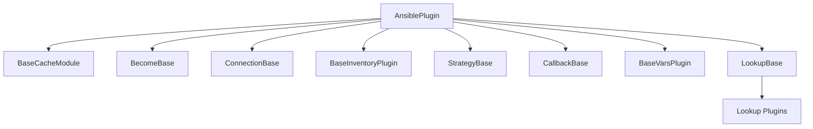

# How to Use Plugin Base Classes in Ansible

Author: [nawazdhandala](https://www.github.com/nawazdhandala)

Tags: Ansible, Plugins, Python, Development, Architecture

Description: Understand Ansible plugin base classes and how to properly extend them when building custom plugins of any type.

---

Every Ansible plugin type has a base class that provides common functionality like option handling, display output, and configuration loading. Understanding these base classes is essential for writing plugins that behave correctly and integrate properly with Ansible's runtime. This guide covers the base classes for each plugin type and what methods and attributes they provide.

## The Plugin Base Class Hierarchy

All Ansible plugins ultimately inherit from `AnsiblePlugin`, which provides the core configuration and option management. Each plugin type then has its own specialized base class that adds type-specific behavior.



## AnsiblePlugin: The Root Base Class

Every plugin inherits from `AnsiblePlugin` (located in `ansible.plugins`). It provides:

```python
# What AnsiblePlugin gives you
class AnsiblePlugin:
    # Load and access plugin options from DOCUMENTATION
    def get_option(self, option):
        """Retrieve a configured option value."""
        pass

    def set_option(self, option, value):
        """Set an option value programmatically."""
        pass

    def set_options(self, task_keys=None, var_options=None, direct=None):
        """Load all options from the various sources (env, ini, vars)."""
        pass

    def has_option(self, option):
        """Check if an option is defined."""
        pass
```

The `set_options` method is called during plugin initialization and loads values from environment variables, `ansible.cfg` INI settings, and Ansible variables based on what you defined in your `DOCUMENTATION` string.

## LookupBase

The base class for lookup plugins (`ansible.plugins.lookup.LookupBase`):

```python
from ansible.plugins.lookup import LookupBase
from ansible.errors import AnsibleError


class LookupModule(LookupBase):
    def run(self, terms, variables=None, **kwargs):
        """
        Main entry point for the lookup.

        Args:
            terms: List of lookup terms (the arguments passed to the lookup)
            variables: Dict of all available Ansible variables
            **kwargs: Additional keyword arguments from the lookup call

        Returns:
            A list of values
        """
        # Always call set_options to load configuration
        self.set_options(var_options=variables, direct=kwargs)

        results = []
        for term in terms:
            # Process each term
            try:
                result = self._do_lookup(term)
                results.append(result)
            except Exception as e:
                raise AnsibleError("Lookup failed for '%s': %s" % (term, str(e)))

        return results

    def _do_lookup(self, term):
        """Your actual lookup logic goes here."""
        pass
```

LookupBase also provides:
- `self._loader` - The Ansible data loader for reading files
- `self._templar` - The Jinja2 template engine
- `self._display` - Display object for output messages
- `self.find_file_in_search_path()` - Helper to locate files

## CallbackBase

The callback base class (`ansible.plugins.callback.CallbackBase`) provides event hooks:

```python
from ansible.plugins.callback import CallbackBase


class CallbackModule(CallbackBase):
    CALLBACK_VERSION = 2.0
    CALLBACK_TYPE = 'notification'  # or 'stdout' or 'aggregate'
    CALLBACK_NAME = 'my_callback'

    def __init__(self, display=None, options=None):
        super(CallbackModule, self).__init__(display=display, options=options)
        # Your initialization here

    # Event methods you can override:
    def v2_playbook_on_start(self, playbook):
        """Called when a playbook starts."""
        pass

    def v2_playbook_on_play_start(self, play):
        """Called when a play starts."""
        pass

    def v2_playbook_on_task_start(self, task, is_conditional):
        """Called when a task starts."""
        pass

    def v2_runner_on_ok(self, result):
        """Called when a task succeeds."""
        host = result._host.get_name()
        task_name = result._task.get_name()
        self._display.display("OK: %s - %s" % (host, task_name))

    def v2_runner_on_failed(self, result, ignore_errors=False):
        """Called when a task fails."""
        pass

    def v2_runner_on_skipped(self, result):
        """Called when a task is skipped."""
        pass

    def v2_runner_on_unreachable(self, result):
        """Called when a host is unreachable."""
        pass

    def v2_playbook_on_stats(self, stats):
        """Called at the end with play statistics."""
        pass
```

The `result` object in runner callbacks gives you:
- `result._host` - The host object
- `result._task` - The task object
- `result._result` - Dict of task results (stdout, changed, etc.)
- `result.is_changed()` - Whether the task reported a change
- `result.is_failed()` - Whether the task failed

## ConnectionBase

The connection base class (`ansible.plugins.connection.ConnectionBase`):

```python
from ansible.plugins.connection import ConnectionBase


class Connection(ConnectionBase):
    transport = 'my_transport'
    has_pipelining = False

    def __init__(self, play_context, new_stdin, *args, **kwargs):
        super(Connection, self).__init__(play_context, new_stdin, *args, **kwargs)

    def _connect(self):
        """Establish the connection to the remote host."""
        # Return self for method chaining
        return self

    def exec_command(self, cmd, in_data=None, sudoable=True):
        """Execute a command on the remote host.

        Returns:
            Tuple of (return_code, stdout, stderr)
        """
        pass

    def put_file(self, in_path, out_path):
        """Transfer a file from local to remote."""
        pass

    def fetch_file(self, in_path, out_path):
        """Transfer a file from remote to local."""
        pass

    def close(self):
        """Close the connection."""
        pass
```

ConnectionBase provides:
- `self._play_context` - Play context with connection info (host, port, user)
- `self._connected` - Boolean tracking connection state
- `self._display` - Display object

## BaseInventoryPlugin

The inventory base class (`ansible.plugins.inventory.BaseInventoryPlugin`):

```python
from ansible.plugins.inventory import BaseInventoryPlugin, Constructable, Cacheable


class InventoryModule(BaseInventoryPlugin, Constructable, Cacheable):
    NAME = 'my_inventory'

    def verify_file(self, path):
        """Check if the inventory source file is valid for this plugin."""
        valid = False
        if super(InventoryModule, self).verify_file(path):
            if path.endswith(('.yml', '.yaml', '.my_inventory')):
                valid = True
        return valid

    def parse(self, inventory, loader, path, cache=True):
        """Parse the inventory source and populate the inventory."""
        super(InventoryModule, self).parse(inventory, loader, path, cache)

        # Read config from the inventory source file
        self._read_config_data(path)

        # Use self.inventory to add hosts and groups
        self.inventory.add_group('webservers')
        self.inventory.add_host('web1', group='webservers')
        self.inventory.set_variable('web1', 'ansible_host', '10.0.0.1')
```

The `Constructable` mixin adds `self._set_composite_vars()`, `self._add_host_to_composed_groups()`, and `self._add_host_to_keyed_groups()` for dynamic group creation.

The `Cacheable` mixin adds cache support through `self._cache`.

## BaseCacheModule

The cache base class (`ansible.plugins.cache.BaseCacheModule`):

```python
from ansible.plugins.cache import BaseCacheModule


class CacheModule(BaseCacheModule):
    def __init__(self, *args, **kwargs):
        super(CacheModule, self).__init__(*args, **kwargs)

    def get(self, key):
        """Retrieve cached value."""
        pass

    def set(self, key, value):
        """Store a value."""
        pass

    def keys(self):
        """Return all cache keys."""
        pass

    def contains(self, key):
        """Check if key exists."""
        pass

    def delete(self, key):
        """Remove a key."""
        pass

    def flush(self):
        """Clear all cached data."""
        pass
```

## BecomeBase

The become base class (`ansible.plugins.become.BecomeBase`):

```python
from ansible.plugins.become import BecomeBase


class BecomeModule(BecomeBase):
    name = 'my_become'

    # Patterns for password prompt detection
    prompt = 'Password:'
    fail = ('Authentication failure',)
    success = ()

    def build_become_command(self, cmd, shell):
        """Wrap a command for privilege escalation."""
        super(BecomeModule, self).build_become_command(cmd, shell)
        if not cmd:
            return cmd
        # Build and return the wrapped command
        return 'my_escalation_tool %s' % cmd
```

## Common Patterns Across Base Classes

Regardless of plugin type, these patterns apply:

```python
# Always call super().__init__() in your constructor
def __init__(self, *args, **kwargs):
    super(MyPlugin, self).__init__(*args, **kwargs)

# Always call set_options to load configuration
self.set_options(var_options=variables, direct=kwargs)

# Use self._display for output at various verbosity levels
self._display.display("Normal message")
self._display.v("Verbose message (-v)")
self._display.vv("Very verbose (-vv)")
self._display.vvv("Debug level (-vvv)")
self._display.warning("Warning message")
self._display.error("Error message")

# Use AnsibleError for error handling
from ansible.errors import AnsibleError
raise AnsibleError("Something went wrong: %s" % details)
```

## Summary

Every Ansible plugin type has a base class that handles boilerplate like configuration loading, display output, and integration with the Ansible runtime. Extend the correct base class for your plugin type, call `super().__init__()` in your constructor, use `set_options()` to load configuration, and leverage `self._display` for output. Understanding these base classes means you spend less time fighting the framework and more time on your actual plugin logic.
