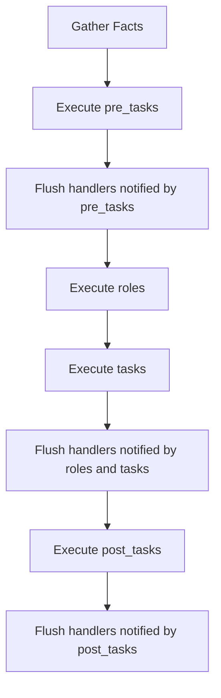

# How to Use Ansible Pre-Tasks and Post-Tasks

Author: [nawazdhandala](https://www.github.com/nawazdhandala)

Tags: Ansible, Pre-Tasks, Post-Tasks, Playbook

Description: Learn how to use pre_tasks and post_tasks in Ansible playbooks to run actions before and after the main task list, including handler flushing.

---

Ansible playbooks have a well-defined execution order within each play. Most people know about `tasks` and `handlers`, but there are two additional sections that run before and after the main tasks: `pre_tasks` and `post_tasks`. These sections are perfect for setup, validation, cleanup, and any logic that needs to happen at specific points in the execution flow.

## Play Execution Order

Before diving into examples, let us establish the exact order in which Ansible processes a play.



This order is important. Handlers that are notified during `pre_tasks` are flushed (executed) before `tasks` begin. Handlers notified during `tasks` are flushed before `post_tasks` begin. This gives you clean separation between phases.

## Basic Syntax

Here is a playbook that uses all three task sections.

```yaml
# deploy.yml - demonstrates pre_tasks, tasks, and post_tasks
---
- name: Deploy application
  hosts: webservers
  become: yes

  pre_tasks:
    - name: Check disk space before deployment
      shell: df -h / | tail -1 | awk '{print $5}' | sed 's/%//'
      register: disk_usage
      changed_when: false

    - name: Fail if disk is too full
      fail:
        msg: "Disk usage is {{ disk_usage.stdout }}%. Need at least 20% free."
      when: disk_usage.stdout | int > 80

  tasks:
    - name: Deploy new application version
      synchronize:
        src: /opt/releases/v2.5.0/
        dest: /var/www/myapp/

    - name: Restart application
      service:
        name: myapp
        state: restarted

  post_tasks:
    - name: Verify application is healthy
      uri:
        url: "http://localhost:8080/health"
        status_code: 200
      retries: 5
      delay: 3

    - name: Send deployment notification
      uri:
        url: "https://hooks.slack.com/services/YOUR/WEBHOOK/URL"
        method: POST
        body_format: json
        body:
          text: "Deployed v2.5.0 to {{ inventory_hostname }}"
      delegate_to: localhost
```

## Pre-Tasks: Setup and Validation

Pre-tasks run before everything else (except fact gathering). They are the right place for:

- Validating prerequisites
- Removing hosts from load balancers
- Taking backups
- Acquiring locks
- Checking external service availability

```yaml
# rolling-deploy.yml - pre_tasks remove host from load balancer
---
- name: Rolling deployment
  hosts: webservers
  become: yes
  serial: 2

  pre_tasks:
    - name: Disable host in HAProxy
      haproxy:
        state: disabled
        host: "{{ inventory_hostname }}"
        socket: /var/run/haproxy/admin.sock
        backend: web_backend
      delegate_to: "{{ item }}"
      loop: "{{ groups['loadbalancers'] }}"

    - name: Wait for connections to drain
      wait_for:
        timeout: 30

  tasks:
    - name: Pull latest code
      git:
        repo: https://github.com/example/myapp.git
        dest: /var/www/myapp
        version: "v2.5.0"

    - name: Restart application
      service:
        name: myapp
        state: restarted

  post_tasks:
    - name: Wait for application to start
      uri:
        url: "http://localhost:8080/health"
        status_code: 200
      retries: 10
      delay: 5

    - name: Re-enable host in HAProxy
      haproxy:
        state: enabled
        host: "{{ inventory_hostname }}"
        socket: /var/run/haproxy/admin.sock
        backend: web_backend
      delegate_to: "{{ item }}"
      loop: "{{ groups['loadbalancers'] }}"
```

This is the classic load balancer drain pattern. Pre-tasks pull the host out of rotation, tasks do the deployment, and post-tasks put it back in rotation.

## Handler Flushing Between Sections

One of the most useful aspects of `pre_tasks` and `post_tasks` is the automatic handler flushing between sections. Handlers notified in `pre_tasks` run before `tasks` begin.

```yaml
# handler-flush.yml - demonstrates handler flushing between sections
---
- name: Handler flushing example
  hosts: webservers
  become: yes

  pre_tasks:
    - name: Update SSL certificate
      copy:
        src: files/new-cert.pem
        dest: /etc/ssl/certs/app.pem
        mode: '0644'
      notify: Reload nginx

    # Handlers notified above will run HERE, before tasks begin
    # This ensures nginx has the new cert before we deploy the app

  tasks:
    - name: Deploy application
      synchronize:
        src: /opt/releases/current/
        dest: /var/www/myapp/

    - name: Update application config
      template:
        src: templates/app.conf.j2
        dest: /etc/myapp/app.conf
      notify: Restart application

    # Handlers notified above will run HERE, before post_tasks begin

  post_tasks:
    - name: Run integration tests
      uri:
        url: "http://localhost:8080/test"
        return_content: yes
      register: test_result

    - name: Verify tests passed
      assert:
        that:
          - "'all tests passed' in test_result.content"

  handlers:
    - name: Reload nginx
      service:
        name: nginx
        state: reloaded

    - name: Restart application
      service:
        name: myapp
        state: restarted
```

Without `pre_tasks`, you would need to manually flush handlers using `meta: flush_handlers` to get the same behavior.

## Post-Tasks: Verification and Cleanup

Post-tasks run after all tasks and their handlers have completed. They are the right place for:

- Health checks and smoke tests
- Sending notifications
- Releasing locks
- Cleaning up temporary files
- Updating CMDB or inventory systems

```yaml
# full-lifecycle.yml - complete pre/post task usage
---
- name: Full deployment lifecycle
  hosts: appservers
  become: yes

  vars:
    app_version: "2.5.0"

  pre_tasks:
    - name: Create deployment lock
      file:
        path: /tmp/deploy.lock
        state: touch
      delegate_to: localhost
      run_once: true

    - name: Back up current version
      archive:
        path: /var/www/myapp/
        dest: "/var/backups/myapp-{{ ansible_date_time.iso8601_basic }}.tar.gz"

  tasks:
    - name: Deploy version {{ app_version }}
      unarchive:
        src: "releases/myapp-{{ app_version }}.tar.gz"
        dest: /var/www/myapp/

    - name: Update version file
      copy:
        content: "{{ app_version }}"
        dest: /var/www/myapp/VERSION

    - name: Restart application
      service:
        name: myapp
        state: restarted

  post_tasks:
    - name: Verify version endpoint returns correct version
      uri:
        url: "http://localhost:8080/version"
        return_content: yes
      register: version_check
      retries: 5
      delay: 3
      until: version_check.content | trim == app_version

    - name: Remove deployment lock
      file:
        path: /tmp/deploy.lock
        state: absent
      delegate_to: localhost
      run_once: true

    - name: Log deployment in audit system
      uri:
        url: "https://audit.example.com/api/deployments"
        method: POST
        body_format: json
        body:
          application: myapp
          version: "{{ app_version }}"
          host: "{{ inventory_hostname }}"
          timestamp: "{{ ansible_date_time.iso8601 }}"
      delegate_to: localhost
```

## Pre-Tasks with Roles

When you use roles alongside tasks, `pre_tasks` still run first.

```yaml
# with-roles.yml - pre_tasks run before roles
---
- name: Configure with roles
  hosts: webservers
  become: yes

  pre_tasks:
    - name: Verify SSH connectivity
      ping:

    - name: Ensure apt cache is fresh
      apt:
        update_cache: yes
        cache_valid_time: 3600

  roles:
    - common
    - nginx
    - myapp

  post_tasks:
    - name: Run full test suite
      command: /opt/myapp/run-tests.sh
      register: test_output

    - name: Display test results
      debug:
        var: test_output.stdout_lines
```

The execution order is: `pre_tasks` -> handler flush -> `roles` -> `tasks` -> handler flush -> `post_tasks` -> handler flush.

## Using pre_tasks for Idempotent Prerequisite Checks

A common pattern is using `pre_tasks` to guarantee prerequisites before the main logic runs.

```yaml
# prerequisite-check.yml - validates environment before proceeding
---
- name: Database migration with safety checks
  hosts: dbservers
  become: yes
  any_errors_fatal: true

  pre_tasks:
    - name: Verify we can connect to the database
      command: psql -c "SELECT 1" -U postgres
      changed_when: false

    - name: Check for pending replication lag
      command: psql -t -c "SELECT pg_wal_lsn_diff(pg_current_wal_lsn(), replay_lsn) FROM pg_stat_replication" -U postgres
      register: replication_lag
      changed_when: false

    - name: Fail if replication lag is too high
      fail:
        msg: "Replication lag is {{ replication_lag.stdout | trim }} bytes. Must be under 1MB."
      when: replication_lag.stdout | trim | int > 1048576

  tasks:
    - name: Run database migration
      command: /opt/myapp/migrate.sh
      register: migration

    - name: Show migration output
      debug:
        var: migration.stdout_lines

  post_tasks:
    - name: Verify migration was successful
      command: psql -t -c "SELECT MAX(version) FROM schema_migrations" -U postgres
      register: schema_version
      changed_when: false

    - name: Show current schema version
      debug:
        msg: "Database schema is now at version {{ schema_version.stdout | trim }}"
```

## Summary

`pre_tasks` and `post_tasks` give your playbooks a clean lifecycle structure. Pre-tasks handle setup and validation, ensuring the environment is ready. Post-tasks handle verification and cleanup, confirming everything worked. The automatic handler flushing between sections means each phase completes fully before the next begins. This pattern is especially valuable for deployment playbooks where the sequence of operations matters.
