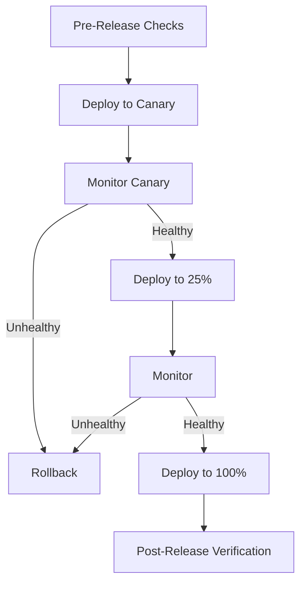

# How to Use Ansible for Production Release Automation

Author: [nawazdhandala](https://www.github.com/nawazdhandala)

Tags: Ansible, Production Release, Deployment, DevOps

Description: Automate production releases with Ansible using blue-green deployments, canary releases, and comprehensive pre and post deployment verification.

---

Production releases are the most critical operation your team performs. A bad release can mean downtime, data loss, or unhappy customers. Ansible gives you the control to automate releases with safety checks, gradual rollouts, and quick rollback capabilities.

This post covers building a production release automation system with Ansible.

## Release Strategy

A well-designed release process has multiple phases:



## Pre-Release Validation

Always validate before deploying to production:

```yaml
# playbooks/production-release.yml
# Complete production release automation
---
- name: Pre-release validation
  hosts: localhost
  connection: local
  tasks:
    - name: Verify artifact exists
      ansible.builtin.uri:
        url: "{{ artifact_registry }}/{{ app_name }}/{{ release_version }}/manifest"
        method: HEAD
        status_code: 200
      register: artifact_check

    - name: Verify staging tests passed
      ansible.builtin.uri:
        url: "{{ ci_api }}/pipelines/{{ release_version }}/status"
        headers:
          Authorization: "Bearer {{ ci_token }}"
      register: pipeline_status

    - name: Fail if staging tests did not pass
      ansible.builtin.assert:
        that:
          - pipeline_status.json.status == 'success'
        fail_msg: "CI pipeline for {{ release_version }} did not pass. Status: {{ pipeline_status.json.status }}"

    - name: Check for active incidents
      ansible.builtin.uri:
        url: "https://api.pagerduty.com/incidents?statuses[]=triggered&statuses[]=acknowledged"
        headers:
          Authorization: "Token token={{ pagerduty_token }}"
      register: incidents

    - name: Warn if there are active incidents
      ansible.builtin.debug:
        msg: "WARNING: {{ incidents.json.incidents | length }} active incidents. Consider postponing release."
      when: incidents.json.incidents | length > 0

    - name: Notify release start
      community.general.slack:
        token: "{{ slack_token }}"
        channel: "#releases"
        msg: "Starting production release of {{ app_name }} {{ release_version }}"
      delegate_to: localhost

- name: Canary deployment
  hosts: webservers[0]
  become: true
  serial: 1
  tasks:
    - name: Deploy canary
      ansible.builtin.include_role:
        name: app_deploy
      vars:
        app_version: "{{ release_version }}"

    - name: Wait for canary to stabilize
      ansible.builtin.pause:
        minutes: 5
        prompt: "Canary deployed. Monitoring for 5 minutes..."

    - name: Check canary error rate
      ansible.builtin.uri:
        url: "http://{{ monitoring_api }}/api/v1/query"
        method: POST
        body_format: form-urlencoded
        body:
          query: "rate(http_requests_total{instance='{{ inventory_hostname }}',status=~'5..'}[5m]) / rate(http_requests_total{instance='{{ inventory_hostname }}'}[5m])"
      register: error_rate
      delegate_to: localhost

    - name: Fail if canary error rate is too high
      ansible.builtin.assert:
        that:
          - error_rate.json.data.result[0].value[1] | float < 0.02
        fail_msg: "Canary error rate {{ error_rate.json.data.result[0].value[1] }} exceeds 2% threshold"

- name: Rolling deployment to remaining servers
  hosts: webservers[1:]
  become: true
  serial: "25%"
  max_fail_percentage: 5

  pre_tasks:
    - name: Deregister from load balancer
      ansible.builtin.uri:
        url: "http://{{ lb_api }}/backends/{{ inventory_hostname }}/drain"
        method: POST
      delegate_to: localhost

    - name: Wait for drain
      ansible.builtin.pause:
        seconds: 15

  roles:
    - role: app_deploy
      vars:
        app_version: "{{ release_version }}"

  post_tasks:
    - name: Verify health
      ansible.builtin.uri:
        url: "http://localhost:{{ app_port }}/health"
        status_code: 200
      retries: 30
      delay: 5
      register: health
      until: health.status == 200

    - name: Re-register with load balancer
      ansible.builtin.uri:
        url: "http://{{ lb_api }}/backends/{{ inventory_hostname }}/enable"
        method: POST
      delegate_to: localhost

- name: Post-release verification
  hosts: localhost
  connection: local
  tasks:
    - name: Run end-to-end smoke tests
      ansible.builtin.command:
        cmd: "npm run test:smoke -- --env=production --base-url=https://{{ production_domain }}"
      register: smoke_tests
      changed_when: false

    - name: Update release tracking
      ansible.builtin.uri:
        url: "{{ release_tracker_api }}/releases"
        method: POST
        body_format: json
        body:
          version: "{{ release_version }}"
          environment: production
          status: "{{ 'success' if smoke_tests.rc == 0 else 'degraded' }}"
          timestamp: "{{ ansible_date_time.iso8601 }}"

    - name: Notify release complete
      community.general.slack:
        token: "{{ slack_token }}"
        channel: "#releases"
        msg: "Production release of {{ app_name }} {{ release_version }} completed successfully"
```

## Release Locking

Prevent concurrent releases:

```yaml
# roles/release_lock/tasks/main.yml
# Acquire and release deployment locks
---
- name: Check for existing lock
  ansible.builtin.uri:
    url: "{{ consul_url }}/v1/kv/deploy-lock/{{ app_name }}"
    method: GET
    status_code: [200, 404]
  register: lock_check

- name: Fail if another release is in progress
  ansible.builtin.fail:
    msg: "Another release is already in progress (locked by {{ lock_check.json[0].Value | b64decode }})"
  when: lock_check.status == 200

- name: Acquire release lock
  ansible.builtin.uri:
    url: "{{ consul_url }}/v1/kv/deploy-lock/{{ app_name }}?acquire={{ session_id }}"
    method: PUT
    body: "{{ ansible_user_id }}@{{ ansible_date_time.iso8601 }}"
```

## Blue-Green Deployment Alternative

For zero-downtime releases with instant rollback:

```yaml
# playbooks/blue-green-release.yml
# Blue-green production release
---
- name: Blue-green deployment
  hosts: localhost
  connection: local
  vars:
    current_color: "{{ lookup('file', '/opt/deploy/current_color') | default('blue') }}"
    target_color: "{{ 'green' if current_color == 'blue' else 'blue' }}"

  tasks:
    - name: Deploy to inactive color group
      ansible.builtin.include_tasks: tasks/deploy-color.yml
      vars:
        color: "{{ target_color }}"
        version: "{{ release_version }}"

    - name: Run verification on new deployment
      ansible.builtin.uri:
        url: "http://{{ target_color }}-lb.internal/health"
        status_code: 200
      retries: 20
      delay: 5

    - name: Switch load balancer to new color
      ansible.builtin.uri:
        url: "http://{{ main_lb_api }}/switch"
        method: POST
        body_format: json
        body:
          active: "{{ target_color }}"
      register: switch_result

    - name: Update current color
      ansible.builtin.copy:
        content: "{{ target_color }}"
        dest: /opt/deploy/current_color
        mode: '0644'

    - name: Monitor for 10 minutes
      ansible.builtin.pause:
        minutes: 10
        prompt: "Monitoring new deployment. Press Ctrl+C then 'A' to abort and rollback."

    - name: Release is stable
      ansible.builtin.debug:
        msg: "Release {{ release_version }} is stable on {{ target_color }}"
```

## Key Takeaways

Production release automation needs multiple safety layers: pre-release validation, canary deployment, gradual rollout, and post-release verification. Use deployment locks to prevent concurrent releases. Always check for active incidents before starting a release. Monitor error rates at each stage and stop if they exceed thresholds. Have a fast rollback mechanism ready. Notify your team at every stage so everyone knows what is happening. The goal is that releases become routine and boring, not risky events that require everyone to be on standby.
